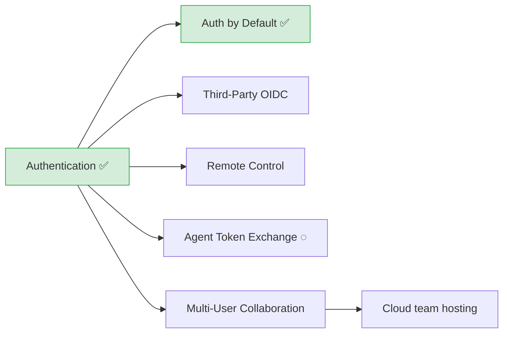
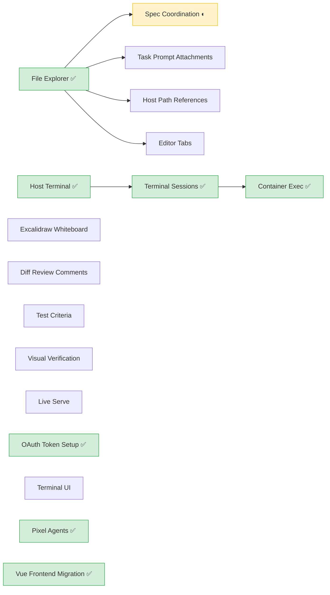
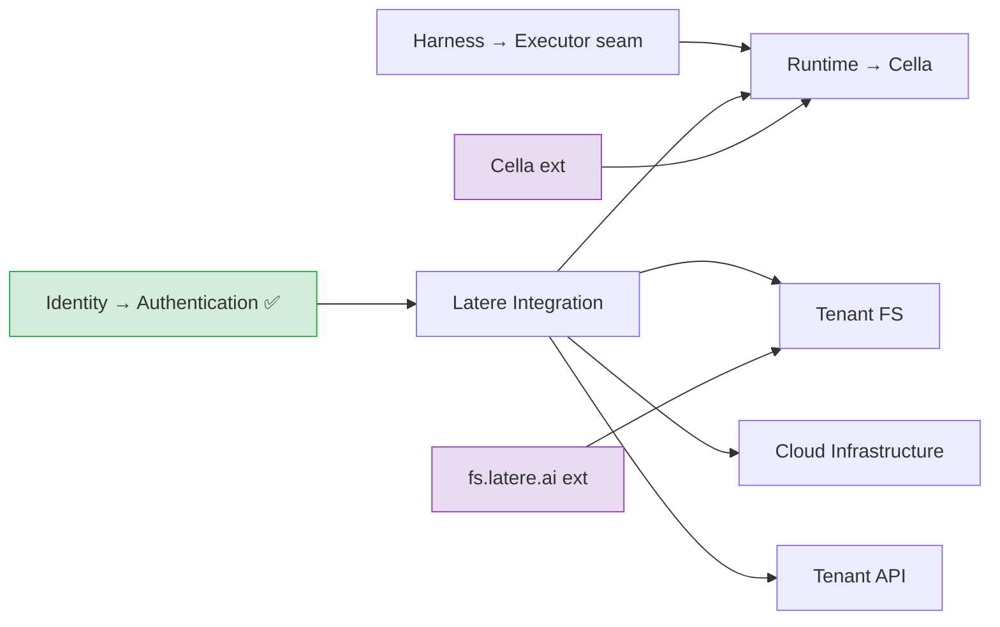
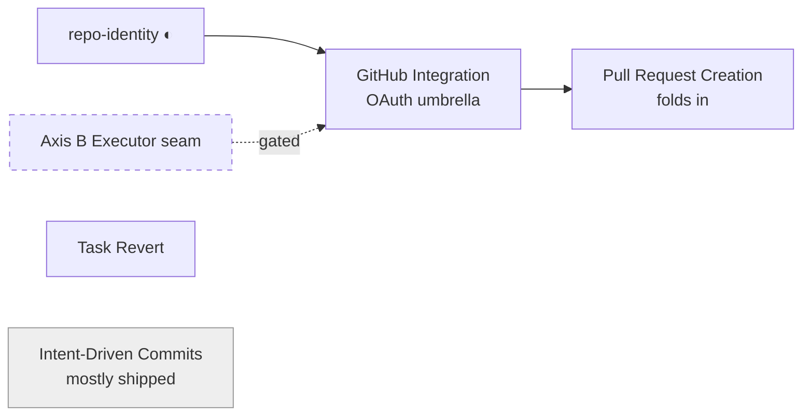

# Specs

Wallfacer roadmap, organized by track and connected by shared design foundations.
Completed specs live in the [Archive](#archive) section at the bottom.

## Status Quo

What has shipped vs what remains. ✅ = complete, ◐ = in progress, ○ = not started, ⊘ = archived.

```
Foundations - 7/7 complete (see Archive)

Identity - the live edge (auth + platform convergence)
  ✅ Authentication                ◐ Auth by Default + Console
  ○ Multi-User Collaboration       ○ Third-Party OIDC
  ◐ Remote Control (→ cloud plane) ○ Agent Token Exchange

Spec Coordination - complete (its own track; spec tree, planning, dispatch)
  ✅ Document Model                ✅ Spec Archival
  ✅ Planning UX                   ✅ Chat-First Mode
  ✅ Planning Chat Threads         ✅ Spec State Control Plane

Local Product - 11 shipped, rest pending
  ⊘ Desktop App (code removed)     ✅ Terminal Sessions
  ✅ Container Exec                ✅ OAuth Token Setup
  ✅ Pixel Agent Avatars           ✅ Routine Tasks
  ✅ Agents & Flows                ✅ Refinement Into Plan
  ✅ Vue Frontend Migration        ✅ Rebrand Module Path
  ✅ Backend Redundancy Cleanup
  ○ Task Prompt Attachments        ✅ Editor Tabs
  ○ Diff Review Comments           ○ Test Criteria
  ○ Visual Verification            ○ Scoped Command Registry
  ○ Host Path References           ○ Live Serve
  ○ Free-Form Specs
  ○ Terminal UI (TUI mode)         ○ Excalidraw Whiteboard
  ○ Dockable Panel Workspace       ○ Workflows Graph UX
  ✅ Map Mission Control
  ⊘ superseded by the Vue/host rewrite: File Attachments,
    File Panel Viewer, Inline Diff Feedback, Spatial Canvas

Shared Design - 4 complete
  ✅ Agent Abstraction             ✅ Host Exec Mode
  ✅ Host as Only Backend          ✅ Harness Abstraction (all 5 harnesses shipped)
  ○ Token & Cost Optimization      ○ Extensible Prompts
  ✅ Agent Session Vocabulary       ⊘ Overlay Snapshots (obsolete under host exec)

Cloud Platform - two axes (consume Latere services, don't absorb)
  Axis A: Coordination plane (Cloud v1, lead; local stays source of truth)
    ◐ Coordination Plane (anchor)  ◐ Connection + Presence
    ○ Metadata Projection          ✅ Spec Comments
    ○ Remote Control (re-homed)    ○ Data Boundary (widened)
  Axis B: Remote execution (Cloud v2+, demand-gated, blocked on Executor seam)
    ○ Latere Integration (umbrella)  ○ Runtime → Cella
    ○ Tenant Filesystem → FS         ○ Cloud Infrastructure
    ○ Tenant API
  archived: Multi-Tenant, Billing Idempotency (now owned by Cella / Identity)

Git Workflow - GitHub integration umbrella + two shippable features
  ○ GitHub Integration (OAuth umbrella) ○ Task Revert
  ○ Pull Request Creation (→ umbrella)  ○ Intent-Driven Commits (mostly shipped)
```

The hot area is **Local Product** polish (the file/diff/attachment trio). Spec
Coordination is complete (the state control plane shipped). Identity / platform
convergence (auth-by-default and the latere-ui console shell) has shipped and is
archived. Cloud Platform is drafted and demand-gated; Git Workflow is two
independently-shippable features.

---

## Identity

Everything about principals, sessions, delegation, and what data crosses the machine boundary. Authentication is the anchor; the rest build on the principal context it establishes. The auth-by-default convergence (`wallfacer run` defaulting into the Latere account experience, latere-ui console shell) has shipped and is archived below; remaining work is collaboration and delegation.

| Spec | Status | Delivers |
|------|--------|----------|
| [authentication.md](identity/authentication.md) | **Complete** | OAuth2/OIDC login, session management, user identity. Phase 1: `WALLFACER_CLOUD` flag, `latere.ai/x/pkg/oidc` integration, cloud-gated `/login`/`/callback`/`/logout`/`/api/auth/me` routes, status-bar sign-in badge. Phase 2: JWT middleware, principal context, `org_id`/`created_by` fields, forced login, superadmin/scope gating, org switching. Follow-up auth-unification (authkit.Identity, HTTP device-code login) shipped and is archived under `identity/authentication/`. |
| [multi-user-collaboration.md](identity/multi-user-collaboration.md) | Drafted | Umbrella: org-scoped collaboration on the shipped identity plumbing (actor fields, org scoping). Adds RBAC, presence/focus, optimistic concurrency, private planning threads. Steps 1-2 (actor fields, migration) already shipped; breakdown started. Gate for cloud team hosting. |
| ↳ [rbac-matrix.md](identity/multi-user-collaboration/rbac-matrix.md) | Drafted | Lead child: the canonical scope-to-permission matrix (admin/editor/viewer mapped onto `Identity.Scopes`, since there is no role claim), wiring `RequireScope`/`RequireSuperadmin` onto mutating routes. Anonymous mode unchanged. |
| [third-party-oidc.md](identity/third-party-oidc.md) | Vague | Self-hosted non-latere.ai deployments log in against Keycloak, Entra ID, Okta, Authelia, Dex, etc. by configuring/extending the platform `pkg/oidc` RP rather than forking a local package. |
| [remote-control.md](identity/remote-control.md) | Drafted | Re-homed onto the cloud coordination plane: now the command-router capability (control UI, instance picker, offline handling, per-action auth + audit, opt-out scope) riding the one coordination connection, not its own wire. Transport lives in [coordination-plane.md](cloud/latere-integration/coordination-plane.md). |
| [agent-token-exchange.md](identity/agent-token-exchange.md) | Dormant | RFC 8693 delegation so per-task agents call latere.ai services on behalf of the dispatching user. Trust plane already shipped as the `sandbox_proxy.go` server-side proxy (`act.sub` delegation + credential substitution); the proxy-vs-env-injection decision is resolved (extend the proxy). The remaining per-task token-mint path is demand-gated on latere.ai backend services (fs.latere.ai, telemetry) that don't exist yet. |

### Identity dependencies



Auth-by-default has shipped (archived). Agent token exchange (◌) is dormant: its trust plane shipped as the `sandbox_proxy.go` server-side proxy, and the remaining mint path is demand-gated on latere.ai backend services. Multi-user collaboration is the gate for cloud *team* hosting (org-scoped shared boards).

---

## Spec Coordination

Recursive spec tree model, planning UX, dispatch workflow, and lifecycle automation. Promoted to its own track (`specs/spec-coordination/`): it is the largest self-contained body of work in the project. All four subtrees are implemented, including the drift pipeline's agent-backed tester (gated behind `WALLFACER_DRIFT_TESTER`, off by default).

| Spec | Status | Delivers |
|------|--------|----------|
| [spec-coordination.md](spec-coordination/spec-coordination.md) | **Complete** | Umbrella: recursive spec tree model, dispatch workflow, cross-task context, lifecycle automation. All four subtrees shipped; two residual stale leaves (lossy planning resume, codex compat re-scope) tracked as follow-ups. |
| ↳ [spec-document-model.md](spec-coordination/spec-coordination/spec-document-model.md) | **Complete** | Spec frontmatter schema, filesystem-derived tree, `depends_on` DAG, six-state lifecycle (including `archived`), per-spec and cross-spec validation, recursive progress tracking, impact analysis. Extracted `internal/pkg/dag/`, `internal/pkg/tree/`, `internal/pkg/statemachine/` |
| ↳ [spec-archival.md](spec-coordination/spec-coordination/spec-archival.md) | **Complete** | Sixth lifecycle state (`archived`), hidden by default, read-only, excluded from impact / progress / drift / stale-propagation. Cascades over non-leaf subtrees on archive; unarchive reverses via `git revert`. Muted rendering in explorer and minimap; archived banner with stacked undo toasts. |
| ↳ [spec-planning-ux.md](spec-coordination/spec-coordination/spec-planning-ux.md) | **Complete** | Three-pane spec mode (explorer, focused markdown view, chat stream), planning sandbox, chat-driven spec iteration, dispatch & board integration, undo snapshots, planning cost tracking. |
| ↳↳ [chat-first-mode.md](spec-coordination/spec-coordination/spec-planning-ux/chat-first-mode.md) | **Complete** | Rename "Spec" to "Plan", collapse the layout when no specs exist, `/create` directive parser and bootstrap choreography. All 14 leaf tasks shipped. |
| ↳↳ [planning-chat-threads.md](spec-coordination/spec-coordination/spec-planning-ux/planning-chat-threads.md) | **Complete** | Multi-tab planning chat: independent conversation threads sharing the single planner, per-thread session/history/unread, inline rename, archive-only deletion, `git revert` thread-scoped undo, crash-safe migration. Shipped (ThreadManager, `/api/planning/threads`, PlanningChatPanel.vue). |
| ↳↳ [dedicated-chat-ui.md](spec-coordination/spec-coordination/spec-planning-ux/dedicated-chat-ui.md) | **Complete** | Chat promoted to a first-class Claude-style surface: sidebar leads with Chat/Plan/Board, a dedicated `/chat` view (`ChatPage.vue`) with a session sub-sidebar and entry screen (supersedes chat-first), and a floating draggable popup (`SpecChatPopup.vue`) in plan mode, now enabled. Frontend-only, reusing the thread model; one extracted chat core (`useChatSession`, `ChatMessageList`/`ChatComposer`/`SessionList`) mounted by both surfaces. |
| ↳↳ [session-persistence.md](spec-coordination/spec-coordination/spec-planning-ux/planning-chat-agent/session-persistence.md) | Stale | Faithful planning-conversation resume. The lossy `BuildHistoryContext` fallback is still the live behavior, so the degraded-resume problem remains; needs re-scoping against the host-process planner or archiving. |
| ↳ [spec-state-control-plane.md](spec-coordination/spec-coordination/spec-state-control-plane.md) | **Complete** | Server-managed lifecycle transitions: 7th `testing` state with completion gate, two-channel stale propagation, chat-edit fan-out, dispatch → `validated` + folder dispatch, explicit-validate/mark-stale/dismiss/force-complete actions, advisory staleness scan, and the task-done drift pipeline (`validated → testing → complete`/`stale` with fan-out, `testing_pending` on tester failure, per-workspace commit mutex). Agent-backed drift tester (`runner.AssessDrift` + `drift.tmpl`) wired through `NewRunnerDriftTester`, gated behind `WALLFACER_DRIFT_TESTER` (off by default — the hook preserves complete-on-done unless the flag is set). |

---

## Local Product

Desktop experience and developer workflow improvements. No cloud dependency. Ships value to single-user deployments.

| Spec | Status | Delivers |
|------|--------|----------|
| [task-prompt-attachments.md](local/task-prompt-attachments.md) | Drafted | Drag-and-drop file and image attachments for task prompts; worktree `.attachments/` staging + Read tool. Supersedes the archived file-attachments. |
| [inline-file-panel.md](local/inline-file-panel.md) | Complete | VS Code-style file tabs in the board top bar: `editorTabs` store, `EditorTabStrip`, CodeMirror 6 editor, preview tabs, board task-status indicators; replaces the `ExplorerPanel` preview modal. Multi-modal preview + raw-content endpoint deferred to Future. Supersedes the archived file-panel-viewer. |
| [inline-diff-feedback.md](local/inline-diff-feedback.md) | **Complete** | Code-review-style inline comments anchored to Changes-tab diff lines, batched into the existing feedback channel, with the inline surface login-gated server-side like spec comments. Implemented directly (not dispatched); also fixed the `submitFeedback` `feedback`/`message` key bug. |
| [map-mission-control.md](local/map-mission-control.md) | **Complete** | Rebuilt the orphaned read-only Map into an actionable mission-control surface: a server-side unified spec+task graph (`GET /api/graph` + pure `internal/graph` builder), a clean hand-rolled-SVG renderer (no new dep; RAF-batched drag, curved edges) replacing the ~4,583-line vendored depgraph, and inline node actions (dispatch a validated spec, start a ready task, jump to Board/Plan) with operational "ready to act" highlighting. |
| [dockable-panel-workspace.md](local/dockable-panel-workspace.md) | Drafted | VS Code-style dockable panel workspace: terminal (later explorer/file panel) docks to any edge, maximizes to fullscreen, and splits via drag-and-drop, persisted to localStorage. Editor-center model wrapping the RouterView in `AppLayout`; custom split-tree (no docking library). |
| [test-criteria.md](local/test-criteria.md) | Drafted | Persist user-defined free-form test criteria on a task (`Task.Criteria`) so the auto-tester checks them, threaded into the existing `buildTestPrompt` / `tryAutoTest` path. Closes a live hole: autopilot test runs currently pass empty criteria. Supersedes the archived validation-barrier. |
| [agon-adversarial-verification.md](local/agon-adversarial-verification.md) | Drafted | Post-run adversarial multi-agent verification via agon (`latere.ai/x/agon`). `HarnessCritic` adapts all five wallfacer harnesses as critics; `SessionProposer` uses `Task.SessionID` for the fork-session path; `tryAutoAdon` in the autopilot loop gated by a toggleable `agonEnabled` flag (off by default). Requires agon `specs/37-pkg-public-api.md` first. |
| [visual-verification.md](local/visual-verification.md) | Drafted | Post-execution visual regression check for UI changes, built on the existing `frontend/scripts/ui-shots` screenshot harness. Test/CI tooling, not a hard gate. |
| [unified-transcript-rendering.md](local/unified-transcript-rendering.md) | **Complete** | Activity tab gets a `Raw ↔ Rendered` transcript toggle (default Rendered) that works for all five harnesses. Hybrid normalization: Claude keeps the rich FE `prettyNdjson` parser; cursor/opencode/pi render from the backend canonical `harness.Event` via a new `?format=normalized` on the logs stream; codex's `item.*` gets enriched; additive `KindThinking`. Fixes the prose-only raw-JSON dump and renders the answer prose. Agon gets only a raw toggle (no refactor). |
| [scoped-command-registry.md](local/scoped-command-registry.md) | Drafted | Promote the flat planning-only slash registry (`internal/planner/commands.go`, no scope field today) to a surface-agnostic mechanism with per-scope catalogs (planning, task_create, task_waiting) so the board and other Vue surfaces get their own `/` commands. |
| [host-mounts.md](local/host-mounts.md) | Drafted | Per-task host path references surfaced to the agent prompt (reframed off container `-v` mounts for the host-worktree model; read-only is advisory, no isolation boundary). |
| [live-serve.md](local/live-serve.md) | Drafted | Build and run developed software from within Wallfacer; needs a raw-command launch seam on the executor backend. |
| [terminal-ui.md](local/terminal-ui.md) | Drafted | Full TUI mode over the same backend: interactive terminal board, log streaming, task lifecycle via Bubble Tea (`internal/tui/`). |
| [archive-active-task-guard.md](local/archive-active-task-guard.md) | **Complete** | Spec archive guard blocks only when a dispatched task is still active; terminal (done/failed/cancelled) or stale links no longer 409. Fixes a complete tree refusing to archive. |
| [excalidraw-whiteboard.md](local/excalidraw-whiteboard.md) | Drafted | Excalidraw-based drawing/brainstorm whiteboard as a peer Vue view (note: adds React to the otherwise React-free SPA, a cost worth sign-off before dispatch). |
| [free-form-specs.md](local/free-form-specs.md) | **Complete** | Render frontmatter-less markdown specs read-only in spec mode (previously they silently collapsed the tree to empty), plus a non-blocking, dismissible suggestion to migrate them into wallfacer lifecycle-managed specs via opt-in frontmatter scaffolding. Shipped: `ErrMissingFrontmatter` sentinel + `BuildTree` doc nodes, `InjectFrontmatter`, `migrate` transition action, explorer doc-node rendering + adopt banner. |
| [refinement-into-plan.md](local/refinement-into-plan.md) | **Complete** | Retired the bespoke refine pipeline. Plan mode edits task prompts directly via a Task Prompts explorer section and a task-aware `update_task_prompt` tool. Rounds persist as task events; undo is event rewind for task mode, git revert for spec mode. |
| [backend-redundancy-cleanup.md](local/backend-redundancy-cleanup.md) | **Complete** | Umbrella for follow-ups to the June 2026 pass-1 cleanup. All children landed or retired: the 6 API-surface leaves collapsed verb-specific routes into PATCH/parameterised endpoints (123 → 113 routes). `ideate` archived; `transitionTask` helper deferred. |
| [rebrand-module-path.md](local/rebrand-module-path.md) | **Complete** | Migrated the module path from `changkun.de/x/wallfacer` to `latere.ai/x/wallfacer` (267 files, `ffce4807`). Two follow-ups (wallfacerd image rename, vanityOwners override) deferred, gated on the repo moving into the `latere-ai` GitHub org. |
| [routine-tasks.md](local/routine-tasks.md) | **Complete** | Routines as board cards (`Kind=routine`) with a schedule that spawn fresh instance tasks when they fire. Ideation migrated to a `system:ideation`-tagged routine. |
| [agents-and-flows.md](local/agents-and-flows.md) | **Complete** | Agent role + pipeline as first-class user primitives. Sidebar Agents and Flows tabs; the composer simplifies to "pick a Flow, write a prompt". Seeded built-in flows replace the old TaskKind + Agent-overrides surface. |
| [agents-and-flows/refinements.md](local/agents-and-flows/refinements.md) | **Archived** | Post-ship follow-ups: split-pane UI redesign, token-based CSS restyle, `Role.PromptTmpl` runtime wiring, a dedicated [`docs/guide/agents-and-flows.md`](../docs/guide/agents-and-flows.md) guide, and a cross-reference repair across 12 docs. |

Archived local specs (superseded or dropped) are listed in the [Archive](#local--archived-superseded-or-dropped) section below.

### Local product dependencies



---

## Shared Design

Specs that serve both tracks. These define interfaces and behaviors that local product and cloud platform both depend on.

| Spec | Status | Serves | Delivers |
|------|--------|--------|----------|
| [agent-abstraction.md](shared/agent-abstraction.md) | **Complete** | Both | `AgentRole` descriptor + `runAgent` primitive unify the seven sub-agent roles onto one launch path. Shipped Option A across 5 migration phases; Options C / D deferred. |
| [host-exec-mode.md](shared/host-exec-mode.md) | **Complete** | Local | `HostBackend` that execs host-installed `claude`/`codex` directly. No image pull, no container. Covers both agents, live NDJSON streaming, parallel-cap default, Settings UI warning, host-mode E2E harness. |
| [host-default.md](shared/host-default.md) | **Complete** | Local | Make host the only local backend: remove `LocalBackend`, the `--backend` flag, image pull plumbing, the Sandbox Images UI, and the agent `Dockerfile`. Cloud / Cella path unaffected. |
| [harness-abstraction.md](shared/harness-abstraction.md) | **Complete** | Both | `internal/harness/` with a `Harness` interface (BuildArgv / ParseEvent / AuthEnv / Capabilities). All five Tier-A harnesses (Claude, Codex, Cursor, OpenCode, Pi) **shipped** and selectable. Topos is a remote *executor*, not a harness. |
| ↳ [harness-abstraction/interface.md](shared/harness-abstraction/interface.md) | **Complete** | Both | Skeleton package: interface, value types, registry, fake harness for tests. |
| ↳ [harness-abstraction/claude-and-codex-migration.md](shared/harness-abstraction/claude-and-codex-migration.md) | **Complete** | Both | Move Claude / Codex argv + parse logic into `harness.Claude` / `harness.Codex`; delete `host_codex.go` and Codex's fake-Claude-result synthesis. |
| ↳ [harness-abstraction/cursor.md](shared/harness-abstraction/cursor.md) | **Complete** | Both | Cursor (`cursor-agent`) harness, first validation case. Shipped: `harness.Cursor` adapter, `launchCursor` host wiring (forces `--force --trust`), registry-driven `config.go` list, env/UI/doctor surfacing, docs, unit + build-tag-gated live e2e. Validation finding: registration needs the hardcoded `{claude,codex}` call sites generalized. |
| ↳ [harness-abstraction/opencode.md](shared/harness-abstraction/opencode.md) | **Complete** | Both | OpenCode (`opencode run`) harness, provider auth managed by the harness itself. Shipped: harness adapter, host-mode launcher (synthesizes the terminal result opencode omits), config/env wiring, docs, gated live e2e. |
| ↳ [harness-abstraction/pi.md](shared/harness-abstraction/pi.md) | **Complete** | Both | Pi (earendil-works coding agent) harness, JSON mode. Shipped: `harness.Pi` adapter, `launchPi` host wiring, config/UI surfacing, docs, unit + build-tag-gated e2e tests. |
| [token-cost-optimization.md](shared/token-cost-optimization.md) | **Archived** | Both | Cache observability, `--resume` correctness audit, host-side shell output compression, regression model, budgeting. Archived: baseline cost-visibility tiles shipped; the rest is premised on caching wallfacer doesn't control or is speculative polish. Sat drafted from April with 0/14 criteria built. |
| [extensible-prompts.md](shared/extensible-prompts.md) | Vague | Both | Discoverable, user-creatable prompt system replacing hardcoded `internal/prompts` templates with skill-like files discovered at runtime. |
| [agent-session-vocabulary.md](shared/agent-session-vocabulary.md) | **Complete** | Both | Generalized the "planning" chat machinery (`internal/planner/` -> `internal/agentsession/`, `PlanningThread` -> `AgentSession`, `usePlanningStore` -> `useAgentStore`, `/api/planning/*` -> `/api/agent/*`) onto one `AgentSession` vocabulary. Kept genuine spec-plan code ("Plan" tab, `commitPlanningRound`) and frozen `Plan-Round:` git trailers named "plan". Migrated routes, storage, env, and localStorage with a one-time shim. |
| [overlay-snapshots.md](shared/overlay-snapshots.md) | **Archived** | Both | Overlay snapshot + CRIU checkpoint/restore for warm container startup. Archived: the per-task container model it optimized was removed in favor of host execution. No replacement. |

### Why these are shared

**Agent abstraction** refactors `internal/runner/`, the execution engine both tracks use. **Harness abstraction** lets both tracks add coding agents (Cursor, OpenCode, Pi, and beyond) behind one interface instead of branching on agent type throughout the runner.

---

## Cloud Platform

Integration track. Wallfacer is the autonomous-engineering control plane; in cloud mode it **consumes** Latere platform services rather than absorbing them (`latere.ai/specs/products/wallfacer.md`). Each integration is a thin client over a service boundary (Identity, Cella, FS), config-gated so local mode is unchanged.

The track now splits into **two axes** (see the umbrella): **Axis A, the coordination plane (Cloud v1, lead)** has signed-in local instances hold one outbound connection to a coordinator role on wallfacerd (wf.latere.ai) for presence, remote control, an allow-listed metadata projection, and spec-comment collaboration; local stays source of truth (relay + projection, never mirror). **Axis B, remote execution (Cloud v2+, demand-gated)** dispatches agent runs to Cella/Topos and is blocked on the `Executor` seam from harness-abstraction.

| Spec | Status | Delivers |
|------|--------|----------|
| [latere-integration.md](cloud/latere-integration.md) | Drafted | Umbrella: the two axes, the per-service seams, and the consume-don't-absorb rules. Read it first. |
| ↳ [latere-integration/coordination-plane.md](cloud/latere-integration/coordination-plane.md) | Drafted | **Axis A anchor (Cloud v1).** One outbound connection per signed-in instance to a coordinator role on wallfacerd; relay + projection never mirror; git-remote workspace identity; spec comments cloud-now / git-export-later. |
| ↳↳ [coordination-plane/repo-identity.md](cloud/latere-integration/coordination-plane/repo-identity.md) | Drafted | Foundation: collaboration unit is the repo (host/owner/repo), not the folder-group. Server stores repo identities (never paths); ephemeral instance->repos in Valkey, durable org->repos + comments in Postgres. Verification layered (local credential proof default, org-registry fallback, GitHub OAuth upgrade); org boundary is the perimeter. |
| ↳↳ [coordination-plane/connection-and-presence.md](cloud/latere-integration/coordination-plane/connection-and-presence.md) | Drafted | Phase 1 lead: the outbound WSS, ephemeral registry, heartbeat, and org-wide presence re-homed from process-local to coordinator-aggregated. Multi-replica via Valkey (Directory seam); single-replica in-memory fallback. |
| ↳↳ [coordination-plane/metadata-projection.md](cloud/latere-integration/coordination-plane/metadata-projection.md) | Drafted | Phase 2: tap `store.TaskEvent`, redact to an enumerated allow-list, push a derived org read-model for history/usage/team dashboards. |
| ↳↳ [coordination-plane/spec-comments.md](cloud/latere-integration/coordination-plane/spec-comments.md) | Complete | Phase 4: cloud-resident inline spec comments relayed in real time, ActorSub attribution, content-hash anchoring, export-friendly schema. Shipped v1; anchored text highlighted inline (`<mark>`). RBAC gate, outdated/re-place triage, comment edit deferred. |
| ↳↳ [coordination-plane/postgres-store.md](cloud/latere-integration/coordination-plane/postgres-store.md) | Validated (impl shipped, drift gate pending) | Shared Postgres store owning the pool + embedded golang-migrate versioned migrations; replaced the inline `IF NOT EXISTS` schema string so future durable consumers add a numbered migration. Generic = one shared pool + one linear sequence. |
| ↳ [latere-integration/cella-runtime.md](cloud/latere-integration/cella-runtime.md) | Drafted | **Axis B lead.** `CellaBackend` implementing `executor.Backend`, a cloud runtime alongside Host, selected by `--executor cella`. Maps the task spec onto Cella's `/v1/sandboxes` API; worktree transport via FS. |
| ↳ [latere-integration/shared-cella-client.md](cloud/latere-integration/shared-cella-client.md) | Drafted | Extract Cella's wire client into a standalone `latere.ai/x/sandbox/client` package shared by `CellaBackend` and Topos. Mostly external (Cella repo); thin in-repo stake. |
| ↳ [latere-integration/topos-remote-executor.md](cloud/latere-integration/topos-remote-executor.md) | Drafted | `TopozExecutor`: dispatch task runs to Latere Topos's `/v1/agents` control plane via `--executor topos`. Topos runs the harness remote-side; client streams canonical events back. |
| [claude-managed-agents.md](cloud/claude-managed-agents.md) | Drafted | Third-party remote executor: dispatch to Anthropic's Managed Agents API (`POST /v1/sessions`) with a self-hosted sandbox mounting the worktree locally. Independent of Latere infra. |
| [antigravity.md](cloud/antigravity.md) | Drafted | Third-party remote executor: dispatch to Google's Antigravity Interactions API. Harness + model both fixed (Gemini). Independent of Latere infra. |
| [tenant-filesystem.md](cloud/tenant-filesystem.md) | Drafted | fs.latere.ai integration (FSClient, RepoResolver, workspace cloud mapping). **Blocked on FS Workspace API (Phase 5).** |
| [cloud-infrastructure.md](cloud/cloud-infrastructure.md) | Drafted | Thin deploy module into the existing DOKS `latere` namespace + `pkg/otel` OTLP emit. |
| [tenant-api.md](cloud/tenant-api.md) | Drafted | Versioned external API (`/api/v1/`), per-tenant API keys, webhooks. Rebased off the archived control plane onto Identity keys + single-instance; keep-vs-archive is demand-gated and open. |
| [data-boundary-enforcement.md](cloud/data-boundary-enforcement.md) | Drafted | What may leave the machine: the SPA telemetry scrubber **plus** the coordination-channel egress gate (opt-in, allow-listed) now that signed-in instances phone home. Owns the boundary rule and the gate; per-field allow-lists live in the projection/comments leaves. |

### Cloud platform dependencies



### Deployment modes

Auth is opt-in at every mode (see [auth-by-default.md](identity/auth-by-default.md)):

1. **Local anonymous (today):** runs on the user's machine, no auth. Filesystem storage, host execution.
2. **Local authenticated (default-available):** same binary, signed in to latere.ai via the public client. Adds account linkage and (later) cloud metadata coordination; code and execution stay local.
3. **Cloud execution (Phase 3+, gated by demand):** task runtimes dispatch to **Cella** via the runtime seam ([cella-runtime.md](cloud/latere-integration/cella-runtime.md)); workspace files stage through **FS**. Cella owns scheduling, warm pools, and hardening.

Why no wallfacer-owned K8s control plane? Cella already owns sandbox runtime, lifecycle, quota, and audit, so wallfacer consumes it rather than duplicating a platform.

---

## Git Workflow

Git and GitHub workflow as a product surface: GitHub integration, revert, PR creation, and attribution over the commit graph. [github-integration](intent/github-integration.md) is the umbrella that makes GitHub a first-class surface via a real OAuth App (Codex-style, not host `gh`): connect, pick a repo, read PRs/issues + comments, create PRs and comment through the API, with cloud clone + remote-fix as a gated later phase on the Axis B Executor seam. PR creation folds into it (its `gh` mechanism is superseded by the API path); revert and commit-attribution are local git. The original framing (intent-commits as a foundation the other two build on) was overtaken by reality: the commit/undo machinery shipped per-surface (planning rounds, spec transitions, and explorer edits all commit with trailers and undo via `git revert`), so revert and PR are independently shippable today, not gated on a foundation spec. GitHub *identity* (canonical `host/owner/repo`) is owned by the cloud coordination plane ([repo-identity](cloud/latere-integration/coordination-plane/repo-identity.md)); the PR feature consumes it rather than redefining it.

| Spec | Status | Delivers |
|------|--------|----------|
| [github-integration.md](intent/github-integration.md) | Drafted | **Umbrella.** OAuth-App-backed GitHub surface (Codex-style, not host `gh`): connect via OAuth + server-side token store, select a repo, read PRs/issues + comments, create PRs and comment via the API. Consumes [repo-identity](cloud/latere-integration/coordination-plane/repo-identity.md); supersedes pull-request's `gh` mechanism (folds it in as the PR-write child). Cloud clone + remote-fix is a gated later phase on the Axis B Executor seam. Broken into 5 design children. |
| ↳ [oauth-token-store.md](intent/github-integration/oauth-token-store.md) | Drafted | Lead child. GitHub OAuth/App auth, principal-scoped server-side token store + refresh, `/api/config` status. Blocks all other children. |
| ↳ [repo-selection.md](intent/github-integration/repo-selection.md) | Drafted | List accessible user/org repos via API, pick one, resolve to canonical `host/owner/repo`; associate with local workspace by `origin`. |
| ↳ [read-surface.md](intent/github-integration/read-surface.md) | Drafted | List PRs/issues, detail + comment threads; shared API client, REST/GraphQL split, pagination, rate-limit, caching. |
| ↳ [pull-request.md](intent/github-integration/pull-request.md) | Drafted | Write surface: create PR via the GitHub API (supersedes `gh pr create`, reuses the sandbox title/body pipeline) + comment on PR/issue. Re-homed from `intent/pull-request.md`. |
| ↳ [cloud-remote-fix.md](intent/github-integration/cloud-remote-fix.md) | Vague | Gated. Clone a repo + run agents in a cloud sandbox with no local checkout; blocked on the Axis B Executor seam (cella-runtime / topos). |
| [task-revert.md](intent/task-revert.md) | Drafted | Agent-assisted revert of merged task changes with conflict resolution. Consumes the existing `task.CommitHashes` to know which commits belong to a task. Self-contained. |
| [intent-commits.md](intent/intent-commits.md) | Complete | Task, planning, and explorer paths all auto-commit with attribution trailers and undo via `git revert`. |



GitHub Integration is the OAuth umbrella; PR creation folds into it and cloud clone + remote-fix is gated on the Axis B Executor seam. Revert is independent and shippable; intent-commits is fully realized (task, planning, and explorer paths all auto-commit with attribution trailers).

---

## Ordering Rationale

**Identity / platform convergence:**
- Auth-by-default and the latere-ui console shell have shipped; [auth-by-default.md](identity/auth-by-default.md) is archived as the system of record. Further console work lands by bumping the `latere-ui` pin.
- Multi-user collaboration should be broken down (rbac-matrix first); steps 1-2 already shipped.

**Within local product:**
- Spec coordination is complete (document model, planning UX, archival, chat-first mode, planning threads, and the state control plane / drift detection all shipped; the drift pipeline's agent-backed tester is wired but gated behind `WALLFACER_DRIFT_TESTER`, off by default).
- Editor tabs (inline-file-panel) shipped. The remaining file/diff/attachment work (task-prompt-attachments, inline-diff-feedback) plus test-criteria are clean and ready to dispatch.

**Within cloud platform:**
- [latere-integration.md](cloud/latere-integration.md) is the umbrella; read it first. The executor sub-cluster (cella-runtime, topos, antigravity, managed-agents) is blocked on the `Executor` seam from harness-abstraction.
- Tenant filesystem is blocked on fs.latere.ai Phase 5 (Workspace API).

**Cross-track:**
- Agent and harness abstraction reduce duplication before either track adds new agent roles.
- Sandbox backends (K8s, native-OS, hardening) live in the external `latere.ai/sandbox` repo; wallfacer depends on the `Runtime` interface it exposes.
- The only hard cross-track dependency: the cloud integration track requires authentication (shipped).

---

## Archive

System of record for completed work. Stable, not under active development. Included for reference and dependency context only.

### Foundations

Abstraction interfaces that all tracks build on. All seven are shipped and stable.

| Spec | Delivers |
|------|----------|
| [sandbox-backends.md](foundations/sandbox-backends.md) | `sandbox.Backend` / `sandbox.Handle` + `LocalBackend` (since superseded by host-only `internal/executor`) |
| [storage-backends.md](foundations/storage-backends.md) | `StorageBackend` + `FilesystemBackend`; cloud backends (PG, S3) deferred to cloud track |
| [multi-workspace-groups.md](foundations/multi-workspace-groups.md) | Multi-store manager, runtime workspace switching |
| [container-reuse.md](foundations/container-reuse.md) | Per-task worker containers via `podman exec` (since superseded by host execution) |
| [file-explorer.md](foundations/file-explorer.md) | Browse + edit workspace files in the web UI |
| [host-terminal.md](foundations/host-terminal.md) | Interactive shell in the web UI (WebSocket + PTY) |
| [windows-support.md](foundations/windows-support.md) | Tier 2 Windows host support |

### Identity - Completed

| Spec | Delivers |
|------|----------|
| [auth-by-default.md](identity/auth-by-default.md) | Zero-config browser sign-in in `wallfacer run` (secret-less public client via `resolveAuthConfig`, silent-available first run, anonymous still first-class), `authkit.Identity` on the principal path, headless RFC 8628 device-code login, and latere-ui console-shell adoption (`AccountMenu`, org switcher, `Sidebar`) via thin wrappers. Adoption spec; further console work lands by bumping the `latere-ui` pin. |

### Local - Completed

| Spec | Delivers |
|------|----------|
| [desktop-app.md](local/desktop-app.md) | Wails native wrapper, archived, code removed 2026-06-14 |
| [terminal-sessions.md](local/terminal-sessions.md) | Multiple concurrent terminal sessions with tab bar |
| [terminal-container-exec.md](local/terminal-container-exec.md) | Attach to running task containers from the terminal panel |
| [oauth-token-setup.md](local/oauth-token-setup.md) | Browser-based OAuth sign-in for Claude and Codex credentials |
| [pixel-agents.md](local/pixel-agents.md) | Pixel art office view, animated characters representing task agents |
| [vue-frontend-migration.md](local/vue-frontend-migration.md) | Converged the vanilla-JS `ui/` board and the Vue `frontend/` site into one Vue 3 + TypeScript SPA; legacy `ui/` and its build/CI pipeline removed, single embedded `frontend/dist` served by the Go server. Superseded typescript-migration and typed-dom-hooks. |

### Local - Archived (superseded or dropped)

Specs that were never implemented and whose designs target architecture since removed (the vanilla-JS `ui/` frontend, the per-task container model, the Goal field). The still-wanted features were re-specced against the current Vue + host-backend architecture; the dropped one has no replacement.

| Spec | Why archived |
|------|--------------|
| [file-attachments.md](local/file-attachments.md) | Built on `ui/js/tasks.js` and container `-v` mounts (both removed). Replaced by [task-prompt-attachments.md](local/task-prompt-attachments.md). |
| [file-panel-viewer.md](local/file-panel-viewer.md) | Built on `ui/js/explorer.js` (removed). Replaced by [inline-file-panel.md](local/inline-file-panel.md). |
| [diff-review-comments.md](.archive/local/diff-review-comments.md) | Vue-targeted redraft of the diff-comment feature. Folded back into the revived [inline-diff-feedback.md](local/inline-diff-feedback.md), which adds login-gating and owns the key-bug fix. |
| [spatial-canvas.md](local/spatial-canvas.md) | Exploratory infinite-canvas view targeting `ui/js/` (removed). No replacement specced. |

### Cloud - Archived

Wallfacer build/deploy and infrastructure specs that are no longer active. Most propose infrastructure that Latere services now own (replaced by the integration track, [latere-integration.md](cloud/latere-integration.md)); one is a dropped deploy migration. Retained for context.

| Spec | Why archived |
|------|--------------|
| [multi-tenant.md](cloud/multi-tenant.md) | Control plane, per-user instance provisioning, routing, and hibernation are owned by **Cella** (runtime) and **terraform** (infra); org/team scoping is Identity's. Wallfacer consumes, not builds. |
| [billing-idempotency.md](cloud/billing-idempotency.md) | Stripe charge mechanics and idempotency are owned by **Identity** (`latere.ai/x/auth`). Wallfacer's only billing surface is an optional read-only subscription UX, to be specced if/when payment is introduced. |
| [local-build-deploy.md](cloud/local-build-deploy.md) | Local `make release` / `make deploy` for the wallfacerd server image. Implemented then deliberately reverted in favor of GitHub Actions (`0ba7b225`). |
