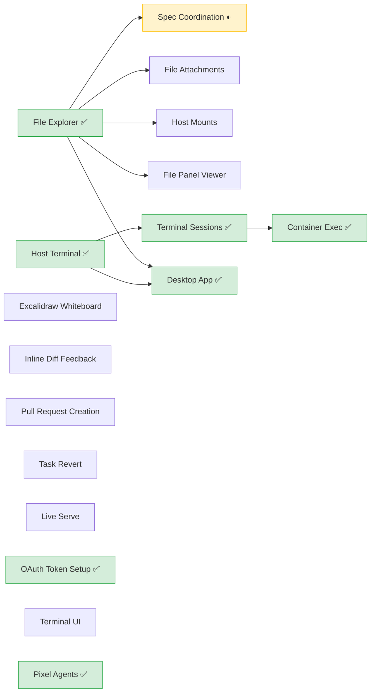
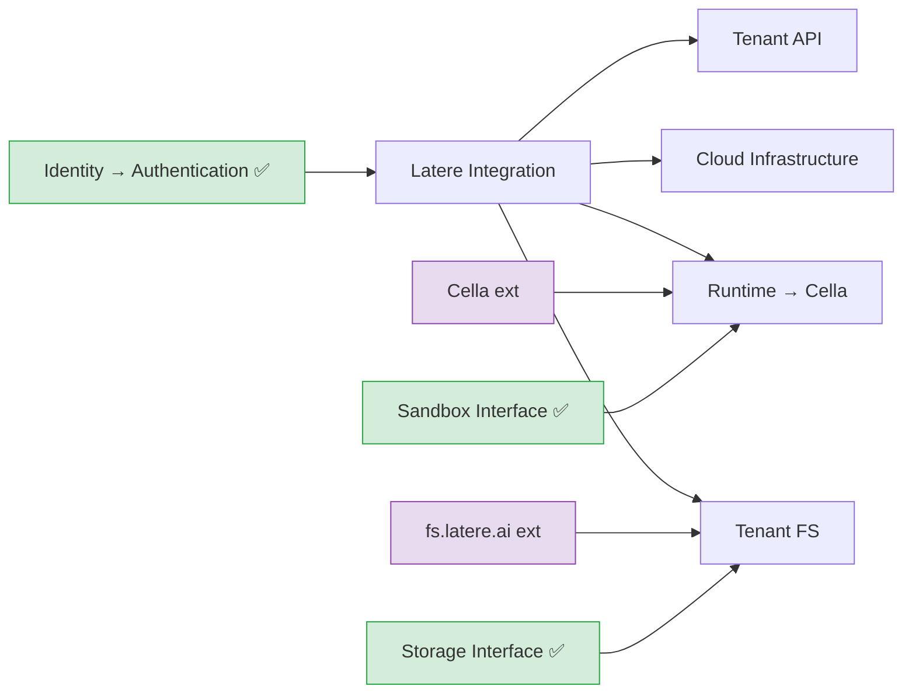
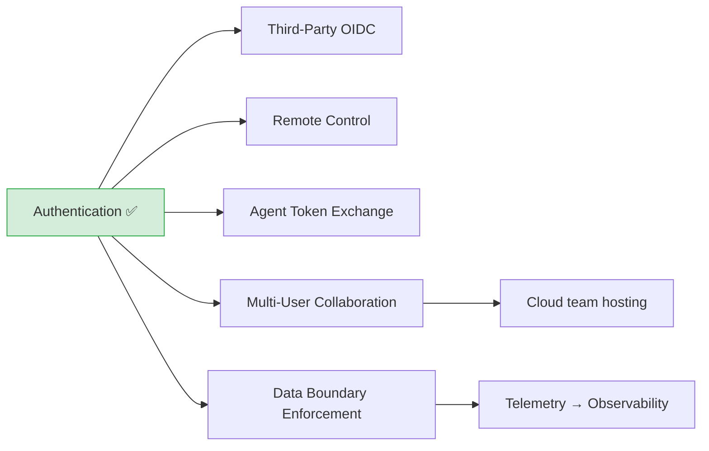
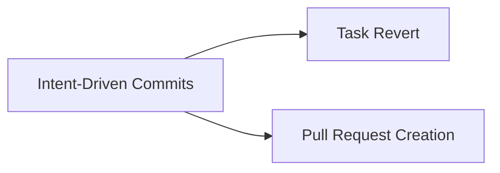

# Specs

Wallfacer roadmap, organized by track and connected by shared design foundations.
Completed specs live in the [Archive](#archive) section at the bottom.

## Status Quo

What has shipped vs what remains. ✅ = complete, ◐ = in progress, ○ = not started.

```
Foundations — 7/7 complete (see Archive)

Local Product — 8 done, 1 in progress, 12 pending
  ✅ Desktop App                   ✅ Terminal Sessions
  ✅ Container Exec                ✅ OAuth Token Setup
  ✅ Pixel Agent Avatars           ◐ Spec Coordination
  ✅ Routine Tasks                 ✅ Agents & Flows
  ✅ Refinement Into Plan          ○ File/Image Attachments
  ○ Host Mounts                    ○ File Panel Viewer
  ○ Inline Diff Feedback           ○ Live Serve
  ○ Terminal UI (TUI mode)         ○ Excalidraw Whiteboard
  ○ Vue Frontend Migration
  ○ Rebrand Module Path            ○ Spatial Canvas
  ○ Scoped Command Registry

Cloud Platform — integration track (consume Latere services, don't absorb)
  ○ Latere Integration (umbrella)  ○ Runtime → Cella
  ○ Tenant Filesystem → FS         ○ Cloud Infrastructure
  ○ Tenant API
  archived: Multi-Tenant, Billing Idempotency (now owned by Cella / Identity)

Shared Design — 2/5 complete
  ✅ Agent Abstraction             ✅ Host Exec Mode
  ○ Overlay Snapshots              ○ Token & Cost Optimization
  ○ Extensible Prompts

Intent — 0/3 (every action is a commit; undo and PR build on it)
  ○ Intent-Driven Commits          ○ Task Revert
  ○ Pull Request Creation

Identity — 1/6 (principals, sessions, data boundaries)
  ✅ Authentication                ○ Third-Party OIDC
  ○ Remote Control                 ○ Agent Token Exchange
  ○ Multi-User Collaboration       ○ Data Boundary Enforcement

Oversight — 0/2 (task-level verification gates)
  ○ Validation Barrier             ○ Visual Verification
```

---

## Local Product

Desktop experience and developer workflow improvements. No cloud dependency. Ships value to single-user deployments.

| Spec | Status | Delivers |
|------|--------|----------|
| [spec-coordination.md](local/spec-coordination.md) | In progress | Umbrella: recursive spec tree model, dispatch workflow, cross-task context |
| ↳ [spec-document-model.md](local/spec-coordination/spec-document-model.md) | **Complete** | Spec frontmatter schema, filesystem-derived tree, `depends_on` DAG, six-state lifecycle (including `archived`), per-spec and cross-spec validation, recursive progress tracking, impact analysis. Extracted `internal/pkg/dag/`, `internal/pkg/tree/`, `internal/pkg/statemachine/` |
| ↳ [spec-archival.md](local/spec-coordination/spec-archival.md) | **Complete** | Sixth lifecycle state (`archived`) — hidden by default, read-only, excluded from impact / progress / drift / stale-propagation. Cascades over non-leaf subtrees on archive; unarchive reverses via `git revert` of the archive commit. Muted rendering in explorer and minimap; archived banner in focused view with stacked undo toasts. |
| ↳ [spec-planning-ux.md](local/spec-coordination/spec-planning-ux.md) | **Complete** | Three-pane spec mode (explorer, focused markdown view, chat stream), planning sandbox container, chat-driven spec iteration, dispatch & board integration, undo snapshots, planning cost tracking. Deferred: Codex compatibility, enhanced session recovery. |
| ↳↳ [planning-chat-threads.md](local/spec-coordination/spec-planning-ux/planning-chat-threads.md) | Drafted | Multi-tab planning chat: independent conversation threads per workspace group sharing the single planner sandbox, per-thread session/history, inline rename, archive-only deletion, `git revert`-based thread-scoped undo, crash-safe migration from single-thread layout. |
| ↳ [spec-state-control-plane.md](local/spec-coordination/spec-state-control-plane.md) | Not started | Server-managed lifecycle transitions: chat-edit fan-out → `stale`, dispatch → `validated`, task done → tester-mediated drift verdict → `complete` or `stale`, periodic cross-tree staleness scan, downstream propagation via `depends_on`. |
| [excalidraw-whiteboard.md](local/excalidraw-whiteboard.md) | Not started | Excalidraw-based drawing/brainstorm whiteboard as a peer view |
| [file-attachments.md](local/file-attachments.md) | Not started | Drag-and-drop file and image attachments for task prompts |
| [host-mounts.md](local/host-mounts.md) | Not started | Per-task read-only host filesystem mounts into sandbox containers |
| [file-panel-viewer.md](local/file-panel-viewer.md) | Not started | VS Code-style inline file panel with tabs, multi-modal preview |
| [inline-diff-feedback.md](local/inline-diff-feedback.md) | Not started | Code-review-style inline comments on diff lines with batch feedback submission |
| [live-serve.md](local/live-serve.md) | Drafted | Build and run developed software from within Wallfacer |
| [refinement-into-plan.md](local/refinement-into-plan.md) | **Complete** | Retired the bespoke refine pipeline. Plan mode edits task prompts directly via a Task Prompts explorer section and a task-aware `update_task_prompt` tool. Rounds persist as task events; undo is event rewind for task mode, git revert for spec mode. Auto-refine removed entirely (no replacement in this spec). |
| [terminal-ui.md](local/terminal-ui.md) | Not started | Full TUI mode — interactive terminal board, log streaming, task lifecycle via Bubble Tea |
| [vue-frontend-migration.md](local/vue-frontend-migration.md) | Drafted | Converge both frontends (vanilla JS `ui/` + Vue+TS `frontend/`) into a single Vue 3 + TypeScript SPA. Runtime mode switching: local serves kanban directly, cloud adds landing/docs/pricing. Parallel build with cutover flag. Supersedes typescript-migration and typed-dom-hooks. |
| [rebrand-module-path.md](local/rebrand-module-path.md) | Not started | Migrate module path and image refs from `changkun.de/x/wallfacer` to `latere.ai/wallfacer` |
| [spatial-canvas.md](local/spatial-canvas.md) | Vague | Spatial infinite-canvas view — tasks, agents, and notes as free-form nodes on a 2D plane |
| [scoped-command-registry.md](local/scoped-command-registry.md) | Drafted | Promote the planning-only slash command registry to a surface-agnostic mechanism with per-scope catalogs (planning, task_create, task_waiting). Task board and other UI surfaces can then trigger their own `/` commands via the shared autocomplete widget. |
| [routine-tasks.md](local/routine-tasks.md) | **Complete** | Promote the ideation agent's "cronjob" scheduler into a generic primitive: routines are board cards (`Kind=routine`) with a schedule that spawn fresh instance tasks when they fire. Users create, edit, and toggle routines on the board; ideation migrates to a `system:ideation`-tagged routine. |
| [agents-and-flows.md](local/agents-and-flows.md) | **Complete** | Promote agent role + pipeline to first-class user-facing primitives. Sidebar gains Agents and Flows tabs; the composer simplifies to "pick a Flow, write a prompt". Seeded built-in flows (`implement`, `brainstorm`, `refine-only`, `test-only`) replace the current TaskKind + Agent-overrides surface. Depends on the backend abstraction in `shared/agent-abstraction.md`. |
| [agents-and-flows/refinements.md](local/agents-and-flows/refinements.md) | **Archived** | Post-ship follow-ups to the agents-and-flows track that landed after the parent was archived: split-pane UI redesign for both tabs, token-based CSS restyle onto the paper-ink palette, `Role.PromptTmpl` runtime wiring in `runAgent`, dedicated [`docs/guide/agents-and-flows.md`](../docs/guide/agents-and-flows.md) guide, and a cross-reference repair across 12 docs. |

### Local product dependencies



---

## Cloud Platform

Integration track. Wallfacer is the autonomous-engineering control plane; in cloud mode it **consumes** Latere platform services rather than absorbing them (`latere.ai/specs/products/wallfacer.md`). Each integration is a thin client over a service boundary (Identity, Cella, FS), config-gated so local mode is unchanged. The earlier "build our own control plane / instance provisioner / Stripe" specs are archived — Cella and Identity own those concerns now.

| Spec | Status | Delivers |
|------|--------|----------|
| [latere-integration.md](cloud/latere-integration.md) | Drafted | Umbrella: the integration seams (Identity ✅, Runtime→Cella, FS, deploy, Lux, MCP, metadata) and the consume-don't-absorb rules |
| ↳ [latere-integration/cella-runtime.md](cloud/latere-integration/cella-runtime.md) | Drafted | `CellaBackend` implementing `sandbox.Backend` — a third runtime alongside Local (podman/docker) and Host, selected by `--backend cella`. Maps `ContainerSpec` onto Cella's `/v1/sandboxes` API; worktree transport via FS |
| ↳ [latere-integration/shared-cella-client.md](cloud/latere-integration/shared-cella-client.md) | Drafted | Extract Cella's wire client into a standalone `latere.ai/x/sandbox/client` package shared by Wallfacer's `CellaBackend` and Topos's `cella.Provider`; abstractions stay split (harness-inside vs harness-outside) |
| [tenant-filesystem.md](cloud/tenant-filesystem.md) | Drafted | fs.latere.ai integration, repo provisioner, workspace cloud mapping. **Blocked on FS Workspace API (Phase 5)** |
| [cloud-infrastructure.md](cloud/cloud-infrastructure.md) | Drafted | Thin deploy module into the existing DOKS `latere` namespace + `pkg/otel` OTLP emit |
| [tenant-api.md](cloud/tenant-api.md) | Drafted | Versioned external API (`/api/v1/`), per-tenant API keys, webhooks |

### Cloud platform dependencies



### Deployment modes

Three modes, auth is opt-in at every mode (see [authentication.md](identity/authentication.md)):

1. **Local anonymous (today):** Wallfacer runs on the user's machine, no auth. Filesystem storage, local containers.
2. **Local authenticated:** Same binary, signed in to latere.ai. Adds account linkage and (later) cloud metadata coordination — code stays local, execution stays local.
3. **Cloud execution (Phase 3+, gated by demand):** Task runtimes dispatch to **Cella** via the runtime seam ([cella-runtime.md](cloud/latere-integration/cella-runtime.md)); workspace files stage through **FS**. Wallfacer asks "run this bounded task"; Cella owns scheduling, warm pools, and hardening.

Why no wallfacer-owned K8s control plane? Cella already owns sandbox runtime, lifecycle, quota, and audit. Wallfacer consuming Cella's `Runtime` interface avoids duplicating an entire platform — see [latere-integration.md](cloud/latere-integration.md).

---

## Shared Design

Specs that serve both tracks. These define interfaces and behaviors that local product and cloud platform both depend on.

| Spec | Status | Serves | Delivers |
|------|--------|--------|----------|
| [agent-abstraction.md](shared/agent-abstraction.md) | **Complete** | Both | `AgentRole` descriptor + `runAgent` primitive unify the seven sub-agent roles (title, oversight, commit, refinement, ideation, implementation, testing) onto one container launch path. Shipped Option A across 5 migration phases; Options C / D deferred. |
| [host-exec-mode.md](shared/host-exec-mode.md) | **Complete** | Local | `HostBackend` — opt-in `wallfacer run --backend host` that execs host-installed `claude`/`codex` directly. No image pull, no container; trades isolation for zero install friction. Covers both agents, live NDJSON streaming, parallel-cap default, Settings UI warning, `make build-host` target, and host-mode E2E harness. |
| [overlay-snapshots.md](shared/overlay-snapshots.md) | Not started | Both | Overlay snapshot cloning, CRIU checkpoint/restore. Accelerates both local workers and cloud pod startup. |
| [token-cost-optimization.md](shared/token-cost-optimization.md) | Not started | Both | Cache observability, --resume correctness audit, shell output compression (RTK), consumption regression model, prospective budgeting. |
| [extensible-prompts.md](shared/extensible-prompts.md) | Not started | Both | Discoverable, user-creatable prompt system — replace hardcoded templates with skill-like prompt files that the system discovers at runtime. |

### Why these are shared

**Agent abstraction** refactors `internal/runner/` — the execution engine that both tracks use. Without it, every new agent role requires touching 6+ files with duplicated launch/parse/usage logic. Both tracks add new roles (cloud adds K8s-aware agents, local product adds planning/gate agents from spec coordination).

**Overlay snapshots** accelerates container startup for both local workers and cloud K8s pods.

---

## Identity

Everything about principals, sessions, delegation, and what data crosses the machine boundary. Authentication is the anchor; the rest build on the principal context it establishes. Spans local, cloud, and cross-machine (remote-control) deployments — any wallfacer instance that has a user, an org, or an agent acting on behalf of either needs these.

| Spec | Status | Delivers |
|------|--------|----------|
| [authentication.md](identity/authentication.md) | **Complete** | OAuth2/OIDC login, session management, user identity. Phase 1: `WALLFACER_CLOUD` flag, `latere.ai/x/pkg/oidc` integration, cloud-gated `/login`/`/callback`/`/logout`/`/logout/notify`/`/api/auth/me` routes, status-bar sign-in badge. Phase 2: JWT middleware, principal context, `org_id`/`created_by` fields, forced login, superadmin/scope gating, org switching. Unblocks cloud multi-tenant and multi-user collaboration. Phase 3 split into third-party-oidc and remote-control below. |
| [third-party-oidc.md](identity/third-party-oidc.md) | Vague | Pluggable OIDC so self-hosted non-latere.ai deployments can log in against Keycloak, Entra ID, Okta, Authelia, Dex, etc. Depends on authentication Phase 2. |
| [remote-control.md](identity/remote-control.md) | Vague | Wire protocol + latere.ai-side registry that lets the latere.ai web UI or a mobile client observe and operate signed-in local wallfacer instances. Depends on authentication Phase 2. |
| [agent-token-exchange.md](identity/agent-token-exchange.md) | Drafted | RFC 8693 delegation — mint short-lived agent tokens per task so sandbox agents can call latere.ai backend services (fs, telemetry) on behalf of the dispatching user. Orthogonal to user login. |
| [multi-user-collaboration.md](identity/multi-user-collaboration.md) | Drafted | Reframes tenant as org (not user), adds actor fields across the store, RBAC role matrix, presence/focus, optimistic concurrency, private planning threads. Blocker for cloud hosting. |
| [data-boundary-enforcement.md](identity/data-boundary-enforcement.md) | Drafted | Enforce what metadata can leave the user's machine to wallfacer.cloud — explicit allow-list, redaction at the boundary, CI lint against leaked code/paths/secrets. |

### Identity dependencies



Multi-user collaboration is the gate for cloud *team* hosting (org-scoped shared boards); data-boundary-enforcement is the gate for anything the local instance sends up to observability / cloud.

---

## Intent

Every user or agent action becomes a git commit with metadata; revert and PR are natural consumers. Intent-commits is the primitive foundation — once every action is a commit, "undo this task" and "open a PR for this branch" are just traversals over that commit graph.

| Spec | Status | Delivers |
|------|--------|----------|
| [intent-commits.md](intent/intent-commits.md) | Vague | Every intent (task run, planning chat edit, explorer file edit) produces a git commit with structured metadata. Enables fine-grained undo, attribution, and revert. Foundation for the other two specs in this theme. |
| [task-revert.md](intent/task-revert.md) | Drafted | Agent-assisted revert of merged task changes with conflict resolution. Consumes intent-commits metadata to know which commits belong to a task. |
| [pull-request.md](intent/pull-request.md) | Drafted | Agent-generated GitHub PR from the current branch via a lightweight sandbox. Uses intent-commits metadata to pick commit messages and PR body content. |

### Intent dependencies



Ship intent-commits first; revert and PR become noticeably simpler once every action is already a well-formed commit.

---

## Oversight

Task-level verification gates wallfacer runs around its own agent execution.

| Spec | Status | Delivers |
|------|--------|----------|
| [validation-barrier.md](oversight/validation-barrier.md) | Drafted | Pre-execution gate: user-defined test criteria persisted on tasks for targeted post-run verification. |
| [visual-verification.md](oversight/visual-verification.md) | Drafted | Post-execution visual check for UI changes — Playwright-based screenshot diffs. |

Both are independent, task-scoped, and depend only on the shipped agent abstraction.

---

## Ordering Rationale

**Within local product:**
- Spec coordination is in progress (document model, planning UX, and archival complete; drift detection remains).
- Live serve is independent — start anytime.
- Oversight is two task-scoped gates (validation barrier, visual verification) under `specs/oversight/`.

**Within cloud platform:**
- [latere-integration.md](cloud/latere-integration.md) is the umbrella — it defines each seam's contract and the consume-don't-absorb rules. Read it first.
- Runtime → Cella ([cella-runtime.md](cloud/latere-integration/cella-runtime.md)) is the lead leaf: it generalizes the existing Local/Host backend selection to a cloud runtime via the `sandbox.Backend` interface.
- Tenant filesystem integrates with fs.latere.ai for config persistence and hot-tier workspace staging. Prerequisite: fs.latere.ai Phase 5 (Workspace API) — the cross-product critical-path blocker. The runtime leaf's worktree transport depends on it.
- Cloud infrastructure is a thin deploy module into the existing DOKS `latere` namespace, not a from-scratch cluster design.
- Tenant API comes last — after the runtime + FS seams exist.

**Cross-track:**
- Identity (authentication, OIDC, remote-control, agent-tokens, multi-user-collab, data-boundary) now lives in `specs/identity/` as its own theme — authentication complete; the rest unblocked by Phase 2.
- Agent abstraction reduces duplication before either track adds new agent roles.
- Sandbox backends (K8s, native-OS, hardening) live in the external `latere.ai/sandbox` repo and evolve on their own timeline; wallfacer depends on the `Runtime` interface that repo exposes.

**Between tracks:**
- The two tracks are independent after shared foundations. They can run in parallel.
- The only hard cross-track dependency: the cloud integration track requires authentication (shipped).

---

## Archive

System of record for completed work. Stable, not under active development. Included for reference and dependency context only.

### Foundations

Abstraction interfaces that all tracks build on. All seven are shipped and stable.

| Spec | Delivers |
|------|----------|
| [sandbox-backends.md](foundations/sandbox-backends.md) | `sandbox.Backend` / `sandbox.Handle` + `LocalBackend` |
| [storage-backends.md](foundations/storage-backends.md) | `StorageBackend` + `FilesystemBackend`; cloud backends (PG, S3) deferred to cloud track |
| [multi-workspace-groups.md](foundations/multi-workspace-groups.md) | Multi-store manager, runtime workspace switching |
| [container-reuse.md](foundations/container-reuse.md) | Per-task worker containers via `podman exec` |
| [file-explorer.md](foundations/file-explorer.md) | Browse + edit workspace files in the web UI |
| [host-terminal.md](foundations/host-terminal.md) | Interactive shell in the web UI (WebSocket + PTY) |
| [windows-support.md](foundations/windows-support.md) | Tier 2 Windows host support |

### Local — Completed

| Spec | Delivers |
|------|----------|
| [desktop-app.md](local/desktop-app.md) | Wails native wrapper (macOS .app, Windows .exe, Linux binary) |
| [terminal-sessions.md](local/terminal-sessions.md) | Multiple concurrent terminal sessions with tab bar |
| [terminal-container-exec.md](local/terminal-container-exec.md) | Attach to running task containers from the terminal panel |
| [oauth-token-setup.md](local/oauth-token-setup.md) | Browser-based OAuth sign-in for Claude and Codex credentials |
| [pixel-agents.md](local/pixel-agents.md) | Pixel art office view — animated characters representing task agents |

### Cloud — Archived (superseded by the Latere platform boundary)

Specs proposing wallfacer build infrastructure that Latere services now own. Replaced by the integration track ([latere-integration.md](cloud/latere-integration.md)). Retained for context.

| Spec | Why archived |
|------|--------------|
| [multi-tenant.md](cloud/multi-tenant.md) | Control plane, per-user instance provisioning, routing, and hibernation are owned by **Cella** (runtime) and **terraform** (infra); org/team scoping is Identity's. Wallfacer consumes, not builds. |
| [billing-idempotency.md](cloud/billing-idempotency.md) | Stripe charge mechanics and idempotency are owned by **Identity** (`latere.ai/x/auth`). Wallfacer's only billing surface is an optional read-only subscription UX, to be specced if/when payment is introduced. |
