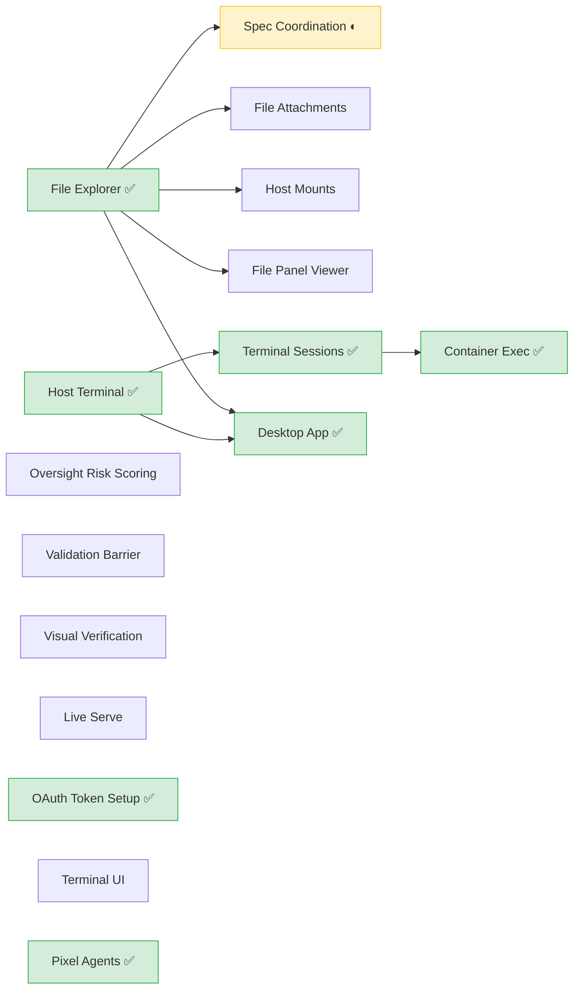
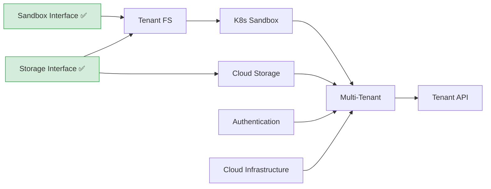

# Specs

Wallfacer roadmap. Three tracks run in parallel, connected by shared design foundations.

## Status Quo

What has shipped vs what remains. ✅ = complete, ○ = not started.

```
Foundations (complete)
  ✅ Sandbox Backend Interface
  ✅ Storage Backend Interface
  ✅ Container Reuse
  ✅ File Explorer
  ✅ Host Terminal

Local Product                     Cloud Platform
  ◐ Spec Coordination               ○ Cloud Deployment (overview)
  ✅ Desktop App                     ○ Tenant Filesystem
  ○ File/Image Attachments          ○ K8s Sandbox Backend
  ○ Host Mounts                     ○ Cloud Infrastructure
  ○ File Panel Viewer               ○ Multi-Tenant (capstone)
  ✅ Terminal Sessions               ○ Tenant API
  ✅ Container Exec
  ○ Oversight Risk Scoring        Shared Design
  ○ Validation Barrier              ○ Authentication
  ○ Visual Verification             ○ Agent Abstraction
  ✅ OAuth Token Setup              ○ Native Sandboxes (Linux/macOS/Win)
  ○ Live Serve                      ○ Overlay Snapshots
  ○ Terminal UI (TUI mode)
  ✅ Pixel Agent Avatars
```

---

## Foundations (Complete)

Abstraction interfaces that all tracks build on. These are done and stable.

| Spec | Status | Delivers |
|------|--------|----------|
| [sandbox-backends.md](foundations/sandbox-backends.md) | **Complete** | `sandbox.Backend` / `sandbox.Handle` + `LocalBackend` |
| [storage-backends.md](foundations/storage-backends.md) | **Complete** (enablers) | `StorageBackend` + `FilesystemBackend`; cloud backends (PG, S3) deferred to cloud track |
| [multi-workspace-groups.md](foundations/multi-workspace-groups.md) | **Complete** | Multi-store manager, runtime workspace switching |
| [container-reuse.md](foundations/container-reuse.md) | **Complete** | Per-task worker containers via `podman exec` |
| [file-explorer.md](foundations/file-explorer.md) | **Complete** | Browse + edit workspace files in the web UI |
| [host-terminal.md](foundations/host-terminal.md) | **Complete** | Interactive shell in the web UI (WebSocket + PTY) |
| [windows-support.md](foundations/windows-support.md) | **Complete** | Tier 2 Windows host support |

---

## Local Product

Desktop experience and developer workflow improvements. No cloud dependency. Ships value to single-user deployments.

| Spec | Status | Delivers |
|------|--------|----------|
| [spec-coordination.md](local/spec-coordination.md) | In progress | Umbrella: recursive spec tree model, dispatch workflow, cross-task context |
| ↳ [spec-document-model.md](local/spec-coordination/spec-document-model.md) | **Complete** | Spec frontmatter schema, filesystem-derived tree, `depends_on` DAG, five-state lifecycle, per-spec and cross-spec validation, recursive progress tracking, impact analysis. Extracted `internal/pkg/dag/`, `internal/pkg/tree/`, `internal/pkg/statemachine/` |
| ↳ [spec-drift-detection.md](local/spec-coordination/spec-drift-detection.md) | Not started | Drift detection, propagation through spec tree, `affects` field |
| ↳ [spec-planning-ux.md](local/spec-coordination/spec-planning-ux.md) | Not started | Spec explorer, chat-driven iteration, dispatch workflow, progress tracking |
| [desktop-app.md](local/desktop-app.md) | **Complete** | Wails native wrapper (macOS .app, Windows .exe, Linux binary) |
| [file-attachments.md](local/file-attachments.md) | Not started | Drag-and-drop file and image attachments for task prompts |
| [host-mounts.md](local/host-mounts.md) | Not started | Per-task read-only host filesystem mounts into sandbox containers |
| [file-panel-viewer.md](local/file-panel-viewer.md) | Not started | VS Code-style inline file panel with tabs, multi-modal preview |
| [terminal-sessions.md](local/terminal-sessions.md) | **Complete** | Multiple concurrent terminal sessions with tab bar |
| [terminal-container-exec.md](local/terminal-container-exec.md) | **Complete** | Attach to running task containers from the terminal panel |
| [oversight-risk-scoring.md](local/oversight-risk-scoring.md) | Not started | Real-time agent action risk assessment |
| [visual-verification.md](local/visual-verification.md) | Not started | Visual verification for UI changes |
| [live-serve.md](local/live-serve.md) | Not started | Build and run developed software from within Wallfacer |
| [oauth-token-setup.md](local/oauth-token-setup.md) | **Complete** | Browser-based OAuth sign-in for Claude and Codex credentials |
| [pixel-agents.md](local/pixel-agents.md) | **Complete** | Pixel art office view — animated characters representing task agents |
| [validation-barrier.md](local/validation-barrier.md) | Not started | User-defined test criteria persisted on tasks for targeted verification |
| [terminal-ui.md](local/terminal-ui.md) | Not started | Full TUI mode — interactive terminal board, log streaming, task lifecycle via Bubble Tea |
| [rebrand-module-path.md](local/rebrand-module-path.md) | Not started | Migrate module path and image refs from `changkun.de/x/wallfacer` to `latere.ai/wallfacer` |

### Local product dependencies



---

## Cloud Platform

Multi-tenant hosted service. Builds on sandbox and storage interfaces.

| Spec | Status | Delivers |
|------|--------|----------|
| [cloud-backends.md](cloud/cloud-backends.md) | Not started | Overview: VPS recipe, per-user instance architecture, sub-milestone index |
| [tenant-filesystem.md](cloud/tenant-filesystem.md) | Not started | Per-tenant persistent volume, repo provisioner, workspace group cloud mapping |
| [k8s-sandbox.md](cloud/k8s-sandbox.md) | Not started | `K8sBackend` — K8s Jobs with PVC mounts, pod log streaming, exec |
| [cloud-infrastructure.md](cloud/cloud-infrastructure.md) | Not started | Per-provider IaC modules (DO, AWS, GCP, Alibaba, self-hosted) |
| [multi-tenant.md](cloud/multi-tenant.md) | Not started | Control plane, instance provisioning and lifecycle |
| [tenant-api.md](cloud/tenant-api.md) | Not started | Versioned external API (`/api/v1/`), per-tenant API keys, webhooks |

### Cloud platform dependencies



### Scaling strategy

Two modes, no intermediate step:

1. **VPS (today):** Single VM, single user, filesystem storage, local containers.
2. **K8s (when scaling):** Managed K8s. Each tenant gets a wallfacer pod + PVC. Task containers dispatch as K8s Jobs.

Why no VM-per-tenant intermediate? The wallfacer binary is identical in both modes. Building a VM provisioner then replacing it with K8s is wasted work. See [cloud-backends.md](cloud/cloud-backends.md) for cost estimates.

---

## Shared Design

Specs that serve both tracks. These define interfaces and behaviors that local product and cloud platform both depend on.

| Spec | Status | Serves | Delivers |
|------|--------|--------|----------|
| [authentication.md](shared/authentication.md) | Not started | Both | OAuth2/OIDC login, session management, user identity. Locally: replaces static API key with real login. Cloud: prerequisite for multi-tenant. |
| [agent-abstraction.md](shared/agent-abstraction.md) | Not started | Both | Pluggable agent roles, unified container lifecycle, inter-agent communication. Eliminates role duplication that both tracks would inherit. |
| [native-sandbox-linux.md](shared/native-sandbox-linux.md) | Not started | Local | `BubblewrapBackend`, `NspawnBackend` — daemon-free sandboxing |
| [native-sandbox-macos.md](shared/native-sandbox-macos.md) | Not started | Local | `VZBackend`, `SandboxInitBackend` — macOS-native isolation |
| [native-sandbox-windows.md](shared/native-sandbox-windows.md) | Not started | Local | `JobObjectBackend`, `HyperVBackend` — Windows-native isolation |
| [overlay-snapshots.md](shared/overlay-snapshots.md) | Not started | Both | Overlay snapshot cloning, CRIU checkpoint/restore. Accelerates both local workers and cloud pod startup. |

### Why these are shared

**Authentication** is the clearest cross-track spec. A single-host deployment gets real login instead of a bearer token. The cloud track needs it as a prerequisite for multi-tenant. Implementing it once serves both.

**Agent abstraction** refactors `internal/runner/` — the execution engine that both tracks use. Without it, every new agent role requires touching 6+ files with duplicated launch/parse/usage logic. Both tracks add new roles (cloud adds K8s-aware agents, local product adds planning/gate agents from spec coordination).

**Native sandboxes** are alternatives to the container-based `LocalBackend`. They eliminate the Docker/Podman dependency for local deployments and the desktop app.

**Overlay snapshots** accelerates container startup for both local workers and cloud K8s pods.

---

## Dependency Graph

How the three tracks connect through shared design and foundations.

```mermaid
graph TB
  subgraph Foundations [Foundations ✅]
    SBI[Sandbox Interface]
    STI[Storage Interface]
    CR[Container Reuse]
    FE[File Explorer]
    MW[Multi-Workspace]
    HT[Host Terminal]
  end

  subgraph Shared [Shared Design]
    AUTH[Authentication]
    AA[Agent Abstraction]
    OS[Overlay Snapshots]
    NSL[Native Sandbox Linux]
    NSM[Native Sandbox macOS]
    NSW[Native Sandbox Windows]
  end

  subgraph Local [Local Product]
    SC[Spec Coordination ◐]
    FA[File Attachments]
    HM[Host Mounts]
    FPV[File Panel Viewer]
    DA[Desktop App ✅]
    TS[Terminal Sessions ✅]
    CE[Container Exec ✅]
    ORS[Oversight Risk Scoring]
    VB[Validation Barrier]
    VV[Visual Verification]
    LS[Live Serve]
    OTS[OAuth Token Setup ✅]
    TUI[Terminal UI]
    PA[Pixel Agents ✅]
  end

  subgraph Cloud [Cloud Platform]
    TFS[Tenant FS]
    K8S[K8s Sandbox]
    CS[Cloud Storage]
    CI[Cloud Infrastructure]
    MT[Multi-Tenant]
    TA[Tenant API]
  end

  %% Foundations → Local
  FE --> SC
  FE --> FA
  FE --> HM
  FE --> FPV
  FE --> DA
  HT --> DA
  HT --> TS --> CE

  %% Foundations → Cloud
  SBI --> TFS
  STI --> TFS
  STI --> CS

  %% Shared → Cloud
  AUTH --> MT

  %% Cloud internal
  TFS --> K8S --> MT
  CS --> MT
  CI --> MT
  MT --> TA
```



---

## Ordering Rationale

**Within local product:**
- Spec coordination is in progress (document model complete; drift detection and planning UX remain).
- Terminal extensions complete: sessions and container exec both shipped.
- Desktop app is complete.
- Oversight, visual verification, live serve are independent — start anytime.

**Within cloud platform:**
- Tenant filesystem first — repos and worktrees need a cloud home before K8s can mount them.
- K8s sandbox consumes the tenant volume layout.
- Cloud storage (PG, S3) can run in parallel with tenant FS / K8s sandbox.
- Cloud infrastructure (IaC) is a leaf — provisions managed services.
- Multi-tenant is the capstone wiring everything together. Tenant API comes after.

**Cross-track:**
- Authentication should be early — useful for both tracks and blocks multi-tenant.
- Agent abstraction reduces duplication before either track adds new agent roles.
- Native sandboxes are independent — start when the desktop app needs them.

**Between tracks:**
- The two tracks are independent after shared foundations. They can run in parallel.
- The only hard cross-track dependency: multi-tenant requires authentication.
