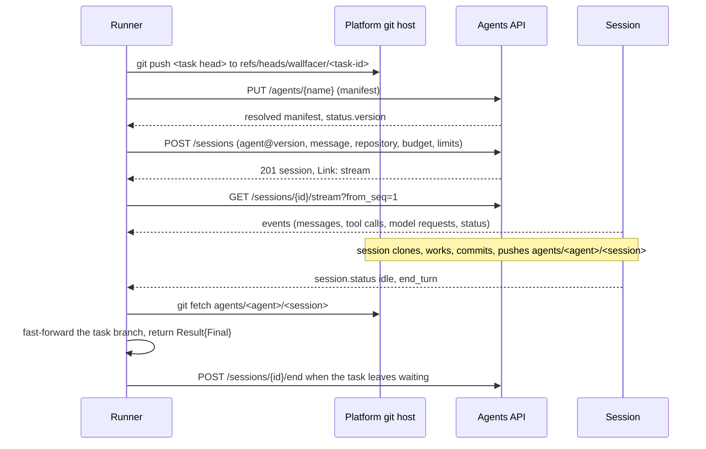

# Hosted Agents as the Remote Executor

Axis B of the [platform integration](../latere-integration.md): a wallfacer
task runs as a hosted agent session on the Latere platform instead of as a
process on the user's machine. This is the only Latere remote executor. It
replaces three earlier designs: a sandbox backend
([cella-runtime](../../.archive/cloud/latere-integration/cella-runtime.md)),
a file-plane worktree transport
([tenant-filesystem](../../.archive/cloud/tenant-filesystem.md)), and the
first version of this spec, which targeted a run API that no longer exists.

The file keeps its name. Topos is the open-source project behind the
platform's Agents capability; the address wallfacer calls is the capability's.

## Problem

Every wallfacer task executes on the user's machine. A long task holds the
machine awake, shares its CPU with the user, and stops when the lid closes.
The platform runs agents as a service: a session keeps working with no client
attached, on a machine of its own, under a budget.

Wallfacer should be able to hand a task to that service and keep everything
else it does: the board, the task timeline, review of the diff, the commit
and merge pipeline, and the spec lifecycle around the task.

## The service this builds on

The design relies on these properties of the Agents capability, as its
published API states them. The root is `https://api.latere.ai/v1/agents`.

| Property | Statement |
|---|---|
| Agent | A versioned configuration: a model from the catalog, instructions, built-in tools, permissions, a budget. Applied as a manifest with `PUT /agents/{name}`. A version is identified by a digest of the resolved `spec`, so applying the same manifest twice leaves one version |
| Session | One conversation with one agent version and one append-only event log. Started with `POST /sessions` and a first message. Always `running`, `idle` with a reason, or `ended` |
| Harness | The session runs the platform's own agent loop with the model the agent names. It does not run a coding CLI that the caller selects |
| Workload | A session starts without a machine. The first tool call that touches files or runs a command opens a Linux workload for it, which stops when idle and is removed when the session ends |
| Repositories | A session names up to 8 repositories as `https` URLs with no credential. Each is cloned into the workload. The session works on a branch of its own, `agents/<agent>/<session>`, created from the ref the repository entry names, and pushes it with plain `git` |
| Credentials | The workload holds none. The platform injects them at the workload's egress, and only for the platform's git host and its Models address. A repository on another host is cloned without a credential |
| Events | `GET /sessions/{id}/events` pages the log from a sequence number. `GET /sessions/{id}/stream` is the same log as Server-Sent Events, resumable with `Last-Event-ID` |
| Input | `POST /sessions/{id}/events` sends a `user.message`, a `user.interrupt`, or a `user.tool_confirmation` |
| Budget | The lowest of the agent's, the request's, and the plan's. At the budget the session goes `idle` with `budget` and spends nothing more |
| Contexts | A personal agent's sessions run and spend from the person's wallet. An organization's agent cannot be given a budget yet, so its sessions are refused |
| Limits | 600 requests a minute and 16 open streams per caller. Every `POST` takes an `Idempotency-Key` |

Two consequences shape everything below.

1. **Hosted execution is a mode of the native harness, not a remote copy of
   the CLI harnesses.** Wallfacer's Claude Code, Codex, Cursor, OpenCode and
   Pi harnesses are local processes and stay local. The hosted session is the
   same kind of run as the in-process native harness
   ([topos-native-harness](../../shared/topos-native-harness.md)): one agent,
   a model from the gateway, built-in tools. The choice wallfacer adds is
   where that run happens.
2. **The session owns the workspace.** Wallfacer does not upload a worktree.
   It makes the task's starting commit reachable on the platform's git host,
   names it, and fetches the session's branch back.

## Decision

Add a hosted run to the runner as a third `runFn` of `driveToposRun`
(`internal/runner/agentic.go`), beside `runAgenticFlow` and `runNativeTopos`.
`driveToposRun` already forwards live events onto the task timeline, persists
the final text and trace, classifies failure, and walks the task through
`in_progress`, `waiting`, `committing` and `done`. A hosted run supplies the
same `(agentgraph.Result, error)` and the same event callback from a session
on the platform instead of from an in-process runtime.

The platform calls live in a new package, `internal/hostedagents`, which
imports nothing from the embedded runtime. `internal/agentgraph` stays the
only importer of the runtime module, as its boundary test requires.

`executor.Backend` is not the seam. It is shaped for a process: a stdout
reader, a stderr reader, an exit code. A session has an event log, statuses
with reasons, and input events. Forcing it behind `Handle` would mean
re-serializing typed events into a byte stream for the runner to parse again.

## Design

### Selection

A task runs hosted when both hold:

- its resolved harness is the native harness (`harness.InProcess` reports
  true for it), and
- its execution target is `hosted`.

The execution target is a new per-task field with two values, `local` (the
default, and the zero value) and `hosted`. A workspace-level default selects
the initial value for new tasks; the composer shows the choice only when the
instance is signed in. A task pinned to a CLI harness has no `hosted` option.

Flows that delegate between several agents (`runAgenticFlow`) stay local in
v1. A hosted session is one agent.

Where the selector is drawn and how it reads next to the harness picker
belongs to [topos-native-harness](../../shared/topos-native-harness.md),
which owns the harness surface. This spec owns the field, its validation,
and the run.

### Dispatch sequence

Every step before `POST /sessions` is idempotent, and the create carries an
`Idempotency-Key` derived from the task id and its turn number, so a retry
after a dropped connection starts no second session.

### The agent

Wallfacer applies one agent per role it runs hosted. v1 has one role,
`implement`.

| Manifest field | Source |
|---|---|
| `metadata.name` | `wallfacer-implement`, fixed. A DNS label, as the API requires |
| `spec.model.name` | The task's effective model when it names a catalog model, else the configured default for hosted runs |
| `spec.instructions` | The role's system prompt from wallfacer's agent registry, followed by one fixed paragraph: commit the work and push the session's branch before ending the turn |
| `spec.tools` | The built-in set the role needs: `read`, `grep`, `glob`, `edit`, `write`, `bash`, `todo` |
| `spec.permissions` | The workload permissions every agent with a file or command tool needs, as the platform documents them. No repository permission: a session's repositories come with the session |
| `spec.budget.maxCost` | The configured ceiling for one hosted task |
| `spec.approvals.mode` | `confirm`, the platform's default: a call that runs inside the session's workload runs at once |

The manifest is rendered from wallfacer's configuration and applied before
every dispatch. Because a version is a digest of the `spec`, an unchanged
configuration applies to the same version and a changed one creates the next.
The session pins the version the apply returned (`agent_<id>@<n>`), so a
configuration change during a run does not reach it.

The model name is the only field that varies by task. Two tasks with
different models would otherwise alternate the agent between two versions,
which is correct but noisy in the agent's version history. v1 accepts that;
an agent per model is an open question.

Workspace instruction files (`AGENTS.md` and its peers) are not copied into
the manifest. They are files in the repository, and the session reads them
from its clone.

### Workspace transport

A hosted task works on one repository in v1. The repository must have a
remote on the platform's git host that the signed-in user may push to. The
dispatch fails before anything leaves the machine when it has none, with one
error code and a sentence that names the missing remote.

1. **Out.** The runner pushes the task branch's head to
   `refs/heads/wallfacer/<task-id>` on that remote with plain `git`, using
   the credentials the user's git already has for the host. The session's
   repository entry names that branch as its `ref`.
2. **Work.** The platform clones the repository into the session's workload
   and creates `agents/wallfacer-implement/<session>` from the named ref. The
   agent edits, commits and pushes that branch.
3. **Back.** When the session goes `idle` with `end_turn`, the runner fetches
   the session's branch and fast-forwards the task branch in the local
   worktree to it. The session's branch descends from the commit the runner
   pushed, so the update is a fast-forward by construction; anything else is
   reported as a failure and nothing is merged.
4. **Clean up.** When the task reaches `done` or `cancelled`, the runner
   deletes `refs/heads/wallfacer/<task-id>` from the remote. The session's
   own branch is left: it is the platform's record of the run and carries the
   session and agent trailers.

The commits a session makes are authored by the agent and carry the
`Topos-Session` and `Topos-Agent` trailers. They enter the task's commit
history as they are. `captureTaskCommits` records them. The existing
`committing` phase stages nothing in a clean worktree, so its first step is a
no-op and it proceeds to rebase and merge.

A turn that ends with nothing pushed is not a finished task. The task moves
to `waiting` with the agent's final message, the same as a local run that
asks a question.

### Session and task lifecycle

A task maps to one session for as long as the session lives. Feedback on a
waiting task is the next message of the same session, not a new run.

| Session | Task | Runner action |
|---|---|---|
| created, `running` | `in_progress` | Follow the stream |
| `idle`, `end_turn`, branch advanced | `waiting`, then `committing` and `done` under the existing autonomy rules | Fetch, fast-forward |
| `idle`, `end_turn`, branch unchanged | `waiting` | Show the final message |
| `idle`, `tool_confirmation` | `waiting`, with the pending call | Send `user.tool_confirmation` with the user's `allow` or `deny` |
| `idle`, `budget` | `waiting`, with the budget reason | Offer resume when a service refused money; a session at its own budget cannot continue |
| `idle`, `turn_limit` or `output_limit` or `error` | `failed`, with the matching failure category | Record the session's `session.error` code |
| `idle`, `interrupted` | `cancelled` when wallfacer interrupted | End the session with `canceled` |
| `ended`, `expired` or `failed` | `failed` | None; the log stays readable |
| user feedback on a `waiting` task | `in_progress` | `POST /events` with `user.message`. If the session has ended, start a new session from the task branch, which carries the work |
| user cancels | `cancelled` | `user.interrupt`, then `POST /end` with `canceled` |
| task reaches `done` | `done` | `POST /end` with `completed` |

Ending is allowed only while a session is idle, so cancel always interrupts
first and waits for the `interrupted` status before it ends.

### Events

`internal/hostedagents` reads the stream and emits `agentgraph.Event` values
through the callback `driveToposRun` supplies, so `agenticEvent` and the
Agent Graph view need no hosted-specific branch for the events they already
render.

| Session event | Emitted as | Timeline |
|---|---|---|
| `agent.message` | `AssistantMessage`, text from `payload.message.blocks` | The agent's reply for the turn |
| `agent.tool_use` | `PostToolUse` once its `tool.result` arrives | "used `<tool>`", with input and outcome |
| `session.machine` | new kind, `Machine` | The workload, and each repository with its branch and commit |
| `approval.requested` | new kind, `Approval` | The pending call, with allow and deny |
| `session.status` | drives the lifecycle table above | State change |
| `session.error` | error | The code and message |
| `model.request` | not a timeline row | Added to the task's usage |

The trace of a hosted run is one node: its id is the session id, its name is
the agent's. Events carry that id in `Node`, as an in-process run's do.

`model.request` carries the model, the tokens, the cost and the latency of
one request. The runner adds each to the task's usage as it arrives. The cost
is the platform's billed cost, in millionths of a US dollar; it is recorded
as reported and not recomputed from wallfacer's price table.

### Credentials

The runner mints an actor token for the audience `api.latere.ai` from the
signed-in session, with the same `oidc.Client.ActorToken` call the
coordination connector uses for its audience. It mints again on a `401` and
when a stream reconnects. Wallfacer stores no platform key and adds no token
endpoint.

The token reaches the Agents API only. Model access, the workload, and the
push credential are the session's own, held by the platform.

A refusal is shown as the platform states it. Three are expected in normal
use and get a specific sentence in the UI:

| Code | Cause | Shown as |
|---|---|---|
| `unauthenticated` | The sign-in expired | Sign in again |
| `forbidden`, with `agents_not_enabled` in the details | Agents is not open to the account | Hosted runs are not available for this account |
| `forbidden`, organization context | An organization's agents cannot run sessions yet | Hosted runs work in a personal context for now |

### Re-attach after a restart

A session keeps running when wallfacer stops. The task stores the session id
(in `SessionID`, which the native harness leaves unused) and the last event
sequence it applied. On startup the runner lists `in_progress` and `waiting`
tasks whose target is `hosted`, reads each session's state, and follows the
stream from the stored sequence plus one. Events are applied at most once
because the sequence is contiguous and stored with the event it produced.

A task whose session ended while wallfacer was down is settled from the log:
the runner pages the remaining events, then applies the lifecycle table to
the final status.

### Limits

One stream per running hosted task. The platform allows 16 open streams per
caller, so the runner caps concurrently followed sessions at 12 and leaves
the rest in the backlog, the way the local parallel cap already holds tasks.
A `429` backs off for the `Retry-After` the response names.

### Data boundary

A hosted run sends the repository off the machine. That is the purpose of
the feature and it is still a boundary crossing, so:

- Hosted is never a default for an instance that has not chosen it. A new
  task is `local` unless the workspace default was changed by the user.
- The first hosted dispatch in a workspace asks for confirmation and names
  what is pushed: the task branch, which includes every commit on the base
  branch that the remote does not already have.
- The push goes to a remote the user already configured. Wallfacer does not
  create a repository or add a remote on the user's behalf.
- Nothing else leaves: no environment variable, no file outside the pushed
  history, no local path.

The task prompt is sent as the session's first message. A prompt is user
content, and the confirmation names it.

## Configuration

| Variable | Default | Meaning |
|---|---|---|
| `WALLFACER_AGENTS_URL` | `https://api.latere.ai/v1/agents` | The Agents root. A self-hosted core serves the same routes at the root of its own address |
| `WALLFACER_HOSTED_MODEL` | none | The catalog model for hosted runs when a task names none. Hosted is unavailable until it is set |
| `WALLFACER_HOSTED_MAX_COST` | `5` | The most one hosted task may spend, in US dollars, as a decimal string |

All three are read through `internal/envconfig` and shown in Settings.
`wallfacer doctor` reports whether the instance is signed in, whether a
token for `api.latere.ai` can be minted, and whether `GET /agents` answers.

## Scope

Included:

- `internal/hostedagents`: the calls this spec names, the stream reader with
  reconnect, the manifest renderer, and the event mapping.
- The hosted `runFn` in `internal/runner`, the execution-target field on the
  task, the push, fetch and clean-up steps, and re-attach on startup.
- Approval and budget states on a waiting task, with allow, deny and resume.
- The three configuration variables, the Settings rows, and the doctor check.
- A user guide page for hosted runs under `docs/guide/`.

Excluded:

- The Agents API itself. This spec consumes the published document at
  `/v1/agents/openapi.yaml`.
- Multi-agent flows, multi-repository tasks, and test or review runs.
- Repositories that have no remote on the platform's git host. See
  [cloud-remote-fix](../../intent/github-integration/cloud-remote-fix.md) for
  the GitHub case.
- Organization contexts, until the platform runs an organization's agents.
- Triggers. A routine that fires on a schedule keeps running locally.
- Any call to Environments, Storage or Models on a hosted run's behalf.

## Acceptance criteria

1. A task with the native harness and target `hosted`, in a single-repository
   workspace with a remote on the platform's git host, runs to `done`: its
   commits are in the local worktree, its timeline shows the agent's
   messages and tool calls, and its usage shows the platform's cost.
2. A task with target `local`, and every task on an instance that is not
   signed in, behaves byte-identically to a build without this feature.
3. A dispatch with no eligible remote fails before any push, with one error
   code.
4. Stopping wallfacer during a hosted run and starting it again re-attaches:
   no event is applied twice and none is skipped.
5. Cancelling a hosted task interrupts and ends its session; no session is
   left `running` or `idle` for a task that is `cancelled` or `done`.
6. Feedback on a waiting hosted task continues the same session when it is
   alive and starts a new one from the task branch when it is not.
7. A session idle at `tool_confirmation` or `budget` shows as a waiting task
   with the matching control, and the control sends the matching event.
8. No request leaves for the platform from a task that is not `hosted`.

## Tests

- Unit tests of `internal/hostedagents` against an `httptest.Server`: request
  bodies and headers, idempotency keys, paging, stream reconnect with
  `Last-Event-ID`, the error envelope, `401` re-mint, `429` back-off.
- A recorded event log fed through the mapping, asserting the timeline rows
  and the usage total, and that an unknown event type is skipped, not fatal.
- Runner tests over a fake Agents server and a local bare repository standing
  in for the git host: the full sequence, each row of the lifecycle table,
  the no-eligible-remote refusal, and re-attach from a stored sequence.
- A boundary test that fails if a hosted dispatch pushes to a remote that is
  not on the configured git host, or if a `local` task calls the client.
- An opt-in end-to-end test, behind a build tag, against the real platform
  with a signed-in session and a scratch repository.

## Open questions

1. **Client package.** The Agents project specifies a typed Go client but has
   not published one, and wallfacer pins the module at a version that
   predates its rebuild, for the in-process runtime. Moving the pin for a
   client would force the in-process migration at the same time. The
   recommendation is a small client in `internal/hostedagents` written
   against the published OpenAPI document, with a test that fails when a
   route it calls leaves that document, replaced by the published client
   when the in-process runtime moves to the rebuilt module.
2. **Audience.** The public sign-in client must be allowed to mint an actor
   token for `api.latere.ai`. That is a registration at the issuer, not a
   wallfacer change, and it gates the first end-to-end run.
3. **Push credential.** v1 pushes with the user's own git credentials. A
   signed-in user who has none for the platform's git host could push with
   an actor token for that host instead. Whether wallfacer should mint one
   is open; it would remove a setup step and add a second audience.
4. **Commit shape.** The session's commits enter history as the agent wrote
   them. Wallfacer's local pipeline writes its own commit message from the
   diff. Whether a hosted task's commits are kept, squashed, or reworded,
   and how the trailers survive that, needs a decision before the merge
   pipeline is touched.
5. **One agent per model.** A fixed agent name with a per-task model
   alternates versions. An agent per model keeps each agent's history
   linear and multiplies the agents in the user's console.
6. **Session age.** A session lives at most 7 days by default. A task that
   waits longer falls back to a new session from the task branch, which
   loses the conversation. The API document names a fork route
   (`POST /sessions/{id}/fork`) that starts a session from an ended one's
   log, and restores its files when the repository is private on the
   platform's git host. v1 does not use it. Using it would keep the
   conversation across the expiry, at the cost of a second branch per
   continuation.
7. **Uncommitted local state.** A task branch is clean at dispatch today. If
   a later change lets a task start from a dirty worktree, the push step
   needs a rule for it.

## Why not the earlier shapes

- **A harness named Topos that proxies a CLI.** The first version of this
  spec assumed the remote side would run whichever coding CLI wallfacer
  selected and return its native event stream. The platform runs its own
  loop. There is no CLI to select and no NDJSON to parse.
- **A sandbox backend.** Creating the sandbox from wallfacer would make
  wallfacer responsible for the credentials inside it, the worktree's way
  in and out, and its cleanup. The session does all three.
- **A file-plane transport.** Git is the transport every coding agent
  already assumes, and the session's branch is a reviewable artifact on its
  own. A staged copy of the worktree is neither.
