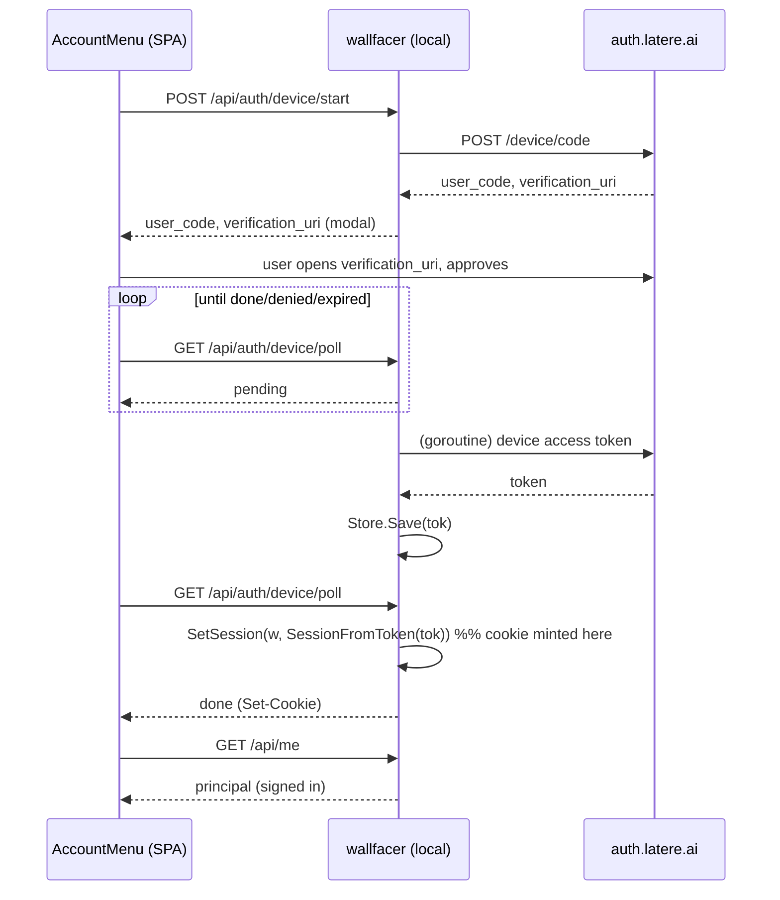

# Local-Mode Device-Code Sign-In (UI re-home)

## Overview

Wire the already-built RFC 8628 device-code backend into the current Vue SPA so a
local `wallfacer run` user can sign in to latere.ai from the account menu without a
browser redirect. The device-code driver (`internal/handler/device_auth.go`) and its
three HTTP endpoints exist but are never constructed, never surfaced in the UI, and —
even if driven — never mint the session cookie `/api/me` reads. The intended consumer
(a Wails desktop binding, per the archived `auth-unification-migration.md`) was removed
with the desktop app on 2026-06-14, orphaning the HTTP surface. This spec re-homes that
flow onto the Vue account menu and closes the session-cookie gap.

## Motivation

Browser sign-in (`/login` → `auth.latere.ai/authorize` → `/callback`) already works on a
current binary via the public secret-less `wallfacer` OIDC client, but it depends on the
listen port matching a pre-registered `redirect_uri`. A local instance on a non-default
port has no valid redirect target. RFC 8628 device-code has no `redirect_uri`: the browser
authenticates on `auth.latere.ai/device`, and the local backend polls for the token. It
also unifies local sign-in with the `latere` CLI and `wallfacer auth login`, which already
write the same `<UserConfigDir>/latere/token.json` (`authkit.DefaultFileTokenStorePath`).

## Current State

- **Backend driver, built but unwired.** `internal/handler/device_auth.go` implements
  `DeviceAuth` with `start` / `poll` / `cancel`, single-flight, and file-store persistence.
  `Handler.AuthDeviceStart/Poll/Cancel` proxy to it and 503 when `h.deviceAuth == nil`.
  There is **no `SetDeviceAuth` method** (only a comment referencing one at
  `internal/handler/handler.go:183-187`) and no construction outside tests, so
  `h.deviceAuth` is always nil and `/api/auth/device/*` always returns 503.

- **Endpoint verified live.** `POST auth.latere.ai/device/code` (the path the oidc lib
  builds as `AuthURL + "/device/code"`, `pkg/oidc/oidc.go:216`) returns 200 with
  `user_code` / `verification_uri` / `verification_uri_complete`. The grant is not listed
  in the OIDC discovery document but is functional; `wallfacer auth login`
  (`internal/cli/auth.go:103`) already uses it via `authkit.NewDeviceCodeClient`.

- **The `/api/me` gap.** `Handler.AuthMe` (`internal/handler/login.go:123`) resolves the
  principal from the encrypted **session cookie** (`__Host-latere-session`), via
  `AuthProvider.BuildMe` / `UserFromRequest`. The device flow's success path
  (`device_auth.go:176-188`) only calls `d.Store.Save(tok)` — it writes the **file** token
  store, never the cookie. So a completed device login does not render as signed-in, and the
  coordination connector / GitHub broker (which read the same file store) are the only
  things that light up.

- **Frontend has no device UI.** The account menu (`AccountControl.vue:53`) emits
  `@login="auth.login()"`, which the shared latere-ui store turns into a full-page
  navigation to `/login` (browser redirect). `SettingsTabSandbox.vue:353-387` is the only
  start/poll/cancel polling pattern in the SPA (for provider CLI auth) and is the UI
  reference.

- **Primitives available.** `oidc.SessionFromToken(token, ttl)` (`pkg/oidc/handlers.go:90`)
  and `client.SetSession(w, sess)` (`pkg/oidc/oidc.go:452`) are exactly what
  `HandleCallback` uses to mint the cookie from a token. Local cookie config
  (Secure-off / non-`__Host-` name for `http://localhost`) is already resolved by
  `resolveAuthConfig` for the browser `/callback` path and is reused unchanged.

## Architecture

Reuse, not new machinery. The same `*auth.Client` already set via `h.SetAuth(authClient)`
in local boot backs both the browser flow and the device flow; the same file token store
that `newCoordinationTokenStore` uses is passed to the device driver. Three changes connect
the existing dots:

1. **Wire the driver** — add `Handler.SetDeviceAuth` and construct a `DeviceAuth` in local
   boot (`internal/cli/server.go`), giving `/api/auth/device/*` real behavior.
2. **Bridge to the cookie** — on device-token acquisition, mint the session cookie so
   `/api/me` reflects the sign-in. Because the token arrives in the `start` goroutine after
   that response has flushed, the cookie is written on the `poll` response that observes
   `done`.
3. **Surface in the SPA** — the account menu's login action branches on mode: cloud keeps
   the `/login` redirect; local drives start/poll and shows a user-code modal, then refreshes
   `/api/me`.

## Components

### Backend — wire the driver (`internal/cli/server.go`, `handler.go`)

- Add `func (h *Handler) SetDeviceAuth(*DeviceAuth)` in `internal/handler/login.go` (next to
  `SetAuth`), assigning `h.deviceAuth`.
- In the local boot path, after `authClient` and the coordination token store are built,
  construct `&handler.DeviceAuth{OIDC: <oidc client>, Store: coordTokenStore}` and call
  `h.SetDeviceAuth(...)`. Reuse the same `*oidc.Client` the auth client wraps (or build one
  from the resolved `authCfg`) and the **same** `authkit.DefaultFileTokenStorePath` store so
  the CLI, connector, and GitHub broker share one login. Guard on the store being non-nil.
- Keep it always-on in local mode (mirrors the browser flow being always-available); no new
  env flag.

### Backend — mint the session cookie on completion (`internal/handler/device_auth.go`)

- Extend `deviceFlowState` to retain the acquired `*oauth2.Token` (the goroutine currently
  saves and discards it).
- Add an injectable session-writer to `DeviceAuth` (e.g. `SetSession func(http.ResponseWriter, *oauth2.Token) error`)
  wired in boot to `func(w, tok) { return authClient.SetSession(w, oidc.SessionFromToken(tok, ttl)) }`.
  Injection keeps the driver testable without a real OIDC client and avoids a hard
  `*auth.Client` dependency in the handler package.
- In `poll`, on the `done` branch (before clearing the flow), if a session-writer and token
  are present, write the cookie on the poll `w`. Preserve the existing `denied` / `expired`
  status mapping. Idempotence: once the flow is cleared, later polls return `idle`.
- `TTL`: reuse the same session lifetime the browser callback uses (derive from the token
  expiry or the configured `SessionMaxAge`).

### Frontend — mode-gated login + device modal (`AccountControl.vue`, `auth.ts`, `types.ts`)

- Mode is inferred from the endpoint itself rather than a config flag: the driver is wired
  local-mode-only (`!cloudMode`, see boot), so `POST /api/auth/device/start` returns 200 in
  local mode and 503 in cloud. This keeps the shared `AccountControl` working on both the
  landing nav (no config loaded) and the app sidebar without plumbing a `cloud` flag.
- Intercept the menu's login: try `POST /api/auth/device/start`; on success open a
  device-sign-in modal; on 503 (or any start failure) fall back to `auth.login()` (the
  unchanged browser redirect).
- Modal shows `user_code` prominently, the `verification_uri`, and an "Open verification page"
  action (opens `verification_uri_complete` when present). Poll `GET /api/auth/device/poll`
  on the returned `interval` (default 5s) until `done` / `denied` / `expired`. On `done`,
  call `auth.fetchMe()` and close; the menu re-renders as signed-in. On cancel, call
  `POST /api/auth/device/cancel`.
- Follow the `SettingsTabSandbox.vue` start/poll/cancel structure and existing modal
  conventions; i18n both locales (`en`, `zh`).

## API Surface

No new routes. Activates the existing contract endpoints (previously 503 in local mode):

- `POST /api/auth/device/start` → `{ verification_uri, verification_uri_complete?, user_code, expires_in }`
- `GET  /api/auth/device/poll`  → `{ status: idle|pending|done|denied|expired, error? }`;
  now also emits `Set-Cookie` on the `done` response.
- `POST /api/auth/device/cancel` → 204.
- No `/api/config` change: mode is inferred from `device/start`'s 200-vs-503, not a flag.

## Error Handling

- **Driver unconfigured** (store path unresolvable): endpoints stay 503; the modal surfaces a
  clear "device sign-in unavailable" message rather than spinning.
- **`denied` / `expired`**: poll maps the oauth2 `RetrieveError` code (existing logic); the
  modal shows the reason and offers restart.
- **Single-flight**: a second `start` cancels the in-flight flow (existing `start` behavior);
  the modal reflects only the latest.
- **Cookie write failure**: if `SetSession` errors on the `done` poll, return `done` without
  the cookie and let the frontend `fetchMe` fall back to 204 (still signed in for the file
  store / CLI); log server-side. Do not fail the whole login on a cookie error.
- **No session leakage in cloud mode**: the device endpoints remain reachable but the SPA
  never calls them in cloud mode (which uses `/login`).

## Testing Strategy

- **Backend unit** (`device_auth_test.go`, extend): with a fake OIDC client and a fake
  session-writer, drive start → poll(pending) → poll(done) and assert (a) the token is saved
  to the store and (b) the session-writer is invoked exactly once on the `done` poll with the
  acquired token. Assert `denied` / `expired` still map correctly and that a post-`done` poll
  returns `idle` without re-minting.
- **Handler wiring** (`login_test.go` / server wiring test): assert `SetDeviceAuth(nil)` keeps
  503, and a wired driver makes `/api/auth/device/*` non-503. Assert `/api/me` returns a
  principal after a simulated device `done` (cookie set), closing the regression the current
  gap represents (device login → still 204).
- **Frontend** (Vitest + happy-dom): mock the three endpoints; assert local mode opens the
  modal (not a redirect), renders `user_code`, polls until `done`, and calls `fetchMe`; assert
  cloud mode still calls `auth.login()` (redirect) and never opens the modal. Assert cancel
  posts `/cancel`.
- **Manual E2E**: `wallfacer run` on a non-8080 port, sign in via the modal against real
  `auth.latere.ai`, confirm the account menu shows the principal and `wallfacer auth whoami`
  sees the same token (shared file store).

## Outcome

**Summary.** Implemented directly in-session (not dispatched) across four commits —
`152162b4` (backend driver), `ab280b01` (boot wiring), `067a39db` (frontend), `692af58b`
(docs). The account menu's "Sign in via latere.ai" now drives the RFC 8628 device flow in
local mode and mints the session cookie on completion, so `/api/me` reflects the sign-in.
Drift: Moderate — every acceptance item satisfied functionally, with two mechanism
divergences (the session-cookie writer and the frontend mode gate) that simplified the
design; the spec body was corrected inline to match.

**What Shipped.**
- No new HTTP routes — activated the existing `/api/auth/device/{start,poll,cancel}` (they
  were built but never wired; always 503). Endpoint verified live at `auth.latere.ai/device/code`.
- Backend: `Handler.SetDeviceAuth` (`login.go`); `deviceFlowState.token` retention and a
  session-cookie mint on the `poll` `done` branch via `oidc.SessionFromToken` +
  `Client.SetSession` (`device_auth.go`); local-mode-only construction in boot reusing
  `authClient` + the shared `latere/token.json` store (`server.go`).
- Frontend (~250 LOC): `useDeviceSignIn` composable (start/poll/cancel + the fallback
  decision), presentational `DeviceSignInModal.vue`, `AccountControl.vue` interception,
  `DeviceStartResponse`/`DevicePollResponse` types, en+zh i18n.
- Tests: backend — driver lifecycle now asserts the `done` poll sets a session cookie, plus
  a `SetDeviceAuth` 503-vs-200 wiring test; frontend — 7 composable + 3 modal tests. All
  green; `make lint` 0 issues; `make build` clean; vue-tsc clean.

**Design Evolution.**
- **Session-cookie writer** — the spec proposed an injectable `SetSession func` field on
  `DeviceAuth`. Shipped using the `OIDC *oidc.Client` the driver already holds
  (`d.OIDC.SetSession(w, oidc.SessionFromToken(tok, 0))`), since that adds no new coupling
  and is directly testable (the test client carries a cookie key). `ttl=0` matches local
  mode's default `SessionTTL`, mirroring `HandleCallback` (`152162b4`).
- **Frontend mode gate** — the spec gated the modal on a new `/api/config` `cloud` flag.
  Shipped a self-configuring gate instead: the driver is wired `!cloudMode` only, so the
  frontend *tries* `device/start` and falls back to the `/login` redirect on 503. This
  avoids adding a config field and the harder problem that `AccountControl` is shared with
  the landing nav, which never loads `/api/config` (`ab280b01`, `067a39db`).

**Not Implemented.**
- The full `/api/me`-round-trip integration test (device `done` → 200 principal) was
  descoped: with fake, non-JWT tokens `BuildMe` degrades unpredictably. The bridge is
  instead pinned at the driver level (the `done` poll emits a session cookie) plus the
  runtime confirmation that `resolveAuthConfig` always sets a cookie key + RedirectURL. No
  follow-up needed.

**Unspecified Work.**
- `docs/internals/api-and-transport.md` poll-row note that `done` mints the cookie
  (improvement, `692af58b`).

**Decisions / surprises / follow-ups.**
- The device grant is **not advertised** in `auth.latere.ai`'s OIDC discovery document, yet
  `POST /device/code` works (the oidc lib builds `AuthURL + "/device/code"`). Probing the
  discovery doc alone is misleading — hit the real path.
- `auth.Client` is a **type alias** for `oidc.Client`, so `authClient` is passed directly as
  the driver's `OIDC` and shares the browser flow's cookie key — no separate client.
- Pre-existing, unrelated test failures observed and left as-is:
  `internal/cli` `TestSessionTokenBridgeCapturesCookie` (bare client without RedirectURL) and
  `frontend` `TaskDetail.results.test.ts` (verification copy) — both fail at the base commit.
- The original reported symptom (a stale-binary 404 on `/login`) is a separate operational
  issue with no code change: a current `wallfacer run` binary 302-redirects `/login` to a
  provisioned auth service. Rebuilding/reinstalling the binary on the affected machine
  resolves it.
- Follow-up: none required. Optional — surface a signed-in confirmation toast, and consider
  driving device sign-in from the settings surface too.
