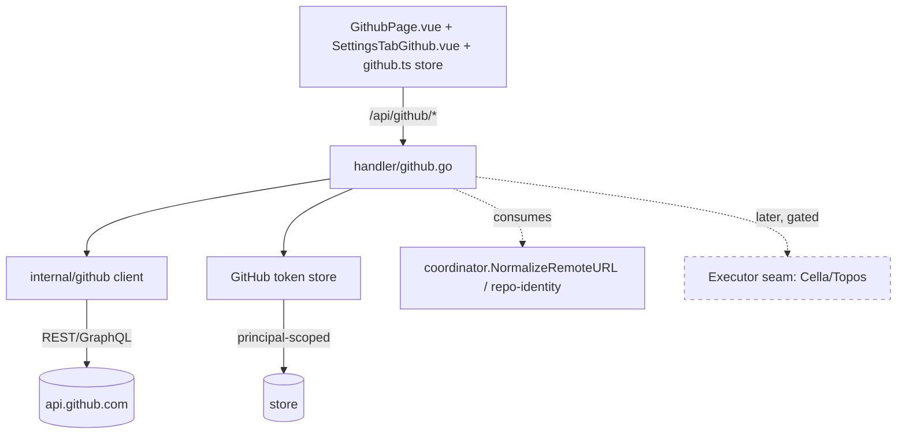
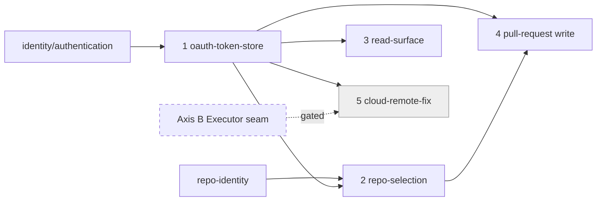

# GitHub Integration: OAuth-Backed Repo, PR, and Issue Surface

Umbrella spec. Read this first; the implementable work lives in the child specs
under `github-integration/`.

---

## Problem

Wallfacer treats a workspace as a pre-cloned local folder and never talks to
GitHub. Everything GitHub-shaped happens out of band: the user clones a repo in
a terminal, registers the folder, and switches to a browser to open PRs, read
review comments, and triage issues. There is no way to pick a GitHub repo from
inside the product, no view of the PRs or issues on the repo being worked, and
no path to clone-and-fix a repo the user has not already checked out locally.

Today the only GitHub-aware code is git plumbing:
[`NormalizeRemoteURL`](../cloud/latere-integration/coordination-plane/repo-identity.md)
(`internal/coordinator/identity.go`, canonical `host/owner/repo`),
`internal/gitutil/` (repo/status/worktree ops), and `internal/handler/git.go`
(status, push, sync, rebase, branch, diff). There is no GitHub API client, no
`gh` CLI usage, and no GitHub OAuth. The only token machinery is the generic
OIDC device-code flow in `internal/handler/device_auth.go` (latere.ai sign-in,
not GitHub).

The drafted [pull-request.md](pull-request.md) is the one prior attempt at a
GitHub feature. It shells `gh pr create` on the host. That works only where a
host `gh` is installed and logged in, which excludes headless and cloud
deployments, and it cannot read anything back (PR comments, issues, PR list).

---

## Goal

Make GitHub a first-class surface inside Wallfacer, authenticated by a real
GitHub OAuth App (Codex-style) rather than a host CLI, so it works in local,
headless, and cloud modes.

1. **Authenticate** to GitHub via an OAuth App from the UI; store and refresh
   the token server-side; surface auth status on `/api/config`.
2. **Select a repo** from the user's and org's accessible GitHub repositories,
   resolving the choice to canonical `host/owner/repo`.
3. **Read** the selected repo's pull requests and issues: list views, PR/issue
   detail, and review/issue comment threads.
4. **Write** to GitHub: create a PR from the current branch and comment on a PR
   or issue, via the GitHub API (superseding the `gh` path).
5. **Clone and fix remotely** (later, gated): clone a selected repo and run
   agents in a cloud sandbox, without a local checkout.

---

## Design

This is a non-leaf umbrella. The sections below set the architecture and the
component boundaries; each component becomes a child spec under
`github-integration/`. Sizing, file lists, and acceptance criteria live in the
children, not here.

### Relationship to existing specs

- **Consumes** [repo-identity.md](../cloud/latere-integration/coordination-plane/repo-identity.md).
  Repo identity (`host/owner/repo`, `NormalizeRemoteURL`, the layered
  verification ladder, the org->repos registry) is owned there. This umbrella
  does not redefine identity; it consumes it and realizes the "GitHub OAuth
  upgrade" verification tier that repo-identity foreshadows. The OAuth token
  this spec introduces is what upgrades a repo from credential-proof to
  OAuth-verified.
- **Supersedes the mechanism of** [pull-request.md](pull-request.md).
  PR creation is still wanted, but the `gh pr create` host-CLI mechanism is
  replaced by the GitHub API path defined here. pull-request.md folds in as the
  PR-write child (the "collect branch context + sandbox-generate title/body"
  pipeline it specs is reused; only the final create call changes from CLI to
  API). It is re-homed under `github-integration/` at breakdown time.
- **Depends on** [authentication.md](../identity/authentication.md) for the
  principal context that scopes stored GitHub tokens to a user/org.

### Architecture



The read and write surfaces are a thin handler + a `internal/github` API client
+ a Vue panel. They do **not** touch the runner or sandbox machinery: listing
PRs and reading comments is plain authenticated HTTP. Only two things reach
deeper: PR-text generation (reuses the existing sandbox path from
pull-request.md) and the gated cloud-clone phase (reaches the Executor seam).

### Components (future child specs)

#### 1. GitHub OAuth App + token store

The auth foundation every other component needs. A single central **GitHub App**
named **"Latere AI"** (decided; see the child), registered once at the latere.ai
org level and shared across latere products, installed per org by users, with a
user-to-server OAuth flow brokered through latere.ai auth and an install step that
grants per-repo permissions
(`contents`, `pull_requests`, `issues`, `metadata`). Tokens are stored
server-side, scoped to the principal (user/org from
[authentication.md](../identity/authentication.md)), and refreshed on expiry.
`/api/config` gains GitHub auth status (connected, login, installation/granted
scopes) so the UI can gate the rest of the surface. Reuse the `authkit`
token-store patterns (`internal/handler/device_auth.go`) where they fit; GitHub
tokens are a distinct credential from the latere.ai OIDC token and must not be
conflated. The install model means the connect flow has an explicit install +
grant step (component 1 UI) and repo selection lists installation repos
(component 2).

This is the lead child: nothing else dispatches until tokens exist.

#### 2. Repo selection

List the repos the authenticated identity can access (user repos + org repos
via the API), let the user pick one, and resolve the choice to canonical
`host/owner/repo` via repo-identity. For local mode the picked repo associates
with an existing `workspace.Group` member by matching its `origin`; the actual
clone-into-a-new-folder flow is part of the gated cloud phase, not this child.
Honors the org boundary from repo-identity (only repos in the signed-in org).

#### 3. Read surface (PRs and issues)

Plain authenticated API reads, no sandbox:
- List PRs (open/closed filter, pagination).
- List issues (open/closed filter, labels, pagination).
- PR detail + review comments + conversation comments.
- Issue detail + comments.

Must handle pagination, the GitHub rate limit (surface remaining budget; back
off on 403/secondary limits), and short-TTL caching so list views do not refetch
on every poll. GraphQL is an option for the detail composites (one round trip
for a PR + its comments) where REST would need several calls; the child decides
per endpoint.

#### 4. Write surface (create PR, comment)

- **Create PR**: reuse the branch-context collection and sandbox title/body
  generation from [pull-request.md](pull-request.md); replace `gh pr create`
  with a GitHub API call. Push the branch first (existing `git.go` push path).
  Existing-PR detection returns the open PR instead of erroring.
- **Comment**: post a comment to a PR or issue.

Keep pull-request.md's boundary: PR merge/close stay out of scope unless
explicitly widened in the child.

#### 5. Cloud clone + remote fix (later, gated)

Codex-style: clone a selected repo and run agents in a cloud sandbox with no
local checkout. This depends on the **Cloud Axis B Executor seam**
([cella-runtime.md](../cloud/latere-integration/cella-runtime.md),
[topos-remote-executor.md](../cloud/latere-integration/topos-remote-executor.md)),
which is demand-gated and not yet built. Specced as a dependent later phase so
the local/headless OAuth + read/write surface (components 1-4) ships
independently of remote execution.

### UI Architecture

The umbrella owns the cross-cutting UI so the children specify only their slice
and do not each re-invent the shell. The naming in the original `affects` lists
(a single `GithubPanel.vue`) predates this IA and is reconciled here.

#### Surface split (follows the app idiom)

Wallfacer's frontend is route-per-surface (a Sidebar nav item maps to a page
view under `frontend/src/views/`) with account/prerequisite settings living in
tabbed sub-components under `frontend/src/components/settings/`. The GitHub
surface splits along that same seam:

- **Connect / disconnect (component 1)** is account-level and connect-once, so
  it lives in a **Settings tab** (`SettingsTabGithub.vue`), mirroring
  `AccountControl.vue` and the existing prerequisite tabs. Reachable from
  Settings; not workspace-scoped.
- **Repo selection + PR/issue browse (components 2-3)** is workspace-level and
  is the day-to-day surface, so it is a **`/github` page**
  (`views/GithubPage.vue`) with a Sidebar entry under the **Workspace** group
  (`meta: { needsWorkspace: true }`, so the standard `WorkspaceRequired` prompt
  applies when no workspace is visible).

The old `GithubPanel.vue` name is dropped. The page composes child components
under `frontend/src/components/github/` (e.g. a repo picker, PR/issue lists, a
thread view); the exact decomposition is each child's call. A shared
`stores/github.ts` holds auth status, the selected repo, and list/detail state.

#### `/github` page information architecture

```
+--------------------------------------------------------------+
| [ repo selector v ]  owner/repo      rate: 4980/5000  [↻]    |  <- header
+--------------------------------------------------------------+
|  ( Pull Requests )  ( Issues )                               |  <- tab switch
+----------------------+---------------------------------------+
|  open  closed  all   |   #42  Add task revert ...            |
|  [ search ]          |   opened by @x · 3 days ago · 2 ✓     |
|----------------------|   ------------------------------------|
| #42 Add task revert  |   <body markdown>                     |
| #41 Fix flaky test   |   ------------------------------------|
| #39 Bump deps        |   <conversation + review comments>    |
|  ... (paginated)     |   [ comment box ] (write surface, #4) |
+----------------------+---------------------------------------+
       list pane                 detail pane (master-detail)
```

The repo selector and header are shared chrome; the PRs/Issues tabs and the
master-detail list/detail are component 3 (read); the comment box and a "Create
PR" affordance are component 4 (write). The list pane is a master list; the
detail pane lazy-loads the selected item.

#### Shared UI state matrix

Every GitHub surface resolves to one of these states. Children reference this
matrix rather than redefining states; each child names which states it owns and
what it renders.

| State | Trigger | Surface behavior |
|-------|---------|------------------|
| Disconnected | no GitHub token for principal | `/github` page shows a connect call-to-action linking to the Settings tab; Settings tab shows `[ Connect GitHub ]`. Sidebar entry visible but page gated. |
| Connecting | OAuth/install flow in flight | Settings tab shows an in-progress state through the install + grant round trip; disable re-trigger. |
| Connected | valid token, login + scopes known | Settings tab shows login, granted scopes/installation, `[ Disconnect ]`. Page enabled. |
| No repo selected | connected, no repo chosen | Page shows the repo picker (component 2) front and center; lists are empty/hidden. |
| Loading | list or detail fetch in flight | Skeleton rows in the active pane; the rest of the chrome stays interactive. |
| Empty | fetch succeeded, zero items | "No open pull requests" / "No open issues" with the active filter echoed. |
| Error | non-auth fetch failure | Inline error in the affected pane with a retry; never a blank page. |
| Token expired / 401 | API returns 401 | Silent refresh attempt; on failure, drop to Disconnected and re-prompt (see Error Handling). |
| Rate-limited | remaining budget low / secondary-limit 403 | Header shows remaining/reset; refresh disabled with a "resets in N min" hint; reads served from cache where possible. |
| Org-boundary blocked | repo outside the signed-in org | 403 surfaced as "outside your organization", not a 500; the repo never appears in the picker. |
| No local clone | selected repo has no local workspace match (local mode) | Read/write surfaces work; a banner notes "no local checkout" and points at the gated remote-fix phase rather than erroring. |

### API Surface

Indicative routes under `/api/github/*`; the children pin exact shapes. All are
principal-scoped and require GitHub auth (except the status/connect endpoints).

| Method | Path | Component |
|--------|------|-----------|
| `GET`  | `/api/github/auth/status` | 1 |
| `POST` | `/api/github/auth/connect` (start OAuth) + callback | 1 |
| `POST` | `/api/github/auth/disconnect` | 1 |
| `GET`  | `/api/github/repos` (list accessible) | 2 |
| `POST` | `/api/github/repo/select` | 2 |
| `GET`  | `/api/github/pulls?repo=&state=` | 3 |
| `GET`  | `/api/github/pulls/{number}` (detail + comments) | 3 |
| `GET`  | `/api/github/issues?repo=&state=` | 3 |
| `GET`  | `/api/github/issues/{number}` (detail + comments) | 3 |
| `POST` | `/api/github/pulls` (create PR) | 4 |
| `POST` | `/api/github/comments` (comment on PR/issue) | 4 |

`/api/config` is extended with GitHub auth status (component 1).

### Error Handling

- **Not authenticated / token expired**: 401 from the handler; the UI prompts to
  connect or silently refreshes. A failed refresh disconnects and re-prompts.
- **Rate limit**: surface remaining budget and reset time; treat 403 secondary
  limits as retryable with backoff, not as auth failure.
- **Org boundary**: a repo outside the signed-in org is 403 (consistent with
  repo-identity's perimeter), never silently widened.
- **Cloud phase unavailable**: until the Executor seam exists, the clone-remote
  action is hidden/disabled with a clear "not available" state, not a 500.

---

## Scope Boundaries

**In scope (this umbrella + components 1-4):**
- GitHub OAuth App auth, server-side principal-scoped token storage + refresh.
- Repo selection from accessible user/org repos.
- Reading PRs, issues, and their comment threads.
- Creating a PR (API path) and commenting on PRs/issues.
- Auth status on `/api/config`; a GitHub panel in the UI.

**Out of scope (or deferred to the gated phase):**
- Cloud clone + remote-fix execution (component 5): gated on the Cloud Axis B
  Executor seam; specced as a dependent later phase.
- PR merge, close, review approval/request-changes (inherits pull-request.md's
  boundary).
- GitHub Actions / workflow dispatch, projects, releases, discussions.
- GitLab / Bitbucket (GitHub only).
- Replacing the local git mutation endpoints in `git.go` (push/sync/rebase stay
  git, not API).
- Redefining repo identity or org verification (owned by repo-identity.md).

---

## Testing Strategy

Strategy only; per-component test plans live in the children.

- **Unit**: token store (save/load/refresh, principal scoping), OAuth
  callback handling, API client request building + pagination + rate-limit
  parsing, response mapping to internal models. Mock the GitHub HTTP layer.
- **Integration**: handler routes against a mock GitHub server (httptest) for
  the full list/detail/create/comment paths, including 401-refresh and
  rate-limit backoff.
- **Frontend**: GithubPanel visibility gated on auth status; list/detail
  rendering; connect/disconnect flow; error and rate-limit states.
- **Boundary**: a repo outside the signed-in org returns 403; cloud-clone action
  is disabled while the Executor seam is absent.

---

## Design Breakdown

| # | Sub-design | Design problem | Depends on | Effort | Status |
|---|-----------|---------------|-----------|--------|--------|
| 1 | [oauth-token-store](github-integration/oauth-token-store.md) | GitHub OAuth/App auth + principal-scoped server-side token store + refresh | identity/authentication | large | drafted |
| 2 | [repo-selection](github-integration/repo-selection.md) | List accessible user/org repos, pick one, resolve to `host/owner/repo` | #1, repo-identity | medium | drafted |
| 3 | [read-surface](github-integration/read-surface.md) | List PRs/issues, detail + comments, REST/GraphQL, rate-limit, caching | #1 | large | drafted |
| 4 | [pull-request](github-integration/pull-request.md) | Create PR via API (supersedes `gh`) + comment on PR/issue | #1, #2 | medium | drafted |
| 5 | [cloud-remote-fix](github-integration/cloud-remote-fix.md) | Clone + run agents in a cloud sandbox, no local checkout (gated) | #1, cella-runtime, topos | large | vague |



**Resolved cross-cutting decisions:**

- **App type: GitHub App** (per-org install, per-repo permissions) -- fixes the
  connect flow (install + grant step) and the repo-list source (installation
  repos) for #1 and #2.
- **Brokering: a single central "Latere AI" GitHub App**, registered once at the
  latere.ai org level and shared across latere products, brokered through
  latere.ai auth (not a wallfacer-specific app, not per-install registration).
  This adds a latere.ai-side infra dependency (central app + callback route in
  `../terraform`); local dev can run against a mock until that lands.
- **UI shell** is settled in [UI Architecture](#ui-architecture): a Settings tab
  for connect, a `/github` Workspace page for browse, and the shared state matrix
  all children draw from.

**Recommended iteration order:** #1 leads and blocks everything (no GitHub call
works without a token). Once it settles, #2, #3, and #4 iterate largely in
parallel (#4 also wants #2 for repo context). #5 stays `vague` and is iterated
only after the Cloud Axis B Executor seam is built.
