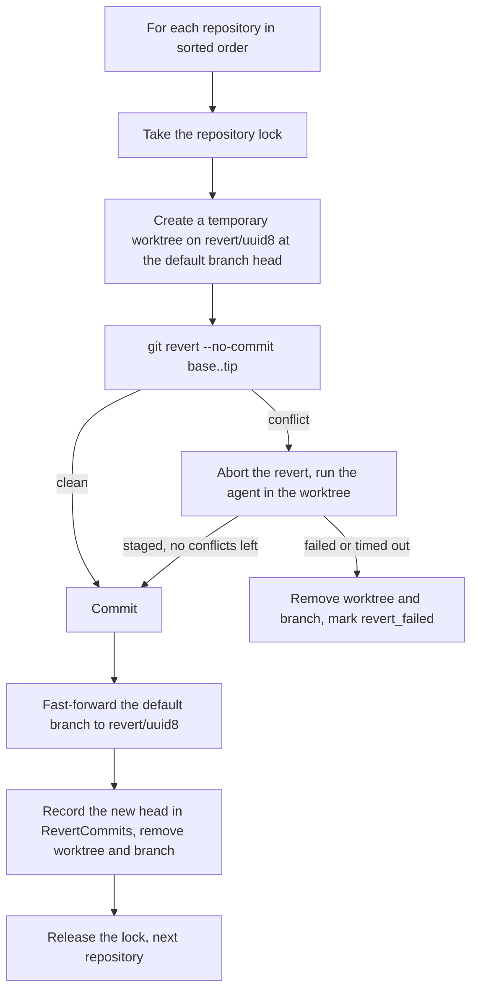

# Task Revert: Agent-Assisted Undo of Merged Task Changes

---

## Problem

Once a task is done and its branch has been merged into the default branch,
wallfacer offers no way to undo it. The user runs `git revert` in a terminal,
which is error-prone when:

1. **The task touched several repositories.** Each has its own commits, and
   the revert has to be repeated in each.
2. **The task merged more than one commit.** The commit pipeline rebases the
   task branch onto the default branch and fast-forwards it
   (`rebaseAndMergeOne`, `internal/runner/commit.go`). The branch holds
   whatever the agent committed during its turns plus one commit the pipeline
   adds for the remaining changes, so a task lands as a run of commits, not
   one. Reverting only the last one leaves the rest in place.
3. **Later work was merged on top.** The revert conflicts wherever a later
   commit touched the same lines.

Nothing of this is built. There is no revert route, no revert field on the
task, and no revert code in the runner.

## What exists to build on

- **The task's merged range is recorded.** For each repository the pipeline
  stores `BaseCommitHashes[repoPath]`, the default-branch head read before
  the rebase, and `CommitHashes[repoPath]`, the default-branch head after the
  fast-forward (`internal/store/models.go`, written in `rebaseAndMergeOne`).
  The task's commits are `base..tip`. Both survive completion; a retry back
  to backlog clears them (`ResetTaskForRetry`, `internal/store/tasks_update.go`).
- **A per-repository merge lock.** `Runner.repoLock` serializes the rebase
  and merge of concurrent tasks on one repository.
- **A fast-forward that tolerates a dirty checkout.** `gitutil.FFMerge`
  stashes uncommitted changes in the main checkout, checks out the default
  branch, merges `--ff-only`, and restores the stash.
- **An agent-driven conflict resolver.** `Runner.resolveConflicts`
  (`internal/runner/commit.go`, prompt `internal/prompts/conflict.tmpl`)
  mounts one worktree, runs an agent in it to finish a rebase, and records
  its output as a task turn.
- **A forward-revert precedent.** Planning undo
  (`internal/handler/planning_undo.go`) reverts a planning round with
  `git revert --no-commit`, aborts on conflict, and commits with its own
  message.

## Goal

1. A Revert action on a task whose merged range is recorded.
2. Revert the whole range in each repository the task merged into.
3. When the revert applies cleanly, commit it and merge it without an agent.
4. When it conflicts, run an agent to resolve the conflict, with the original
   task as context.
5. Track the revert on the task: state, resulting commits, error, events,
   usage.

---

## Design

### Eligibility

A task is revertible when all of the following hold:

- Its status is `done`, or `cancelled` after having been done. The state
  machine allows `done` to `cancelled`, and canceling keeps the recorded
  hashes.
- `CommitHashes` has at least one entry whose repository is a git repository
  with commits. A task on a non-git folder is extracted from a snapshot
  instead of merged; the hash recorded for it belongs to the snapshot and
  cannot be reverted.
- For each such repository, `BaseCommitHashes` has an entry, both hashes
  resolve to commits (`git cat-file -e <hash>^{commit}`), the base is an
  ancestor of the tip, and the tip is an ancestor of the default branch
  (`git merge-base --is-ancestor`). A history rewrite on the default branch
  makes the task not revertible.
- `RevertStatus` is empty or `revert_failed`.

The route reports the reason when a task is not eligible; the UI hides the
action when `CommitHashes` is empty and otherwise lets the server decide.

### Data model

New fields on `Task` in `internal/store/models.go`:

```go
// RevertStatus tracks the lifecycle of a revert. Empty means none attempted.
RevertStatus    RevertState       `json:"revert_status,omitempty"`
// RevertCommits maps host repoPath to the default-branch head after the
// revert was merged there.
RevertCommits   map[string]string `json:"revert_commits,omitempty"`
RevertError     string            `json:"revert_error,omitempty"`
RevertStartedAt *time.Time        `json:"revert_started_at,omitempty"`
RevertDoneAt    *time.Time        `json:"revert_done_at,omitempty"`
```

```go
type RevertState string

const (
    RevertStateNone       RevertState = ""
    RevertStateInProgress RevertState = "reverting"
    RevertStateDone       RevertState = "reverted"
    RevertStateFailed     RevertState = "revert_failed"
)
```

`ResetTaskForRetry` clears all five together with the commit hashes it
already clears. The same fields are added to the `Task` type in
`frontend/src/api/types.ts`, which today carries no commit hash fields.

The task's own status does not change. A reverted task stays `done`.

### API

Two routes in `internal/apicontract/routes.go`, wired in the handler table in
`internal/cli/server.go`, implemented in a new
`internal/handler/tasks_revert.go`:

| Method | Path | Name | Description |
|---|---|---|---|
| `POST` | `/api/tasks/{id}/revert` | `RevertTask` | Start, or retry, the revert of a merged task |
| `DELETE` | `/api/tasks/{id}/revert` | `CancelTaskRevert` | Cancel a revert that is running |

**`POST /api/tasks/{id}/revert`**

- Checks eligibility. Not eligible: `422` with the reason. Already
  `reverted`: `409`. Already `reverting`: `409`.
- Sets `RevertStatus` to `reverting`, records `RevertStartedAt`, clears
  `RevertError`.
- Starts the pipeline in a background goroutine through a new
  `runner.Interface` method, `RevertTask(taskID uuid.UUID)`.
- Returns `202` with `{"status": "reverting"}`.

**`DELETE /api/tasks/{id}/revert`**

- Not `reverting`: `409`.
- Cancels the pipeline's context, which stops a running agent.
- The pipeline's own cleanup removes the temporary worktree and branch.
  Repositories already reverted stay reverted and stay in `RevertCommits`.
- Sets `RevertStatus` to `revert_failed` with `RevertError` "canceled", so
  the partial state is visible and the action becomes Retry.
- Returns `200`.

### Pipeline

`internal/runner/revert.go`. Repositories are processed one at a time in
sorted path order; a repository already present in `RevertCommits` is
skipped, which is what makes a retry resume.



The revert never runs in the user's checkout. It runs in a temporary
worktree under the task's worktree directory, on a branch `revert/<uuid8>`
created at the default branch head, and reaches the default branch through
`gitutil.FFMerge`, the same way a task's own commits do. The repository lock
is held from worktree creation to the fast-forward, so the default branch
cannot move underneath it and no rebase is needed.

**Clean path.** `git revert --no-commit <base>..<tip>` stages the inverse of
every commit in the range. The pipeline commits it as one commit:

```
Revert "<task title>"

Reverts <base8>..<tip8>, the commits merged by task <task uuid>.
```

The subject is cut by rune, as `buildRevertSubject` in planning undo does.

**Conflict path.** When the revert stops on a conflict:

1. `git revert --abort` in the temporary worktree, so the agent starts from a
   clean tree. This follows the existing resolver, where the host aborts and
   the agent redoes the operation itself.
2. Run the agent with `runContainer`, mounting only the temporary worktree
   (the `worktreeOverrides` argument, as `resolveConflicts` does), with the
   prompt from `internal/prompts/revert.tmpl` and the activity
   `SandboxActivityRevert`. Its output is saved as a task turn so
   `GET /api/tasks/{id}/logs` and the turn files show it.
3. On return, the host verifies: no revert is in progress, no unmerged paths
   remain (`gitutil.HasConflicts`), and the index differs from the branch
   head. Then it commits with the message above plus a line
   `Conflicts resolved by agent.`
4. If the agent fails, times out, or leaves conflicts: remove the worktree
   and branch, set `revert_failed` with the reason, and stop. Repositories
   after this one are not attempted.

**Partial progress.** Each repository is an independent commit. When one
fails after others succeeded, `RevertCommits` holds the ones that succeeded,
`RevertStatus` is `revert_failed`, and `RevertError` names the repository
that failed. A retry skips what is already reverted.

**Auto-push.** After the last repository, the pipeline calls the existing
auto-push check (`maybeAutoPush`), so a revert is pushed under the same rule
as a task merge.

### Prompt template

`internal/prompts/revert.tmpl`, embedded and registered in
`internal/prompts/prompts.go` under the API name `revert`:

```
You are reverting a previously merged change. The straightforward revert
conflicts with commits made after it.

## Original task
{{.Prompt}}

## What the task changed
{{.OriginalDiffStat}}

## Instructions
1. In {{.ContainerPath}}, run: git revert --no-commit {{.Base}}..{{.Tip}}
2. Resolve every conflict. The goal is to undo the task's changes and keep
   the unrelated changes that later commits made.
3. If a later commit depends on the task's changes, adapt the later code so
   it works without them.
4. Continue the revert until every commit in the range is applied
   (git revert --continue), then stage all resolved files with git add.
5. Do not run git commit. The host commits.
```

`OriginalDiffStat` is `git diff --stat <base>..<tip>`. The full diff is not
inlined; the agent has the repository and can read it.

### Events

On the task's event trail, through the existing event types:

- `system`: "Revert started", "Revert completed", "Revert failed: \<reason\>",
  "Revert conflict in \<repository\>, running resolver".
- `span_start` / `span_end` with `SpanData{Phase: "revert", Label: <repository basename>}`
  around each repository, so the spans view times the revert.

### Usage

A new attribution-only activity in `internal/store/models.go`, declared
beside `SandboxActivityReview`:

```go
SandboxActivityRevert SandboxActivity = "revert"
```

It is not added to `SandboxActivities`, so it gets no routing of its own:
`sandboxForTaskActivity` (`internal/runner/container.go`) resolves it to the
task's harness, then the configured default. Its token usage appears under
`revert` in the task's `UsageBreakdown`.

### UI

**Task detail** (`frontend/src/components/TaskDetail.vue`). A Revert row in
the task's action stack, shown when the task has `commit_hashes`:

| `revert_status` | Row |
|---|---|
| empty | "Revert", with a hint naming the repositories it will touch; a confirm step before the request |
| `reverting` | progress label and "Cancel" |
| `reverted` | "Reverted", with the revert commit per repository and the time |
| `revert_failed` | the error, the repositories already reverted, and "Retry" |

**Board card** (`frontend/src/components/TaskCard.vue`). One more entry in
the card's `signals` list: `reverting`, `reverted`, or `revert failed`, using
the existing pill classes.

**Updates.** The task stream (`GET /api/tasks/stream`) already pushes the
task on every change, so the new fields reach the UI without a new channel.

---

## Scope Boundaries

**In scope:**
- Reverting the full merged range of a done task, per repository.
- A clean revert without an agent; an agent for conflicts.
- Partial progress across repositories, retry, and cancel.
- Events, spans and usage for the revert.

**Out of scope:**
- Tasks that never merged, and tasks on non-git folders.
- Reverting several tasks in one action.
- Undoing a revert. A retry of the task back to backlog starts it over.
- Interactive conflict resolution by the user.
- Anything on a git host. Wallfacer has no GitHub integration; a pull
  request the user opened for the task is theirs to close.

---

## Open Questions

1. **Range exactness.** `base` is read before the rebase and `tip` after the
   fast-forward, with the repository lock held between them. The lock
   excludes other task merges. It does not exclude a commit made on the
   default branch by something that does not take the lock, such as a manual
   commit in the checkout. Such a commit would sit inside `base..tip` and be
   reverted with the task. Options: accept it and show the commit list in the
   confirm step; or have the commit pipeline record the exact rebased commit
   list per repository at merge time and revert that list, falling back to
   the range for tasks merged before the change.
2. **Worktree garbage collection.** `internal/runner/worktree_gc.go` and
   `PruneUnknownWorktrees` manage directories under the worktree root. The
   temporary revert worktree must be invisible to them while a revert runs.
   Whether it lives under the task's directory or under a separate root is
   left to implementation; the tests below pin the behavior.
3. **Whether this is still wanted.** The spec has been unbuilt since
   2026-04-01. Keep it as the next git-workflow item, or archive it.

---

## Testing

- **Unit, eligibility:** status rules, missing base, unreachable hashes, tip
  not on the default branch, non-git repository, revert already running.
- **Integration, clean path** (real git repository): a task range of three
  commits, a later unrelated commit, revert; the default branch gains one
  commit, the three commits' changes are gone, the later commit's change is
  kept, and a dirty file in the main checkout is untouched.
- **Integration, conflict path:** a later commit edits the same lines; the
  revert conflicts, the mock agent resolves and stages, the host commits and
  merges. A second case where the mock agent leaves a conflict ends in
  `revert_failed` with the worktree and branch removed.
- **Integration, several repositories:** the second repository fails; the
  first is recorded in `RevertCommits`; a retry skips it.
- **Cancel:** `DELETE` during a running resolver ends in `revert_failed` with
  the temporary worktree and branch removed.
- **Garbage collection:** a worktree GC pass during a revert does not remove
  the temporary worktree.
- **Frontend:** the action row and the card signal for each `revert_status`,
  driven by a task stream update.
