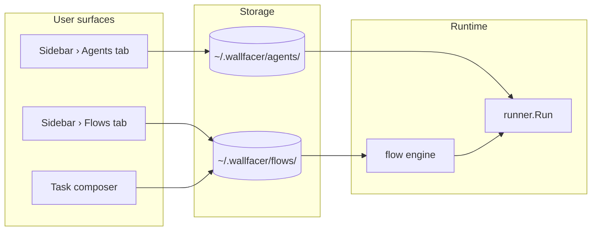
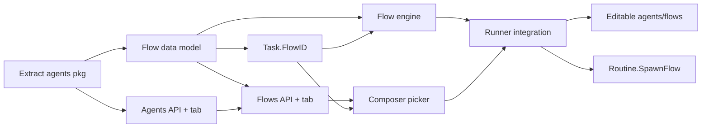

# Agents & Flows

## Overview

Promote the currently-ad-hoc notion of "what the task agent does and how it
pipes through multiple stages" into two first-class user-facing primitives:

- An **Agent** is a reusable role — name, prompt template, sandbox / CLI
  choice, timeout, and runtime config — that a user can create, edit, and
  share.
- A **Flow** is an ordered graph of agents with handoff rules that describes
  how a task is handled from start to finish.

Users define both from dedicated sidebar tabs. The task composer collapses
to "pick a Flow, optionally write a prompt, submit" — no more Type picker
(`Implement` / `Brainstorm`), no per-task Agent overrides, no hidden
`idea-agent` TaskKind special case. The primitive also gives routines,
observability agents, and future multi-agent workflows a common substrate
instead of minting a new `TaskKind` for each.

## Current State

Task execution today is a hard-coded state machine with several
adjacent-but-separate knobs:

- **`TaskKind` in `internal/store/models.go`** enumerates hardcoded flavors
  (`TaskKindTask`, `TaskKindIdeaAgent`, `TaskKindPlanning`, `TaskKindRoutine`).
  Each flavor drives a different branch in `internal/runner/execute.go` — e.g.
  `Kind == TaskKindIdeaAgent` routes to `runIdeationTask` which runs a
  one-shot brainstorm and exits; other kinds go through the implementation
  loop.
- **Per-activity sandbox overrides** (`TaskCreateOptions.SandboxByActivity`
  in `internal/store/tasks_create_delete.go`) let a user pick Claude vs Codex
  per stage (implementation, testing, refinement, title, oversight, commit,
  idea-agent). Only the CLI binary is customizable; the prompt and behavior
  are fixed per activity.
- **Hardcoded stage sequence** in `internal/runner/execute.go` and its
  neighbors: implement → commit → (async) title + oversight. Refinement and
  testing are bolted on via separate handlers (`internal/runner/refine.go`,
  `internal/runner/execute.go`'s test branch) but the order is not data.
- **Ideation** is its own subsystem (`internal/runner/ideate.go`) — a
  different container launch path with a different prompt template and
  output parser. The recently-shipped composer exposes this as a "Brainstorm"
  Type option that flips `Kind` on POST `/api/tasks`.
- **Routines** (spec `specs/local/routine-tasks.md`, shipped) fire an instance
  task of a given `RoutineSpawnKind` every interval. Today the only meaningful
  spawn kind is `""` (regular task) or `idea-agent` — the primitive would
  benefit from spawning against a named Flow instead.

The shipped spec [`specs/shared/agent-abstraction.md`](../shared/agent-abstraction.md)
already identifies the core problem at the runtime layer and proposes an
`AgentRole` descriptor registry plus an optional agent-graph coordination
layer (its Options A and C). That spec lives in `shared/` because both the
local and cloud tracks depend on the backend abstraction. This spec is the
**local UX realization** of that backend work: Agents and Flows as
user-editable surfaces, composer simplification, migration of the current
TaskKind-based flows into seeded built-ins, and sidebar tabs to browse and
manage them.

## Architecture



- **Agent** and **Flow** definitions are stored on the host under
  `~/.wallfacer/agents/<slug>.yaml` and `~/.wallfacer/flows/<slug>.yaml`.
  This mirrors the existing `~/.wallfacer/instructions/` pattern (see
  `internal/prompts/instructions.go`) so users can version, share, and hand-
  edit them. Per-workspace overrides (a `flows/` directory inside a repo) are
  a follow-up.
- **Flow engine** sits between the HTTP handler and the runner. It reads a
  task's `flow_id`, walks the flow's linear agent chain, and asks the runner
  to execute each agent in turn. The runner itself becomes dumber — it knows
  how to launch one agent, not how to sequence them.
- **Legacy TaskKind** stays on the wire as a migration hint. Existing tasks
  without `flow_id` are resolved to a seeded built-in flow (see
  Migration section below).

### Built-in flows (seeded on first boot)

| Flow slug | Agents (in order) | Replaces |
|---|---|---|
| `implement` | refine (optional) → implement → commit; oversight + title fan out in parallel | default `Kind=""` task |
| `brainstorm` | idea-agent | `Kind=idea-agent` task |
| `refine-only` | refine | manual "refine this task" action |
| `test-only` | test | manual "test this task" action |

The six currently-hardcoded post-completion agents (title, oversight,
commit_message) become attached-parallel steps on the `implement` flow,
not a separate axis.

## Components

### Agent definition (`internal/agent/`, new package)

```go
package agent

type Agent struct {
    Slug         string        // stable id, kebab-case
    Name         string        // human-readable
    Description  string
    PromptTmpl   string        // template file or inline body
    Sandbox      sandbox.Type  // default CLI
    Timeout      time.Duration
    ReadOnly     bool          // workspace mount mode
    MountBoard   bool
    MountSiblings bool
    OutputParser string        // named parser: "ideation", "refinement", "commit", "default"
    SingleTurn   bool
}
```

This mirrors the `AgentRole` descriptor proposed in
`shared/agent-abstraction.md` Option A and is the hand-off point between the
two specs. A `Registry` loads agents from `~/.wallfacer/agents/` at startup,
watches the directory for changes, and merges with an embedded set of
built-ins (the current seven hardcoded roles).

### Flow definition (`internal/flow/`, new package)

```go
package flow

type Flow struct {
    Slug        string
    Name        string
    Description string
    Steps       []Step     // linear in v1; a Graph field replaces this in v2
}

type Step struct {
    AgentSlug  string
    Optional   bool   // if true, user can skip via composer toggle
    InputFrom  string // agent slug whose result feeds this step's prompt; "" = task prompt
    RunInParallelWith []string // sibling agent slugs executed concurrently
}
```

**v1 scope: linear chains only.** Parallel fan-out (oversight + title
alongside commit) is expressed via `RunInParallelWith` pointing at siblings.
True DAGs with conditional edges are deferred to a follow-up — the current
execution graph is shallow enough that linear + parallel-sibling covers it.

Flows carry a **schema version** on disk; the runtime reads the version and
falls back to seeded built-ins when unknown, so forward compat works.

### Flow engine (`internal/flow/engine.go`)

The engine is the missing indirection between the handler and the runner.
Current `internal/runner/execute.go` `Run()` drives the sequence directly;
after this spec `Run()` delegates the "what runs next" decision to the
engine.

```go
func (e *Engine) Execute(ctx context.Context, taskID uuid.UUID, flow Flow) error
```

Internally the engine holds a cursor on the flow, reads the current step,
calls a `runner.RunAgent(taskID, agent, prompt)` helper (to be extracted
from the existing stage-specific functions), collects the result, and
advances. Fan-out steps execute their siblings with errgroup-style waits.

### Sidebar tabs (UI)

- **Agents tab** (`ui/partials/agents-tab.html`, `ui/js/agents.js`): lists
  registered agents with their prompt snippets; supports create / edit / clone
  / delete. Built-in agents are read-only with a "clone to customize" action.
- **Flows tab** (`ui/partials/flows-tab.html`, `ui/js/flows.js`): lists flows
  as vertical cards showing the step chain (`refine ▸ implement ▸ test ▸
  commit`). Users can reorder, add, and remove steps. Built-in flows
  read-only with clone-to-customize.
- Both tabs mount through the existing sidebar tab system
  (`ui/partials/sidebar.html` nav items + section routing). The routine
  card for ideation and the Brainstorm Type option in the composer both go
  away — a Brainstorm task is now created via the composer's Flow picker
  (`Flow: brainstorm`).

### Composer simplification (`ui/partials/board.html`, `ui/js/tasks.js`)

The composer currently shows:
- Type picker (Implement / Brainstorm)
- Prompt textarea
- Tags
- Agent + Timeout + Share-siblings row
- Start / Repeat scheduling row
- Budget, Agent overrides, Depends on disclosures

After this spec:
- **Flow picker** (replaces Type picker): a select listing all user-visible
  flows. Default value is `implement`. Selecting `brainstorm` shows the
  same "Optional: narrow the brainstorm focus…" placeholder swap already
  wired in.
- **Prompt textarea** unchanged.
- **Tags** unchanged.
- **Timeout + Share-siblings** remain; the per-step agent/sandbox override is
  gone (it now belongs on the Flow definition).
- Scheduling + Budget + Depends-on unchanged.
- Agent overrides disclosure is **removed**. Per-stage CLI selection lives
  on the flow's agent references (or on the agent itself).

The collapsed composer is the main UX payoff of this spec.

## Data Flow

**Creating a task from the composer:**

```
POST /api/tasks { prompt, flow: "implement", … }
  → store.CreateTaskWithOptions(Flow: "implement", ...)
  → handler promotes to in_progress
  → runner.Run(taskID) loads task.FlowID
  → flow engine walks Flow("implement") step by step
  → each step: build prompt → runner.RunAgent → parse result → advance
```

**Editing a flow while a task is executing:**

The in-flight engine holds a **snapshot** of the flow at the task's start.
Subsequent edits are materialized on disk with a new version; running tasks
finish on the old definition. The flow file format carries a monotonic
`version` counter; the snapshot is a deep copy stored on the task record
(new `Task.FlowSnapshot` field) so it survives server restart.

**Ideation firing (via `brainstorm` flow):**

```
User clicks "+ New Task", picks Flow: brainstorm
  → POST /api/tasks { flow: "brainstorm", prompt: "<optional user focus>" }
  → store.CreateTaskWithOptions(FlowID: "brainstorm", Kind: "")
  → flow engine loads Flow("brainstorm")
  → single step: agent "idea-agent", input_from "task_prompt"
  → runner.RunAgent → existing runIdeationTask logic (extracted)
  → agent.OutputParser="ideation" → creates backlog task cards from result
```

Routines spawning ideation become: `RoutineSpawnFlow: "brainstorm"` instead
of `RoutineSpawnKind: "idea-agent"`. The existing routine engine passes the
flow slug through unchanged.

## API Surface

New routes registered in `internal/apicontract/routes.go`:

- `GET /api/agents` — list registered agents with their metadata
- `POST /api/agents` — create a user agent
- `GET /api/agents/{slug}` — fetch one agent including prompt body
- `PUT /api/agents/{slug}` — update (user agents only; 409 for built-ins)
- `DELETE /api/agents/{slug}` — delete (user only)
- `GET /api/flows` — list flows with their step chain
- `POST /api/flows` — create a user flow
- `GET /api/flows/{slug}` — fetch one
- `PUT /api/flows/{slug}` — update (user only)
- `DELETE /api/flows/{slug}` — delete (user only)

Task creation gets one new field on `POST /api/tasks`:

- `flow` (string, optional) — flow slug; defaults to `implement`. When
  `flow: "brainstorm"` is present, empty prompt is allowed.

**Retired surface** (replaced by the above, kept as back-compat aliases for
one release):

- `POST /api/tasks { kind: "idea-agent" }` → internally rewritten to
  `flow: "brainstorm"`.
- `TaskCreateOptions.SandboxByActivity` continues to work but is deprecated;
  new writes should edit the flow's agent references instead.
- `GET/POST/DELETE /api/ideate` shim endpoints (from the earlier ideation
  retirement) keep working.

### CLI / env

No new CLI flags. One new env var for initial agent/flow directory path
(`WALLFACER_AGENTS_DIR`, `WALLFACER_FLOWS_DIR`) mirroring
`WALLFACER_INSTRUCTIONS_DIR`.

## Migration

This is where the spec touches the most surfaces. The plan is:

1. **Seed built-ins on first boot**: a startup hook writes the four
   built-in flows (`implement`, `brainstorm`, `refine-only`, `test-only`)
   and the seven built-in agents into `~/.wallfacer/` if absent. Idempotent
   by slug.
2. **Task record changes**: add `FlowID string` and `FlowSnapshot *Flow` to
   `store.Task`. Existing tasks (`FlowID == ""`) are resolved to:
   - `implement` if `Kind == ""` or unset
   - `brainstorm` if `Kind == "idea-agent"`
   - `planning` (new built-in) if `Kind == "planning"`
   No data migration; the resolver maps on read.
3. **Runner refactor**: extract the per-stage launch logic in
   `internal/runner/execute.go`, `refine.go`, `ideate.go`, `title.go`,
   `oversight.go`, `commit.go` into a common `runAgent()` method. This is
   the bulk of the work and overlaps directly with
   `shared/agent-abstraction.md` Option A.
4. **Handler rewiring**: the composer's `flow` field plumbs through
   `CreateTaskWithOptions`; the old `Kind` field becomes derived from the
   flow's `SpawnKind` (empty for most flows, `idea-agent` only if that's
   what the flow's single step specifies).
5. **UI rewrite**: composer Type picker and Agent-overrides disclosure are
   removed; Flow picker added. Agents tab and Flows tab mount in the
   sidebar. The existing sandbox-per-activity env vars
   (`WALLFACER_SANDBOX_IMPLEMENTATION` etc.) continue to set defaults for
   their matching built-in agent; hand-edited agent files override them.
6. **Routine primitive**: `RoutineSpawnKind` is renamed/replaced by
   `RoutineSpawnFlow`. A one-time migration rewrites existing routine
   records.

## Scope & Follow-ups

**In scope for this spec (v1)**:

- Agent and Flow data model + on-disk format + loader/watcher
- Linear flow engine with parallel-sibling fan-out
- Built-in flows seeded to preserve current behavior
- Composer Flow picker; retire Type picker and Agent overrides
- Agents tab and Flows tab (read + create + edit + clone; no visual DAG
  editor, just the linear step list)
- Migration of existing TaskKind + routines to the new wire format

**Deferred**:

- True DAG flows with conditional edges (needed for advanced pipelines like
  "retry only if transient", "branch by test verdict")
- Visual flow editor (drag-and-drop node graph) — v1 uses a form list
- Multi-provider consensus flows (needs `shared/multi-agent-consensus.md`)
- Shared agent message bus (needs `shared/agent-abstraction.md` Option D)
- Per-workspace flow overrides (files inside the repo that mask user-global)
- Flow marketplace / import-from-URL

## Open Questions

1. **Storage location.** `~/.wallfacer/agents/` vs per-workspace `.wallfacer/`?
   Start with global only; per-workspace can be stacked via the same loader.
2. **Built-in agent editability.** Allow edits directly (risking lock-in to
   old versions across upgrades) or enforce clone-first? Recommend
   **clone-first**: built-ins are read-only and ship in the embedded FS;
   user copies become editable with a different slug (e.g. `my-implement`).
3. **Flow versioning on task records.** Deep-copy the flow into the task
   record, or store flow slug + version and resolve on read? Deep copy is
   safer (immune to file drift) at a small storage cost — recommend
   **deep copy into `Task.FlowSnapshot`**.
4. **What becomes of `TaskKind`?** After migration it is derivable from the
   flow (`flow.SpawnKind`). Keep the field for existing tasks until the
   back-compat window closes, then remove.
5. **How does this interact with `shared/agent-abstraction.md`?** That spec
   is the backend primitive this UX sits on. Two paths: (a) land them
   together as one large effort; (b) land the backend first (agent
   registry + runAgent extraction), then this spec layers the Flow engine
   + UI on top. Recommend **(b)** — agent abstraction unblocks several
   other specs (multi-agent consensus, debate, observability) that don't
   need the Flow UI. **Resolved: option (b).** agent-abstraction landed
   in 2026-04-19 (commits c99bdc61..948dcd06); this spec layers on top.

6. **Should agent descriptors stay in `internal/runner/` or move to a
   dedicated `internal/agents/`?** **Resolved: move to
   `internal/agents/`** — the first child task extracts the package so
   the runner stays focused on execution machinery and future consumers
   (flow engine, handler API, observability agents) don't have to
   depend on the full runner.

## Task Breakdown

Implementation lands in eight commits across five dependency layers.
Each task preserves the green-tree acceptance criterion:

| Child spec | Depends on | Effort | Status |
|------------|-----------|--------|--------|
| [Extract internal/agents](agents-and-flows/extract-agents-package.md) | — | medium | validated |
| [Agents API + tab (read-only)](agents-and-flows/agents-api-and-tab.md) | extract-agents-package | medium | validated |
| [Flow data model](agents-and-flows/flow-data-model.md) | extract-agents-package | medium | validated |
| [Task.FlowID + resolver](agents-and-flows/task-flow-field.md) | flow-data-model | small | validated |
| [Flow engine](agents-and-flows/flow-engine.md) | flow-data-model, task-flow-field | large | validated |
| [Flows API + tab (read-only)](agents-and-flows/flows-api-and-tab.md) | flow-data-model, agents-api-and-tab | medium | validated |
| [Composer flow picker](agents-and-flows/composer-flow-picker.md) | flows-api-and-tab, task-flow-field | medium | validated |
| [Runner → flow-engine wiring](agents-and-flows/runner-flow-integration.md) | flow-engine, composer-flow-picker | large | validated |
| [Editable agents + flows (follow-up)](agents-and-flows/editable-agents-and-flows.md) | runner-flow-integration | large | validated |
| [Routine.SpawnFlow migration (follow-up)](agents-and-flows/routine-spawn-flow-migration.md) | runner-flow-integration | small | validated |



**Recommended execution order:**

1. **extract-agents-package** — refactor only, no behaviour change.
   Unblocks everything else.
2. **agents-api-and-tab** — ships the user-visible Agents tab first,
   as a standalone deliverable. Validates the data contract.
3. **flow-data-model** + **task-flow-field** in parallel — both depend
   only on the agents extraction and are independent of each other.
4. **flow-engine** — consumes the data model and task field; no UI
   yet.
5. **flows-api-and-tab** — read-only Flows tab; requires the agents
   tab and the flow data model only.
6. **composer-flow-picker** — Flow dropdown + drop Agent overrides.
   Requires flows endpoint + Task.FlowID.
7. **runner-flow-integration** — final MVP piece. After this the
   composer, runner, and UI are all Flow-aware end-to-end.
8. **Follow-ups** ship independently when the MVP is stable:
   editable agents/flows and routine.SpawnFlow migration.

## Testing Strategy

### Unit tests

- `internal/agent/registry_test.go` — load built-ins, load user overrides,
  watch file changes, slug collision.
- `internal/flow/engine_test.go` — linear execution, parallel-sibling
  fan-out, error propagation, cancellation, snapshot-vs-live
  deterministic behaviour.
- `internal/store/task_flow_test.go` — legacy TaskKind → flow resolution
  round-trips for `""`, `idea-agent`, `planning`.
- `internal/handler/agents_test.go`, `flows_test.go` — CRUD + built-in
  protection.

### Integration / e2e

- `scripts/e2e-flow-implement.sh` — create a task against `implement` flow,
  watch refine → implement → test → commit → done; assert each stage
  recorded its span event.
- `scripts/e2e-flow-brainstorm.sh` — create via `flow: brainstorm`, assert
  3 backlog cards produced.
- `scripts/e2e-custom-flow.sh` — POST a user-defined flow with a custom
  step order, run a task, assert the order matches.

### UI

- `ui/js/tests/agents.test.js`, `flows.test.js` — tab rendering, CRUD
  interactions, built-in protection.
- `ui/js/tests/composer-flow.test.js` — Flow picker populates, default
  selection, empty-prompt allowed for brainstorm, payload shape on POST.

### Migration

- Boot with a fresh `~/.wallfacer/` → built-ins materialize.
- Boot with an existing store carrying Kind=`idea-agent` tasks → they
  resolve to `brainstorm` flow on read; ideation still fires; no
  double-migration on subsequent boots.
- Upgrade with a running ideation routine (`RoutineSpawnKind: idea-agent`)
  → rewritten to `RoutineSpawnFlow: brainstorm` once, idempotent on
  restart.
