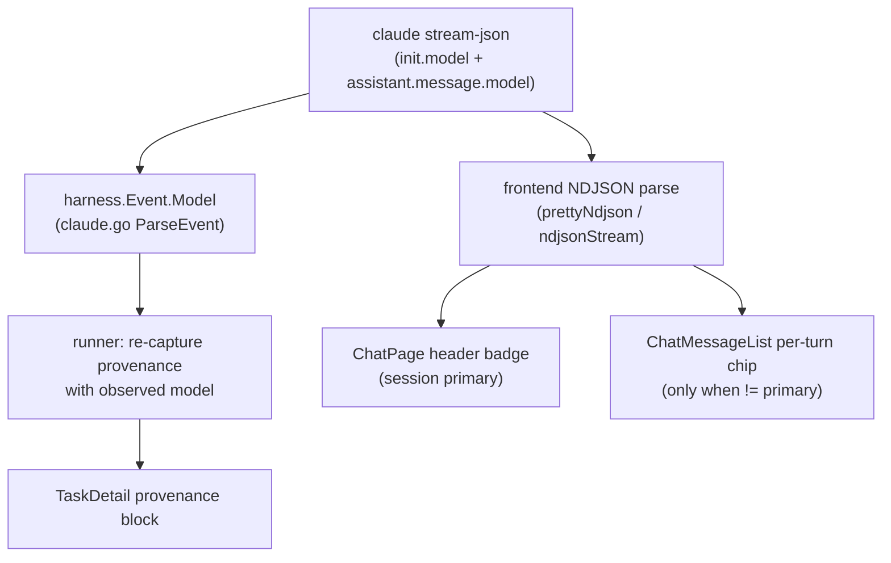

# Chat + Task Model Transparency

## Overview

The chat window shows neither which harness is running nor which model is
answering. A harness such as Claude Code selects models internally (a primary
model for the main loop, a smaller model for some sub-agents, a context-window
variant, fallbacks under load), so even a user who knows "this is Claude" cannot
tell which model produced a given turn. This spec surfaces the **observed**
model at two granularities: a session-level badge in the chat header ("what is
running now") and a per-turn annotation on assistant messages that differ from
the session primary ("on what case"). It also corrects task provenance, which
today records the *requested* model (frequently empty) instead of the model that
actually ran.

The guiding principle is to display the model the harness reports in its event
stream, never a value wallfacer requested or assumed. The requested model can be
empty (the harness picks) or diverge from what executed, so it is not
trustworthy as displayed truth.

## Current State

The model is present in the Claude headless stream at two places, both verified
against `claude` 2.1.195 (`claude -p … --output-format stream-json --verbose`):

- `system`/`init` line carries a top-level `model` (e.g. `claude-opus-4-8[1m]`)
  — the session's configured primary model, including the context-window variant
  suffix.
- every `assistant` line carries `message.model` (e.g. `claude-opus-4-8`) — the
  model that produced that specific turn.

Neither value reaches the UI:

- **Harness layer.** `harness.Event` (`internal/harness/harness.go:60-71`) has
  no `Model` field. `claudeHarness.ParseEvent` (`internal/harness/claude.go:73`)
  recognizes the init line at `case "system":` (lines 81-83) and returns
  immediately, discarding the `model` field. The discriminator struct
  `claudeStreamLine` (claude.go:65-68) only reads `type`/`subtype`.
- **Chat path.** The chat runs `claude` with no `--model` flag
  (`internal/handler/agentsession.go` `SendAgentMessage`), so the init model
  reflects the CLI default — exactly the value worth showing. The handler
  streams raw stdout NDJSON verbatim to the browser
  (`StreamAgentMessages` → `relayLiveChunks`) and stores it in
  `agentsession.Message.RawOutput` (`internal/agentsession/conversation.go:18`).
  The frontend parses that NDJSON itself (`frontend/src/lib/prettyNdjson.ts`
  `Frame`, `frontend/src/lib/ndjsonStream.ts`), but neither captures `model`.
  The chat header (`frontend/src/views/ChatPage.vue` `.chat-conversation-head`,
  ~line 84) shows only the title and a token rollup.
- **Task provenance.** `captureExecutionEnvironment`
  (`internal/runner/provenance.go:16`) is called once at task start
  (`internal/runner/execute.go:188`), before any harness output exists, and sets
  `env.ModelName` from `modelFromEnvForSandbox` (`internal/runner/container.go:310`),
  which returns `""` when the env file sets no default. `TaskDetail.vue:57-66`
  then renders `Model: (unknown)`.

Tasks already have the surfacing pattern (the provenance block in
`TaskDetail.vue`) and the harness already has the surfacing pattern for chips
(`HarnessBadge.vue` + `HarnessLogo.vue` + `harnessLabel()` in
`frontend/src/lib/harness.ts`). This spec reuses both rather than inventing new
ones.

## Architecture

Two consumers read the same source fact (the model the harness reports) over two
different transports, so the spec has a small shared foundation and two
independent surfaces.

The split is deliberate. The chat path already ships raw NDJSON to the browser,
so the chat display is read from the existing client-side parse and needs no new
wire field. Task provenance runs entirely server-side and consumes
`harness.Event`, so it needs the canonical `harness.Event.Model`. The
`harness.Event.Model` change is therefore the backend foundation; the chat
display does not depend on it but is described here because it answers the same
user question.

Scope guard: only the Claude harness is wired. Codex / Cursor / OpenCode / Pi
init events may not carry a model field, and the chat runtime is Claude-only
today (`internal/agentsession/runtime.go:151`). The `harness.Event.Model`
field is harness-agnostic, but only `claudeHarness.ParseEvent` populates it in
this spec; other harnesses leave it empty and their UI degrades to "no badge"
rather than a wrong one.

## Components

### `harness.Event.Model` (foundation, backend)

- `internal/harness/harness.go`: add `Model string` to `Event` (after
  `StopReason`). Document it as "the model the harness reports for this event;
  init lines carry the session primary, assistant lines carry the per-turn
  model; empty when the harness does not report one."
- `internal/harness/claude.go`: add `Model string json:"model"` to
  `claudeStreamLine`; in `ParseEvent` populate `evt.Model = line.Model` for the
  `system` case (the init top-level model) and for the `assistant` case (read
  the nested `message.model` — add a minimal `Message struct { Model string
  \`json:"model"\` }` to the line struct, since assistant model is nested under
  `message`).
- No other harness is modified. `fake.go` may set `Model` in a test fixture if a
  parse test needs it.

### Model label helper (frontend)

- `frontend/src/lib/harness.ts`: add `modelLabel(raw: string): string` mapping
  canonical ids to brand-cased short names (`claude-opus-4-8` → `Opus 4.8`,
  `claude-sonnet-4-6` → `Sonnet 4.6`, `claude-haiku-4-5` → `Haiku 4.5`), and a
  table analogous to `HARNESS_LABELS`. The function strips a trailing
  context-variant suffix such as `[1m]` for the label but the **raw string is
  preserved** by callers for the chip `title` (hover) so nothing is hidden. An
  unknown id falls back to the raw string verbatim — never a hardcoded guess.

### Chat session badge (frontend)

- `frontend/src/lib/prettyNdjson.ts`: add `model?: string` to `Frame`; read it
  in the line parser from the init line's top-level `model` and the assistant
  line's `message.model`.
- `frontend/src/lib/ndjsonStream.ts`: thread `model` through
  `NdjsonStreamState` / `consumeLine` so the live (streaming) model is available
  before the turn completes.
- `frontend/src/composables/useChatSession.ts`: expose a session-level
  `primaryModel` on the returned `ChatSession` object, set from the first
  observed init model in a session (persisted history via `bubbleFromMessage`
  /`loadHistory`, and live via `applyStreamingUpdate`).
- `frontend/src/views/ChatPage.vue`: render the badge in
  `.chat-conversation-head` next to the title, as `Claude · {modelLabel}` using
  `HarnessLogo`/`HarnessBadge` for the harness half and a plain chip for the
  model half, with `title` set to the raw model id. Hidden when no model has been
  observed yet.

### Per-turn model annotation (frontend)

- `frontend/src/lib/agentBubble.ts`: add `model?: string` to `RenderedBubble`;
  in `bubbleFromMessage` populate it from the per-turn `message.model` extracted
  from `m.raw_output` (the assistant line), falling back to undefined.
- `frontend/src/components/plan/ChatMessageList.vue`: render a small model chip
  on an assistant turn **only when `m.model` differs from the session
  primaryModel** (so the common case stays quiet and a Haiku sub-agent turn or an
  Opus→Sonnet fallback becomes visibly attributed). Place it next to the
  existing per-turn `.pcp-usage` row (lines 103-112), which is the direct
  precedent.
- Optional durability: add `Model string json:"model,omitempty"` to
  `agentsession.Message` and `model?: string` to the `AgentMessage` interface
  (`frontend/src/stores/agentSession.ts:96`) so the per-turn model survives a
  reload without re-parsing `raw_output`. Treated as a follow-up if the
  re-parse-from-`raw_output` path is sufficient.

### Task provenance correction (backend)

The structural issue is that provenance is captured before the harness runs. The
fix re-captures (overwrites) the environment after the first turn yields the
observed model.

- `internal/runner/container.go`: add an observed-model field to `agentOutput`
  (struct at lines 31-41).
- `internal/runner/harness_parse.go`: in the per-line accumulator
  (`parseHarnessOutput`, lines 46-72), capture `evt.Model` from the init event
  into the `agentOutput` observed-model field (first non-empty wins).
- `internal/runner/execute.go`: after the agent turn returns (around line 428,
  near the existing post-run `UpdateTask*` calls), if an observed model was
  captured and differs from the recorded `ModelName`, read-modify-write the
  environment and call `UpdateTaskEnvironment` again. `UpdateTaskEnvironment`
  (`internal/store/tasks_update.go:485`) overwrites the whole struct and is safe
  to call mid-run, so the re-capture must re-supply all fields.
- `internal/runner/provenance.go`: keep the start-time capture (it records
  sandbox, API endpoint, recorded-at) but document that `ModelName` is the
  best-effort requested value, superseded by the observed model once a turn runs.

## Data Flow

**Chat, live turn.** User sends a prompt → `SendAgentMessage` execs `claude` →
raw NDJSON streamed to the browser → `ndjsonStream` parser sees the init line,
sets `model` in state → `useChatSession` sets `primaryModel`, `ChatPage` renders
the header badge → assistant lines arrive, each carries `message.model`; if a
line's model differs from the primary the streaming bubble records it →
`ChatMessageList` shows the per-turn chip on that bubble.

**Chat, reload.** `loadHistory` reads stored messages with `raw_output` →
`bubbleFromMessage` extracts the per-turn model from the assistant line and the
first init model seeds `primaryModel` → same rendering as live.

**Task run.** Provenance captured at start with the requested model →
`claude` runs → `parseHarnessOutput` lifts the init model into `agentOutput` →
turn loop re-calls `UpdateTaskEnvironment` with the observed model →
`TaskDetail` provenance block shows the real model instead of `(unknown)`.

## Error Handling

- Missing model in the stream (other harness, older CLI, malformed line): the
  field stays empty. The chat badge is hidden; the per-turn chip is omitted; task
  provenance keeps the start-time value (which may still be `(unknown)`). No
  placeholder model is ever invented.
- Variant suffix (`[1m]`): the label strips it; the raw id (with suffix) is
  preserved in the chip `title` and in `ExecutionEnvironment.ModelName` so the
  exact reported string is auditable.
- Re-capture failure (`UpdateTaskEnvironment` error mid-run): tolerated like the
  start-time capture — provenance is best-effort metadata and must never fail a
  task. Log and continue.

## Testing Strategy

Per project policy each behavior change ships with a test that fails before and
passes after.

- **Harness parse** (`internal/harness/claude_test.go`): extend the existing
  init-line test (`claude_test.go:93`) to assert `evt.Model` is populated from
  the top-level `model`; add an assistant-line case asserting `evt.Model` from
  the nested `message.model`; add a line with no model asserting empty.
- **Provenance re-capture** (`internal/runner/provenance_test.go` +
  `internal/runner` parse tests): add a test that a stream whose init line
  carries a model results in `ExecutionEnvironment.ModelName` equal to the
  observed model even when the env file sets a different/empty default — i.e. the
  observed value supersedes `modelFromEnvForSandbox`. Mirror the existing
  `TestCaptureExecutionEnvironment_*` setup. Reuse the
  `TestUpdateTaskEnvironment_RoundTrip` pattern (`internal/store/tasks_test.go:1681`)
  for the mid-run overwrite.
- **Frontend label** (new `frontend/src/lib/harness.test.ts` or extend
  existing): `modelLabel('claude-opus-4-8[1m]') === 'Opus 4.8'`, unknown id
  passes through verbatim.
- **Frontend NDJSON parse** (`prettyNdjson` / `ndjsonStream` tests): a stream
  fixture with init `model` and an assistant `message.model` yields the expected
  `model` on the frame/state.
- **Component**: a `ChatMessageList` test asserting the per-turn chip renders
  only when the turn model differs from the session primary, and a `ChatPage`
  test asserting the header badge appears once a model is observed.
- **Finishing gate**: `make build` / `make lint` (golangci-lint + vue-tsc +
  vitest + vite-ssg), not just unit tests.
