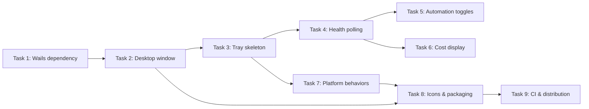

# Native Desktop App

**Status:** Complete | **Date:** 2026-02-21 → 2026-03-29

## Goal

Make wallfacer behave like a proper desktop application — launch from dock/taskbar, no terminal required, OS-native window — while keeping the existing Go server and browser-based UI architecture intact.

## Core Constraints

The desktop app retains these hard runtime dependencies:

1. **Container runtime** — user must have Docker Desktop or Podman installed
2. **Git** on the host — worktrees, rebase, merge all run locally
3. **Workspace directories** on the local filesystem

These are fundamental to the architecture, not packaging details.

---

## Current State

The application is a pure CLI tool (`wallfacer run`) that starts an HTTP server on `:8080` and opens the system browser via `openBrowser()` in `internal/cli/cli.go:161`. The UI is a server-rendered HTML + vanilla JS frontend embedded via `//go:embed ui` in `main.go`. There is no native window, system tray, or desktop packaging.

Key entry points:
- `main.go` — CLI dispatch to `run`, `exec`, `status`, `doctor` subcommands
- `internal/cli/server.go:RunServer()` — HTTP server lifecycle (listen, serve, graceful shutdown)
- `internal/cli/cli.go:openBrowser()` — cross-platform browser launcher (macOS: `open`, Windows: `cmd /c start`, Linux: `xdg-open`)

The Windows browser fallback mentioned in the original spec already exists in `openBrowser()`.

---

## Approach: Wails Native App

[Wails](https://wails.io) packages a Go backend + web frontend into a native desktop binary using the OS's native WebView (WKWebView on macOS, WebView2 on Windows, WebKitGTK on Linux). No Electron, no bundled Chromium, small binary.

**Why this fits well:**
- Backend is already Go — no rewrite
- Frontend is already vanilla HTML/JS — Wails renders it in a WebView
- Existing HTTP handlers stay as-is; the WebView connects to `localhost:8080`
- Output: `Wallfacer.app` on macOS, `Wallfacer.exe` on Windows, binary on Linux

**What needs to change:**

| Area | Change |
|------|--------|
| `main.go` | Add `desktop` subcommand that wraps `RunServer` inside `wails.Run()` app lifecycle |
| Browser launch | Desktop mode skips `openBrowser()` — Wails window replaces it |
| `net.Listen` | Keep port binding; Wails WebView points at it |
| First-run setup | Wails dialogs for token entry (optional quality-of-life) |
| Build toolchain | `wails build` for desktop binary; `go build` unchanged for CLI mode |
| System tray | Add tray icon with "Open Dashboard" and "Quit" menu items via Wails tray support |
| macOS | Build as `.app` bundle with `Info.plist` and icon |
| Windows | Build as `.exe` with version info and icon |

**Wails app skeleton:**
```go
// internal/cli/desktop.go
func RunDesktop() {
    app := NewDesktopApp()  // wraps RunServer
    err := wails.Run(&options.App{
        Title:     "Wallfacer",
        Width:     1400,
        Height:    900,
        AssetServer: &assetserver.Options{
            Assets: uiFiles,  // existing embed.FS from main.go
        },
        OnStartup: app.startup,     // calls RunServer
        Bind:      []interface{}{app},
    })
}
```

**Effort:** Medium. The architectural fit is very good — the main work is the Wails integration layer and packaging (icons, code signing for distribution).

---

## System Tray

The tray icon is the persistent anchor when the main window is closed. It shows at-a-glance status and provides quick actions without opening the full dashboard.

### Tray Icon State

The icon encodes board activity at a glance:

| State | Icon | Condition |
|-------|------|-----------|
| Idle | Brick (static) | No in-progress tasks |
| Active | Brick (badge dot) | 1+ tasks in_progress or committing |
| Attention | Brick (orange dot) | 1+ tasks waiting or failed |

The icon updates by polling `GET /api/debug/health` every 5 seconds (lightweight: returns goroutine count + task-by-status map, no store scan).

### Tray Tooltip

Hover text shows a one-line summary, updated on the same poll cycle:

```
Wallfacer — 2 running · 1 waiting · $3.42 today
```

Falls back to `Wallfacer — Idle` when nothing is active.

### Tray Menu

Right-click (all platforms) or left-click (Linux) opens the menu:

```
┌──────────────────────────────┐
│ Open Dashboard               │  ← focuses/shows main window
│ ──────────────────────────── │
│ ● 2 In Progress              │  ← read-only status (bold when >0)
│   1 Waiting                  │
│   4 Backlog                  │
│ ──────────────────────────── │
│ ✓ Autopilot                  │  ← toggle (PATCH /api/config)
│ ✓ Auto-test                  │  ← toggle
│   Auto-submit                │  ← toggle (unchecked = off)
│   Auto-sync                  │  ← toggle
│ ──────────────────────────── │
│ Today: $3.42 · Total: $156   │  ← from GET /api/stats
│ Uptime: 2h 15m               │
│ ──────────────────────────── │
│ Quit                         │  ← graceful shutdown
└──────────────────────────────┘
```

**Menu items:**

| Item | Action | Data source |
|------|--------|-------------|
| Open Dashboard | Show/focus main Wails window | — |
| Status counts | Read-only labels | `GET /api/debug/health` → `tasks_by_status` |
| Automation toggles | Check/uncheck sends `PUT /api/config` | `GET /api/config` → `autopilot`, `autotest`, `autosubmit`, `autosync` |
| Cost / Uptime | Read-only labels | `GET /api/stats` → `total_cost_usd`; `GET /api/debug/health` → `uptime_seconds` |
| Quit | Sends SIGTERM to self, triggers graceful shutdown (5s drain) | `os.Process.Signal()` |

### Platform Differences

| Behavior | macOS | Windows | Linux |
|----------|-------|---------|-------|
| Tray location | Menu bar (top-right) | System tray (bottom-right) | Notification area (varies by DE) |
| Left-click | Opens menu (macOS convention) | Shows/focuses main window | Opens menu (Linux convention) |
| Right-click | Opens menu | Opens menu | Opens menu |
| Tooltip | Native `NSStatusItem` tooltip | Balloon tooltip | Depends on DE (GNOME shows, KDE shows) |
| Icon format | Template image (auto light/dark) | `.ico` (16×16 + 32×32) | PNG (22×22 recommended) |
| Quit behavior | App hides to tray on window close; Quit from menu or ⌘Q exits | Window close = minimize to tray; Quit exits | Window close = minimize to tray; Quit exits |

**macOS-specific:** The tray icon should be a template image (`NSImage.isTemplate = true`) so macOS automatically adapts it for light/dark menu bar. Wails supports this via `mac.Options{About: ...}` and the system tray API.

**Windows-specific:** Window close should minimize to tray (not quit). The tray icon should show a balloon notification on first minimize: "Wallfacer is still running in the background."

**Linux-specific:** Tray support depends on the desktop environment. GNOME removed the system tray in GNOME 3 (AppIndicator extension required). KDE Plasma, XFCE, and MATE support it natively. Wails uses `systray` under the hood which handles most DEs, but document the GNOME limitation.

### Tray Data Flow

```
5s poll timer
    │
    ├─► GET /api/debug/health ──► update icon state + tooltip + status counts
    │
    └─► GET /api/stats (every 30s) ──► update cost label
```

The poll runs only while the tray is active (always, since the tray persists as long as the app is running). Cost stats poll less frequently (30s) since they change slowly.

---

## Rejected Alternative: Electron

Would run the Go binary as a child process. Adds ~150 MB for bundled Chromium, introduces a Node.js runtime, more complex build pipeline. No meaningful capability gain over Wails for this use case.

---

## Task Breakdown

| # | Task | Depends on | Effort | Status |
|---|------|-----------|--------|--------|
| 1 | [Wails dependency & scaffold](desktop-app/task-01-wails-dependency.md) | — | Small | Done |
| 2 | [Desktop subcommand & Wails window](desktop-app/task-02-wails-window.md) | 1 | Medium | Done |
| 3 | [System tray — static skeleton](desktop-app/task-03-tray-skeleton.md) | 2 | Medium | Done |
| 4 | [System tray — health polling & dynamic state](desktop-app/task-04-tray-health-polling.md) | 3 | Medium | Done |
| 5 | [System tray — automation toggles](desktop-app/task-05-tray-toggles.md) | 4 | Medium | Done |
| 6 | [System tray — cost & stats display](desktop-app/task-06-tray-cost-display.md) | 4 | Small | Done |
| 7 | [Platform-specific behaviors](desktop-app/task-07-platform-behaviors.md) | 3 | Medium | Done |
| 8 | [App icons & build packaging](desktop-app/task-08-icons-packaging.md) | 2, 7 | Medium | Done |
| 9 | [CI builds & release distribution](desktop-app/task-09-ci-distribution.md) | 8 | Large | Done |



---

## Outcome

Wallfacer now ships as a native desktop application on macOS (.app), Windows (.exe), and Linux. The `wallfacer desktop` subcommand (or double-clicking the .app) starts the HTTP server in the background and opens a native WebView window. A persistent system tray icon provides at-a-glance status, automation toggles, cost display, and graceful shutdown with a progress overlay.

### What Shipped

- **Desktop subcommand** with build-tag-gated (`//go:build desktop`) Wails integration; default `go build` remains CGo-free
- **Shared `initServer()` helper** extracted from `RunServer()` so both CLI and desktop modes reuse the same server initialization
- **System tray** via `fyne.io/systray` with: status counts (in-progress, waiting, backlog), automation toggles (autopilot, auto-test, auto-submit, auto-sync), cost display (today + total), uptime, and dynamic icon state (idle/active/attention)
- **Platform-specific behaviors**: macOS TitleBarHiddenInset with CSS drag region, hide-on-close to tray, Cmd+Q override via app menu; Windows frameless window with .ico tray icon; Linux GNOME AppIndicator note
- **Graceful shutdown overlay** with live progress updates (pending goroutine names) shown from both tray Quit and Cmd+Q
- **App icons**: 1024px master PNG, macOS .icns, Windows .ico (16/32/48/256), tray icons (idle/active/attention at 1x and 2x) — brick wall motif matching the frontend header
- **Build packaging**: `wails.json`, `build/darwin/Info.plist`, `build/windows/` manifest and version info; Makefile targets (`build-desktop`, `build-desktop-darwin/windows/linux`); Wails CLI tracked as `go.mod` tool dependency
- **CI workflow**: `.github/workflows/release-desktop.yml` with 3-platform matrix, optional macOS code signing + notarization, optional Windows Authenticode signing, secret guards for forks
- **Tests**: `TestInitServer`, `TestRunDesktopStub`, `TestTrayManagerNew`, `TestIconState` (9 cases), `TestFormatTooltip`, `TestFormatDuration`, `TestPollHealthResponse`, `TestPollHealthWithAPIKey`, `TestParseConfigToggles`, `TestToggleSendsCorrectPayload`, `TestToggleFailurePreservesState`, `TestParseStatsResponse`, `TestExtractTodayCostMissing`, `TestFormatCostShort`, `TestStatsErrorFallback`, `TestHideOnCloseLogic`, `TestAppIconFilesExist`, `TestWailsJSONExists`

### Design Evolution

1. **Reverse proxy instead of Wails AssetServer.Assets** — The spec prescribed `URL: "http://localhost:<port>"` on `options.App`, but Wails v2 has no URL field. Used `httputil.NewSingleHostReverseProxy` as the `AssetServer.Handler` instead. This proxies all HTTP/SSE requests while preserving Wails WebView integration (frameless window, CSS drag).

2. **Direct WebSocket for terminal** — The Wails AssetServer `ResponseWriter` does not implement `http.Hijacker`, so WebSocket upgrades cannot go through the reverse proxy. The terminal JS discovers the real server port via `GET /api/desktop-port` (only present in desktop mode) and connects `ws://localhost:<port>` directly.

3. **`fyne.io/systray` instead of Wails systray API** — Wails v2 has no public systray API (the `TrayMenu` type exists internally but isn't exposed). Used `fyne.io/systray` with `RunWithExternalLoop` to coexist with the Wails event loop.

4. **Cmd+Q via app menu override** — Wails' `OnShutdown` fires after the window is destroyed, making `WindowExecJS` ineffective for showing the shutdown overlay. Added a custom Wails `Menu` with Cmd+Q bound to `doShutdown()` where the window is still alive.

5. **`DefaultSubcommand()` for Finder launch** — macOS launches `.app` binaries without arguments. Added build-tag-gated `DefaultSubcommand()` that returns `"desktop"` (desktop builds) or prints usage and exits (CLI builds).

6. **CSRF skip in desktop mode** — The Wails WebView origin (`wails://wails.localhost`) doesn't match the server's `localhost:<port>`, causing CSRF validation to reject mutating requests. Desktop mode sets `SkipCSRF: true` since all requests come from the local WebView.

7. **Windows balloon notification skipped** — `fyne.io/systray` does not support Windows balloon/toast notifications. The tray icon appearance provides sufficient indication.

8. **macOS dock icon click skipped** — Wails v2 has no public API for `applicationShouldHandleReopen`. Users reopen via "Open Dashboard" in the tray menu or left-click on the tray icon.
