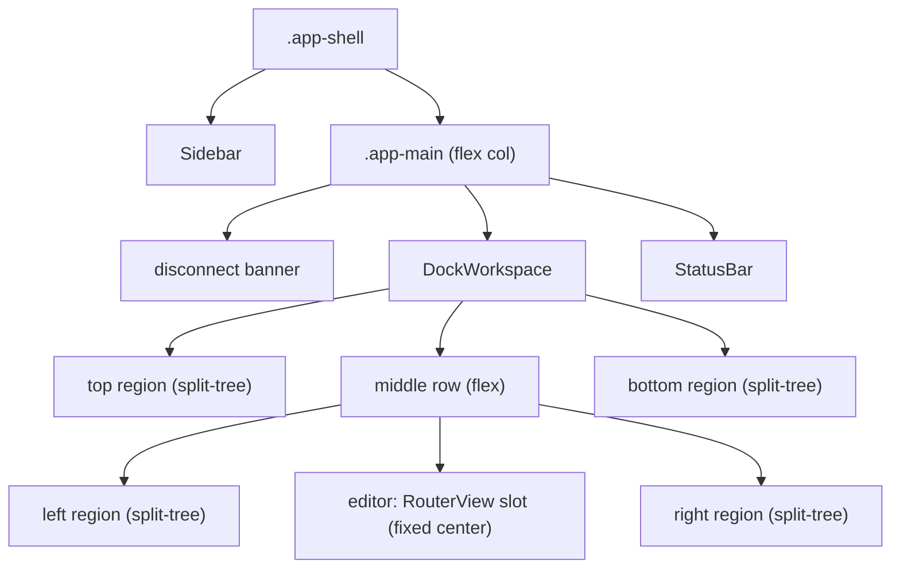

# Dockable Panel Workspace

## Overview

Replace the single bottom-drawer terminal with a VS Code-style dockable panel
workspace. The terminal (and, later, the explorer and inline file panel) can be
docked to the left, right, top, or bottom of the editor area, maximized to
fullscreen, and arranged into arbitrary horizontal/vertical splits via
drag-and-drop with drop-zone overlays. The layout persists across reloads.

The immediate win is a maximize/fullscreen button plus dock-to-edge positions
for the terminal; the target end state is free drag, splits, and tab-grouping of
multiple panels. This is a parent spec; it will be broken down into phased child
tasks via `/wf-spec-breakdown`.

## Current State

- **App shell** — `frontend/src/layouts/AppLayout.vue` renders `.app-shell`
  (flex row: `Sidebar` + `.app-main`). `.app-main` is a flex column holding the
  disconnect banner, the `<slot>` (RouterView page content), `TerminalPanel`,
  and `StatusBar`. The terminal is hard-wired between the page and the status
  bar.
- **Terminal** — `frontend/src/components/TerminalPanel.vue` is a single bottom
  drawer gated by `ui.showTerminal` (`stores/ui.ts`). It owns a persistent
  xterm instance + WebSocket (`/api/terminal/ws`), multi-session tabs, a
  reconnect loop, and a theme `MutationObserver`. Height is a top-edge drag
  handle persisted to `localStorage` under `wallfacer-panel-height` via
  `frontend/src/lib/panelHeight.ts` (`clampPanelHeight`, `PANEL_MIN_HEIGHT`).
  Only the DOM renderer is loaded (`@xterm/addon-fit`, no canvas/WebGL addon).
- **Explorer** — `frontend/src/components/ExplorerPanel.vue` is mounted *inside*
  `frontend/src/views/BoardPage.vue` (`.board-with-explorer`, gated by
  `ui.showExplorer`), with its own width drag handle. It is not visible on the
  Plan route.
- **Plan route** — `/plan` renders its own three-pane layout (SpecTreePanel /
  SpecFocusedView / PlanningChatPanel), each pane independently resizable. These
  panes are internal to the page, not part of any shared docking system.
- **Per-panel resize** — every region rolls its own mouse-drag resize + a
  dedicated `localStorage` key. There is no shared layout model.

## Architecture

### Editor-center model

The workspace follows VS Code's actual model, not a single free-form split tree:
the **center "editor" region is fixed** and holds the RouterView page content
(the board, or the Plan three-pane layout). **Dockable panels attach to the four
edges** (left / right / top / bottom) of the editor. The board is never a node
in a split with the terminal, and panels do not float. (See Non-Goals.)

The dock container lives in **`AppLayout`, wrapping the RouterView `<slot>`**, so
it applies to both routes. A left- or right-docked terminal therefore sits
beside the *entire* page, including the Plan page's three panes, which nest
inside the center region like editor splits. Consequently the explorer moves up
out of `BoardPage` into the dock system as another dockable panel (board-only
visibility is preserved as a panel property, not by where it is mounted).



### Layout tree as pure data + reducers

The layout is a serializable tree, manipulated only through **pure reducer
functions** kept separate from the Vue components (in a new
`frontend/src/lib/dock/` module). This is the testable core; drag/drop, gutter
math, and xterm survival are verified separately (see Testing Strategy).

```ts
// frontend/src/lib/dock/types.ts
type DockRegion = 'left' | 'right' | 'top' | 'bottom';

type DockNode =
  | { kind: 'split'; dir: 'row' | 'col'; sizes: number[]; children: DockNode[] }
  | { kind: 'group'; id: string; tabs: PanelId[]; active: PanelId };

type PanelId = 'terminal' | 'explorer' | string; // extensible

interface DockLayout {
  regions: Partial<Record<DockRegion, DockNode>>; // absent = collapsed/empty
  sizes: Partial<Record<DockRegion, number>>;     // px or fraction per edge
  maximized: PanelId | null;                       // fullscreen panel, if any
  version: number;                                 // for migration
}
```

Reducers (pure, `(layout, …) => layout`): `dockPanel(panel, region)`,
`splitGroup(groupId, dir, panel)`, `moveTab(panel, targetGroupId, index)`,
`closePanel(panel)`, `resizeRegion(region, size)`, `resizeSplit(path, sizes)`,
`maximize(panel)` / `restore()`, plus `serialize` / `deserialize` /
`migrateLegacy`.

### Components

#### `dockStore` (Pinia)

New `frontend/src/stores/dock.ts`. Holds the reactive `DockLayout`, exposes
actions that wrap the pure reducers, and persists to `localStorage`
(`wallfacer-dock-layout-v1`) on change. On first load with no stored layout but a
legacy `wallfacer-panel-height`, `migrateLegacy` seeds a bottom-docked terminal
at that height. The `ui.showTerminal` / `showExplorer` booleans are reframed as
"is this panel present in the layout" (open = dock it into its last region or a
default; close = remove from the tree).

#### `DockWorkspace.vue`

Top-level container mounted in `AppLayout` around the RouterView slot. Lays out
the five regions (four edges + fixed center), renders each non-empty region via
`SplitContainer`, and owns the **drop-zone overlay** shown during a drag: edge
zones on the workspace (dock to that edge) and per-group zones (split
left/right/top/bottom, or center to merge as a tab). When `maximized` is set, it
renders only that panel full-bleed over everything else.

#### `SplitContainer.vue`

Recursive renderer for a `DockNode`: a `split` node renders its children with
resizable gutters (reuse the drag pattern + `clampPanelHeight`-style clamping
from the existing handles); a `group` node renders a tab bar plus the active
panel's body. **Tabs use `v-show`, never `v-if`**, so a backgrounded terminal
keeps its xterm + WebSocket state.

#### `DockPanel.vue`

Chrome wrapper around a panel body: a header with the panel title, a **drag
handle** (HTML5 drag or pointer-events drag to start a move), a **maximize /
restore** button (the "expand to fullscreen" the user asked for), and a **dock
menu** (move to left/right/top/bottom). The terminal and explorer bodies render
inside this wrapper.

### Terminal survival across moves (critical constraint)

Moving the terminal between regions must **not** dispose the xterm instance or
drop the WebSocket. Approach: keep a single persistent `TerminalPanel` instance
and reposition it with `<Teleport :to>` into the target region's mount point.
Teleport's `to` is reactive and preserves the component instance, so the socket
and scrollback survive. After any move or region resize, call `fitAddon.fit()`
(already wired to a `ResizeObserver`).

Renderer constraint: only the **DOM renderer survives DOM re-parenting**. A
canvas/WebGL xterm addon would lose its GL context on re-parent, so the terminal
must stay on the DOM renderer (it already does — only `addon-fit` is loaded).
This is a standing constraint for any future renderer change.

## Data Flow

1. User clicks maximize / picks a dock position / drags a panel.
2. `DockPanel` (or a drop-zone) dispatches a `dockStore` action.
3. The action calls the matching pure reducer, replacing the `DockLayout`.
4. `dockStore` persists the new tree to `localStorage`.
5. `DockWorkspace` / `SplitContainer` re-render; the terminal's `<Teleport>`
   target changes, re-parenting the live xterm node without unmount.
6. A post-update `fitAddon.fit()` reflows the PTY to the new size.

## API Surface

No backend changes. The terminal WebSocket (`/api/terminal/ws`) and explorer
endpoints are reused as-is.

Frontend surface:
- New `localStorage` key `wallfacer-dock-layout-v1` (supersedes
  `wallfacer-panel-height`, which is read once for migration).
- Keyboard: extend `useKeyboard` so the existing terminal toggle still works;
  add a maximize/restore binding for the focused panel.

## Non-Goals (v1)

Stated explicitly so they are objected to at spec review, not mid-build:

- **No center-drop** — the editor (board / Plan view) is never a node in a split
  with a docked panel. The center region is fixed.
- **No floating / detached windows.** All panels dock to an edge.
- **No cross-window or multi-monitor tear-off.**
- **Plan-route internal panes** (SpecTree / Focused / Chat) stay as they are;
  they nest inside the fixed center region and are not converted into dock nodes
  in v1.

## Phasing

Indicative breakdown for `/wf-spec-breakdown` (parent spec):

1. **Maximize + dock-to-edge for the terminal.** Introduce `dock/` reducers,
   `dockStore`, `DockWorkspace` wrapping the RouterView, Teleport-based terminal
   repositioning, the maximize button and dock menu, and legacy-height
   migration. Drag-and-drop not yet required. Ships the user's concrete ask.
2. **Drag-and-drop with drop-zone overlays.** Edge + per-group drop zones,
   pointer-drag from the panel header.
3. **Splits + tab groups.** Recursive `SplitContainer`, resizable gutters,
   multi-panel tab groups (`v-show` bodies).
4. **Generalize to other panels.** Move `ExplorerPanel` out of `BoardPage` into
   the dock system; wire the inline file panel ([[inline-file-panel]]) as a dock
   panel once it lands.

## Testing Strategy

The split between unit-testable logic and visually-verified behavior follows the
project's jsdom limits (cf. the SpecFocusedView crossfade and visual-verification
work — DOM-render and drag behavior do not survive jsdom).

- **Unit (Vitest, pure functions)** — the `dock/` reducers: `dockPanel`,
  `splitGroup`, `moveTab`, `closePanel`, `resize*`, `maximize`/`restore`, and
  `serialize` / `deserialize` round-trips. Plus `migrateLegacy`: an old
  `wallfacer-panel-height` value produces a bottom-docked terminal at that
  height; absence produces the default layout. These are the bulk of the tests
  and run without a DOM.
- **Component (Vitest + jsdom)** — `dockStore` action → reducer → persistence
  wiring; `SplitContainer` renders the right node kinds; tab bodies use `v-show`
  (assert backgrounded panels stay in the DOM).
- **Playwright / manual** — drag-and-drop drop zones, gutter resizing, and the
  load-bearing claim that **the live terminal survives a move** (open terminal,
  type, dock left, confirm the same session/scrollback and a working prompt).
  jsdom cannot exercise xterm or HTML5 drag, so this is verified in a real
  browser (reuse the `frontend/scripts/ui-shots` harness pattern).
