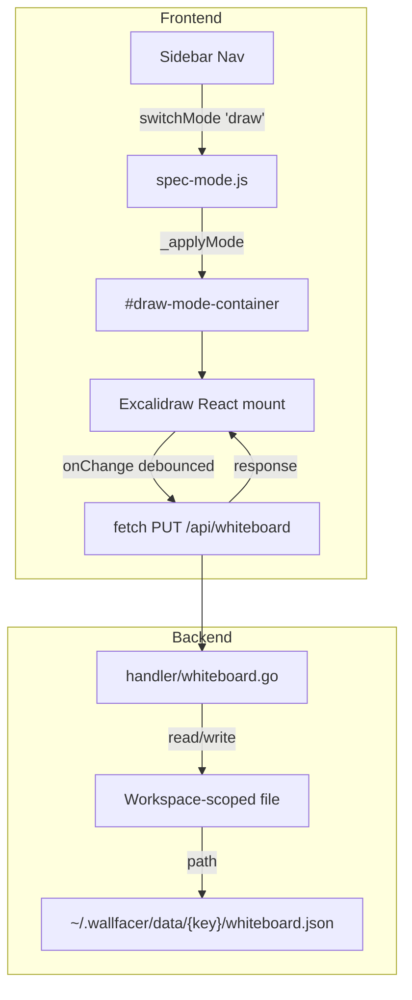

# Excalidraw Whiteboard

## Overview

Add an Excalidraw-based whiteboard as a peer view alongside the kanban board,
spec tree, and docs views. Users can draft architecture diagrams, brainstorm
ideas, and sketch designs on an infinite canvas that persists per workspace.
This is a focused integration — embed Excalidraw as a drawing tool, not a
full spatial-canvas rethinking of the UI (see `spatial-canvas.md` for that).

## Current State

Wallfacer has three top-level views, switched via a string-based mode registry
in `ui/js/spec-mode.js`:

```
_validModes = { board: true, spec: true, docs: true }
```

Each mode has an HTML container partial (`ui/partials/board.html`,
`spec-mode.html`, `docs-mode.html`), a sidebar navigation button in
`ui/partials/sidebar.html`, and visibility toggling in `_applyMode()`.
The active mode persists to `localStorage["wallfacer-mode"]`.

There is no current drawing or diagramming capability. Mermaid diagrams in
spec documents render as static images in the docs/spec viewers.

Per-workspace data lives in `~/.wallfacer/data/<workspace-key>/` where the
key is a SHA256 fingerprint of sorted workspace paths (see
`internal/prompts/instructions.go:InstructionsKey()`). Task data is stored
per-task via `StorageBackend.SaveBlob()`/`ReadBlob()`, but there is no
existing pattern for workspace-level (non-task) blob storage.

## Architecture



Excalidraw is a React component. Since Wallfacer's frontend is vanilla JS,
we mount a minimal React root only inside the whiteboard container. This is a
common pattern — React can coexist with vanilla JS when scoped to a single
DOM node. The React/ReactDOM bundle is loaded only when the whiteboard view
is first activated (lazy load).

## Components

### Frontend: Whiteboard View

**New files:**
- `ui/partials/whiteboard.html` — Container div for the React mount point
- `ui/js/whiteboard.js` — Lazy-load Excalidraw, manage save/load lifecycle
- `ui/css/whiteboard.css` — Minimal overrides for Excalidraw's default styles

**Modifications:**
- `ui/js/spec-mode.js` — Add `draw` to `_validModes`, add case to `_applyMode()`
- `ui/partials/sidebar.html` — Add whiteboard nav button (pencil/draw icon)
- `ui/partials/scripts.html` — Add `whiteboard.js` script tag
- `ui/index.html` — Include `whiteboard.html` partial in the `board-with-explorer` container

**Lifecycle:**
1. User clicks sidebar "Draw" button → `switchMode('draw')`
2. `_applyMode('draw')` shows `#draw-mode-container`, hides others
3. On first activation, `whiteboard.js` dynamically loads React, ReactDOM,
   and `@excalidraw/excalidraw` from vendored bundles (or CDN as fallback)
4. Mounts `<Excalidraw>` component into the container with loaded scene data
5. On `onChange`, debounces (1-2 seconds) and PUTs the scene JSON to the server
6. On mode switch away, the React root stays mounted (preserves undo history)
   but stops auto-saving

**Excalidraw configuration:**
- Theme: sync with Wallfacer's dark/light theme (`localStorage["wallfacer-theme"]`)
- UI: Show Excalidraw's built-in toolbar (shape tools, text, arrows, etc.)
- Collaboration: Disabled (single-user, no WebSocket needed)
- Library: Enable Excalidraw's shape library for reusable components

### Backend: Whiteboard Storage

**New files:**
- `internal/handler/whiteboard.go` — HTTP handlers for whiteboard CRUD

**Modifications:**
- `internal/apicontract/routes.go` — Register whiteboard routes

The whiteboard scene is stored as a single JSON file per workspace. This is
workspace-level data (not task-level), so it lives directly in the workspace
data directory rather than under a task UUID subdirectory.

**Storage path:** `~/.wallfacer/data/<workspace-key>/whiteboard.json`

The file contains the raw Excalidraw scene JSON (elements array, app state,
files for embedded images). Excalidraw scenes are typically 10KB-1MB depending
on complexity.

**Write strategy:** Atomic write via temp-file-rename, following the existing
pattern in `internal/store/` (see `atomicfile.WriteJSON()`). The handler
receives the full scene JSON and overwrites the file — no incremental updates.
This is safe because there is only one writer (the single browser session).

### Vendoring Strategy

Excalidraw and its React dependencies need to be available to the frontend.
Options (in order of preference):

1. **Vendor pre-built bundles** — Download UMD/ESM builds of `react`,
   `react-dom`, and `@excalidraw/excalidraw` into `ui/vendor/`. Load via
   `<script>` tags. This avoids a build step and keeps the vanilla JS
   philosophy (no bundler, no node_modules at runtime). Total size ~1.5MB
   gzipped.

2. **CDN with local fallback** — Load from a CDN (unpkg/esm.sh) with a
   fallback to vendored copies. Faster initial setup but adds an external
   dependency.

The vendored approach is preferred since Wallfacer already embeds all UI
assets via `embed.FS` in `main.go`.

## API Surface

### Whiteboard

- `GET /api/whiteboard` — Load the current workspace's whiteboard scene JSON.
  Returns `200` with the scene or `204` if no whiteboard exists yet.
- `PUT /api/whiteboard` — Save the whiteboard scene JSON. Request body is the
  raw Excalidraw scene. Returns `204` on success.

Both routes are scoped to the active workspace via the workspace manager
snapshot, following the same pattern as `GET/PUT /api/instructions`.

## Data Flow

1. **Load:** Browser activates draw mode → `GET /api/whiteboard` →
   handler reads `data/<key>/whiteboard.json` → returns scene JSON →
   Excalidraw initializes with scene data.

2. **Save:** User draws on canvas → Excalidraw `onChange` fires →
   debounced (1.5s idle) → `PUT /api/whiteboard` with scene JSON →
   handler writes atomically to `data/<key>/whiteboard.json` → `204`.

3. **Workspace switch:** User changes workspace group → draw mode
   container is unmounted and re-initialized on next activation →
   loads new workspace's whiteboard data.

## Testing Strategy

**Backend:**
- Unit test `handler/whiteboard.go`: GET returns 204 when no file exists,
  PUT saves and GET retrieves, invalid JSON rejected. Follow the pattern
  in `handler/instructions_test.go` (if it exists) or `handler/env_test.go`.

**Frontend:**
- Vitest unit test for `whiteboard.js`: verify lazy-load trigger, debounce
  timing, theme sync. Mock the Excalidraw component (don't load the real
  React bundle in tests).
- Manual test: draw shapes, reload page, verify persistence. Switch
  workspaces, verify isolation.
