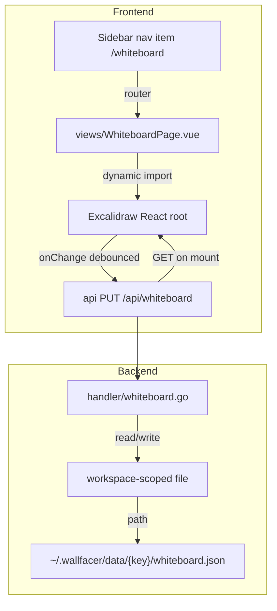

# Whiteboard

## Overview

Add a whiteboard as a peer view alongside the board, plan, and map views. Users
can draft architecture diagrams, brainstorm ideas, and sketch designs on an
infinite canvas that persists per workspace, drawing freely the way they would
in Excalidraw. The goal is the drawing capability, not a specific vendor; the
engine below is the chosen vehicle, not the requirement. This is a focused
integration of a drawing tool, not a full spatial-canvas rethinking of the UI
(see `spatial-canvas.md` for that).

## Engine: Excalidraw, React isolated (current choice, revisable)

The goal — an infinite drawing canvas — does not mandate any particular library.
The options were: (1) embed Excalidraw and isolate React behind a lazy
code-split boundary, (2) iframe-isolate a self-hosted Excalidraw, or (3) build
the whiteboard Vue-natively on a canvas library like vue-konva. Excalidraw and
the closest alternative (tldraw) are both React components with no Vue port.
Option 3 reimplements a mature tool at much lower fidelity and far higher cost;
option 2 adds a separate build plus a postMessage bridge for theme, sizing, and
data.

Current choice: option 1. Mount a single React root inside one Vue view via a
dynamic `import()`, code-split so the React + Excalidraw chunk (~1.5MB gzipped)
loads only when the whiteboard route is first opened. The initial Vue SPA bundle
stays React-free in practice; React is confined to this one lazily-loaded island
and torn down on route leave. The `react`/`react-dom` cost is therefore an
on-demand chunk for an opt-in view, not a tax on every page load.

Revisit trigger: the one real cost is that Excalidraw drags React into an
otherwise React-free Vue SPA. If that proves unacceptable (bundle size,
maintenance, build friction), the engine can be swapped — for tldraw, a
Vue-native vue-konva build, or another library — without changing the goal, the
per-workspace storage design, or the API surface. The whiteboard is persisted as
opaque scene JSON via `GET/PUT /api/whiteboard` (see below), which is
engine-agnostic; only the frontend view and the scene serialization format are
engine-specific.

## Current State

The frontend is a single Vue 3 SPA under `frontend/src/`, built with Vite and
embedded into the binary via `go:embed` (`main.go`, `//go:embed
all:frontend/dist`). There is no separate `internal/webserver/spa/` package and
no legacy `ui/` mode registry.

Top-level views are vue-router routes registered in `frontend/src/router.ts`.
In local mode the peer views are board (`/`), chat (`/chat`), plan (`/plan`),
agents (`/agents`), workflows (`/workflows`, with `/flows` as a redirect),
routines (`/routines`), mission control (`/mission`, with `/map` as a
redirect), analytics (`/analytics`), docs (`/docs`), and settings
(`/settings`). Each page is a lazy-imported SFC under `frontend/src/views/`
(for example `MapPage.vue`, `PlanPage.vue`). The left rail in
`frontend/src/components/Sidebar.vue` drives navigation through `to:` items
grouped under "Workspace", "Inspect", and a bottom group (docs, settings),
each with an inline SVG icon.

Theme lives in the `prefs` store (`frontend/src/stores/prefs.ts`), which writes
`data-theme="light|dark"` on `<html>` and persists to
`localStorage["wallfacer-theme"]`. Components read the resolved theme from that
store rather than touching localStorage directly.

There is no current drawing or diagramming capability. Mermaid diagrams in
spec documents render as static SVG in the docs/spec viewers.

Per-workspace data lives in `~/.wallfacer/data/<workspace-key>/` where the key
is a SHA256 fingerprint of sorted workspace paths (see
`internal/prompts/instructions.go:InstructionsKey()`). The active workspace
group exposes this directory directly: `workspace.Snapshot.ScopedDataDir`
(`internal/workspace/manager.go`) is exactly
`~/.wallfacer/data/<workspace-key>/`. Task data is stored per-task via the
filesystem store backend (`internal/store/backend_fs.go`), but there is no
existing pattern for workspace-level (non-task) blob storage, and no handler
currently reads `ScopedDataDir`; the merged `AGENTS.md` instructions are
surfaced through `internal/handler/config.go` (which keys workspace state via
`prompts.InstructionsKey()`), and config/template blobs are written under
`h.configDir` rather than the workspace-scoped data dir.

## Architecture

Excalidraw is a React component. The Vue SPA does not otherwise use React, so
`WhiteboardPage.vue` mounts a single React root into one container element via
a dynamic `import()` of `react`, `react-dom/client`, and
`@excalidraw/excalidraw`. The import is code-split by Vite so the React +
Excalidraw chunk is fetched only when the whiteboard route is first visited
(the dependencies are installed through `frontend/package.json`/bun and bundled
at build time; there is no runtime CDN or hand-vendored UMD bundle). The React
root is torn down in `onBeforeUnmount` so leaving the route releases it.

## Components

### Frontend: Whiteboard View

**New files:**
- `frontend/src/views/WhiteboardPage.vue` - peer view that hosts the React
  root, manages the save/load lifecycle, and syncs theme.

**Modifications:**
- `frontend/src/router.ts` - add `{ path: '/whiteboard', component: () =>
  import('./views/WhiteboardPage.vue') }` to `localRoutes`.
- `frontend/src/components/Sidebar.vue` - add a nav item under the "Workspace"
  group: `{ id: 'whiteboard', label: 'Whiteboard', to: '/whiteboard', icon:
  'whiteboard' }`, plus an inline SVG branch for the `whiteboard` icon (a
  pencil/draw glyph) in the `#icon` template.
- `frontend/package.json` - add `react`, `react-dom`, and
  `@excalidraw/excalidraw` dependencies (installed via bun).

**Lifecycle:**
1. User clicks the sidebar "Whiteboard" item, router navigates to
   `/whiteboard`, vue-router lazy-loads `WhiteboardPage.vue`.
2. On `onMounted`, the page `GET /api/whiteboard` to fetch the saved scene,
   then dynamically `import()`s React + Excalidraw and mounts the
   `<Excalidraw>` component into the container with the loaded scene.
3. On Excalidraw `onChange`, the page debounces (1.5s idle) and `PUT`s the
   scene JSON to the server.
4. On `onBeforeUnmount` (route change or workspace switch), the page flushes a
   pending save and unmounts the React root.

**Excalidraw configuration:**
- Theme: read the resolved theme from the `prefs` store
  (`frontend/src/stores/prefs.ts`) and pass it to Excalidraw; `watch` the store
  so theme changes propagate live.
- UI: show Excalidraw's built-in toolbar (shape tools, text, arrows, etc.).
- Collaboration: disabled (single-user, no WebSocket needed).
- Library: enable Excalidraw's shape library for reusable components.

### Backend: Whiteboard Storage

**New files:**
- `internal/handler/whiteboard.go` - HTTP handlers for whiteboard load/save.

**Modifications:**
- `internal/apicontract/routes.go` - register the whiteboard routes. Each entry
  is `{ Method, Pattern, Name }`, where `Name` maps to the `Handler` method of
  the same name; mirror the `/api/config` (`GetConfig`/`UpdateConfig`) or
  `/api/env` (`GetEnvConfig`/`UpdateEnvConfig`) GET/PUT block.

The whiteboard scene is stored as a single JSON file per workspace. This is
workspace-level data (not task-level), so it lives directly in the active
group's scoped data directory rather than under a task UUID subdirectory.

**Storage path:** `<workspace.Snapshot.ScopedDataDir>/whiteboard.json`, i.e.
`~/.wallfacer/data/<workspace-key>/whiteboard.json`. The handler resolves the
directory through the active workspace snapshot, which is mirrored onto the
handler by `applySnapshot` (`internal/handler/handler.go`). No existing handler
reads `ScopedDataDir` yet, so this introduces that usage: add a small
`currentWhiteboardPath()` helper in `internal/handler/handler.go` that joins the
snapshot's `ScopedDataDir` with `whiteboard.json` (returning `""` when no
workspace is configured, i.e. an empty `ScopedDataDir`). For the read/write
mechanics, the closest analog is `templates.go`'s private `templatesPath()`
helper plus its `atomicfile` write.

The file contains the raw Excalidraw scene JSON (elements array, app state,
files for embedded images). Excalidraw scenes are typically 10KB-1MB depending
on complexity.

**Write strategy:** atomic write via temp-file-rename, using
`internal/pkg/atomicfile` (`atomicfile.Write(path, data, 0o644)`), the same
helper the explorer and templates handlers already use. The handler receives
the full scene JSON and overwrites the file (no incremental updates). This is
safe because there is only one writer (the single browser session).

### Frontend dependency packaging

Excalidraw and its React dependencies are added to `frontend/package.json` and
installed with bun, then bundled by Vite into a lazily-loaded route chunk. No
runtime CDN, no hand-maintained `ui/vendor/` UMD copies: the build step Vite
already runs handles tree-shaking and chunk splitting, and the resulting
`frontend/dist/` is embedded via `//go:embed all:frontend/dist` (`main.go`).
Keep the Excalidraw import dynamic so the
React + Excalidraw chunk (~1.5MB gzipped) is fetched only when the whiteboard
route is opened.

## API Surface

### Whiteboard

- `GET /api/whiteboard` - load the current workspace's whiteboard scene JSON.
  Returns `200` with the scene, or `200` with an empty body / `204` when no
  whiteboard file exists yet.
- `PUT /api/whiteboard` - save the whiteboard scene JSON. The request body is
  the raw Excalidraw scene. Returns `200` (`{"status":"ok"}`) on success.

Both routes are scoped to the active workspace via the workspace manager
snapshot, following the same shape as the `GET/PUT /api/config` and
`GET/PUT /api/env` handlers. When no workspace is configured, return `503`
(`http.StatusServiceUnavailable`) as `config.go` and the agents handlers do.

## Data Flow

1. **Load:** route mounts, page `GET /api/whiteboard`, handler reads
   `<ScopedDataDir>/whiteboard.json`, returns scene JSON (or empty), Excalidraw
   initializes with the scene.
2. **Save:** user draws, Excalidraw `onChange` fires, debounced (1.5s idle),
   page `PUT /api/whiteboard` with scene JSON, handler writes atomically to
   `<ScopedDataDir>/whiteboard.json`.
3. **Workspace switch:** the workspace snapshot changes `ScopedDataDir`, so a
   subsequent `GET /api/whiteboard` resolves the new group's file. The page
   reloads the scene when the active workspace changes (re-fetch and re-seed
   the Excalidraw scene), keeping per-workspace isolation.

## Testing Strategy

**Backend:**
- Unit test `handler/whiteboard.go`: GET returns the empty convention when no
  file exists, PUT saves and a subsequent GET retrieves the same bytes, no
  workspace configured returns `503`, two distinct workspace keys stay
  isolated. Follow `handler/explorer_test.go` and `handler/templates_test.go`
  (which exercise `atomicfile`-backed writes through a temp-dir handler) and
  `handler/config_test.go` for the no-workspace `503` case.

**Frontend:**
- Vitest unit test for `WhiteboardPage.vue`: verify the GET-on-mount call, the
  debounced save (timing), and theme sync against the `prefs` store. Mock the
  dynamic `@excalidraw/excalidraw` import so the real React bundle is not
  loaded in tests (follow the dynamic-import-mocking approach used by
  `MapPage.test.ts` for its vendored renderer).
- Manual test: draw shapes, reload the page, verify persistence; switch
  workspace groups, verify isolation; toggle theme, verify Excalidraw follows.
