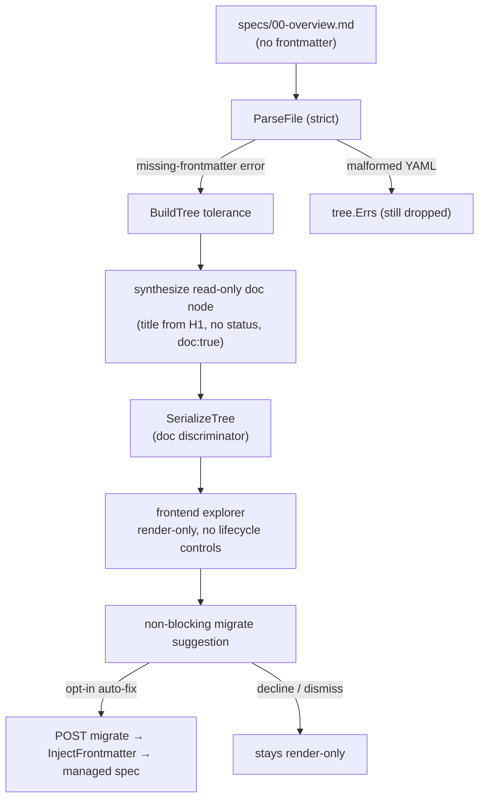

# Free-Form Specs

## Overview

A workspace whose `specs/` directory contains plain markdown files with **no YAML
frontmatter** renders nothing in spec mode. The whole tree silently collapses to
empty. This spec makes wallfacer **render free-form specs read-only** (so existing
design-doc repos are immediately usable), and adds a **non-blocking migration
affordance** that nudges users to adopt wallfacer's lifecycle and, on opt-in,
scaffolds frontmatter onto a prose file to convert it into a managed spec. Users
can always decline and keep using render-only mode.

## Current State

The failure is silent and three-staged:

1. `spec.ParseFile` (`internal/spec/parse.go:34`) errors with
   `"missing frontmatter: file must start with ---"` for any file that does not
   begin with `---\n`.
2. `spec.BuildTree` (`internal/spec/tree.go:94-98`) catches that error, appends it
   to `tree.Errs`, and `continue`s — **the node is never added to the tree.**
3. `collectSpecTree` (`internal/handler/specs.go:33-60`) **ignores `tree.Errs`
   entirely** and returns the (now empty) `Nodes` list.

Result: a `specs/` directory full of valid design docs (e.g.
`com.example.service.revenue-engine/specs/` — files start with `# 00 — Overview` and
a bespoke prose convention like `**Status**: planned`) shows as an empty tree with
no surfaced error.

`ParseFile`'s strictness is **deliberate and depended upon**: it is the contract
for the write/dispatch paths and is explicitly tested at
`internal/spec/parse_test.go:222` (`expected error for missing frontmatter`). It
must not be loosened.

There is already precedent for a "plain markdown, no frontmatter, no lifecycle"
surface: the `Index` concept (`internal/spec/index.go:13-16`) models
`specs/README.md` as a pinned, read-only roadmap entry distinct from `Spec`. This
spec extends that philosophy to arbitrary frontmatter-less files.

## Architecture

The change is render-path only. `ParseFile` stays strict; tolerance is introduced
one layer up in `BuildTree`, mirroring how `Index` sits beside `Spec`.

## Components

### Doc-node model (`internal/spec/model.go`)

A free-form file becomes a **doc node**: a `Spec` value that carries a title and a
discriminator but no lifecycle. Two shaping options, decide during implementation:

- Add a `Doc bool` (`yaml:"-" json:"doc"`) field to `Spec`, left false for normal
  specs and set true for synthesized doc nodes. Status stays empty.
- Or a distinct lightweight type serialized into `NodeResponse`.

Recommended: the `Doc bool` flag on `Spec` — smallest change, keeps the existing
tree/serialize plumbing (`Node = gentree.Node[string, *Spec]`) intact. A doc
node has `Doc: true`, `Title` set, `Status: ""`, empty `DependsOn`/`Affects`.

### Parser tolerance (`internal/spec/parse.go`, `internal/spec/tree.go`)

- Keep `ParseFile`/`ParseBytes` strict. Export a **sentinel error**
  (`ErrMissingFrontmatter`) instead of the current `errors.New(...)` so callers
  can distinguish "no frontmatter" (tolerable) from "malformed YAML" (a real
  parse error).
- In `BuildTree`'s scan loop (`tree.go:94`), when `errors.Is(parseErr,
  ErrMissingFrontmatter)`, build a doc node instead of `continue`-ing:
  derive `Title` from the first `# H1` (reuse the `readFirstH1` logic in
  `index.go:102`, extracted to a shared helper) falling back to the filename;
  set `Doc: true`; set `Path`/`Track` as today; `tree.Add(...)`.
- All other parse errors (malformed YAML) still go to `tree.Errs` and the node is
  still dropped — unchanged behavior for genuinely broken files.

### Serialization (`internal/spec/serialize.go`)

`NodeResponse.Spec` already carries the whole `Spec`; with the `Doc` flag the
frontend can discriminate via `spec.doc === true`. `TreeProgress` must skip doc
nodes (they have no status, so they neither count toward nor against progress).
Verify `internal/spec/progress.go` tolerates status-less nodes.

### Migration helper (`internal/spec/write.go` or `scaffold.go`)

New `InjectFrontmatter(path string, fields map[string]any) error`: prepend a
YAML frontmatter block to an existing file **without rewriting the prose body**.
Distinct from `UpdateFrontmatter` (which requires an existing block) and from
`Scaffold`/`RenderSkeleton` (which create a new file from a skeleton). Field
defaults: `title` from first H1 or filename, `status: drafted`, `created`/`updated`
= now, `author` from configured identity. It does **not** guess status from prose.

### Migration endpoint + commit (`internal/handler/specs.go`)

A handler (e.g. `MigrateSpec`) that: resolves the file in a visible workspace
(reuse `findSpecFile`), rejects files that already have frontmatter, calls
`InjectFrontmatter`, then commits via the existing `commitSpecTransition` /
`commitSpecChanges` pattern (subject e.g. `<relPath>: adopt spec frontmatter`).
Optionally a batch variant ("migrate all") iterating the doc nodes in a workspace.
Guard with `requireVisibleWorkspace`, same as the other mutating spec handlers.

### Frontend rendering + migration popup (`frontend/src/`)

- Render doc nodes as readable entries in the spec explorer/tree. **Suppress the
  status badge, progress indicator, and all lifecycle controls** (dispatch,
  archive) — a doc node must be structurally incapable of triggering a mutation
  on a file wallfacer does not own.
- When one or more doc nodes are present, show a **non-blocking, dismissible**
  suggestion (banner or popover): "These specs aren't lifecycle-managed. Adopt
  wallfacer frontmatter?" with an opt-in **Migrate** action (per-spec, and
  optionally "Migrate all"). Declining/dismissing keeps render-only mode and
  should not nag (persist dismissal, e.g. localStorage).

## Data Flow

Read path: `GetSpecTree`/`SpecTreeStream` → `collectSpecTree` →
`BuildTree` (now emits doc nodes) → `SerializeTree` (with `doc` flag) → explorer.
A doc node renders as a readable markdown document via the existing focused-view
file read; no status column, no lifecycle buttons.

Migrate path: user clicks Migrate → `POST` migration endpoint →
`InjectFrontmatter` writes the block → commit → next `SpecTreeStream` poll
re-parses the file, which now passes strict `ParseFile`, so it returns as a normal
lifecycle-managed `Spec` (the doc node is replaced by a real node).

## API Surface

- `POST /api/specs/migrate` (exact route/shape per existing spec-handler
  conventions): body `{ "path": "specs/00-overview.md" }`, response
  `{ "path": ..., "status": "drafted" }`. Optional batch variant.
- JSON: `NodeResponse.spec.doc: boolean` — new discriminator field, omitted/false
  for normal specs.

## Error Handling

- Malformed-YAML files keep failing into `tree.Errs` and are dropped — only the
  missing-frontmatter sentinel triggers the doc-node path.
- Migrate on a file that already has frontmatter returns 422 (nothing to inject).
- Migrate outside a visible workspace / non-git workspace follows the existing
  patterns (404 / non-fatal commit skip, as `commitSpecTransition` already does).
- Non-git workspaces still render doc nodes (read-only) but migration commit is a
  best-effort no-op, matching `commitSpecTransition`'s git-absent behavior.

## Testing Strategy

- **Unit (`internal/spec`)**: `BuildTree` over a fixture dir mixing
  frontmatter, frontmatter-less, and malformed-YAML files asserts: doc node
  present with title from H1 (and filename fallback), normal nodes parsed,
  malformed file in `tree.Errs` and absent from tree. `ParseFile` still returns
  the sentinel error (keep the existing `parse_test.go:222` assertion, switch to
  `errors.Is`). `InjectFrontmatter` round-trips: body preserved byte-for-byte,
  block prepended, result re-parses via `ParseFile`. `TreeProgress` ignores doc
  nodes.
- **Handler (`internal/handler`)**: `MigrateSpec` happy path (doc node →
  managed spec, committed), already-has-frontmatter rejection, missing-workspace
  rejection. Follow `specs_test.go` patterns.
- **Frontend (real browser, not jsdom)**: doc node renders and is readable;
  status badge / progress / dispatch / archive controls are **absent and cannot
  fire**; migrate suggestion appears, is dismissible, does not reappear after
  dismissal; clicking Migrate converts the node to a lifecycle-managed spec. This
  must be verified in a real browser — the happy-dom/jsdom reactivity blind spot
  makes value-only tests insufficient here.
- **Prerequisite check**: verify whether the `specs/README.md` `Index` already
  pins in the explorer today when running against a frontmatter-less repo
  (`com.example.service.revenue-engine`). If it does, the doc-node render path is
  proven end-to-end; if not, that is a smaller related explorer bug to note.
- **Gate**: `make build` (golangci-lint) must pass — `go build/vet/test` alone
  will not catch unused-code/lint regressions.

## Out of Scope

- **No board participation.** Doc nodes appear in the spec explorer only, never as
  task-board cards. (Assumption to confirm; flagged here so it can be corrected
  cheaply.)
- **No prose-convention scraper.** Auto-fix uses a sane default status; it does
  not parse `**Status**: planned` into a real lifecycle status. Per-repo prose
  conventions are fragile and out of scope.
- **No loosening of `ParseFile`.** Tolerance lives only in `BuildTree`.
