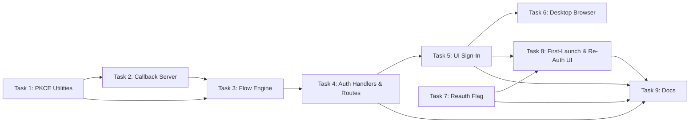

# OAuth Token Setup

## Problem

Setting up Claude and Codex credentials in Wallfacer requires users to manually obtain tokens from external tools and paste them into the Settings UI:

- **Claude OAuth token:** User must install Claude Code CLI, run `claude auth login` or `claude setup-token`, copy the token from `~/.claude/.credentials.json`, then paste it into Wallfacer Settings.
- **Anthropic API key:** User must visit console.anthropic.com, create a key, copy it, paste it.
- **OpenAI API key:** User must visit platform.openai.com, create a key, copy it, paste it.

This is friction-heavy, error-prone (partial pastes, whitespace), and requires users to know where tokens live on disk. Both Claude Code and Codex CLI solve this with browser-based OAuth flows that Wallfacer can replicate directly.

## Solution

Add "Sign in" buttons to the Settings API Configuration panel that trigger OAuth 2.0 Authorization Code with PKCE flows directly from the Wallfacer server. The browser opens, the user authenticates, and the token is written to `~/.wallfacer/.env` automatically. Manual paste remains as a fallback.

## Design

### OAuth Flows

Both Claude and Codex use standard OAuth 2.0 Authorization Code with PKCE (public client, no client secret).

#### Claude OAuth Flow

1. User clicks **"Sign in with Claude"** in Settings.
2. Frontend calls `POST /api/auth/claude/start`.
3. Server generates PKCE code verifier + S256 challenge, random state, stores them in memory.
4. Server starts a temporary HTTP listener on a random localhost port for the callback.
5. Server returns the authorization URL to the frontend.
6. Frontend opens the URL in a new browser tab:
   ```
   https://platform.claude.com/oauth/authorize?
     client_id=https://claude.ai/oauth/claude-code-client-metadata
     &redirect_uri=http://localhost:{port}/callback
     &response_type=code
     &code_challenge={challenge}
     &code_challenge_method=S256
     &state={state}
   ```
7. User authenticates on platform.claude.com and grants consent.
8. Browser redirects to `http://localhost:{port}/callback?code=...&state=...`.
9. Server validates state, exchanges code for tokens at `https://platform.claude.com/v1/oauth/token` with code verifier.
10. Server writes the OAuth token to `~/.wallfacer/.env` as `CLAUDE_CODE_OAUTH_TOKEN`.
11. Server returns a success HTML page (auto-closes tab or shows "You can close this tab").
12. Frontend polls `GET /api/auth/claude/status` or receives an SSE event indicating success, then refreshes the env config display.

#### Codex OAuth Flow

1. User clicks **"Sign in with OpenAI"** in Settings.
2. Frontend calls `POST /api/auth/codex/start`.
3. Server generates PKCE code verifier + S256 challenge, random state.
4. Server starts a temporary HTTP listener on localhost for the callback.
5. Server returns the authorization URL.
6. Frontend opens:
   ```
   https://auth.openai.com/oauth/authorize?
     client_id=app_EMoamEEZ73f0CkXaXp7hrann
     &redirect_uri=http://localhost:{port}/callback
     &response_type=code
     &scope=openid profile email offline_access
     &code_challenge={challenge}
     &code_challenge_method=S256
     &state={state}
   ```
7. User authenticates on auth.openai.com.
8. Callback arrives, server exchanges code at `https://auth.openai.com/oauth/token`.
9. Server extracts the API key (or access token) and writes `OPENAI_API_KEY` to `~/.wallfacer/.env`.
10. Success page shown, frontend refreshes.

### API Endpoints

| Method | Path | Description |
|--------|------|-------------|
| `POST` | `/api/auth/{provider}/start` | Start OAuth flow. Returns `{authorize_url}`. Provider: `claude` or `codex`. |
| `GET` | `/api/auth/{provider}/status` | Poll for flow completion. Returns `{state: "pending"|"success"|"error", error?: string}`. |
| `POST` | `/api/auth/{provider}/cancel` | Cancel a pending flow (closes the callback listener). |

### Callback Listener Design

- Each OAuth flow starts a **separate ephemeral HTTP listener** on `127.0.0.1` with a random available port. This avoids conflicting with the main Wallfacer server or other services.
- The listener accepts exactly one request (the callback), then shuts down.
- A timeout (5 minutes) auto-cancels the flow if the user never completes authentication.
- Only one flow per provider can be active at a time. Starting a new flow cancels any pending one.

### Token Storage

- Obtained tokens are written to `~/.wallfacer/.env` using the existing `envconfig.Update()` function.
- For Claude: writes `CLAUDE_CODE_OAUTH_TOKEN`. If the user already had an `ANTHROPIC_API_KEY`, the OAuth token takes precedence (existing behavior).
- For Codex: writes `OPENAI_API_KEY`.
- Token refresh is out of scope for v1 — OAuth tokens have long expiry and users can re-authenticate when they expire.

### Security Considerations

- **PKCE required** — prevents authorization code interception.
- **State parameter** — prevents CSRF. Server validates that callback state matches the initiated flow.
- **Localhost-only callback** — the callback listener binds to `127.0.0.1`, not `0.0.0.0`.
- **Short-lived listener** — auto-shuts down after callback or timeout.
- **No client secret** — both providers use public client flows (no secret to protect).
- **Token written to .env** — same security posture as manual token entry. The `.env` file is already the credential store.

### UI Changes

In the Settings API Configuration panel, add sign-in buttons next to the token input fields:

```
Claude Code
┌─────────────────────────────────────────────────────┐
│ OAuth Token  [________________________] [Sign in]   │
│ API Key      [________________________]             │
│ Base URL     [________________________]             │
│ Model        [________________________]             │
└─────────────────────────────────────────────────────┘

OpenAI Codex
┌─────────────────────────────────────────────────────┐
│ API Key      [________________________] [Sign in]   │
│ Base URL     [________________________]             │
│ Model        [________________________]             │
└─────────────────────────────────────────────────────┘
```

- **"Sign in" button** triggers the OAuth flow. While pending, the button shows a spinner and "Waiting for browser...". On success, the masked token appears in the placeholder.
- The manual paste input remains fully functional — sign-in is an alternative, not a replacement.
- If a custom `ANTHROPIC_BASE_URL` or `OPENAI_BASE_URL` is set, the sign-in button is hidden (custom endpoints won't use the standard OAuth providers).

### First Launch & Missing Credentials

When the app starts with no tokens configured (empty `~/.wallfacer/.env` or missing credential keys), the user should be guided toward the OAuth sign-in flow instead of requiring them to figure out where to get tokens.

**Detection:** On startup, the server already loads `~/.wallfacer/.env` via `envconfig.Parse()`. If neither `CLAUDE_CODE_OAUTH_TOKEN` nor `ANTHROPIC_API_KEY` is set (and similarly for `OPENAI_API_KEY`), the `GET /api/env` response already reflects empty values.

**UI behavior:**

- When the Settings API Configuration panel loads and detects no credentials for a provider, the token input shows a placeholder hint: **"No token configured"** and the **"Sign in"** button is visually emphasized (e.g., primary color instead of secondary) to draw attention.
- On first app launch (desktop or browser), if no credentials are configured for any provider, the Settings panel can auto-open or show a toast: **"Set up your API credentials to get started"** with a link to Settings.
- The `wallfacer doctor` CLI command should report missing credentials with a note that they can be set via the Settings UI sign-in flow.

**Desktop app integration:**

Since the desktop app (via Wails) is now shipped, the OAuth flow must work correctly within the native WebView:

- **Browser launch:** The "Sign in" button must open the OAuth authorization URL in the system's default browser (not the Wails WebView), since OAuth providers may block embedded WebViews. Use `wails.Runtime.BrowserOpenURL()` in desktop mode, `window.open()` in browser mode.
- **Callback return:** After the user completes authentication in the system browser, the callback hits `http://localhost:{port}/callback` on the ephemeral listener. The Wails WebView polls `/api/auth/{provider}/status` as usual and updates when the token is received. The system browser tab shows the success page.
- **First-launch flow in desktop mode:** When the desktop app starts with no credentials, the first-launch hint described above appears in the Wails WebView window. The user clicks "Sign in", the system browser opens for OAuth, and the token flows back to the app seamlessly.

### Invalid Token Detection & Re-authentication

When existing tokens are invalid or expired, the system should detect this and guide users to re-authenticate via the OAuth sign-in flow rather than leaving them to debug opaque failures.

**Detection points:**

- **`POST /api/env/test`** — The existing credential test endpoint already validates tokens by running a test container. When this returns an authentication error (401/403 from the provider), the response should include a `reauth_available: true` flag for providers that support OAuth sign-in.
- **Task execution failure** — When a task fails during execution due to an authentication error (detected from container exit code or output), the task's error event should include a `reauth_available` flag. The UI can then show a "Sign in again" action alongside the error.

**UI behavior:**

- In the Settings API Configuration panel, if a stored token fails validation (via the "Test" button or background check), show an inline warning: **"Token invalid or expired"** with a **"Sign in again"** button that triggers the OAuth flow.
- On the task board, if a task fails with an auth error, the task card's error message includes a **"Re-authenticate"** link that opens the Settings panel with the relevant provider's sign-in flow highlighted.
- After a successful re-authentication, any tasks that failed due to auth errors can be retried with the new token.

**Flow:**

1. User clicks "Test" in Settings or a task fails with auth error.
2. System detects the error is authentication-related (401, 403, "invalid token", "expired token" patterns).
3. UI displays the error with a "Sign in again" call-to-action (only when OAuth sign-in is available for that provider — i.e., no custom base URL set).
4. User clicks "Sign in again" → standard OAuth flow triggers.
5. On success, token is updated in `.env` and UI refreshes.

### Error Handling

- If the callback listener fails to start (port unavailable), return an error to the frontend.
- If the user denies consent, the callback receives an error parameter — surface it in the UI.
- If the token exchange fails, surface the provider's error message.
- If the flow times out (5 min), clean up and show "Authentication timed out. Try again."

## Implementation Scope

### New files

- `internal/handler/auth.go` — HTTP handlers for `/api/auth/{provider}/*` endpoints
- `internal/oauth/pkce.go` — PKCE code verifier, S256 challenge, state generation
- `internal/oauth/callback.go` — Ephemeral localhost callback server
- `internal/oauth/flow.go` — Flow engine, token exchange, manager
- `internal/oauth/provider.go` — Claude and Codex provider configurations

### Modified files

- `internal/apicontract/routes.go` — Register new auth routes
- `internal/handler/handler.go` — Wire `oauth.Manager` into Handler
- `internal/handler/env.go` — Extend `POST /api/env/test` response with `reauth_available` flag
- `internal/cli/server.go` — Register auth handlers in BuildMux
- `ui/partials/settings-tab-sandbox.html` — Add sign-in buttons, first-launch hints
- `ui/js/envconfig.js` — Sign-in flow, polling, cancel, reauth prompt, first-launch emphasis

### Not in scope

- Token refresh / automatic re-authentication
- Device code flow for headless servers (can be added later)
- Storing tokens in OS keychain (current .env approach is retained)
- Anthropic API key OAuth (console.anthropic.com does not offer a public OAuth flow for API keys — only manual creation)

## Test Plan

- Unit test PKCE code verifier/challenge generation (correct length, S256 hash).
- Unit test state parameter generation and validation.
- Unit test callback URL parsing (extract code and state from query params).
- Integration test: mock OAuth provider, verify full flow from start → callback → token written to .env.
- Test timeout cleanup: start a flow, wait for timeout, verify listener is shut down and status returns error.
- Test concurrent flow cancellation: start a flow, start another for the same provider, verify the first is cancelled.
- Test UI: sign-in button disabled when custom base URL is set.
- Frontend test: polling stops on success/error/cancel.
- Test first-launch detection: when no credentials are configured, UI emphasizes sign-in buttons.
- Test invalid token response: `POST /api/env/test` returns `reauth_available: true` on 401/403 auth errors.
- Test re-auth flow: after token validation fails, "Sign in again" triggers a new OAuth flow and updates the stored token.
- Test desktop browser launch: OAuth authorization URL opens in system browser (not WebView) when running in desktop mode.

## Outcome

Browser-based OAuth sign-in is fully implemented for both Claude and Codex. Users click "Sign in" in Settings, authenticate in their browser, and the token is stored automatically — replacing the manual copy-paste workflow.

### What Shipped

- **`internal/oauth/` package** (4 files): PKCE utilities (RFC 7636 verified), ephemeral callback server (`127.0.0.1` with fixed or random port), flow engine with per-provider state machine (start/poll/cancel), provider configs for Claude and Codex
- **3 API routes** (`internal/handler/auth.go`): `POST /api/auth/{provider}/start`, `GET /api/auth/{provider}/status`, `POST /api/auth/{provider}/cancel`
- **Reauth detection** (`internal/handler/env.go`): `reauth_available` flag on sandbox test response when auth errors are detected and OAuth is available
- **UI** (`settings-tab-sandbox.html`, `envconfig.js`): sign-in buttons (accent for Claude, black for Codex), 2-second polling with cancel link, first-launch hints with emphasized buttons and toast, inline "Sign in again" on auth errors, buttons hidden when custom base URL is set
- **Desktop support**: Wails `BrowserOpenURL` integration
- **17 backend tests** (oauth package) + **5 auth handler tests** + **1 reauth test**
- **Docs**: configuration.md, getting-started.md, api-and-transport.md, CLAUDE.md all updated

### Design Evolution

1. **Claude OAuth endpoint changed.** The spec used `platform.claude.com/oauth/authorize` with the Claude Code CLI metadata client ID. This didn't work for third-party redirect URIs. Changed to `claude.ai/oauth/authorize` with client ID `9d1c250a-e61b-44d9-88ed-5944d1962f5e` and fixed port 53692, matching the Pi coding agent's working implementation.

2. **Claude token exchange requires JSON body with state.** The spec assumed standard form-encoded token exchange. Claude's endpoint returns 400 for form-encoded bodies and requires a `state` field in the JSON body plus an `Accept: application/json` header.

3. **Codex OAuth requires fixed port 1455.** The spec used random ports. OpenAI only accepts redirect URIs matching the registered app (`http://localhost:1455/auth/callback`). Added `FixedPort` and `CallbackPath` fields to the Provider struct.

4. **Flow context uses `context.Background()`.** The spec's `Start` method accepted `ctx` from the HTTP request. The flow's 5-minute timeout was derived from it, causing the flow to die when the request handler returned. Fixed by using `context.Background()` for the flow lifetime.

5. **Buttons placed in `settings-tab-sandbox.html`.** The spec referenced `api-config-modal.html` which is not used by the Settings modal. The actual Settings > Sandbox tab uses `settings-tab-sandbox.html`.

6. **Task 6 (desktop browser launch) implemented in task 5.** The Wails `BrowserOpenURL` check was included directly in `startOAuthFlow()` during task 5, making task 6 a no-op.

## Task Breakdown

| # | Task | Depends on | Effort | Status |
|---|------|-----------|--------|--------|
| 1 | [PKCE Utilities](oauth-token-setup/task-01-pkce-utilities.md) | — | Small | Done |
| 2 | [Ephemeral Callback Server](oauth-token-setup/task-02-callback-server.md) | 1 | Medium | Done |
| 3 | [Flow Engine & Provider Configs](oauth-token-setup/task-03-flow-engine.md) | 1, 2 | Medium | Done |
| 4 | [Auth HTTP Handlers & Routes](oauth-token-setup/task-04-auth-handler-routes.md) | 3 | Medium | Done |
| 5 | [UI Sign-In Buttons & Polling](oauth-token-setup/task-05-ui-sign-in.md) | 4 | Medium | Done |
| 6 | [Desktop Browser Launch](oauth-token-setup/task-06-desktop-browser.md) | 5 | Small | Done |
| 7 | [Env Test Reauth Flag](oauth-token-setup/task-07-reauth-flag.md) | — | Small | Done |
| 8 | [First-Launch Hints & Re-Auth UI](oauth-token-setup/task-08-first-launch-reauth-ui.md) | 5, 7 | Medium | Done |
| 9 | [Documentation](oauth-token-setup/task-09-docs.md) | 4, 5, 7, 8 | Small | Done |


