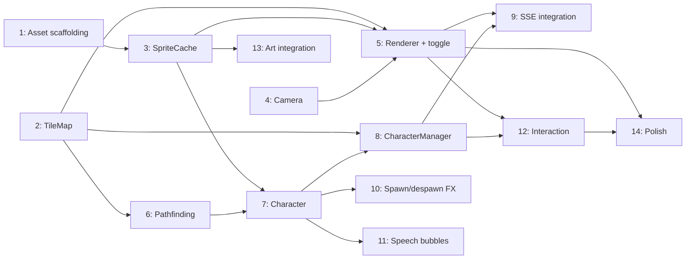

# Plan: Pixel Agent Avatars

**Status:** Draft
**Date:** 2026-03-29
**Last reviewed:** 2026-03-29

---

## Problem Statement

Wallfacer's task board is functional but visually static. Tasks are cards in columns — effective for status tracking, but lacking personality and ambient awareness. When multiple tasks are running in parallel, the board conveys state through text labels and color badges but offers no spatial, animated representation of what the agents are actually doing.

[Pixel Agents](https://github.com/pablodelucca/pixel-agents) demonstrates that representing AI agents as pixel art characters in a virtual office creates an engaging, glanceable overview of agent activity. The concept maps naturally onto Wallfacer: each task is an agent, each agent gets a character, and the office becomes a live visualization of the task board.

## Goal

Add an optional pixel art office view to the Wallfacer web UI. Each active task is represented by an animated character that visually reflects the task's lifecycle state. The office view complements (does not replace) the existing card-based board.

**What ships:**
- A toggleable office view rendered on a `<canvas>` element alongside the existing board
- Pixel art characters assigned to tasks, with animations mapped to task states
- An auto-generated office layout that scales with the number of tasks
- Speech bubbles and visual indicators for actionable states (waiting, failed)
- Spawn/despawn effects when tasks are created or completed
- Click-to-select interaction linking characters back to their task cards

## Design

### View Architecture

The office is a **secondary view mode**, toggled via a button in the board header. Two modes:

1. **Board view** (default) — existing card columns, unchanged.
2. **Office view** — canvas-based pixel art scene. The board SSE stream (`/api/tasks/stream`) drives both views identically.

Both views stay mounted in the DOM; toggling swaps `display: none`. This keeps SSE state synchronized without reconnection.

### Character System

#### Sprites

Characters are 16×16 pixel top-down sprites (matching the LimeZu tileset grid), rendered at integer zoom (3× or 4× depending on viewport). Each character sheet is **896×656 px** (56×41 frames at 16×16). The full animation layout is documented in the pack's `Spritesheet_animations_GUIDE.png`. Key animation sets used:

| Animation | Sheet rows | Frames | Trigger |
|-----------|-----------|--------|---------|
| **idle** | 0 | 1 per dir | Task is `backlog` or `done` |
| **walk** | 1–2 | 6 per dir | Character moving between tiles |
| **sit** | 3 | varies | Transition to desk |
| **sitting idle** | 5–6 | varies | Seated at desk (passive) |
| **typing** | 7–10 | varies | Task is `in_progress` (agent executing) |

20 pre-made character sheets (`char_00.png` – `char_19.png`) ship with Wallfacer, copied from the Modern Interiors Premade Characters. Each task is assigned a character deterministically from the task UUID as a seed.

#### State Machine

Each character runs a simple state machine driven by its task's status:

```
                    ┌──────────────┐
                    │   SPAWN      │  matrix effect reveal
                    └──────┬───────┘
                           │
                    ┌──────▼───────┐
        ┌───────── │   WALK_TO    │ ◄──── task goes in_progress
        │          │   DESK       │       (pathfind to assigned seat)
        │          └──────┬───────┘
        │                 │ arrived
        │          ┌──────▼───────┐
        │          │   WORKING    │  typing/reading animation
        │          │              │  seated at desk, PC "on"
        │          └──┬───┬───┬──┘
        │             │   │   │
        │   waiting ──┘   │   └── done/cancelled
        │                 │
        │   ┌─────────────▼──────┐
        │   │   SPEECH_BUBBLE    │  "..." bubble (waiting)
        │   │                    │  "!" bubble (failed)
        │   └────────┬───────────┘
        │            │ feedback received / resumed
        │            │
        │   ┌────────▼───────────┐
        │   │   WALK_TO_DESK     │  resume working
        │   └────────────────────┘
        │
        │          ┌─────────────┐
        └────────► │   IDLE      │  backlog / done / cancelled
                   │   WANDER    │  stand, wander randomly
                   └──────┬──────┘
                          │ task archived or deleted
                   ┌──────▼──────┐
                   │   DESPAWN   │  matrix effect dissolve
                   └─────────────┘
```

State mapping from task status:

| Task Status | Character State | Visual |
|-------------|----------------|--------|
| `backlog` | IDLE / WANDER | Standing near desk, occasional wandering |
| `in_progress` | WORKING | Seated, typing animation, PC screen on |
| `committing` | WORKING | Seated, typing (slightly different: papers on desk) |
| `waiting` | SPEECH_BUBBLE | Seated, amber "..." bubble floating above |
| `failed` | SPEECH_BUBBLE | Standing, red "!" bubble |
| `done` | IDLE | Standing, brief celebration animation, then wander |
| `cancelled` | DESPAWN | Matrix dissolve effect |

#### Speech Bubbles

Small pixel art overlays (11×13 px) floating above the character head:

- **Waiting bubble** (amber "..."): task needs user feedback. Clicking the bubble opens the feedback modal.
- **Failed bubble** (red "!"): task failed. Clicking opens the task detail.
- **Committing bubble** (green spinning): commit pipeline running.

Bubbles follow the character's position with a vertical offset.

### Office Layout

#### Tile Grid

The office is a tile-based grid (16×16 px per tile at 1× zoom). Layout is auto-generated based on the number of tasks:

- **Desk cluster**: each task gets one desk + chair + PC. Desks are arranged in rows of 2–4, facing each other (open office style).
- **Common area**: a small lounge area (sofa, plant, coffee machine) where idle/done characters wander.
- **Walls and floor**: simple border walls, tiled floor with slight color variation.

The grid grows dynamically: when tasks are added, new desk clusters are appended. When tasks are removed, empty desks stay (furniture doesn't vanish).

Layout algorithm:
1. Compute `N = max(active_tasks, 6)` (minimum 6 desks for visual balance).
2. Arrange desks in rows of 4 (2 facing 2), with aisle gaps.
3. Place common area at the bottom or right side.
4. Walls auto-generated around the bounding rectangle.

#### Furniture Catalog

All furniture is sliced from `furniture/office_sheet.png` (256×848, 16px grid) at runtime. The `SpriteCache` defines pixel regions for each item type.

| Item | Size (tiles) | States |
|------|-------------|--------|
| Desk | 2×1 | — |
| Chair | 1×1 | — |
| PC/Monitor | 1×1 | off, on (2-frame animation) |
| Sofa | 2×1 | — |
| Plant | 1×1 | — |
| Coffee machine | 1×1 | — |
| Whiteboard | 2×1 | — |
| Bookshelf | 1×1 | — |

### Rendering Pipeline

Canvas 2D with `requestAnimationFrame`. Pipeline per frame:

1. **Clear** canvas.
2. **Draw floor tiles** (static, cached to offscreen canvas).
3. **Collect drawables** — furniture + characters into a `ZDrawable[]`.
4. **Z-sort** by Y coordinate (bottom edge) for correct depth occlusion.
5. **Draw each drawable** — sprites rendered from cached offscreen canvases.
6. **Draw overlays** — speech bubbles, selection outlines, name labels.
7. **Draw UI layer** — minimap (if office is larger than viewport), zoom controls.

Performance targets:
- 60 FPS with ≤30 characters on screen
- Sprite caching at current zoom level; invalidate on zoom change
- `imageSmoothingEnabled = false` for crisp pixel art
- Floor/wall layer cached as a single offscreen canvas, redrawn only on layout change

### Pathfinding

BFS on 4-connected grid (no diagonals). Walls, furniture, and occupied chairs are impassable. Each character's own chair is always passable for that character.

Walk speed: ~2 tiles/second. Linear interpolation between tile centers for smooth movement.

### Interaction

All input uses `PointerEvent` to unify mouse and touch. Minimum 3× zoom enforced on touch devices (48×48 CSS px per sprite ≥ 44×44 tap target).

| Action | Desktop | Touch | Effect |
|--------|---------|-------|--------|
| Select character | Click | Tap | Highlight with white outline; show task title |
| Open task detail | Double-click | Double-tap | Open task detail/modal |
| Activate bubble | Click bubble | Tap bubble | Feedback modal (waiting) or task detail (failed) |
| Zoom | Scroll wheel | Pinch | Zoom in/out (2×–6×) |
| Pan | Click + drag | Single-finger drag | Pan the office view |
| Tooltip | Hover | Long-press | Show task title + status |

No character dragging or seat reassignment — desk assignments are automatic and deterministic (by task creation order).

### Spawn / Despawn Effects

**Spawn** (task created): Matrix-style digital rain reveal. Bright green pixels sweep top-to-bottom across the character sprite over ~0.5s, revealing the character underneath.

**Despawn** (task archived/deleted): Reverse matrix effect. Green sweep consumes the character sprite over ~0.5s, leaving fading trails.

### SSE Integration

The office view subscribes to the same `/api/tasks/stream` SSE endpoint as the board. On each task list update:

1. Diff current characters against new task list.
2. Spawn new characters for new tasks.
3. Update character states for changed task statuses.
4. Despawn characters for removed/archived tasks.

No new backend endpoints required. The existing SSE stream provides all necessary data.

### Art Assets — LimeZu Modern Series

The office view uses the [LimeZu](https://limezu.itch.io/) pixel art packs, chosen for their office-native aesthetic and built-in character generator:

| Pack | Price | What it provides |
|------|-------|-----------------|
| [Modern Office Revamped](https://limezu.itch.io/modernoffice) | $2.50 | Desks, chairs, PCs, monitors, whiteboards, bookshelves. 300+ sprites in 16/32/48px. |
| [Modern Interiors](https://limezu.itch.io/moderninteriors) | ~$5–10 | Walls, floors, carpets, 100+ animated objects. **Character Generator**: 9 skin tones, 29 hairstyles, 15 accessories with walk animations. |
| [Modern Exteriors](https://limezu.itch.io/modernexteriors) (optional) | $2.50 | Buildings, streets, trees — only if an exterior view is desired later. |

**Total cost: ~$10–15.**

**License**: Commercial and non-commercial use allowed. Credits required (added to Wallfacer's About/credits page). Assets cannot be redistributed standalone. This means:

- **Sprite PNGs are `.gitignore`d** — they are not committed to the open-source repo.
- A `ui/assets/office/README.md` documents which packs to purchase and where to place them.
- A build-time check warns if assets are missing and disables the office view gracefully (toggle button hidden).
- Contributors who want to work on the office view buy the packs (~$10 total).

#### Asset Directory Structure

```
ui/assets/office/              # .gitignored
├── README.md                  # purchase links and placement instructions (committed)
├── characters/
│   ├── char_00.png            # 896×656 premade character sheet (from Modern Interiors)
│   ├── ...
│   └── char_19.png            # 20 premade characters
├── furniture/
│   ├── office_sheet.png       # 256×848 full furniture sheet (Modern_Office_16x16.png)
│   └── room_builder.png       # Room builder sheet from Modern Office
├── tiles/
│   ├── floor.png              # 240×640 floor tile set (Room_Builder_Floors_16x16.png)
│   └── wall.png               # 512×640 wall auto-tile set (Room_Builder_Walls_16x16.png)
└── effects/
    └── bubbles.png            # custom speech bubble sprites (hand-drawn, committed)
```

All sprites are full sheets loaded at startup via `Image()` and sliced into frames at runtime by the `SpriteCache` using pixel coordinates. No extraction of individual PNGs needed — the renderer reads directly from sheets. No build step required — raw PNGs served from the embedded filesystem. The `bubbles.png` and `README.md` are small enough to be committed directly.

## Implementation Phases

### Phase 1 — Rendering Foundation

Build the canvas rendering pipeline and tile grid system.

- Add office view toggle button to board header (swap between board/office)
- Implement `OfficeRenderer` class: canvas setup, game loop, floor/wall drawing
- Implement `TileMap` class: grid data structure, tile types, collision map
- Implement sprite loading and caching (`SpriteCache`)
- Auto-layout algorithm: desk placement, common area generation
- Zoom and pan controls
- **Placeholder sprites**: use colored rectangles until real art is ready

**Files:**
- `ui/js/office/renderer.js` — Canvas game loop and draw pipeline
- `ui/js/office/tileMap.js` — Grid, tile types, layout generation
- `ui/js/office/spriteCache.js` — Sprite loading, slicing, zoom-level caching
- `ui/js/office/camera.js` — Viewport pan/zoom
- `ui/js/office/office.js` — Top-level module, view toggle integration
- `ui/index.html` — Add canvas element and toggle button

### Phase 2 — Character System

Implement character state machine, animations, and pathfinding.

- `Character` class: state machine, animation controller, position
- `CharacterManager`: create/destroy characters, sync with task list
- Animation controller: frame timing, directional sprite selection
- BFS pathfinding on tile grid
- Walk movement with linear interpolation
- Character Z-sorting in render pipeline

**Files:**
- `ui/js/office/character.js` — Character state machine and animation
- `ui/js/office/characterManager.js` — Character lifecycle, task-to-character mapping
- `ui/js/office/pathfinding.js` — BFS pathfinder
- `ui/js/office/renderer.js` — Update to include character drawing and Z-sort

### Phase 3 — Task State Integration

Connect characters to live task state via SSE.

- Subscribe office view to `/api/tasks/stream`
- Map task status changes to character state transitions
- Spawn effect for new tasks
- Despawn effect for archived/deleted tasks
- Speech bubbles: waiting (amber), failed (red), committing (green)
- PC monitor on/off state linked to character working state

**Files:**
- `ui/js/office/characterManager.js` — SSE integration, state sync
- `ui/js/office/effects.js` — Matrix spawn/despawn effect
- `ui/js/office/bubbles.js` — Speech bubble rendering and state

### Phase 4 — Interaction

Click, hover, and keyboard interactions.

- Character selection (click → white outline)
- Double-click → open task detail
- Speech bubble click → feedback modal or task detail
- Hover tooltip with task title and status
- Keyboard: Escape to deselect, Tab to cycle characters

**Files:**
- `ui/js/office/interaction.js` — Hit testing, click/hover handlers
- `ui/js/office/renderer.js` — Selection outline rendering

### Phase 5 — Art Integration (LimeZu Packs)

Replace placeholder sprites with LimeZu art assets.

- ~~Purchase~~ **Done**: Modern Office ($2.50) and Modern Interiors (~$5–10) purchased
- ~~Extract assets~~ **Done**: Full sprite sheets placed (not individual PNGs):
  - `characters/char_00.png` – `char_19.png` — 20 premade character sheets (896×656 each)
  - `furniture/office_sheet.png` — Full furniture sheet (256×848)
  - `furniture/room_builder.png` — Office room builder walls
  - `tiles/floor.png` — Floor tile set (240×640)
  - `tiles/wall.png` — Wall auto-tile set (512×640)
- Define sprite slicing coordinates in `SpriteCache` for each sheet (character animations by row, furniture items by pixel region, tile variants by column group)
- Hand-draw speech bubble sprites (11×13 px) — small enough to create custom and commit directly
- ~~Write README~~ **Done**: `ui/assets/office/README.md` documents setup
- ~~Add .gitignore~~ **Done**: Office asset exclusions in place
- Add build-time asset detection: if sprites are missing, hide the office view toggle gracefully

**Files:**
- `ui/assets/office/` — Full sprite sheets (.gitignored)
- `ui/assets/office/README.md` — Setup instructions (committed)
- `ui/assets/office/effects/bubbles.png` — Custom speech bubbles (committed)
- `ui/js/office/spriteCache.js` — Update slicing coordinates for LimeZu sprite layouts

### Phase 6 — Polish and Persistence

- Remember view mode preference in `localStorage`
- Minimap for large offices (>20 tasks)
- Smooth camera follow when selecting a character
- Performance optimization: dirty-rect rendering, offscreen layer compositing
- Accessibility: `aria-label` on canvas, screen reader description of office state

**Files:**
- `ui/js/office/minimap.js` — Minimap overlay
- `ui/js/office/office.js` — Preference persistence, a11y

## Open Questions (resolve before implementing)

1. ~~**Sprite art source**~~: **Resolved** — LimeZu Modern Office + Modern Interiors. ~$10–15 total. Assets .gitignored; README documents purchase. See "Art Assets" section above.

2. ~~**Mobile/small screens**~~: **Resolved** — Support mobile natively. Use `PointerEvent` (unifies mouse+touch) from the start. Pinch-to-zoom, single-finger pan, tap-to-select, double-tap for detail, long-press for tooltip. Enforce minimum 3× zoom on touch devices (48×48 CSS pixels per sprite meets the 44×44 minimum tap target). Minimap (Phase 6) becomes more useful on small screens. No separate rendering mode needed — canvas is resolution-independent.

3. ~~**Task-to-desk persistence**~~: **Resolved** — Stable via `localStorage`. Desk assignments saved as `{taskId: deskIndex}` and restored on page load. Deleting a task leaves its desk empty (no shuffling). Stale entries pruned on load (any taskId not in current task list). Falls back to deterministic assignment (sorted by creation time) when localStorage is empty.

4. ~~**Sound**~~: **Resolved** — No sound. Out of scope.

5. ~~**Desktop app integration**~~: **Resolved** — Not a concern. Canvas 2D is standard in WKWebView/WebView2. No special handling needed.

## Files Touched Summary

| File | Change Type | Phase |
|------|------------|-------|
| `ui/index.html` | Modify | 1 |
| `ui/js/office/renderer.js` | New | 1, 2, 4 |
| `ui/js/office/tileMap.js` | New | 1 |
| `ui/js/office/spriteCache.js` | New | 1, 5 |
| `ui/js/office/camera.js` | New | 1 |
| `ui/js/office/office.js` | New | 1, 6 |
| `ui/js/office/character.js` | New | 2 |
| `ui/js/office/characterManager.js` | New | 2, 3 |
| `ui/js/office/pathfinding.js` | New | 2 |
| `ui/js/office/effects.js` | New | 3 |
| `ui/js/office/bubbles.js` | New | 3 |
| `ui/js/office/interaction.js` | New | 4 |
| `ui/js/office/minimap.js` | New | 6 |
| `ui/assets/office/**` | Done (.gitignored, sheets placed) | 1, 5 |
| `ui/assets/office/README.md` | Done (committed) | 1 |
| `ui/assets/office/effects/bubbles.png` | New (committed) | 5 |
| `.gitignore` | Done | 1 |

## What This Does NOT Require

- **No backend changes**: The office view is purely frontend. It consumes the existing SSE task stream.
- **No new API endpoints**: All data needed (task list, status, events) is already available.
- **No database changes**: Character state is ephemeral (in-memory JS), desk layout is computed.
- **No build toolchain**: Sprites are static PNGs served from the embedded FS. JS is vanilla (no bundler).
- **No replacement of the board view**: The office is an optional secondary view. The board remains the default and primary interface.

## Task Breakdown

| # | Task | Depends on | Effort | Status |
|---|------|-----------|--------|--------|
| 1 | [Asset scaffolding](pixel-agents/task-01-asset-scaffolding.md) | — | Small | Done |
| 2 | [TileMap and layout algorithm](pixel-agents/task-02-tilemap-and-layout.md) | — | Medium | Done |
| 3 | [SpriteCache with placeholders](pixel-agents/task-03-sprite-cache.md) | 1 | Medium | Done |
| 4 | [Camera](pixel-agents/task-04-camera.md) | — | Small | Done |
| 5 | [Renderer and view toggle](pixel-agents/task-05-renderer-and-view-toggle.md) | 2, 3, 4 | Large | Done |
| 6 | [Pathfinding](pixel-agents/task-06-pathfinding.md) | 2 | Small | Done |
| 7 | [Character state machine and animation](pixel-agents/task-07-character-state-machine.md) | 3, 6 | Medium | Done |
| 8 | [CharacterManager and desk persistence](pixel-agents/task-08-character-manager.md) | 2, 7 | Medium | Done |
| 9 | [SSE task state integration](pixel-agents/task-09-sse-integration.md) | 5, 8 | Medium | Done |
| 10 | [Spawn and despawn effects](pixel-agents/task-10-spawn-despawn-effects.md) | 7 | Small | Done |
| 11 | [Speech bubbles](pixel-agents/task-11-speech-bubbles.md) | 7 | Small | Done |
| 12 | [Interaction and modal integration](pixel-agents/task-12-interaction.md) | 5, 8 | Medium | Todo |
| 13 | [Art integration and asset detection](pixel-agents/task-13-art-integration.md) | 3 | Medium | Todo |
| 14 | [Polish: preferences, minimap, a11y](pixel-agents/task-14-polish.md) | 5, 12 | Medium | Todo |


