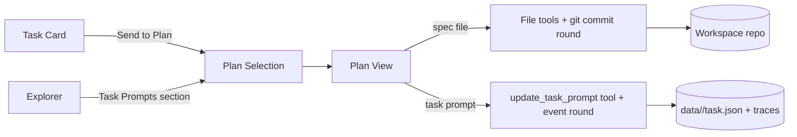
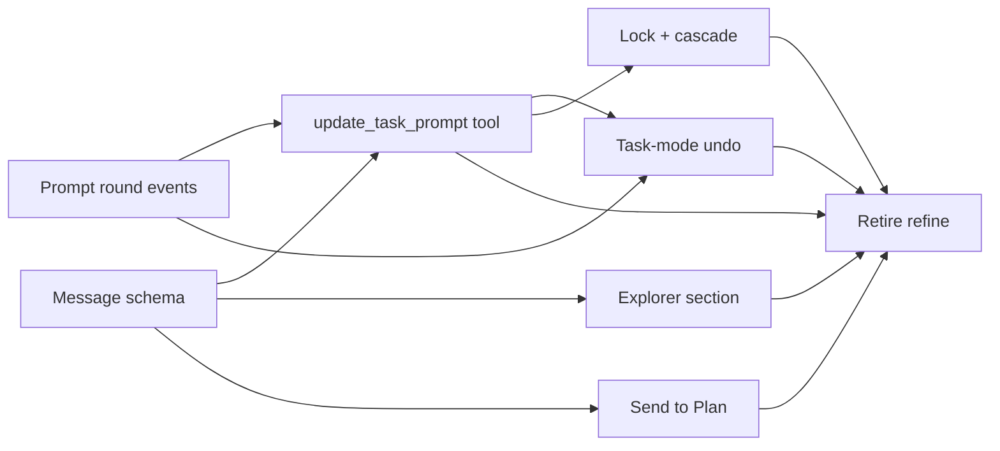

# Unify Refinement Into Plan Mode

## Overview

The task board currently ships two overlapping ways to reshape a task prompt: the one-shot "Refine with AI" modal on a task card, and Plan mode (a multi-turn chat over the workspace repo). The modal duplicates Plan's capabilities with a weaker UX, and the `autorefine` toggle is a narrow automation of the same thing. This spec retires the bespoke refinement subsystem and lets Plan mode edit task prompts directly. Task prompts surface in the explorer as virtual entries alongside spec files; selecting one routes Plan's chat to edit `task.Prompt` through a task-aware tool layer, with rounds captured as task events rather than git commits.

## Current State

Refinement today is a parallel pipeline mounted at `internal/handler/refine.go` and `internal/runner/refine.go`. The `refinement.tmpl` prompt feeds a one-shot sandbox agent that returns a refined prompt string; the UI is a modal in `ui/js/refine.js` driven by four endpoints (`POST/DELETE /api/tasks/{id}/refine`, `/refine/apply`, `/refine/dismiss`) plus an SSE log stream. The `autorefine` toggle in `ui/js/state.js` flips the pipeline on for every new task.

Plan mode lives in `internal/handler/planning.go` and its neighbours (`planning_threads.go`, `planning_git.go`, `planning_undo.go`). Messages carry a `focused_spec` string so the agent knows which file the user is looking at. Rounds commit to the workspace repo with `Plan-Round: N` and `Plan-Thread: <id>` trailers; undo is a forward revert commit matching those trailers. The sandbox mounts the workspace read/write, and the agent uses its standard file-edit tools. There is no concept of a selected entity apart from the per-message `focused_spec` path.

The workspace explorer (`internal/handler/explorer.go`, `ui/js/explorer.js`) only lists real files under workspace roots. The spec explorer (`ui/js/spec-explorer.js`) renders a parallel tree built by `spec.BuildTree()` from `/api/specs/tree`. Neither explorer has a virtual-entry concept.

Task records live at `data/<uuid>/task.json` with events appended to `data/<uuid>/traces/` via `store.InsertEvent`. `task.Prompt` is a plain string field; `PATCH /api/tasks/{id}` rewrites it and fires a `system` event.

## Architecture

Plan mode becomes the single home for prompt reshaping. The addition is a second kind of "thing Plan can edit": a task prompt, addressed by task UUID, persisted in the existing task record, versioned by task events.

The split is internal to Plan. The user sees one chat pane, one round model, one undo button. The header makes the current target explicit (`Spec · <path>` vs `Task Prompt · <title> (<status>)`), and the backend branches on the selection kind when committing a round and when undoing one.

Refinement as a separate subsystem is removed. Task cards lose the Refine button and gain a "Send to Plan" action that opens Plan with the card selected. Automatic refinement is removed entirely (no `autorefine` toggle, no replacement in this spec); the user will rethink and reintroduce it in a later spec once the interactive flow has settled.

## Components

### Task prompt as a Plan selection target

Plan's message schema gains a `focused_task` field peer to `focused_spec`. Exactly one of the two is non-empty per message. `focused_task` carries the task UUID. `internal/handler/planning.go::SendPlanningMessage` validates that at most one is set, resolves the task (or returns 404), and passes the target through to the sandbox agent as part of the system prompt context.

`internal/planner/conversation.go::Message` grows a `FocusedTask string` field alongside the existing `FocusedSpec`. `session.json::SessionInfo` likewise: threads can be "file-mode" or "task-mode" for their lifetime, fixed on first round. Switching targets within a thread is rejected; the user opens a new thread (threads are cheap since `planning-chat-threads` shipped).

### Task-aware agent tool

The planning sandbox gains one new tool surface: `update_task_prompt`. The tool takes `{task_id, prompt}` and calls the server's internal task update path (same write used by `PATCH /api/tasks/{id}`). On success the server appends a `prompt_round` event (new event type) to `data/<uuid>/traces/` carrying `{thread_id, round, prev_prompt, new_prompt}` so the full history is recoverable.

Exposure: the sandbox already has an HTTP bridge back to the server for other actions (see how planning currently reaches git and the spec tree); this tool is registered through the same bridge. File-edit tools remain available to the agent only when the selection is a spec file; they are stripped from the tool manifest for task-mode threads.

`internal/runner/refine.go::buildRefinementPrompt` supplies the prose that today frames the refinement task. That content moves into the system prompt for task-mode planning threads so the agent knows its job is reshaping a prompt, not editing code. The `refinement.tmpl` template is kept under a new name and rendered into the planning system prompt rather than a standalone agent run.

### Round persistence and undo for task mode

Spec-mode rounds keep their existing git-backed model (`planning_git.go::commitPlanningRound`). Task-mode rounds are persisted via task events instead:

- On each `update_task_prompt` tool call the server appends a `prompt_round` event and updates `task.Prompt` atomically.
- Undo (`POST /api/planning/undo?thread=<id>`) branches on thread mode. For a task-mode thread it reads the last `prompt_round` event, restores `prev_prompt` onto `task.Prompt`, and appends a `prompt_round_revert` event so the audit trail stays linear (mirroring how git revert keeps the original commit visible).
- The existing `planRoundTrailer` / `planThreadTrailer` machinery in `planning_undo.go` stays untouched for spec-mode threads.

Undo depth is bounded by the task's event retention. Since task events today are kept for the task's lifetime, effective undo is unlimited within a task.

### Explorer: Task Prompts virtual section

The workspace explorer gains a top-level collapsible section labelled "Task Prompts", rendered alongside the existing workspace roots. Entries are virtual: they do not map to files on disk.

Server side, a new endpoint `GET /api/explorer/task-prompts` returns a list of `{task_id, title, status, updated_at}` for tasks whose status is in the displayed set. Default set: `backlog`. A UI toggle extends the set to include `waiting` (for re-refinement after a task pauses on user feedback). `failed` stays out by default; users who want to reshape a failed task's prompt cancel and recreate it. When `update_task_prompt` writes while the target task is in `waiting`, the event carries a `resume_hint` flag so the resume logic surfaces the prompt change to the user on the next action. The endpoint reuses the task store's existing list path with a status filter.

Client side, `ui/js/explorer.js` renders the new section above the workspace trees. Selecting an entry sets the Plan selection to the task (not to a file path) and opens Plan mode. The existing `ExplorerStream` SSE notifier fires on task list changes as well so the section stays live.

### Task card: Send to Plan action

`ui/js/tasks.js` (or wherever the card's action buttons live) gets a "Send to Plan" action replacing the Refine button. It is a convenience shortcut: create or reuse a task-mode thread for this task, set the selection, open Plan. No separate endpoint; the UI composes the existing thread-create and selection calls.

### Retirement of the old refinement subsystem

After the new surfaces land and ship for one release, the following are removed:

- `internal/handler/refine.go` and its four endpoints.
- `internal/runner/refine.go` and associated container launch path (the planning sandbox replaces it).
- `ui/js/refine.js` and the Refine modal partial.
- The `autorefine` config flag in `ui/js/state.js` and its persistence in env/config.
- The Refine button on task cards.
- The API-contract entries for `/api/tasks/{id}/refine*` in `internal/apicontract/routes.go`.

`internal/prompts/refinement.tmpl` is either deleted or renamed and repurposed as the system-prompt fragment for task-mode planning threads (see "Task-aware agent tool").

### Task movement lock during in-flight turns

While a task-mode Plan thread has an agent turn in flight for task T, T cannot transition. The auto-promoter skips T, and manual drag returns 409 with a pointer to wait for the turn or interrupt the thread. Between turns, T moves freely. If T leaves backlog between turns, the server auto-archives any open task-mode threads for T (same cascade as archive/delete) and the next `update_task_prompt` tool call on those threads hard-fails.

This mirrors the pre-spec refinement lock, which held for the duration of a refine run, without leaving tasks stranded behind idle threads.

### Thread cascade on task archive or delete

When a task is archived or soft-deleted, all task-mode threads pinned to it are auto-archived. The thread rows disappear from the tab bar but the `messages.jsonl` and `session.json` files are retained for the tombstone retention window so the transcript can still be inspected from the task timeline modal. Unarchiving the task unarchives its threads.

## Data Flow

Task-mode refine flow:

1. User clicks "Send to Plan" on a backlog card, or selects a Task Prompts entry in the explorer.
2. UI ensures a task-mode thread exists for that task (create if missing) and sets it active.
3. User types a message. Client posts `{message, focused_task: <uuid>, thread: <id>}` to `POST /api/planning/messages`.
4. Server validates, appends the user message to the thread's `messages.jsonl`, launches the planning sandbox with task-mode system prompt (including the refinement framing) and the `update_task_prompt` tool registered.
5. Agent reasons, optionally calls `update_task_prompt` one or more times. Each call: server writes `task.Prompt`, appends a `prompt_round` event, and streams the tool result back.
6. Agent finishes the turn. No git commit happens; the round is already durable via the event.
7. User clicks undo. `POST /api/planning/undo?thread=<id>` walks the thread's last `prompt_round` event, restores `prev_prompt`, appends `prompt_round_revert`. UI refreshes the card.

Spec-mode flow is unchanged.

## API Surface

**New:**
- `GET /api/explorer/task-prompts` — list task-prompt virtual entries for the explorer, filtered by status set. Query: `?status=backlog,waiting,failed` (default `backlog`). Returns `[{task_id, title, status, updated_at}]`.

**Modified:**
- `POST /api/planning/messages` body gains optional `focused_task` (UUID). Exactly one of `focused_spec` or `focused_task` must be set. 422 otherwise.
- `POST /api/planning/undo?thread=<id>` branches on thread mode: git revert for spec threads, event rewind for task threads. Response shape unchanged.
- `POST /api/planning/threads` body gains optional `focused_task` to pin a new thread to task mode at creation. Once set, the thread's mode is immutable.

**Retired** (after one release's deprecation window):
- `POST /api/tasks/{id}/refine`
- `DELETE /api/tasks/{id}/refine`
- `GET /api/tasks/{id}/refine/logs`
- `POST /api/tasks/{id}/refine/apply`
- `POST /api/tasks/{id}/refine/dismiss`
- `autorefine` field in `GET/PUT /api/config`.

**Event types:**
- New event type `prompt_round` with data `{thread_id, round, prev_prompt, new_prompt}`.
- New event type `prompt_round_revert` with data `{thread_id, reverted_round}`.

## Error Handling

- Planning message with both `focused_spec` and `focused_task` set: 422, no thread mutation.
- `focused_task` references a non-existent or soft-deleted task: 404.
- `update_task_prompt` tool call on a thread not in task mode: agent-visible tool error, no server-side write.
- `update_task_prompt` tool call after the task has left backlog (e.g. moved to in_progress during the session): tool returns an error; user is expected to cancel the task first. No silent overwrite.
- Undo on a task-mode thread with no `prompt_round` events yet: 409, same shape as git-revert with nothing to undo.
- Task deleted while a task-mode thread is open: thread stays but further messages return 410 Gone. User can archive the thread.

## Testing Strategy

**Unit (Go):**
- `internal/handler/planning_test.go`: message with `focused_task`, message with both fields (422), message with task UUID that does not exist (404), thread mode immutability.
- `internal/handler/planning_undo_test.go`: task-mode undo rewinds the last `prompt_round`, appends `prompt_round_revert`, restores `task.Prompt`; mode branching does not touch git for task threads.
- `internal/handler/explorer_task_prompts_test.go`: status filter, inclusion of backlog by default, exclusion of archived/tombstoned.
- `internal/store/events_test.go`: round-trip of `prompt_round` event shape.

**Integration (Go):**
- End-to-end task-mode round: create task, create thread with `focused_task`, simulate agent tool call, verify `task.Prompt` and event log.
- Undo path: two rounds, undo once, assert prompt is back to round-1 output and both `prompt_round_revert` events are present after a second undo.
- Retirement smoke: once the old endpoints are gated, calling them returns 410 with a migration pointer.

**Frontend (Vitest):**
- `ui/js/explorer.test.js`: Task Prompts section renders entries, selection calls the Plan selection API with `focused_task`.
- `ui/js/spec-mode.test.js`: header renders task-prompt breadcrumb when in task mode; file-edit tool affordances are hidden.
- Card button: "Send to Plan" click creates/reuses a task-mode thread.

**E2E:**
- The existing `scripts/e2e-lifecycle.sh` exercise is untouched. No new E2E script is required for this spec; manual verification plus the integration tests cover the new path.

## Migration Plan

1. Ship the task-mode planning surface, the explorer section, and the "Send to Plan" card action. Old refine UI and endpoints remain, annotated as deprecated in the API docs.
2. Keep the deprecation for one release so external callers (CLI scripts, anyone automating against the refine endpoints) can migrate.
3. Remove `internal/handler/refine.go`, `internal/runner/refine.go`, the modal, the autorefine toggle, and the routes. Drop the old prompt template or fold it into the planning system prompt.

## Task Breakdown

| Child spec | Depends on | Effort | Status |
|------------|-----------|--------|--------|
| [Message schema and task-mode threads](refinement-into-plan/message-schema-task-mode.md) | — | medium | validated |
| [Prompt round events](refinement-into-plan/prompt-round-events.md) | — | small | validated |
| [update_task_prompt tool and system prompt](refinement-into-plan/update-task-prompt-tool.md) | message-schema, prompt-round-events | medium | validated |
| [Task-mode undo via event rewind](refinement-into-plan/task-mode-undo.md) | update_task_prompt tool, prompt-round-events | medium | validated |
| [Explorer task prompts section](refinement-into-plan/explorer-task-prompts-section.md) | message-schema | medium | validated |
| [Send to Plan card action](refinement-into-plan/send-to-plan-card-action.md) | message-schema | small | validated |
| [Task movement lock and thread cascade](refinement-into-plan/task-lock-and-cascade.md) | update_task_prompt tool | medium | validated |
| [Retire the refine subsystem](refinement-into-plan/retire-refine-subsystem.md) | tool, undo, explorer, card, lock | medium | validated |

Parallelism: the first wave (message schema, prompt round events) is independent. The second wave (tool, explorer, card) can run in parallel once their upstreams land. Undo and lock join on the tool. Retirement is strictly last.

## Resolved Design Calls

The four open questions from the drafting round have been resolved:

1. **Task states shown in the Task Prompts section.** Default `backlog`. UI toggle extends to `waiting`. `failed` excluded. Writes against `waiting` tasks carry a `resume_hint` flag so the resume path surfaces the prompt change.
2. **Auto-refinement.** Removed entirely. No `autorefine` config flag, no headless pipeline. Reintroduction is deferred to a later spec.
3. **Thread cascade on archive or delete.** Task-mode threads auto-archive when their task is archived or soft-deleted. Files retained for the tombstone retention window. Unarchiving the task unarchives its threads.
4. **Mid-session task state change.** Task is locked during in-flight agent turns on a task-mode thread. Between turns, the task can move; if it leaves backlog, open task-mode threads for it auto-archive and their next tool call hard-fails.
