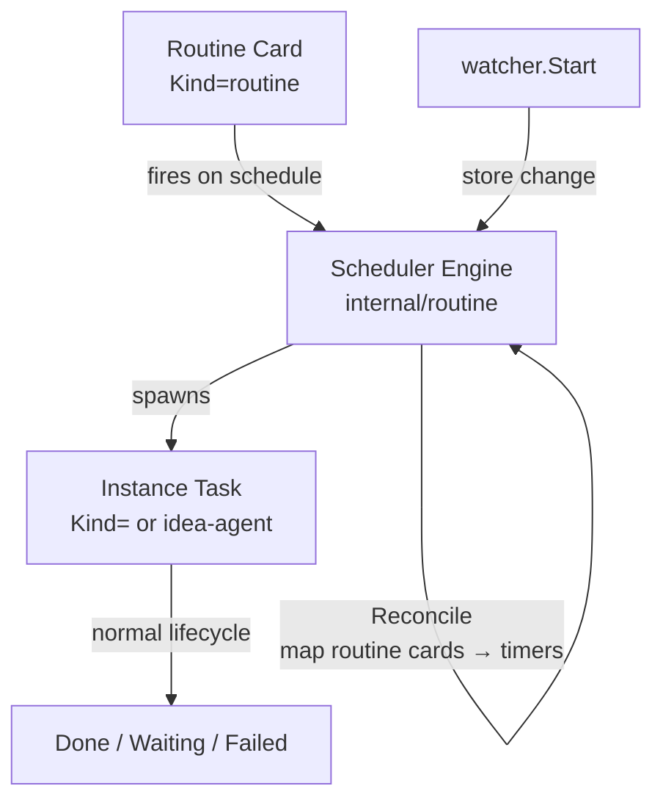

# Routine Tasks

## Overview

Promote the "scheduled cronjob" behavior currently hardcoded for the ideation
agent into a generic, user-facing primitive. A **routine** is a first-class
board card that, on a schedule the user defines, spawns a fresh instance task
to execute against the current workspace. Users create, enable/disable, and
edit the schedule of routines at any time from the board, just like any other
task. Ideation becomes one instance of this primitive rather than a singleton
with its own handler fields, settings panel, and API.

## Current State

Ideation scheduling lives in `internal/handler/ideate.go` as a singleton on
the `Handler` struct:

- `Handler.ideationEnabled`, `ideationInterval`, `ideationNextRun`,
  `ideationTimer`, `ideationMu`, `ideationExploitRatio` — global state.
- `StartIdeationWatcher(ctx)` subscribes via `internal/pkg/watcher.Start` to
  store change notifications. Each change invokes `maybeScheduleNextIdeation`,
  which checks whether any `TaskKindIdeaAgent` task is already active; if not,
  it calls `scheduleIdeation`.
- `scheduleIdeation` either creates the task immediately (interval == 0) or
  arms a single `time.AfterFunc` timer. Only one timer can be pending at a
  time.
- `createIdeaAgentTask` builds the idea-agent prompt via
  `runner.BuildIdeationPrompt`, creates a task with `Kind: TaskKindIdeaAgent`
  via `store.CreateTaskWithOptions`, immediately promotes it to
  `TaskStatusInProgress`, and calls `runner.RunBackground`.
- The UI in `ui/js/ideate.js` exposes a single enable toggle, a single
  interval selector, a "Trigger Now" button, and a next-run countdown. These
  call the singleton endpoints `GET/POST/DELETE /api/ideate` and the global
  `PUT /api/config` (`ideation`, `ideation_interval`, `ideation_next_run`,
  `ideation_exploit_ratio` keys).

Relevant existing primitives that the new abstraction can reuse:

- `store.TaskKind` already has `""`, `"idea-agent"`, `"planning"` — the
  extension point for a new kind.
- `store.Task.ScheduledAt *time.Time` (one-shot delayed auto-promote) is
  handled by `internal/handler/scheduled_promote.go` via a precise
  `time.AfterFunc`. This is the reference pattern for per-task timers.
- `internal/pkg/watcher` drives every autopilot loop (auto-promote,
  auto-retry, auto-test, auto-submit, auto-refine, ideation) the same way:
  `Init` callback on startup, `Action` callback on every store change.
- `store.CreateTaskWithOptions` accepts `Kind`, `Tags`, `ExecutionPrompt` —
  sufficient for both routine definitions and their spawned instances.

Only one ideation routine can ever exist, and no other cron-like behavior is
possible today without adding another set of handler fields, a new watcher
callback, and a new settings surface.

## Architecture

A routine is modeled as a **task with `Kind: TaskKindRoutine`**. The card is
a template — it never executes itself. Instead, a **scheduler engine** tracks
each routine card's next-run time and, when that time arrives, spawns a fresh
**instance task** (a normal `Kind: ""` task by default, or `Kind:
"idea-agent"` for the migrated ideation routine) and invokes the existing
runner to execute it. The routine card remains on the board and fires again
next cycle.



Why this shape:

- Reuses all existing task plumbing: CRUD endpoints, prompt editing, SSE,
  event trail, tags, search, diff, logs.
- "Modify anytime" is free — the user edits the routine card like any other
  task; the engine picks up schedule changes on the next store-change tick.
- No new store collection, no new filesystem layout, no new SSE channel, no
  new JS renderer scaffolding.
- Migration for ideation reduces to "materialize a routine card tagged
  `system:ideation` on first boot and point the legacy endpoints at it."

### Pinning routines outside the normal lifecycle

Routine cards are not executed by the runner and must not be promoted,
archived, or dependency-chained. They stay in `TaskStatusBacklog` for their
entire life and are filtered out of every autopilot path (`auto_promote`,
`scheduled_promote`, dep graph, archive-done, cancel cascade) by `Kind`
check. No new status value is introduced.

## Components

### `internal/routine/` — new package

`Engine` multiplexes one `*time.Timer` per registered routine ID, replacing
the singleton `ideationTimer` with a map. Shape:

```go
type Schedule interface {
    Next(now time.Time) time.Time // zero time ⇒ never fires
}

type FixedInterval struct{ D time.Duration }

type FireFunc func(ctx context.Context, routineID uuid.UUID)

type Engine struct {
    clock   Clock                 // injectable for tests
    fire    FireFunc              // invoked when a registered routine fires
    mu      sync.Mutex
    entries map[uuid.UUID]*entry  // one timer per routine
}

func (e *Engine) Reconcile(routines []store.Task)       // diff against registry
func (e *Engine) Register(id uuid.UUID, s Schedule)     // or updates
func (e *Engine) Unregister(id uuid.UUID)
func (e *Engine) Trigger(ctx context.Context, id uuid.UUID)
func (e *Engine) NextRuns() map[uuid.UUID]time.Time
```

`FixedInterval` is the only `Schedule` implementation for v1. `Schedule` as
an interface lets cron expressions slot in later without a data migration.

Tests (`engine_test.go`) use an injectable `Clock` and poll-with-timeout for
fire events (no `time.Sleep`-based timing, per the project's
`feedback_no_extend_timing` rule).

### `internal/store/models.go` — data model

New kind:

```go
TaskKindRoutine TaskKind = "routine"
```

New fields on `Task` (all `omitempty`; persisted in the existing per-task
JSON without migration):

| Field | Type | Purpose |
|---|---|---|
| `RoutineIntervalSeconds` | `int` | v1 schedule: fixed interval in seconds |
| `RoutineEnabled` | `bool` | Pause without deleting the routine |
| `RoutineNextRun` | `*time.Time` | Server-owned; set by engine |
| `RoutineLastFiredAt` | `*time.Time` | Server-owned; set by engine |
| `RoutineSpawnKind` | `TaskKind` | `""` by default; `"idea-agent"` for system ideation |

### `internal/store/tasks_update.go` — field writers

- `UpdateRoutineSchedule(ctx, id, intervalSeconds)`
- `UpdateRoutineEnabled(ctx, id, enabled)`
- `UpdateRoutineNextRun(ctx, id, t)`
- `UpdateRoutineLastFiredAt(ctx, id, t)`

Each follows the existing atomic write + event append pattern used by
`UpdateScheduledAt` and neighbors.

### `internal/handler/routines.go` — HTTP surface

Handlers:

- `ListRoutines` — wraps `ListTasks` filtered by `Kind == TaskKindRoutine`,
  enriches each entry with the engine's current `NextRun`.
- `CreateRoutine` — wraps `CreateTaskWithOptions` with `Kind: TaskKindRoutine`
  and the supplied schedule fields; auto-computes initial `RoutineNextRun`.
- `UpdateRoutineSchedule` — `PATCH /api/routines/{id}/schedule` body
  `{interval_minutes?, enabled?}`; persists via the store writers and calls
  `engine.Reconcile`.
- `TriggerRoutine` — `POST /api/routines/{id}/trigger`; fires the routine
  immediately, bypassing the schedule.
- `DeleteRoutine` is **not** a new endpoint; routine deletion reuses
  `DELETE /api/tasks/{id}`, which the engine observes via reconcile.

The handler installs an `Init`/`Action` callback on the shared watcher that
calls `engine.Reconcile(routineTasks)` so schedule edits propagate without a
bespoke notification channel.

### `internal/handler/ideate.go` — migration to bootstrap routine

On first boot (or whenever the `system:ideation`-tagged routine is missing):

1. Materialize a routine task with `Tags: ["system:ideation"]`,
   `RoutineSpawnKind: TaskKindIdeaAgent`, `RoutineIntervalSeconds` seeded
   from the existing `ideation_interval` config, `RoutineEnabled` seeded from
   `ideation`.
2. Remove `ideationTimer`, `ideationMu`, `ideationNextRun`,
   `scheduleIdeation`, `maybeScheduleNextIdeation`. The engine now owns this
   loop.
3. `createIdeaAgentTask` becomes the routine's fire func, wired through
   `RoutineSpawnKind`. The per-fire prompt is still built by
   `runner.BuildIdeationPrompt`.
4. `GET/POST/DELETE /api/ideate` become thin aliases: they locate the
   `system:ideation` routine and act on it (get status, trigger now, cancel
   active instance). This preserves the legacy UI until it migrates.
5. `internal/handler/config.go` treats the `ideation`, `ideation_interval`,
   `ideation_next_run`, and `ideation_exploit_ratio` config keys as views
   onto the `system:ideation` routine (read/write passthrough). No config
   file migration needed.

### UI (`ui/js/routines.js`, `ui/js/render.js`, `ui/js/ideate.js`)

- New routine card variant in the card renderer, branched on
  `task.kind === "routine"`. Shows: prompt, interval selector (minutes),
  enabled toggle, live next-run countdown, "Run now" button, spawn-kind
  indicator (generic vs idea-agent for the system routine).
- `ui/js/ideate.js` shrinks to a back-compat shim that reads/writes the
  system routine through the new `/api/routines` endpoints. The settings
  panel's ideation controls keep working until the migration ships in UI.

## Data Flow

**Creating a routine:**

```
User → POST /api/routines {prompt, interval_minutes, enabled, spawn_kind}
       → store.CreateTaskWithOptions(Kind=routine, RoutineInterval...)
       → watcher fires → engine.Reconcile → engine.Register(id, FixedInterval)
       → UI receives SSE /api/tasks/stream (routine card appears)
```

**Fire cycle:**

```
time.AfterFunc → engine.fire(ctx, id)
                 → store.UpdateRoutineLastFiredAt
                 → store.CreateTaskWithOptions(Kind=routine.SpawnKind,
                     Prompt=buildFor(routine), Tags+=["spawned-by:<id>"])
                 → runner.RunBackground(newTask.ID, ...)
                 → engine.Register(id, FixedInterval) — arms next cycle
```

**Editing the schedule:**

```
User → PATCH /api/routines/{id}/schedule {interval_minutes: 30}
       → store.UpdateRoutineSchedule
       → watcher fires → engine.Reconcile → engine.Register re-arms timer
                          with the new interval (resets countdown from now)
```

**Disable:**

```
User → PATCH /api/routines/{id}/schedule {enabled: false}
       → store.UpdateRoutineEnabled(false)
       → engine.Reconcile → engine.Unregister(id)
       → RoutineNextRun cleared
```

## API Surface

New routes registered in `internal/apicontract/routes.go` (regenerate
`ui/js/generated/routes.js` via `make api-contract`):

- `GET /api/routines` — list routine cards; each entry enriched with
  server-side `next_run_at`.
- `POST /api/routines` — create a routine. Body:
  `{prompt, goal?, interval_minutes, spawn_kind?, enabled?, timeout?}`.
- `PATCH /api/routines/{id}/schedule` — update schedule. Body:
  `{interval_minutes?, enabled?}`. Fields omitted are left unchanged.
- `POST /api/routines/{id}/trigger` — manual fire; spawns an instance task
  immediately and leaves the scheduled cycle intact.
- Deletion reuses `DELETE /api/tasks/{id}`.

Legacy aliases (unchanged contract; now thin wrappers):

- `GET /api/ideate` → reads the `system:ideation` routine.
- `POST /api/ideate` → triggers the `system:ideation` routine.
- `DELETE /api/ideate` → cancels the active idea-agent instance (not the
  routine).
- `ideation*` config keys on `GET/PUT /api/config` continue to work.

## Error Handling

- **Missing routine on fire**: if the routine card was deleted between the
  timer arming and firing, the engine skips and unregisters.
- **Spawn failure**: a failed `CreateTaskWithOptions` logs at `warn`, records
  `RoutineLastFiredAt` with the attempt time, and arms the next cycle
  normally. The routine is not disabled — transient errors should not stop
  the schedule silently.
- **Disabled routine**: engine never fires; `RoutineNextRun` stays cleared.
- **Interval == 0**: treated as "paused" rather than "fire continuously" to
  avoid foot-guns. Runtime validation rejects < 60 seconds on the API layer.
- **Clock skew**: the engine uses `time.AfterFunc` (monotonic clock) for
  firing; `RoutineNextRun` is wall-clock and displayed as a hint only.

## Testing Strategy

### Unit tests

- `internal/routine/engine_test.go` — fake clock (injected `Clock`
  interface):
  - Register → Next fires at expected tick.
  - Reschedule resets countdown; old timer does not fire.
  - Unregister stops pending timer.
  - Reconcile adds/removes/updates registry from a task list diff.
  - Disabled entries do not fire.
  - Concurrent Register/Unregister is race-free (exercise with `-race`).

- `internal/handler/routines_test.go` — wired against the in-memory store:
  - `POST /api/routines` creates a routine card with correct `Kind`, fields.
  - `PATCH /api/routines/{id}/schedule` updates fields and re-arms.
  - `POST /api/routines/{id}/trigger` immediately spawns an instance task
    with `RoutineSpawnKind`.
  - `DELETE /api/tasks/{id}` on a routine unregisters from the engine.

- `internal/handler/ideate_test.go` — existing ideation tests migrated to
  the new plumbing:
  - On first boot, a `system:ideation` routine materializes with the
    configured interval/enabled.
  - Config key writes propagate to the routine's fields.
  - Legacy `/api/ideate` endpoints continue to behave as before (trigger,
    cancel, status).

- `internal/store/tasks_update_test.go` — `UpdateRoutine*` writers succeed,
  reject unknown IDs, and preserve unrelated fields.

### Integration / end-to-end

- Script under `scripts/e2e-routine-spawn.sh` (or an extension to
  `e2e-lifecycle`):
  - Create a routine with `interval_minutes: 1`.
  - Poll `GET /api/tasks` until an instance task tagged with
    `spawned-by:<routine-id>` appears.
  - Assert the routine card's `routine_last_fired_at` updated.
  - `PATCH` the schedule, assert `routine_next_run` changes accordingly.
  - Disable, wait > interval, assert no new instance task spawns.

### Edge cases

- Deleting a routine card mid-fire (timer already firing): engine must not
  double-spawn or panic; use `Unregister`-then-reclaim pattern.
- Autopilot filters: verify `tryAutoPromote`, `scheduled_promote`, dep graph,
  archive-done, cancel cascade all ignore `TaskKindRoutine`.
- Migration idempotence: restart the server; assert only one
  `system:ideation` routine exists.
- Runtime workspace switch: engine re-reconciles from the new store; old
  registry is cleared.

---

**Follow-ups (out of scope for v1, separate specs):**

- Cron expressions / time-of-day schedules (implement `Schedule` variants).
- Max-concurrent-instances cap per routine.
- Pause-on-failure policy.
- Per-routine usage/cost aggregation in the analytics panel.
