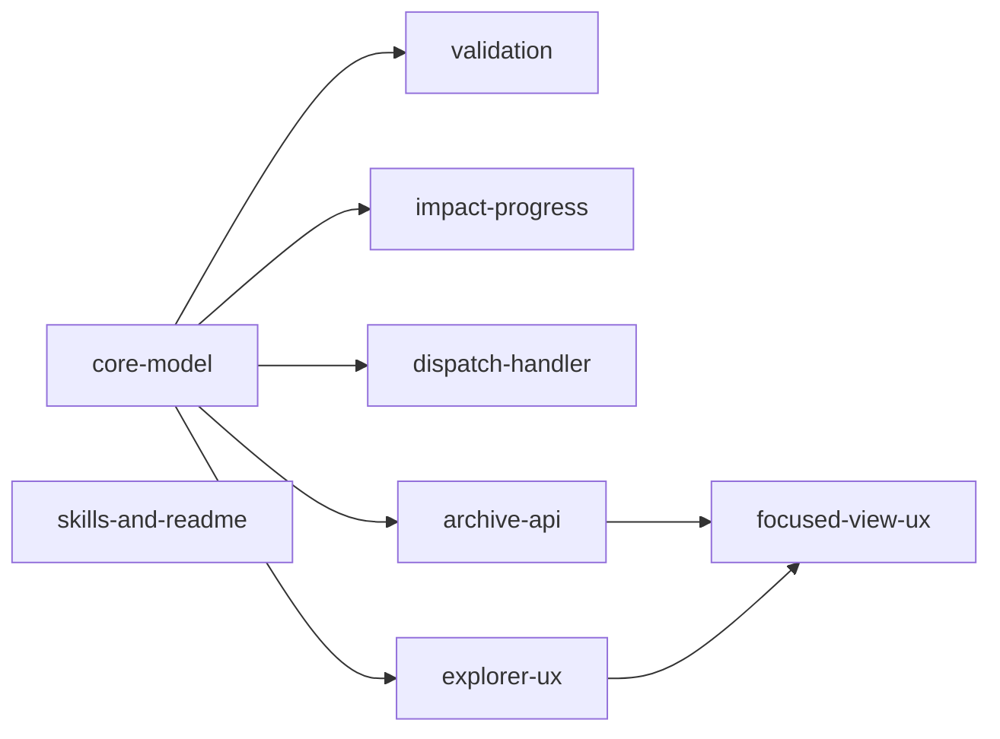

# Spec Archival

Extends [spec-document-model.md](spec-document-model.md) with a sixth status — `archived` — and updates the coordination subsystems (validation, impact, progress, drift, planning UX) to treat archived specs as "below glass": locked, hidden by default, and excluded from every propagation rule the live graph uses.

**Peer, not parent, of [spec-state-control-plane.md](spec-state-control-plane.md).** This spec does not `depends_on` drift detection: the interaction goes the other way — archival defines rules that the drift implementation must honour (skip archived specs, stop upward propagation at archived ancestors). Both specs extend the document model; the drift spec cross-references this one for the skip conditions, and that cross-reference is enough without a DAG edge. Shipping order between the two is free.

---

## Motivation

The current five-state lifecycle (`vague`, `drafted`, `validated`, `complete`, `stale`) cannot express *"this design is settled; stop surfacing it."*

- **`complete`** is a live terminal. Completed specs still count toward progress, still emit drift warnings when `affects` files change, and still appear in reverse-dependency queries. A long-running project accumulates dozens of complete specs that compete for attention in the explorer.
- **`stale`** actively asks for attention — it is a "please refine" signal, not a "please ignore" signal.
- **Neither** expresses the common case of *"we shipped this a quarter ago; I don't want to see it when I'm planning next quarter."*

Without a way to retire finished work from view, the spec explorer becomes visually noisy, progress counters dilute new work against shipped work, and drift checks waste cycles re-evaluating specs the user has consciously closed out. Deleting the spec is worse: we lose history and the `depends_on` edge semantics that explain *why* downstream work exists.

`archived` is the missing signal: **keep the document, sever its connection to the live coordination graph.**

---

## Semantics

An archived spec is:

| Property | Behaviour |
|---|---|
| **Read-only** | No edits from the chat agent. No refinement. No dispatch. The focused markdown view renders it with a banner and disables mutation actions. |
| **Hidden by default** | The spec explorer, dependency minimap, multi-select dispatch list, and status filter dropdown omit archived specs unless the user toggles "Show archived". |
| **Out of impact scope** | Excluded from reverse-dependency results, unblock queries, drift propagation (both directions), progress aggregation, and cross-spec stale-propagation warnings. |
| **Preserved** | The file, its frontmatter, its `depends_on` edges, and any prior `Outcome`/drift report remain on disk. Resurrection restores the spec to the live graph. |

Archival is **not** deletion, not soft-deletion, and not a new tombstone mechanism — it is a single frontmatter value. All existing file-level operations (git history, manual edits, moves) continue to work.

---

## Lifecycle Extension

A new `archived` value joins the status enum. Transitions (to add to the state-machine map in `internal/spec/lifecycle.go`):

```
  drafted ─┐
           │
  complete ┼──▶ archived ──▶ drafted   (resurrect)
           │
  stale   ─┘
```

| From | To `archived` | Rationale |
|---|:-:|---|
| `vague` | ✗ | Ideas this early should not need hiding; they can be edited or deleted instead |
| `drafted` | ✓ | Abandoned early drafts are a real case — archiving preserves the reasoning without forcing refinement |
| `validated` | ✗ | Actively-planned work: either close it out through `complete`/`stale`, or revert to `drafted` before archiving |
| `complete` | ✓ | Primary case — retire a finished spec from the live graph |
| `stale` | ✓ | Acknowledge without refining ("we know it drifted; we're not going to fix this one") |
| `archived` | ✗ | Only exit is via `drafted` |

Resurrection (`archived → drafted`) is the single inbound edge. The user can then drive the spec back up to `validated`/`complete` through the normal lifecycle. Resurrection does **not** automatically re-run drift checks — those are opt-in via `/wf-spec-refine` or the periodic scan.

The `vague → archived` and `validated → archived` prohibitions are soft defaults; if review finds them too strict, we can relax them without breaking anything else in the design.

---

## Validation Behaviour

Per-spec rules (see `spec-document-model/per-spec-validation.md`):

- **`body-not-empty` warning** is suppressed for archived specs — an archived idea with only frontmatter is legitimate.
- **`affects-paths-exist` warning** is suppressed — archived specs may reference paths that have since been moved or deleted, and that is not actionable.
- All **error-level** per-spec rules still apply (required fields, valid enum, date format, no self-dependency, dispatch consistency). Structural integrity has no exemptions.

Cross-spec rules (see `spec-document-model/cross-spec-validation.md`):

- **Status consistency** (complete non-leaf with incomplete leaves) is **skipped** when the non-leaf is archived. The subtree is considered "below glass" regardless of leaf states.
- **Stale propagation** (validated spec depending on stale spec) **does not fire** for archived dependencies. Archived is terminal for propagation.
- **`depends_on` target exists**: still validated. An edge pointing to a missing file is always an error.
- **New soft note** — *"dependency is archived"*: when a live spec's `depends_on` points to an archived spec, emit an informational note (not a warning, not an error) suggesting the user either remove the edge or document why it still matters. Keeps graphs clean over time without forcing churn.
- **DAG acyclic** and **unique dispatches**: unchanged — structural rules apply to every spec.

---

## Impact Analysis

In `internal/spec/impact.go` (current functions: `Adjacency`, `ComputeImpact`, `UnblockedSpecs`, `allDepsComplete`):

- **`Adjacency(tree)`** builds the forward dependency map; when constructing it, skip archived specs as both sources (their `depends_on` edges contribute nothing) and targets (no entry is created for them). Effectively: archived specs are invisible to any reverse traversal built on top of this map.
- **`ComputeImpact(tree, specPath)`** on an archived spec returns an empty `Impact` (no direct, no transitive). Documented explicitly: archival is the signal that nothing further should compute from this spec.
- **`UnblockedSpecs(tree, completedPath)`** does not surface archived candidates. Archiving does **not** unblock downstream work — if you want to unblock, use `complete`.
- **`allDepsComplete`** helper: treat an archived dependency as already satisfied (same semantics as `complete`) so that live specs depending on an archived spec are not held back.
- Non-leaf impact expansion (a non-leaf's impact includes dependents of its leaves): an archived non-leaf prunes its entire subtree from this expansion.

The underlying principle: archival means "this node is not in the live graph." Any query that walks the graph treats archived nodes as absent.

---

## Progress Tracking

In `internal/spec/progress.go`:

- Archived **leaves** are excluded from both `done` and `total` in subtree counts. They vanish from aggregation rather than counting as done-but-archived — this matches the "below glass" model and keeps counters focused on live work.
- Archived **non-leaves** mask their entire subtree: ancestors aggregate nothing from an archived branch. Children may carry any status internally; once the parent is archived, none of them contribute upward.
- The explorer, focused-view children summary, and dependency minimap all read from the same aggregation; no separate UI plumbing needed.

Resurrection re-includes the spec in progress on the next read (aggregation is computed fresh, not stored).

---

## Drift Detection

Interactions with [spec-state-control-plane.md](spec-state-control-plane.md):

- **Periodic staleness scan** (`affects` vs `git log --since updated`) skips archived specs entirely.
- **Post-task drift check** — if a dispatched leaf lands in an archived subtree (which should not normally happen, since archived specs are not dispatchable, but guard against race conditions): drift is recorded on the leaf itself but does not propagate upward past the archived ancestor.
- **Upward propagation** from a drifted leaf stops at the first archived ancestor.
- **DAG forward propagation** (drifted dependency → dependent warning) skips archived dependencies. If an archived spec's `affects` file is touched, no downstream warning fires.

Net effect: archiving a spec immediately silences every drift channel that could surface it.

---

## Dispatch

In `internal/handler/specs_dispatch.go`:

- The existing `status == validated` check already excludes archived specs; this is now explicit in the error message ("spec status is `archived`, must be `validated` — unarchive first if you want to dispatch").
- When dispatching a batch with `depends_on` edges pointing to archived specs, treat the archived dependency as **already satisfied**: it contributes no `DependsOn` edge on the resulting board task. This matches the "below glass" semantics — the archived design is locked, so nothing downstream needs to wait on it.
- **Undispatch** on an archived spec is a no-op (there is no dispatched task to cancel). Manual frontmatter edits to set `dispatched_task_id` while archived are caught by per-spec validation.

---

## Spec Explorer UX

Extends [spec-planning-ux/spec-explorer.md](spec-planning-ux/spec-explorer.md):

- **Hidden by default**: archived specs are filtered out of the tree before rendering. The filter applies to the multi-select dispatch list and the dependency minimap as well.
- **"Show archived" toggle** — a new checkbox in the explorer header, persisted to `localStorage` (same pattern as "Show workspace files"). When enabled, archived specs render in a muted style: grey text, `0.6` opacity, and a small `archived` badge next to the status badge.
- **Auto-collapse on reveal**: when an archived parent is first made visible, its subtree is force-collapsed regardless of the user's prior open/closed state. Prevents clutter spikes when toggling the filter on.
- **Status filter dropdown**: a new `archived` option joins the existing list (`drafted`, `validated`, `stale`, `complete`, `incomplete`). The option is only functional when "Show archived" is on — otherwise it is visible but disabled with a tooltip.
- **Dependency minimap**: archived nodes, when visible, render with a dashed outline to signal "not in the live graph." Edges to/from archived nodes are dashed as well.

---

## Focused View & Chat Agent UX

Extends [spec-planning-ux.md](spec-planning-ux.md) and [spec-planning-ux/planning-chat-agent.md](spec-planning-ux/planning-chat-agent.md):

- **Read-only rendering**: opening an archived spec shows an inline banner at the top of the focused view:

  ```
  ⊘ Archived — read-only. This spec is hidden from the live graph
    and drift checks. [Unarchive] to resume editing.
  ```

  The dispatch button, refine action, and markdown edit affordance are hidden. The Outcome section and all historical content still render normally.

- **Chat agent guard rails**: the planning chat agent receives the archived status as part of the focused spec context. Its system prompt gains a rule: *never write to an archived spec*. If the user asks for modifications, the agent responds with a request for explicit unarchival first — it does not auto-unarchive. Example:

  > User: "Update the acceptance criteria in this spec."
  > Agent: "This spec is archived. Unarchive it first (button at the top of the view) and I'll resume."

- **Archive / Unarchive actions** appear in three places:
  1. Focused view toolbar (primary affordance).
  2. Spec explorer context menu (right-click on a spec).
  3. Chat commands: `archive` / `unarchive`, routed through the same skill used by other lifecycle transitions.

- **Non-leaf archival warning**: archiving a non-leaf pops a confirmation — *"Archiving will hide N descendant specs. Continue?"* — with a brief summary of how many leaves and children would be masked.

---

## Undo & Snapshots

Archival and unarchival are status transitions that should be undoable. Note: [spec-planning-ux/undo-snapshots.md](spec-planning-ux/undo-snapshots.md) covers planning-round snapshots (spec file writes during chat iterations) — not lifecycle state transitions — so there is no existing undo mechanism to hook into. This feature requires a separate lightweight undo entry for lifecycle transitions: each archive/unarchive is one undoable unit; multi-spec archival (via multi-select) is one round. The implementation should decide whether to extend the existing snapshot store or introduce a separate transition log.

---

## README Integration

`specs/README.md` is the human-readable roadmap index. Updates for archival:

- The top-level **Status Quo** diagram and per-track tables omit archived specs by default. An optional *"Show archived"* subsection at the bottom of each track lists them for reference, clearly labelled so they do not blur into active work.
- The **dependency graph** Mermaid diagrams omit archived nodes by default. Edges to/from archived nodes are removed from the rendered graph.
- Archived specs do not count toward a track's in-progress / complete progress totals.

If a CLI regeneration tool is later added (per the Open Question in `spec-planning-ux.md` about entry-point staleness), it should respect the same defaults: archived is hidden unless explicitly requested.

---

## Outcome

Archival is shipped end-to-end: a sixth `archived` lifecycle state lives in the
state machine, every read-side subsystem (validation, impact, progress,
dispatch, chat agent) treats archived specs as below-glass, and the focused
view + explorer UI let users archive/unarchive with a banner, cascading
subtree behaviour, and git-backed undo. The existing user has already
archived 8 completed top-level specs using the shipped UI.

### What Shipped

- **`internal/spec/`**: `StatusArchived` constant; four new state-machine
  edges (`drafted|complete|stale → archived`, `archived → drafted`);
  `ValidStatuses()` returns 6 values.
- **`internal/spec/validate.go`**: `body-not-empty` and `affects-exist` skip
  archived; `status-consistency` and `stale-propagation` skip archived
  non-leaves and archived sinks; new `checkArchivedDependencies` emits a
  `dependency-is-archived` advisory.
- **`internal/spec/impact.go`**: `Adjacency` prunes archived sources/sinks;
  `ComputeImpact` returns empty `Impact` for archived targets;
  `collectLeafPaths` prunes archived subtrees; `UnblockedSpecs` skips
  archived candidates; `allDepsComplete` counts archived deps as satisfied.
- **`internal/spec/progress.go`**: `NodeProgress` excludes archived leaves
  and masks archived subtrees.
- **`internal/handler/specs.go`**: two new HTTP endpoints —
  `POST /api/specs/archive` (cascades over the subtree, commits with subject
  `<path>: archive (1 + N descendants)`), `POST /api/specs/unarchive`
  (finds the archive commit via `git log --grep` and runs `git revert`;
  falls back to single-spec `archived → drafted` when no commit is found).
- **`internal/handler/specs_dispatch.go`**: archived specs rejected with
  "unarchive the spec first"; archived `depends_on` targets skipped (no
  blocker edge on the resulting board task).
- **`internal/handler/planning.go`**: `archivedSpecGuard()` prepends a
  "do not modify archived spec" instruction to the planning chat prompt
  when the focused spec is archived.
- **Frontend (`ui/js/spec-mode.js`, `ui/js/spec-explorer.js`,
  `ui/js/spec-minimap.js`, `ui/css/spec-mode.css` and partials)**:
  - Explorer: status icon (📦), `_showArchived` localStorage toggle,
    "Show archived" checkbox in the header, muted `spec-node--archived`
    rendering, force-collapse on reveal, `incomplete` filter excludes
    archived, `archived` option in the status filter dropdown.
  - Minimap: archived neighbours hidden unless opted in; archived nodes
    rendered with dashed outline; edges touching archived nodes dashed.
  - Focused view: archived banner, Archive/Unarchive toolbar buttons
    with lifecycle-aware visibility, non-leaf confirmation dialog,
    stacked bottom-right toasts with per-toast Undo + × close.
- **Skills & README**: `wf-spec-validate` and `wf-spec-status` list
  `archived` and document skip conditions; `specs/README.md` six-state
  lifecycle reference; `spec-document-model/*` subtree refreshed additively.

### Tests

- Backend: 128→136 `internal/spec/` tests (+8 archived: lifecycle,
  validation, impact, progress); new handler tests for
  `TestArchiveSpec_*`, `TestUnarchiveSpec_*`, `TestArchiveSpec_CascadeAndRevert`,
  `TestArchivedSpecGuard`, `TestDispatch_Archived*`.
- Frontend: new vitest suites `spec-mode-archive.test.js` (9 cases),
  `spec-archived-banner-css.test.js` (2 cases); archived-specific tests
  added to `spec-explorer.test.js` and `spec-minimap.test.js`.

### Design Evolution

1. **Unarchive via `git revert`, not `pre_archive_status` frontmatter field.**
   The spec left open how to restore pre-archive statuses after cascading
   archival. User proposal: since archive already commits, unarchive can
   locate that commit and revert it. Implemented in
   `internal/handler/specs.go` (commits `687ff93`, `9d7e566`): archive
   emits a commit with subject prefix `<path>: archive`; unarchive greps
   the log, runs `git revert --no-edit`, and falls back to single-spec
   `archived → drafted` when no matching commit exists (spec was archived
   by hand). Lossless, needs no extra frontmatter field.

2. **Cascading archive, non-cascading initial design.** The spec's
   Open Question #4 tentatively preferred non-cascading archival — hide
   descendants via below-glass masking, not by changing their status.
   User judged this counterintuitive: clicking Archive on a parent should
   archive the whole subtree visually AND in status. Archive now walks
   the companion directory and sets every descendant's status to
   `archived` in one commit; unarchive reverses the whole cascade.

3. **Archive/unarchive auto-commits to git.** The spec didn't require
   commits; dispatch and other frontmatter mutations don't commit. User
   pointed out that clicking Archive otherwise leaves the working tree
   dirty. `commitSpecChanges()` / `commitSpecTransition()` wrap every
   status write in a git add + commit (non-fatal on non-git workspaces).
   Commit `687ff93`.

4. **Chat agent guard lives in `internal/handler/planning.go`, not
   `internal/planner/spec.go`.** The spec listed `internal/planner/spec.go`
   as the affects path, but that file is the container-spec builder and
   has nothing to do with prompt assembly. Prompt assembly happens in
   the handler's `SendPlanningMessage`; `archivedSpecGuard()` prepends the
   read-only instruction there. Commit `9214aaf`.

5. **Stacking toast notifications.** The spec's "Undo" section prescribed
   a single dismissable toast. User wanted multiple archive actions to
   stack rather than overwrite each other, each with its own Undo + close.
   `_showArchiveToast()` now creates a new DOM element per call and
   appends to a fixed-position `.spec-archive-toasts` container. Commit
   `687ff93`.

6. **README auto-landing view had leaking affordances (bug fix).**
   When no spec is focused, `_showSpecReadme()` renders `specs/README.md`
   as the default content. It cleared the header metadata but not the
   new Archive/Unarchive buttons or archived banner, so stale UI state
   from a previously-focused archived spec "stuck" to the README view.
   Fix in commit `9798a96`; regression test in `04daf70`.

7. **Archived banner CSS specificity bug (bug fix).**
   `.spec-archived-banner { display: flex; }` had the same specificity as
   the global `.hidden { display: none; }` utility and loaded later — the
   utility class was effectively a no-op. Added a higher-specificity
   `.spec-archived-banner.hidden { display: none; }` override. Fix +
   regression test in commit `0c69faca`.

8. **Additional scope expansion (documentation).** Implementation touched
   two files not listed in `affects`: `ui/js/spec-minimap.js` (archived
   nodes + dashed edges, per spec item 8 of explorer-ux.md) and
   `ui/partials/spec-mode.html` + `ui/partials/explorer-panel.html`
   (banner, toolbar buttons, toast container, "Show archived" checkbox).
   Affects list updated in this wrap-up commit.

9. **Deferred items.** Open Question #2 (auto-archival on long inactivity),
   Open Question #3 (archived spec resurfacing via "see also"), the
   "spec explorer context menu" affordance (focused-view-ux.md item 4.2),
   and the "archive/unarchive chat slash commands" (item 4.3) are out of
   scope — the toolbar button + bulk-dispatch workflow cover the primary
   cases. Add as follow-ups if usage shows they're needed.

---

## Follow-up Work on Completed Specs

The completed `spec-document-model/*` subtree documents the 5-state enum inline. Once this spec is validated, those specs need refreshes (via `/wf-spec-refine`) to reflect the 6-state enum. Expected changes:

| Spec | Refresh required |
|---|---|
| `spec-document-model.md` | Lifecycle diagram (ASCII art, line ~143); enum comment on `status` in the example frontmatter (line ~31); lifecycle table (line ~151) |
| `spec-document-model/spec-lifecycle.md` | Transition map, test case enumeration, `ValidStatuses()` count |
| `spec-document-model/per-spec-validation.md` | `valid-status` rule enum list; tests for archived-specific skips |
| `spec-document-model/cross-spec-validation.md` | Status-consistency and stale-propagation skip conditions |
| `spec-document-model/impact-analysis.md` | Reverse-index and unblock skip conditions |
| `spec-document-model/progress-tracking.md` | Archived-leaf and archived-subtree skip rules |

Whether those refreshes demote the subtree to `stale` first (significant drift) or stay at `complete` with an updated `Outcome` section (minimal additive drift) is a call for the refiner, not this spec. The changes are additive — no existing behaviour is removed — so minimal drift is the expected classification.

---

## Acceptance Criteria

When this spec is later dispatched as an implementation task, the following must hold:

- `internal/spec/model.go` defines `StatusArchived`.
- `internal/spec/lifecycle.go` state machine accepts the new transitions (`drafted/complete/stale → archived`, `archived → drafted`) and rejects all others involving archived.
- Validation (`internal/spec/validate.go`) skips archived specs according to the rules in the **Validation Behaviour** section; unit tests cover each skip.
- Impact analysis (`internal/spec/impact.go`) returns empty impact for archived specs and prunes archived dependents from every query; unit tests cover reverse-index, `ComputeImpact`, and `UnblockedSpecs`.
- Progress tracking (`internal/spec/progress.go`) excludes archived leaves and archived subtrees from aggregation; unit tests cover both cases.
- Drift detection (future `internal/runner/drift.go`, per spec-state-control-plane.md) skips archived specs and stops upward propagation at archived ancestors. This acceptance criterion is jointly owned with spec-state-control-plane; it is satisfied when that spec ships.
- Dispatch handler refuses archival specs and treats archived `depends_on` targets as satisfied.
- Explorer UI has a "Show archived" toggle; archived specs are hidden by default and rendered muted when visible.
- Focused view renders archived specs read-only with an Unarchive action.
- Planning chat agent refuses to modify archived specs.
- `specs/README.md` updated to hide archived specs from the main tables and include a separate reference subsection.
- At least the `wf-spec-validate` and `wf-spec-status` skill descriptions (`.claude/skills/wf-spec-*/skill.md`) list `archived` as a valid status.

---

## Task Breakdown

| Child spec | Depends on | Effort | Status |
|---|---|---|---|
| [core-model.md](spec-archival/core-model.md) | — | small | complete |
| [validation.md](spec-archival/validation.md) | core-model | small | complete |
| [impact-progress.md](spec-archival/impact-progress.md) | core-model | small | complete |
| [dispatch-handler.md](spec-archival/dispatch-handler.md) | core-model | small | complete |
| [archive-api.md](spec-archival/archive-api.md) | core-model | small | complete |
| [explorer-ux.md](spec-archival/explorer-ux.md) | core-model | medium | complete |
| [focused-view-ux.md](spec-archival/focused-view-ux.md) | archive-api, explorer-ux | medium | complete |
| [skills-and-readme.md](spec-archival/skills-and-readme.md) | — | small | complete |



**Parallelism:** After `core-model`, tasks `validation`, `impact-progress`, `dispatch-handler`,
`archive-api`, and `explorer-ux` are all independent and can run in parallel. `focused-view-ux`
waits on both `archive-api` (needs the endpoints) and `explorer-ux` (shares CSS).
`skills-and-readme` has no code dependencies and can start immediately.

---

## Open Questions

Questions the reviewer should close during `/plan-ceo-review` or chat iteration before this spec reaches `validated`:

1. **Archiving a dispatched leaf spec.** If a leaf has a live `dispatched_task_id` (task is running or waiting), should archival be blocked, allowed (with the task kept running), or allowed-and-cancel-task? Tentative: block, with an error message "cancel the task first, then archive."
2. **Auto-archival on long inactivity.** Should the system offer to archive `complete` specs whose `updated` is older than N months? Useful for cleanup, risky for accidental hiding of load-bearing specs. Tentative: no auto-archival; always manual.
3. **`affects` scope after archival.** A drift check currently matches commits against `affects`. If a user archives a spec but later the `affects` files change, should the archived spec's filename ever surface *anywhere* (e.g., a "see also" for explanation)? Tentative: no — archival means complete silence.
4. **Multi-select archival granularity.** When multi-select archiving includes a non-leaf, should the system archive descendant specs too, or leave them live (where they will be hidden via subtree masking)? Tentative: leave descendants live — mask via non-leaf archival and resurrect cleanly on unarchival.
5. **Archived dependency visualization in the minimap.** Dashed outlines indicate "not in the live graph." Should archived dependencies be removed from the minimap entirely (simpler) or rendered dashed (preserves context)? Tentative: dashed, with the "Show archived" toggle controlling visibility — same defaults as the explorer.
