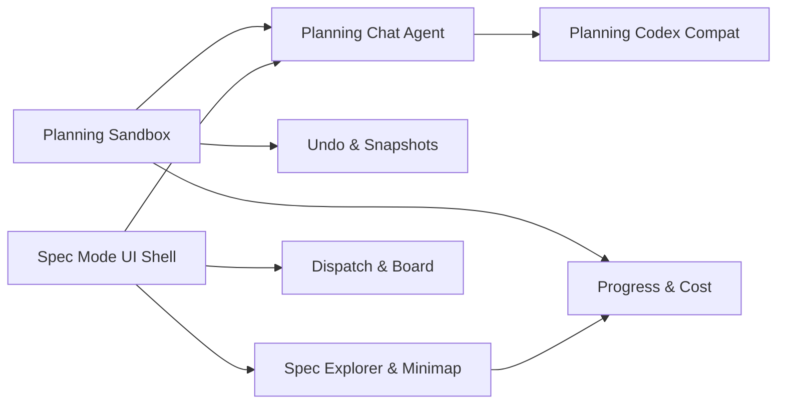

# Spec Planning UX

Depends on [spec-document-model.md](spec-document-model.md).

---

## Core Workflow

The user's workflow is a loop:

```
1. Propose an idea (natural language, any level of vagueness)
2. Agent drafts a spec
3. Review and iterate ("this is wrong", "add X", "break this down")
4. When small enough → dispatch leaf specs to the board
5. Monitor execution, feed results back into specs
6. Repeat for the next piece
```

The UX must support every step of this loop with minimal friction.

---

## Sandbox Execution Model

Spec mode runs inside a sandbox container, same as task execution on the board. Entering spec mode launches (or attaches to) a long-lived planning sandbox. The spec explorer and the chat agent both operate within this sandbox.

**Zero permission prompts.** The chat agent has full read/write access to the specs folder inside the sandbox — no "allow file edit?" dialogs, no approval gates. The agent creates, renames, splits, and edits spec files autonomously. The user steers via chat; the agent executes immediately. This is safe because:

- The sandbox is scoped to spec documents, not production code.
- Spec files are version-controlled; any change is a `git diff` away from reversal.
- The agent only modifies files under the specs folder. It can *read* the full workspace (to understand the codebase when drafting specs), but *writes* are confined to specs.

**Lifecycle.** The planning sandbox starts when the user enters spec mode and stays alive across spec mode sessions (same container reuse model as task workers). It is destroyed on explicit teardown or workspace switch.

---

## Two-Mode UI

The system has two views of the same underlying work:

```
┌────────┐           ┌────────┐
│  Spec  │  ◀──────▶ │ Board  │
│  Mode  │           │  Mode  │
└────────┘           └────────┘
 Planning              Execution
 Iteration             Monitoring
 Tree navigation       Flat board
```

### Spec Mode

A split-pane view for planning work:

```
+--header------------------------------------------------------+
| [Board] [Specs]   workspace-group-tabs   [search] [settings] |
+----------+---------------------------+-----------------------+
|          |                           |                       |
| Spec     |  Focused Markdown View    |  Chat Stream          |
| Explorer |                           |                       |
|          |  # Sandbox Backends       |  > Break this into    |
| specs/   |                           |    sub-specs, each    |
|  foundn/ |  ## Problem               |    touching 2-5 files |
|    sandbo|  Wallfacer uses os/exec   |                       |
|      defe|  directly in the runner.  |  Agent: I'll create   |
|      loca|  This couples container   |  3 sub-specs...       |
|      refa|  lifecycle to the runner  |                       |
|    storag|  package...               |  [spec tree updated,  |
|  local/  |                           |   3 new files shown   |
|    spec-c|  ## Design                |   in explorer]        |
|    deskto|  Extract a SandboxBackend |                       |
|           |  interface...             |  > The refactor-runner|
|           |                           |    spec is too big,   |
|           |  ## Children              |    split it further   |
|           |  - ✓ define-interface     |                       |
|           |  - ✓ local-backend       |  Agent: Split into    |
|           |  - ○ refactor-runner     |  two sub-specs...     |
|           |                           |                       |
+----------+---------------------------+-----------------------+
```

**Left pane — Spec Explorer:** Shows *only* the specs folder — not the full workspace file tree. Tree rooted at the specs directory with status badges and recursive progress indicators (e.g., "4/6" counting all leaves in the subtree, not just direct children). Clicking opens in the focused view. Collapsible subtrees at any depth. Reuses file explorer infrastructure but with a fixed root.

**Center pane — Focused Markdown View:** Renders the selected spec as formatted markdown. Live updates when the agent modifies it in the sandbox. Children listed with status. If it's a leaf spec, shows dispatch button.

**Right pane — Chat Stream:** Conversation for iterating on the focused spec. The user types directives; the agent executes immediately inside the planning sandbox — no permission prompts. It reads the spec tree and codebase, then writes spec files directly. Changes appear live in the explorer and focused view.

### Board Mode

The existing board, unchanged. Shows dispatched leaf specs as tasks. The board stays flat — all structure lives in the spec tree.

When clicking a task that was dispatched from a spec, the task detail shows a link back to its source spec. Clicking it switches to Spec Mode focused on that spec.

### Mode Switching

Zero-cost: single click or keyboard shortcut, context preserved. If viewing a spec in Spec Mode and switching to Board Mode, the board highlights tasks dispatched from that spec's subtree. If viewing a task in Board Mode and switching to Spec Mode, the explorer navigates to that task's source spec.

---

## Chat-Driven Iteration

The chat stream is the primary interaction channel. Examples of what the user can say:

| User says | Agent does |
|-----------|-----------|
| "I want to refactor the sandbox layer" | Drafts a new spec: problem statement, proposed approach, key decisions |
| "This section is too vague" | Expands the section with specifics from the codebase |
| "Break this into sub-specs" | Proposes child specs with acceptance criteria and dependencies |
| "The interface needs a fourth method" | Updates the spec, flags affected children as potentially stale |
| "Dispatch the first two sub-specs" | Creates board tasks from the leaf specs, links them back |
| "What's the status of this spec?" | Summarizes: children progress, drift warnings, dispatched tasks |

The agent always has context: the focused spec, the spec tree, the codebase, and board state. It can read sibling specs, check existing implementations, and propose changes that account for the broader picture.

### Spec File Conventions

For the agent to read and update specs, leaf specs follow a light convention:

```markdown
---
title: Define SandboxBackend interface
status: validated
depends_on: []
affects:
  - internal/sandbox/backend.go
effort: small
---

## Goal

Define `SandboxBackend` and `SandboxHandle` interfaces in a new
`internal/sandbox/` package.

## What to Change

- Create `internal/sandbox/backend.go` with interface definitions
- Create `internal/sandbox/handle.go` with handle interface
- Add doc comments on all exported methods

## Acceptance Criteria

- Interfaces compile
- No existing code is modified (pure addition)
- Doc comments explain the contract for each method

## Dependencies

None — this is the first spec in the tree.
```

Non-leaf specs are less structured — they contain whatever the human and agent have iterated to: problem statements, design decisions, diagrams, open questions, links to children.

---

## Dispatch Workflow

### Dispatching a Leaf Spec

The focused view for a `validated` leaf spec shows a dispatch button:

```
┌──────────────────────────────────────────────────┐
│ Define SandboxBackend interface         [Dispatch]│
│ Status: validated · Effort: small                 │
│ Depends on: —                                     │
│                                                   │
│ ## Goal                                           │
│ Define SandboxBackend and SandboxHandle...        │
└──────────────────────────────────────────────────┘
```

**Dispatch** creates a board task:
- Prompt = spec content (the full markdown body)
- `DependsOn` = resolved from the spec's `depends_on` field (matching other dispatched specs' `dispatched_task_id`)
- The spec's `dispatched_task_id` is set to the new task's UUID
- The spec's status stays `validated` until the task completes, then moves to `complete`

### Dispatching Multiple Specs

The spec explorer supports multi-select. Select several leaf specs and click "Dispatch Selected." This creates a batch of board tasks with proper dependency wiring.

Alternatively, in the chat: "Dispatch all validated leaf specs under sandbox-backends." The agent does the multi-dispatch.

### Undispatching

If a dispatched task is cancelled, the spec's `dispatched_task_id` is cleared and it returns to `validated`. The user can revise the spec and re-dispatch.

---

## Progress Tracking

Progress is visible at every level of the spec tree.

### In the Spec Explorer

```
specs/
  foundations/
    ✅ sandbox-backends.md              6/6 ✓
      ✅ define-interface.md
      ✅ local-backend.md
      ✅ runner-migration.md            3/3 ✓
        ✅ refactor-launch.md
        ✅ refactor-listing.md
        ✅ retire-executor.md
    ✅ storage-backends.md              3/3 ✓
  local/
    📝 spec-coordination.md             0/3
      ✔ spec-document-model.md
      📝 spec-planning-ux.md
      💭 spec-state-control-plane.md
```

Non-leaf specs show `done/total` counts that recursively aggregate all leaves in their subtree. `sandbox-backends.md` shows 6/6 (all leaves), and `runner-migration.md` shows 3/3 (its own leaves). Status icons reflect the spec's own status, not children.

### In the Focused View

Non-leaf specs show a children summary section:

```
## Children                                    4/6 leaves done

✅ define-interface — complete ($0.42)
✅ local-backend — complete ($0.89)
  runner-migration — 2/3 leaves done
    ✅ refactor-launch — complete ($0.67)
    ✅ refactor-listing — complete ($0.56)
    ○  retire-executor — validated, not dispatched
○  update-registry — drafted

Total cost: $2.54
```

### On the Board

Tasks dispatched from specs look like regular tasks. The task card shows a small spec badge linking back to the source spec. No other board changes.

---

## Verification

The previous design had dedicated "gate tasks" for milestone verification. In the spec-centric model, verification is just another leaf spec:

```
specs/foundations/sandbox-backends/
  define-interface.md
  local-backend.md
  refactor-runner.md
  move-listing.md
  retire-executor.md
  verify.md                ← leaf spec: "run tests, lint, vet"
```

The `verify.md` spec depends on all other siblings. When dispatched, it runs verification. The user decides whether to include a verification spec — it's not imposed by the system.

This is simpler and more flexible: the user can add verification at any tree level, make it as thorough or light as they want, and skip it entirely for low-risk work.

---

## Keyboard Shortcuts

| Shortcut | Action |
|---|---|
| `S` | Toggle between Spec Mode and Board Mode |
| `Enter` (in explorer) | Open selected spec in focused view |
| `D` (in focused view) | Dispatch current leaf spec |
| `B` (in focused view) | Break down current spec (opens chat with "break this into sub-specs") |

---

## Open Questions

### Cross-Spec Cognitive Management

When spec count exceeds human working memory (~7-10 specs), the user loses global coherence. Mitigations:

1. **Tree collapsing** — only expand the subtree you're working on. Completed subtrees collapse to a single green checkmark.
2. **Status filtering** — show only specs in a particular state (stale, in-progress, not started).
3. **Reactive warnings** — surface problems when they matter (e.g., drift warnings when about to dispatch), not as background noise.
4. **Dependency minimap** — a small graph visualization (below the explorer or as a toggleable overlay) showing the focused spec's upstream dependencies and downstream dependents. Nodes are specs, edges are `depends_on` relationships. The focused spec is highlighted; upstream specs (what this depends on) fan out to the left or top, downstream specs (what depends on this) fan out to the right or bottom. Clicking a node in the minimap navigates to that spec. Node color encodes status (green = complete, yellow = in-progress, gray = not started, red = stale/blocked). This gives the user a local neighborhood view of the dependency graph without requiring them to hold the full tree in their head — they see "what feeds into this spec" and "what this spec unblocks" at a glance. The minimap only renders the immediate neighborhood (1-2 hops) to stay readable; a "expand" action could show the full transitive closure if needed.

### Entry-Point Document Staleness

`specs/README.md` is a hand-maintained index: status table, dependency graph, ordering rationale. When a spec completes, the README silently drifts — wrong status, stale "Delivers" column, outdated rationale — until someone notices. This is the general problem of derived documents that summarize spec state but aren't part of the spec tree themselves.

**Option A — Generated README.** The README is fully generated from spec frontmatter and a template. `make specs-readme` or a post-completion hook rebuilds it. The template defines the table layout, dependency graph format, and rationale sections. Humans edit the template, not the output.

- Pro: Zero drift by construction. README always matches reality.
- Con: Loses free-form prose (ordering rationale, scaling strategy discussion). Those sections would need to live elsewhere or be template-embedded. Harder to review in PR diffs since the whole file regenerates.

**Option B — Generated sections, manual prose.** The README has fenced marker comments (`<!-- BEGIN status-table -->` / `<!-- END status-table -->`). A generator rewrites only the marked sections; prose outside markers is untouched. Runs as a post-completion hook or CI check.

- Pro: Keeps free-form rationale sections. Only structured sections (status quo, tables, dependency graph) are generated. Surgical diffs.
- Con: More complex generator. Marker discipline required — accidentally deleting a marker breaks the update.

**Option C — Staleness check with blocking.** No generation. Instead, when a spec changes status, the system computes whether any entry-point document references that spec with outdated information (status, deliverables). Surfaces a warning in the spec explorer and optionally blocks further dispatches from the same subtree until the entry-point is updated.

- Pro: Preserves full human authorship. No generator to maintain. Works for any document format.
- Con: Doesn't fix the problem, only nags. The human still does the manual update. "Blocking" may be too aggressive for a README update.

**Option D — Proactive agent update.** On spec completion, the agent automatically updates the entry-point document — at minimum, advancing status fields (e.g., marking a spec from `validated` to `complete`, or flagging dependent specs as `stale`). For larger changes (rewriting rationale, updating deliverables), the agent writes the update directly and surfaces it for human review in the chat stream: "spec-document-model completed — I've updated the README status table and flagged two downstream specs as potentially stale. Review the changes?" The user can accept, edit, or revert.

- Pro: The agent handles the bookkeeping proactively — the human doesn't have to remember or initiate the update. Status fields stay accurate without human intervention. The agent has full context (spec content, what shipped, design decisions) to write good prose updates. No rigid template — the agent adapts to whatever README format exists.
- Con: Requires the agent to understand README conventions. Quality of prose updates depends on prompt engineering. The user must still review non-trivial changes (but status-only updates can be fully automatic).

**Decision: Option D.** The agent should proactively update entry-point documents on spec status changes. Mechanical updates (status field changes, marking downstream specs as stale) happen automatically without requiring human approval. Prose-level updates (rationale, deliverables, dependency graph annotations) are written by the agent and surfaced for review. This eliminates drift for the common case (status tracking) while keeping the human in the loop for substantive content changes.

### Specs Folder Location and Conflicts

**Decision: `specs/` in each repo root.** Specs are version-controlled alongside the code they describe. PRs can include both spec changes and implementation. Only markdown files (`.md`) are considered — non-markdown files (`.yaml`, `.json`, `.openapi`, etc.) in the same directory are always ignored.

**Coexisting with existing `specs/` content.** If a project already uses `specs/` for RFCs, ADRs, OpenAPI docs, or other purposes, Wallfacer only manages markdown files that have valid Wallfacer frontmatter (the full schema: `status`, `depends_on`, `affects`, `effort`, etc.). Existing markdown files without this frontmatter are left alone. On first entering spec mode in a repo with existing `specs/` content, the system offers to auto-convert: "Found 12 markdown files without Wallfacer frontmatter. Convert them to managed specs?" The user can select which files to convert — each gets frontmatter added with sensible defaults (`status: drafted`, empty `depends_on` and `affects`). Files the user declines to convert remain unmanaged and invisible to the spec explorer.

**Bootstrap (no `specs/` folder).** On first entering spec mode, prompt once: "No specs directory found. Create one at `<repo>/specs/`?" One-time friction, explicit consent. After creation, the directory starts with a minimal README.

**Multi-repo workspace groups.** Each repo in a workspace group has its own `specs/` directory with its own spec tree. The spec explorer merges all repos' spec trees into a unified view, grouped by repo. The result is a **spec forest** — multiple independent trees (one per repo), not a single unified DAG.

Cross-repo dependencies are expressed using repo-qualified paths in `depends_on` (e.g., `api/specs/foundations/auth-endpoint.md`). The `affects` field similarly uses repo-prefixed paths (`api/internal/handler/foo.go`, `frontend/src/api.ts`). The repo prefix matches the workspace mount basename — this is already how `/workspace/AGENTS.md` informs agents about the multi-repo layout.

The spec graph across a workspace group is technically a **multi-graph forest**: each repo's specs form a DAG, and cross-repo `depends_on` edges connect nodes across trees. The spec explorer and dependency minimap render this naturally — cross-repo edges appear as connections between repo-grouped subtrees. Cycle detection operates across the full forest, not per-repo.

### Concurrent Edits

**Decision: on-disk is authoritative, conflicts surface as git-style markers.**

The planning sandbox operates directly on the workspace filesystem (no worktree isolation). The agent always reads the current on-disk version of a file before modifying it, so it immediately observes any user edits that have been saved. This means the user can edit a spec in their editor, save it, and the agent's next read picks up the changes — no sync lag.

The conflict case arises when the user has **unsaved edits** in their editor while the agent writes to the same file:

1. The agent writes its changes to disk (it read the last-saved version, which was authoritative at read time).
2. The UI detects the file change via `fsnotify` and compares the on-disk content against the user's unsaved buffer.
3. If the regions don't overlap, the editor can silently reload (or prompt to reload).
4. If the regions conflict, the UI inserts git-style conflict markers (`<<<<<<<`, `=======`, `>>>>>>>`) into the file, showing both the user's unsaved version and the agent's version. The user must resolve the conflict before the file is considered clean — same mental model as a git merge conflict.

This applies equally to edits made via an external editor, the focused markdown view, or the file explorer in board mode. The conflict resolution flow is always the same: git-style markers, user resolves, save.

### Chat Session Persistence

**Decision: global session, persistent across spec mode sessions.**

One continuous conversation thread covers all spec work. Switching the focused spec in the explorer does not clear or fork the conversation — the agent retains full cross-spec reasoning context (e.g., "make this spec consistent with the one we just discussed"). The UI visually indicates which spec was focused at each point in the conversation for readability, but the underlying thread is continuous.

The conversation persists across spec mode sessions (close and reopen). Planning rationale, design decisions, and iteration history are preserved. Storage location: the wallfacer data directory (`~/.wallfacer/`), keyed by workspace fingerprint — same lifetime as the planning sandbox.

**Agent codebase access.** The agent can read the full workspace codebase, not just specs — it needs to understand existing implementations when drafting specs. The spec explorer defaults to showing only the `specs/` folder, but a **"Show workspace files" toggle** (checkbox in the explorer header) expands the tree to include the full workspace file tree. This lets the user browse and reference code files without leaving spec mode. The agent's read access is always full-workspace regardless of this toggle — the toggle only controls what the explorer UI displays.

### Undo and Rollback

**Decision: implicit per-round snapshots with undo stack.**

Before the agent executes any file writes in response to a user message, the system takes a lightweight snapshot of the affected files (git stash or copy-based). Each chat round (one user message → one agent response that modifies files) is one undoable unit. A single user message like "break this into sub-specs and update the parent" may produce many file writes — all of them are captured in one snapshot and revert as one unit.

The UI shows an **Undo button** on each agent response that modified files. Clicking it reverts all file changes from that round by restoring the snapshot. Multiple undos walk back through the snapshot stack in reverse order. The undo stack is bounded (e.g., last 50 rounds) and persists with the planning session.

Rounds where the agent only reads files or responds with text (no file writes) do not create snapshots. The snapshot only covers files under `specs/` that the agent actually modified — it's not a full workspace snapshot.

### Planning Cost Budget

**Decision: costs are tracked and distributed per spec file.**

Each chat round's token usage is attributed to the spec file(s) the agent modified during that round. If a round modifies multiple specs, the cost is split proportionally (e.g., by token count spent on each file's reads and writes). If a round only reads files or produces text without modifying any spec, the cost is attributed to the currently focused spec.

The cost dashboard extends to show planning cost per spec alongside execution cost. Each spec's focused view displays both:

- **Planning cost** — tokens spent drafting, iterating, and refining this spec
- **Execution cost** — tokens spent by dispatched tasks implementing this spec

Non-leaf specs aggregate both planning and execution costs from their entire subtree. This gives the user visibility into the total investment per spec branch — a spec subtree that cost $3 to plan and $15 to execute is easy to reason about.

Planning shares the same cost model and usage tracking infrastructure as task execution. No separate budget cap — the existing per-session cost limits apply to the planning sandbox the same way they apply to task workers.

### Dispatch Granularity Judgment

**Decision: the user decides breakdown granularity; the spec type implies dispatch readiness.**

When a user breaks down a spec, they choose whether each child is:

- An **implementation spec** (leaf) — concrete, scoped to a single agent task, ready for dispatch. These have the full leaf spec structure: goal, what to change, acceptance criteria.
- A **design spec** (non-leaf) — still needs further iteration and breakdown before any part of it is dispatchable.

This distinction is implicit in the spec's structure: specs with children are design specs; specs without children are implementation specs. Only implementation specs (leaves) show the dispatch button. The user doesn't need to explicitly label a spec as "ready" — if it's a leaf with `validated` status, it's dispatchable.

The agent does not proactively flag specs as too large or suggest breakdowns. It proposes breakdowns when asked. The user is in control of when to stop breaking down and when to dispatch.

### Spec Templates

**Decision: no static templates. The agent has skills for common spec formats.**

Static templates (pre-filled section headings and placeholders) add rigidity without value — the agent drafts specs from scratch via chat and adapts to context better than a fixed template can.

Instead, the planning agent has **spec-creation skills** — built-in knowledge of common spec patterns (API endpoint, refactor, bug fix, migration, etc.) that it applies when relevant. When the user says "I want to add a new endpoint," the agent drafts a spec with the appropriate structure (route, handler, tests, docs) without the user needing to select a template. The agent infers the format from the user's description and the codebase context. The user can always ask the agent to restructure a spec differently.

### Agent-Generated Spec Trust

**Decision: structured summaries on demand.**

If the user doesn't write specs, they have lower familiarity with content. The primary mitigation is a **"Summarize" action** in the focused view that asks the agent to produce a structured summary of the spec's key points under a user-chosen word limit (e.g., 50, 100, 200 words). The summary is displayed inline above the full spec body — not a replacement, but a scannable overview. This lets the user quickly verify the spec captures the right intent without reading every paragraph.

Additional mitigations:

- Build familiarity through interactive chat dialogue, not passive reading
- Verification specs catch implementation failures
- The spec is always editable — the user can modify anything before dispatching

---

## Outcome

The planning UX shipped as a complete spec-driven workflow environment integrated into the existing Wallfacer SPA. A three-pane spec mode (explorer, focused markdown view, chat stream) sits alongside the task board, switchable with a single click or `S` shortcut. The planning agent runs inside a long-lived workspace-scoped container, iterates on specs via natural-language chat, and dispatches validated leaf specs directly as board tasks with dependency wiring and bidirectional navigation — all without permission prompts or approval gates.

### What Shipped

- **Planning Sandbox** (`internal/planner/`) — workspace-scoped singleton container lifecycle over `sandbox.Backend`; 3 HTTP endpoints (`GET/POST/DELETE /api/planning`); workspace-switch wiring via `applySnapshot`; 16 backend tests.
- **Spec Mode UI Shell** (`ui/js/spec-mode.js`, `ui/css/spec-mode.css`) — three-pane layout with mode state persisted to `localStorage`; `#spec/<path>` deep-link routing; 2-second polling for live spec updates; YAML frontmatter parser; keyboard shortcuts (`S`, `D`, `B`, `C`); 32 frontend tests.
- **Spec Explorer & Dependency Minimap** (`ui/js/spec-explorer.js`, `ui/js/spec-minimap.js`) — `GET /api/specs/tree` endpoint with recursive progress counts; status icons, filtering dropdown, "Show workspace files" toggle, multi-select dispatch checkboxes; draggable SVG 1-hop minimap with status-colored nodes; 30 tests.
- **Planning Chat Agent** (`ui/js/planning-chat.js`, `internal/handler/planning.go`, `internal/planner/`) — 8 API endpoints including SSE stream and interrupt; JSONL conversation log + session tracking in `~/.wallfacer/planning/<fingerprint>/`; planning system prompt (`internal/prompts/planning.tmpl`); 7 built-in slash commands with embedded templates; `@`-file mention autocomplete with `specs/` priority; ideation routed through `Planner.Exec()`; shared `internal/pkg/livelog/` package; 44+ tests.
- **Dispatch & Board Integration** (`internal/handler/specs_dispatch.go`, `internal/spec/write.go`) — `POST /api/specs/dispatch` (atomic batch with dependency wiring and rollback) and `POST /api/specs/undispatch`; `spec.UpdateFrontmatter()` for atomic YAML field updates; `SpecSourcePath` task field; `SpecCompletionHook` advancing spec to `complete` on task done; spec badge on task cards; board highlight on mode switch; 53+ tests.
- **Undo & Snapshot System** — per-round snapshot of modified spec files before agent writes; undo API and UI button on each agent response; post-exec git commit with `Plan-Round: N` trailer for traceability.
- **Planning Cost Tracking** — per-round token usage attributed to focused spec; planning usage store in `~/.wallfacer/`; per-group cost aggregation surfaced in the existing usage stats modal with a dedicated planning tile; configurable planning window.

### Design Evolution

1. **Dispatch workflow table entry was stale.** The Design Breakdown table above originally showed dispatch-workflow as `drafted`; it shipped complete during implementation without the parent table being updated.

2. **Codex compatibility deferred.** Item 8 (Planning Codex Compatibility) was listed as `vague` at design time. It was subsequently refined into a full design spec (`planning-codex-compat.md`, now `drafted`) covering CLI flag translation, `--resume` skip, AGENTS.md mounting, and Codex auth mounting — but implementation was deferred. The planning agent runs Claude Code only.

3. **Session persistence shipped at basic fidelity only.** The original spec envisioned full per-turn NDJSON storage (`turns/` directory), a `ReconstructContext()` function with a 30K-token budget, and a dedicated `claude-planning-config` volume to isolate planning sessions from task workers. What shipped is the simpler fallback: JSONL message log, session ID file, and `BuildHistoryContext()` with a lossy 20-message text summary. The enhanced design is captured in `planning-chat-agent/session-persistence.md` for future implementation.

4. **Focused markdown view uses polling, not push.** The original spec implied live updates as the agent writes. The implementation uses 2-second client-side polling of `GET /api/specs/file?path=...` rather than server-sent events, which is simpler and sufficient for the planning loop cadence.

5. **Chat pane fold/unfold added.** A `C` keyboard shortcut to collapse/expand the right chat pane was added during implementation — not in the original spec — to support focused reading of long specs.

---

## Design Breakdown

| # | Sub-design | Design problem | Depends on | Effort | Status |
|---|-----------|---------------|-----------|--------|--------|
| 1 | [Planning Sandbox Lifecycle](spec-planning-ux/planning-sandbox.md) | How the long-lived planning container integrates with the sandbox backend infrastructure | — | large | complete |
| 2 | [Spec Mode UI Shell](spec-planning-ux/spec-mode-ui-shell.md) | Three-pane layout integration with the existing SPA, mode switching, keyboard routing | — | large | complete |
| 3 | [Spec Explorer & Dependency Minimap](spec-planning-ux/spec-explorer.md) | Spec-aware tree rendering with status badges, progress indicators, and dependency graph overlay | spec-mode-ui-shell | large | complete |
| 4 | [Planning Chat Agent](spec-planning-ux/planning-chat-agent.md) | Interactive conversational agent model for spec iteration, skills, and session persistence | spec-mode-ui-shell, planning-sandbox | xlarge | complete |
| 5 | [Dispatch & Board Integration](spec-planning-ux/dispatch-workflow.md) | Translating validated leaf specs into board tasks with bidirectional links and dependency wiring | spec-mode-ui-shell | medium | complete |
| 6 | [Undo & Snapshot System](spec-planning-ux/undo-snapshots.md) | Per-round implicit snapshots for reversible agent writes | planning-sandbox | medium | complete |
| 7 | [Planning Cost Tracking](spec-planning-ux/progress-cost-tracking.md) | Per-round planning cost capture, per-group aggregation, and surfacing in the existing usage analytics (recursive progress was already shipped separately) | planning-sandbox | medium | complete |
| 8 | [Planning Codex Compatibility](spec-planning-ux/planning-codex-compat.md) | Codex sandbox support for the planning chat agent (CLI flags, session resumption, output format) | planning-chat-agent | medium | drafted — deferred |



**Recommended iteration order:** Start with #1 (Planning Sandbox) and #2 (Spec Mode UI Shell) in parallel — they are independent foundations. Then #3 (Spec Explorer) and #5 (Dispatch) can proceed in parallel once the UI shell is designed. #4 (Planning Chat Agent) requires both the sandbox and UI shell. #6 (Undo) depends only on the sandbox design. #7 (Progress & Cost) comes last as it integrates data from the explorer and sandbox.
