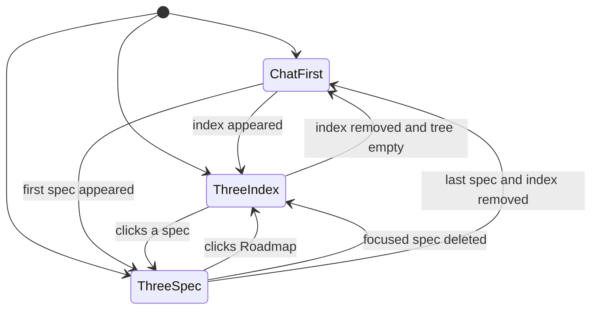
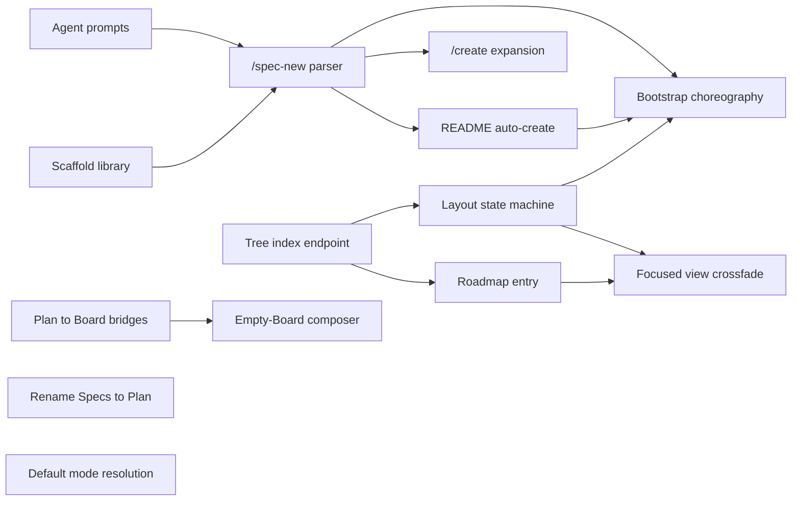

# Chat-First Mode

## Problem

Wallfacer's non-board mode is currently labeled **Specs** and always renders a three-pane layout: explorer (left), focused spec view (centre), planning chat (right). Two problems:

1. **Empty-state dead end.** When a workspace has no spec files, or has markdown files that don't conform to Wallfacer's frontmatter, both the explorer and the focused view are empty. The chat pane is the only thing working — but it's shoved into a narrow right-hand column, and the rest of the screen is wasted real estate that communicates "this feature doesn't work for you yet."
2. **Naming presupposes the artifact.** "Specs" signals that the primary artifact is a spec file. For users in early ideation (pre-spec) or for products whose design doesn't fit Wallfacer's spec document model, the name is a barrier. The *activity* is planning / thinking / ideating; specs are one durable output of that activity.

The goal: make the mode work out of the box for any repo, with or without specs, while preserving the full spec-driven workflow for repos that have it. Do this without touching the spec subsystem, API routes, or file organization.

## Constraints

- **No big change.** Backend unchanged (API routes, `specs/` location, file format, planning-chat-threads, ThreadManager). Only UI labels, layout, and a few CSS/JS branches.
- **Back-compat for deep links.** Existing `#spec/<path>` hashes must still work.
- **Emergent transition.** The layout should respond to *repo state*, not a user toggle. The moment a spec exists (including one created via chat), the full three-pane layout appears. The moment the last spec is removed, it collapses.
- **Keyboard shortcuts and in-code identifiers (`sidebar-nav-spec`, `spec-mode-container`, `specModeState`) stay** to avoid churn. Only user-facing labels and the top-level mode name change.

## Design

### Default mode and guided path to the Board

The two modes serve different activities: **Plan** is where you think, **Board** is where you execute. First-time users and users whose Board is empty have nothing to execute yet — they should land in Plan (chat-first) so the very first interaction is a chat.

**Default mode on open** is resolved from three bits, in order:

| Condition | Open in |
|---|---|
| User has a saved mode preference from a previous session | Saved mode |
| Board is non-empty (any task in backlog / in-progress / waiting / done) | Board |
| Otherwise (first run, or empty board, or brand-new workspace) | Plan (chat-first) |

The saved preference persists the user's last explicit mode choice (click on a sidebar nav button, `S`/`P`/`B` shortcut). Auto-transitions from a dispatch flow do **not** update the saved preference — the user's intent about "which mode do I prefer" should only come from explicit clicks, not from incidental follow-through on a single action.

#### Guiding users from chat-first to the Board

The natural bridge from Plan to Board is **dispatch**: a spec is ready, the user dispatches it, a task appears on the Board. We make this bridge explicit at three touchpoints:

1. **Dispatch-complete toast.** When a spec is dispatched (either via the focused-view `[Dispatch]` button or the `/dispatch` slash command), a toast slides in from the bottom-right with the text *"Dispatched N task(s) to the Board."* and a `[View on Board →]` button. Clicking the button switches to Board mode and highlights the newly created task(s) with a short pulse animation. Auto-dismisses after 8s; the toast is persistent until dismissed if the user doesn't click — don't make them hunt for where their dispatched work went.

2. **Board nav badge.** The sidebar `Board` button shows a small dot when there are tasks the user hasn't viewed since they were created. The dot clears when the user opens Board mode. This is subtle — it's not a notification count, it's a "something's happening over there" signal. The same pattern is used for the in-repo thread unread dot in `planning-chat-threads`, keeping the visual language consistent.

3. **Empty Board composer.** See [Empty Board composer](#empty-board-composer) below. A user who clicks to an empty Board sees a prominent task-creation composer — not a dead-end empty state. The composer itself bridges back to Plan via a single inline link.

Dispatch-complete is the primary path; the badge is a safety-net nudge for users who wander; the empty Board composer turns the "no tasks" dead end into a productive entry point.

### Empty Board composer

The core insight: **both modes have the same philosophy for their empty state — show a prompt box, not a shrug.** When Plan is empty, the user sees a chat composer in the middle of the screen. When Board is empty, the user sees a task-creation composer in the same spatial position, visually continuous. Typing a prompt in either case produces *something* — a spec scaffold, or a task card.

This turns the Board's empty state from a "configure something elsewhere" dead-end into a first-class way to create a task, and it mirrors the chat UX so switching modes on a fresh install doesn't feel like two different apps.

#### Layout

When Board mode is opened and no tasks exist in the current workspace group (including archived):

```
┌──────────────────────────────────────────────────────────────────────┐
│ [Board] [Plan]                                          [Settings ⚙] │
├──────────────────────────────────────────────────────────────────────┤
│                                                                      │
│                                                                      │
│     ┌──────────────────────────────────────────────────────────┐     │
│     │  What should the agent work on?                          │     │
│     │  ───────────────────────────────────────────────────     │     │
│     │  [textarea]                                              │     │
│     │                                                          │     │
│     │  [▾ Advanced]                                [Create ➤]  │     │
│     └──────────────────────────────────────────────────────────┘     │
│                                                                      │
│     Planning something larger? Start a chat in Plan →                │
│                                                                      │
└──────────────────────────────────────────────────────────────────────┘
```

The composer is visually the same shell as the Plan chat composer (same border, border-radius, typography, button placement) — only the label changes and the action creates a task instead of a chat turn. The subtle `Planning something larger? Start a chat in Plan →` line beneath is the inverse of the chat composer's `/create <title>` hint — each empty state gestures at the other.

#### Advanced settings

The `[▾ Advanced]` disclosure expands below the textarea (inline, no modal) to reveal the same fields the current task-create path uses. The list is identical to what today's task-creation flow exposes so we don't introduce a second source of truth for task fields:

- **Sandbox** — dropdown (Claude / Codex), defaults to `WALLFACER_DEFAULT_SANDBOX`.
- **Goal** — optional verification goal (feeds the test agent).
- **Timeout** — minutes, default 60.
- **Fresh start** — boolean, default false.
- **Prompt template** — dropdown of user-saved templates; selecting one fills the textarea.

Advanced is collapsed by default. When the user opens it once per session, the preference sticks for the rest of that browser session (not persisted across reloads — this is a composer-level preference, not a user setting).

#### Submit flow

Submitting calls `POST /api/tasks` with the same body shape the current task-create path uses — no new endpoint, no new handler. The composer becomes a thin client of the existing create-task API.

On success, the following sequence plays out in under 500ms (mirroring the Plan bootstrap animation budget):

1. Server returns the created task.
2. The composer shell animates a "lift off": the textarea's content compresses into a single-line card preview (opacity + scale animation, ~180ms), moves up and to the left to the Backlog column's position, and settles there as a real task card.
3. As the composer lifts, the full Board UI (column headers, empty columns, drag handles, etc.) fades in behind it (`opacity: 0 → 1` over 200ms, 60ms delay so the lift is already underway).
4. The landed task card in Backlog pulses once (the same 1-cycle pulse used by the dispatch-complete toast's `[View on Board →]` target highlight) so the user sees where their input went.

This reads as a single fluid event — text input transforms into a card on the board — rather than "composer disappears, board appears, task shows up" as three separate steps.

If the user creates additional tasks via the existing task-create UI (the small inline composer in the Backlog column), that UI operates as it does today; the empty-board composer is specifically an *empty-state* affordance and disappears as soon as the Board has any tasks.

#### Back-transition

If the user deletes/archives every task in the current workspace group (returning the Board to empty), the Board does NOT automatically transition back to the empty-state composer within the same session — doing so mid-workflow would be disorienting. Instead, the empty state becomes "truly empty with a hint to re-enable via a page reload" — actually simpler: render the full Board UI (empty columns) plus the existing task-create affordance in the Backlog column. On the next open of the workspace group, if the Board is still empty, the default-mode resolution picks Plan (chat-first) again, and if the user then navigates to Board they'll see the empty-state composer.

This avoids yo-yo animations during normal work (where tasks routinely move through Done and get archived) while preserving the onboarding experience for genuinely fresh sessions.

#### Brand-new workspace

When a user mounts a brand-new workspace group (via `PUT /api/workspaces`), treat it as a first-run case regardless of saved preference: open (or re-open) Plan mode with chat-first layout. Rationale: a fresh workspace has no Board history and no specs — the user just pointed Wallfacer at a repo, and the most useful first screen is "start a conversation." After the first interaction (chat message sent, task created manually, spec created) the saved preference reasserts itself on subsequent opens.

### Rename

User-facing label changes (code identifiers are unchanged):

| Where | Old | New |
|---|---|---|
| Header nav button | "Specs" | "Plan" |
| Mode toggle keyboard shortcut hint | "S" | "P" |
| Keyboard shortcut | `S` | `P` |
| Hash deeplink (new) | `#spec/<path>` | `#plan/<path>` (old form still accepted for back-compat) |
| Docs guide titles | "Designing Specs" unchanged; "Exploring Ideas" unchanged | new preface line: "Plan mode (formerly Specs) is where …" |

Internal symbols — `spec-mode.js`, `specModeState`, CSS classes like `.spec-chat-tab`, container IDs — stay. Renaming those is a separate, much bigger refactor and not needed for the UX goal.

### Layout figure

The two layouts look like this. Note that the **chat tab bar and composer are identical** in both — only the surrounding explorer and focused view change.

**Chat-first** (no specs, no `specs/README.md`):

```
┌──────────────────────────────────────────────────────────────────────┐
│ [Board] [Plan]                                          [Settings ⚙] │
├──────────────────────────────────────────────────────────────────────┤
│                                                                      │
│     ┌──────────────────────────────────────────────────────────┐     │
│     │ [Chat 1] [Auth refactor] [+] [▾]                         │     │
│     ├──────────────────────────────────────────────────────────┤     │
│     │                                                          │     │
│     │   user:  help me plan an auth refactor                   │     │
│     │                                                          │     │
│     │   agent: Here's a draft design for your auth refactor…   │     │
│     │         1. Replace session middleware …                  │     │
│     │         [writes to specs/local/auth-refactor.md]         │     │
│     │                                                          │     │
│     ├──────────────────────────────────────────────────────────┤     │
│     │ Try /create <title> to save this as a spec               │     │
│     │ ─────────────────────────────────────────────────        │     │
│     │ [textarea]                                      [/] [@] [➤]    │
│     └──────────────────────────────────────────────────────────┘     │
│                                                                      │
└──────────────────────────────────────────────────────────────────────┘
```

**Three-pane** (at least one spec OR `specs/README.md` exists):

```
┌──────────────────────────────────────────────────────────────────────┐
│ [Board] [Plan]                                          [Settings ⚙] │
├─────────────────┬──────────────────────────────┬─────────────────────┤
│ 📋 Roadmap      │  # Planning Chat Threads     │ [Chat 1][+][▾]      │
│ ─────────────   │  status: drafted             │ ──────────────      │
│                 │  effort: large               │                     │
│ Foundations     │                              │ user: let's split   │
│  ✓ sandbox-…    │  ## Problem                  │       the breakdown │
│  ✓ storage-…    │                              │ agent: OK, I'll add │
│                 │  Today the specs UI chat…    │        a child spec │
│ Local           │                              │        …            │
│ ▶ spec-coord    │  ## Design                   │                     │
│    ├─ threads   │                              │                     │
│    ├─ chat-…    │  (full markdown body here)   │                     │
│    └─ archival  │                              ├─────────────────────┤
│  File Explorer  │  [Dispatch] [Archive]        │ [textarea]    [➤]   │
│   etc.          │                              │                     │
└─────────────────┴──────────────────────────────┴─────────────────────┘
  ← explorer (fixed)   ← focused view (flex)      ← chat (toggle: C)
```

When the **index** (`📋 Roadmap`) is focused, the focused view renders `specs/README.md` and the action row (`[Dispatch] [Archive]`) is hidden — those only apply to real specs.

### Transition figure

The layout is a function of spec-tree state. Transitions are driven by `/api/specs/stream` SSE events:



**Initial state on page load:**

| Condition | State |
|---|---|
| `#plan/<path>` or `#spec/<path>` in URL | `ThreeSpec` focused on that spec |
| Else if `index.nonNull` | `ThreeIndex` |
| Else if spec tree non-empty | `ThreeSpec` focused on first leaf |
| Else | `ChatFirst` |

**Runtime triggers for each edge:**

| Edge | Trigger |
|---|---|
| `ChatFirst → ThreeIndex` | SSE reports `index` became non-null (user created or edited `specs/README.md`, or bootstrap hook ran on an empty repo). |
| `ChatFirst → ThreeSpec` | SSE reports first parseable spec appeared (bootstrap hook or `/create`). |
| `ThreeIndex → ThreeSpec` | User clicks a spec in the explorer, or navigates to `#plan/<path>`. |
| `ThreeSpec → ThreeIndex` | User clicks the pinned `📋 Roadmap` entry or clears the URL hash. |
| `ThreeIndex → ChatFirst` | SSE reports both `tree` empty and `index` null. |
| `ThreeSpec → ThreeIndex` | SSE reports the focused spec was deleted; `index` still present. |
| `ThreeSpec → ChatFirst` | SSE reports the focused spec was deleted, the tree is now empty, and `index` is null. |

Two invariants worth calling out:

1. **The chat pane and tab bar survive every transition.** Switching between ChatFirst and Three-pane never unmounts the chat DOM or clears any thread state — only the *other* panes slide in or out. Any in-flight stream keeps rendering into its thread's bubbles throughout the transition.
2. **No user toggle selects the layout.** The layout is derived from two bits: `tree.nonEmpty` and `index.nonNull`. There is deliberately no "force chat-first" setting — power users who want chat-first on a repo with specs can either archive the spec files or work in a repo without any.

### Animations

Transitions must feel smooth, not teleporty. The goal is to make the layout *explain itself* through motion — the explorer sliding in is a clearer signal than a flash repaint that "your first spec landed and now the explorer is here." All animations respect `prefers-reduced-motion: reduce` (duration collapses to 0, but opacity and final state are still applied correctly).

All durations sit in a narrow range (200–280ms) so the UI never feels sluggish. Easing is `cubic-bezier(0.2, 0, 0, 1)` (material "emphasized decelerate") for enter, `cubic-bezier(0.3, 0, 0.8, 0.15)` (emphasized accelerate) for exit.

#### ChatFirst ⇄ Three-pane

The **explorer** and **focused view** collapse/expand together as a unit. They are NOT separate slide-ins — one motion, one intent.

- **ChatFirst → Three-pane:** both side panes animate `width: 0 → target`, `opacity: 0 → 1`, `transform: translateX(-12px) → 0`. Chat pane relaxes its `flex: 1 1 100%` to its three-pane proportions (`flex: 0 1 <chat-width>`). All three panes animate in the same frame so there's no intermediate "chat jumps, then explorer appears" glitch. Duration: **260ms**, emphasized decelerate.
- **Three-pane → ChatFirst:** reverse. Side panes animate to `width: 0`, `opacity: 0`, `transform: translateX(-12px)` while chat expands. Duration: **200ms**, emphasized accelerate.

The pinned `📋 Roadmap` entry in the explorer uses a **nested stagger**: the entry fades in 40ms after the explorer starts expanding, so it's visually "arriving" rather than appearing fully formed mid-slide. Spec tree children follow 40ms later in a subtle cascade (max 200ms across all items — no long waits on large trees).

#### ThreeIndex ⇄ ThreeSpec (focused view swap)

When the focused entry changes, the **content crossfades** rather than the panes rearranging. The side panes stay put; only the centre content changes.

- Outgoing content: `opacity: 1 → 0` over 140ms, emphasized accelerate.
- Incoming content is inserted at `opacity: 0`, then `opacity: 0 → 1` over 180ms starting 40ms into the outgoing fade (slight overlap for continuity).
- The spec-only affordances row (status chip, dispatch, archive) has its own `opacity` + `translateY(6px)` transition: it slides in from below when switching to a spec, slides out when switching to the index. Duration: **220ms**, emphasized decelerate.

#### First-spec bootstrap

When the bootstrap hook fires on an empty repo, the sequence is carefully ordered so the user sees *causation*, not a sudden state jump:

1. User message bubble appears in chat (existing behaviour; no change).
2. Server writes the scaffold and emits the `specs/stream` SSE event.
3. Frontend receives the event. Layout transitions `ChatFirst → Three-pane` (260ms animation above).
4. **At 160ms into the transition** (roughly when the panes are half-opened), the scaffolded spec is focused and the toast *"Your first spec was created at `<path>`. Rename or move it anytime."* slides in from the top (200ms, emphasized decelerate, auto-dismisses after 6s).
5. Agent stream bubble begins appearing in chat; simultaneously the focused view shows the empty body updating live as the agent writes.

The total time from SSE arrival to "user sees their spec being populated" is under 500ms, which reads as one fluid event rather than a series of pops.

#### Tab switching within the chat pane

The existing tab bar (from `planning-chat-threads`) switches threads synchronously, but the **messages area** should crossfade content between threads to avoid a raw DOM wipe feeling:

- On `_switchToThread`, add `opacity: 0` to `#spec-chat-messages` for 120ms, then swap content, then `opacity: 1`. Messages from the incoming thread appear in view during the last 60ms of the outgoing fade.
- The tab bar itself — no animation on the active-tab indicator move; click-to-switch should feel instant visually on the tab level.
- This crossfade is NOT present in the existing `planning-chat-threads` implementation; adding it is part of this spec.

#### Implementation notes

- All animations are CSS-driven, not JS keyframes. Toggle `data-layout="chat-first"` / `data-layout="three-pane"` on the spec-mode container; CSS transitions on `width`, `opacity`, `transform` do the rest. This keeps the motion GPU-accelerated and trivially disableable via `prefers-reduced-motion`.
- Width transitions require `width` to be explicitly set (not `auto`) on both sides — the CSS pins the target widths as CSS custom properties (`--explorer-width`, `--chat-width`) which match the existing resize handle variables already in `ui/css/spec-mode.css`.
- The focused-view crossfade uses a small queue to avoid content jumping when the user click-spams specs during an in-flight fade: the outgoing content finishes its fade before the next incoming content is mounted. This also composes with the `_switchEpoch` guard for thread switching added in `planning-chat-threads` — stale content never paints over new content.

### Layout states

Mode runs in one of two layouts, selected from spec tree state:

| State | Trigger | Layout |
|---|---|---|
| **Chat-first** | Spec tree is empty (no parseable specs) **and** no `specs/README.md` exists in any mounted workspace. | Explorer hidden, focused view hidden. Chat fills the full content area. |
| **Three-pane** | At least one parseable spec exists, OR `specs/README.md` exists. | Current behaviour: explorer (left), focused entry (centre), chat (right, toggleable with `C`). |

There's no separate "dual" state; the focused view always has *something* when specs are present, because `specs/README.md` is the default focus when no spec is selected (see [Spec index / root entry](#spec-index--root-entry-specsreadmemd)).

In chat-first layout the `C` shortcut (toggle chat pane) is a no-op — hiding the only visible pane would leave the user with nothing. `C` resumes its normal behaviour (show/hide chat) as soon as the layout expands to three-pane.

Transitions are driven by the spec tree SSE stream (`/api/specs/stream`), which already fires on every spec-tree change. Additions:

- The tree endpoint (see below) gains an `index` field so the UI knows whether `specs/README.md` exists.
- When the stream reports an empty tree **and** `index` is null → collapse to chat-first.
- When the stream reports a non-empty tree or `index` becomes non-null → expand to three-pane and focus the default entry.
- Clicking a spec in the explorer or navigating to `#plan/<path>` overrides the default focus.

### Spec index / root entry (`specs/README.md`)

`specs/README.md` is the hand-written roadmap — umbrella status, track tables, dependency graph. Today it's invisible from the UI because the explorer is backed by `/api/specs/tree`, which parses frontmatter-bearing files and silently drops everything else. Users who want to see the roadmap must open it in a separate editor.

The spec UI should treat `specs/README.md` as a first-class entry — visible in the explorer, default-focused on Plan mode load, and rendered in the same focused-view markdown pipeline as any other spec.

#### Tree endpoint changes

`GET /api/specs/tree` gains an `index` field alongside the existing `tree`:

```json
{
  "tree": [ /* existing spec nodes */ ],
  "index": {
    "path": "specs/README.md",
    "workspace": "/abs/path/to/repo",
    "title": "Specs",          // pulled from first H1 of the file; fallback "Roadmap"
    "modified": "2026-04-12T12:34:56Z"
  }
}
```

`index` is `null` when no `specs/README.md` exists in any mounted workspace. When multiple workspaces are mounted and more than one has a `specs/README.md`, the first workspace wins (explicit resolution order; deterministic). A future spec can introduce a workspace-selector for `index` if multi-repo users find this limiting.

The existing spec-tree SSE stream fires on `specs/README.md` changes too (same file watcher hook); `SpecTreeStream` payloads include the updated `index`.

#### Explorer rendering

The explorer gets a pinned node at the very top, visually distinct from the spec tree:

```
📋 Roadmap                  ← specs/README.md, pinned index entry
────────────────
Foundations
  ├─ sandbox-backends       ← regular specs follow
  ├─ …
Local Product
  ├─ …
```

The pinned entry:
- Highlights on focus like any other node.
- Responds to click / Enter / `j`/`k` navigation the same way.
- Is skipped by the dispatch / archive / rename keyboard shortcuts (none of those apply to a non-spec markdown file).
- Renders `📋 Roadmap` as its label, regardless of the H1 in the file, to keep the visual anchor stable across renames.

If `index` is null, the pinned node is not rendered — users without a `specs/README.md` don't see a phantom entry.

#### Focused view for the index

The focused view pipeline reuses its existing markdown renderer with the following adjustments when the focused entry is the index:

- Hide spec-only affordances in the header: no status chip, no dispatch button, no archive button, no `depends_on` indicator.
- The chat pane's `/create`, `/break-down`, `/dispatch` commands remain available (they target the agent, not the focused entry), but chat UI makes clear the current focus is the index — the chat header label reads "Roadmap" instead of a spec title.
- The agent, when asked to edit, can safely write to `specs/README.md` just like any file under `specs/`. No special-case write path.

#### Default focus

On Plan mode load:

1. If the URL has `#plan/<path>` or legacy `#spec/<path>` → focus that spec.
2. Else if `index` is non-null → focus the index.
3. Else if the spec tree has any entries → focus the first leaf in depth-first order.
4. Else (chat-first) → no focus; chat fills the screen.

### Interaction with `/spec-new` directive

When the `/spec-new` directive fires and `spec.Scaffold` creates the first spec in a repo:

- If `specs/README.md` does not exist, the server ALSO creates a minimal one as part of the same scaffold call. Since the agent is already producing a spec, it's the right moment to seed the roadmap; delaying it to a separate agent turn would leave the Explorer with a pinned Roadmap entry whose target file doesn't exist.
- The minimal README template:
  ```md
  # Specs

  Project roadmap.

  ## Local Product

  | Spec | Status | Summary |
  |------|--------|---------|
  | [<slug>](local/<slug>.md) | Drafted | *(agent will fill this in)* |
  ```
- The agent is instructed in its system prompt: "If your `/spec-new` directive creates the first spec in the repo, also emit a brief summary sentence for the roadmap table; the server will patch it into `specs/README.md` for you."
- If `specs/README.md` already exists, the server appends a row to the appropriate track table (inferred from the spec's path), or adds a new track section if none matches. User-authored content outside the track tables is never touched.
- On subsequent `/spec-new` directives, only the README row is appended; the README file itself is not re-initialised.

### Bootstrapping a new spec from chat (hook-triggered)

The core insight: **the agent should never hand-write spec frontmatter.** Frontmatter is deterministic, must validate, and has a handful of required fields; letting an LLM generate it reintroduces the class of bugs that `wallfacer spec new` was built to prevent. Instead, the server creates the skeleton with valid frontmatter **before** the agent turn runs, then tells the agent to fill in the body.

This also means users don't need to remember a slash command. The first chat message in a chat-first workspace automatically bootstraps a spec, and the agent's first turn is scoped to populating it.

#### Shared scaffold library

Extract the file-creation logic from `runSpecNew` (currently in `internal/cli/spec.go`) into a pure library function under `internal/spec/`:

```go
// ScaffoldOptions controls the frontmatter fields of a new spec.
type ScaffoldOptions struct {
    Path    string   // required, e.g. "specs/local/auth-refactor.md"
    Title   string   // optional; defaults to TitleCase(basename)
    Status  Status   // optional; defaults to StatusVague
    Effort  Effort   // optional; defaults to EffortMedium
    Author  string   // optional; defaults to resolveAuthor()
    DependsOn []string // optional; when bootstrapped from a specific pane
}

// Scaffold creates a new spec file with valid frontmatter defaults,
// returning the absolute path. Errors on invalid path, missing parent
// track, or existing file (unless Force is set).
func Scaffold(opts ScaffoldOptions) (string, error)
```

`internal/cli/spec.go:runSpecNew` becomes a thin argv-parsing wrapper around `spec.Scaffold`. The new chat bootstrap hook calls `spec.Scaffold` directly.

#### Hook flow: the agent decides intent

The question "should this message bootstrap a spec?" is a judgment call about whether the user is doing design work or casual conversation. Heuristics on the raw message ("at least 6 meaningful words", "contains a verb", etc.) are brittle: "hi, can you help me refactor our authentication?" is a spec-worthy intent but the first two words would defeat any length-based check. LLMs are excellent at this kind of intent classification. So we defer the decision to the agent itself.

**There is no pre-turn auto-bootstrap hook.** The chat-first layout stays chat-first until a real spec is created. If the user just says "hi", nothing happens structurally — they see a chat reply and the UI doesn't shift.

Instead, the planning agent's system prompt instructs it to emit a special **`/spec-new`** directive when it decides the conversation warrants a spec. The server intercepts the directive in the NDJSON stream, calls `spec.Scaffold` with the arguments, and the agent's subsequent body content is treated as the initial content for the scaffolded file. From the user's perspective: they chat; the agent either replies conversationally (no layout change) or spawns a spec on the fly (layout transitions mid-stream).

**Directive grammar** (in the agent's stream-json output, on its own text line):

```
/spec-new <path> [title="..."] [status=vague|drafted] [effort=small|medium|large|xlarge]
```

Example:
```
/spec-new specs/local/auth-refactor.md title="Auth Refactor" status=drafted
Design: replace the session middleware with OAuth-backed JWTs …
(body content follows; agent continues writing)
```

**Trigger condition.** The `/spec-new` prompting is gated on the **spec tree being effectively empty** — defined as zero non-archived parseable specs across all mounted workspaces. Archived specs don't count; a repo where the user archived every active spec reverts to chat-first and its agent behaves as it would in a brand-new repo. This is checked per-turn, not per-thread, so the trigger applies equally to the first message of any thread whenever the tree is empty. Once a non-archived spec exists, the agent switches to editing specs directly via its existing Write/Edit tools (no `/spec-new` directives needed — specs already exist).

**Agent system prompt addition** (wired via the existing `internal/prompts/` template system so it's user-overridable, selected per-turn based on tree state):

When the spec tree is **empty** (no non-archived parseable specs):

```
The user is planning from a clean slate. If their message is substantive
design or planning work — a feature request, a refactor proposal, an
investigation with an outcome, a new document worth drafting — emit a
single `/spec-new` directive on its own line, followed by the body of
the spec. Pick a slugged path under specs/local/ (or the appropriate
track) that describes the work. The server will create the file with
valid frontmatter; you only need to write the body.

For casual conversation, questions about Wallfacer itself, clarifying
questions, or anything that doesn't produce a durable design document,
respond conversationally without any /spec-new directive.
```

When the spec tree is **non-empty**:

```
Relevant specs already exist in this workspace. Prefer editing existing
specs (using your Write/Edit tools) over creating new ones. Only emit a
`/spec-new` directive if the user's request clearly introduces an
entirely new concern that doesn't fit into any existing spec.
```

**Server-side interception** in `internal/handler/planning.go` during streaming:

1. As NDJSON lines arrive from the agent, parse each `assistant` text-content block for a line matching the `/spec-new` directive.
2. **Directive placement is unrestricted.** The scanner processes the entire stream line-by-line; the directive can be the first line of the response, buried three paragraphs in, or anywhere in between. The agent may chat conversationally for a while, realise mid-turn that the topic warrants a spec, and then emit the directive. The server does not require the directive to be the opening line.
3. **Fenced code blocks shield their contents.** The scanner tracks fenced-code-block state (` ``` ` toggles it) and only recognises `/spec-new` as the first non-whitespace content on a line when that line sits *outside* a fenced block. A directive-looking line inside a code fence (e.g. the agent quoting the grammar in its own response, or including an example in a `md` code block) is treated as body content, not a directive — no double-scaffold. This is the same disambiguation pattern `sanitizeAgentCommitMessage` (`internal/handler/planning_git.go`) uses to pull commit messages out of fenced blocks; reuse the logic.
4. On the first match, call `spec.Scaffold` with the parsed args. If Scaffold succeeds, the spec-tree SSE fires and the UI transitions.
5. Subsequent body content from the agent (lines following the directive, up to either end-of-turn or the next `/spec-new` directive if the agent emits multiple) is captured and appended to the scaffolded file. The agent isn't using Write/Edit tools — the server handles the file mutation based on the directive.
6. If `spec.Scaffold` errors (invalid path, name collision), emit a system bubble in chat explaining the failure and drop the directive — the agent's body content falls through as a normal chat response.
7. Multiple directives in one turn are allowed (rare case: agent breaks a topic into two specs in the same response). Each scaffolds independently; body content between directives is associated with the preceding directive.

**The scaffold library stays deterministic.** The agent never writes frontmatter; it only decides *whether* to create a spec, *where*, and *what title*. The server owns the file format.

#### User-driven variant: `/create` slash command

The existing `/create <title>` slash command is a user-facing shorthand for the same mechanism. Currently it expands to an agent instruction; after this change, it expands directly to a `/spec-new` directive before the agent runs, so the user can force a scaffold regardless of the agent's judgment:

1. User types `/create Auth Refactor` in the chat composer.
2. Slash-command expansion (in `internal/planner/commands.go`) replaces the user message with the directive line + the original title as a starting hint for the agent:
   ```
   /spec-new specs/local/auth-refactor.md title="Auth Refactor"
   User requested a spec with title "Auth Refactor". Write a first-draft body.
   ```
3. The server sees the directive in the stream-json output (since the agent will echo it back or emit its own), scaffolds, and proceeds as above.

Users who want control keep `/create`; everyone else lets the agent judge.

#### First-spec transition UX

When the directive fires and `spec.Scaffold` succeeds mid-stream, the spec-tree SSE emits and the UI runs the `ChatFirst → ThreeSpec` transition from the [Layout states](#layout-states) section. The chat pane and the in-flight stream survive the transition (invariant #1). The user sees:

1. Their message in chat.
2. The agent's opening line or two as a reply.
3. The layout animate open as the spec is scaffolded.
4. The focused view filling in live as the server writes the agent's body content to the new spec file.
5. The chat stream continuing in the right pane with whatever conversational wrap-up the agent adds.

The toast *"Your first spec was created at `<path>`. Rename or move it anytime."* slides in from the top 160ms into the layout transition.

No explicit "save as spec" button on assistant bubbles — intent detection handles it.

### Non-parseable markdown

"Has specs" means the backend's spec tree resolver returns at least one entry. Markdown files that don't conform to the frontmatter model don't count — they live in the regular file explorer if one exists, not in the spec explorer. Users with a repo full of `README.md`-style files see chat-first mode; their markdown is unaffected.

### Deep-link back-compat

Accept both `#spec/<path>` and `#plan/<path>` in the hash router (`ui/js/hash-deeplink.js` or wherever the hash is parsed). Writes always produce `#plan/`. No server-side changes.

## Acceptance Criteria

- [ ] Opening Plan mode in a repo with no specs **and** no `specs/README.md` renders only the chat pane; explorer and focused view are not visible and do not occupy horizontal space.
- [ ] Opening Plan mode in a repo with any parseable spec OR a `specs/README.md` renders the three-pane layout.
- [ ] `GET /api/specs/tree` returns `{tree, index}` where `index` is non-null when `specs/README.md` exists in the first mounted workspace (deterministic resolution across multiple workspaces).
- [ ] The explorer renders a pinned `📋 Roadmap` entry at the top when `index` is non-null. Clicking it focuses the index and renders `specs/README.md` in the focused view using the standard markdown pipeline.
- [ ] When the index is focused, spec-only affordances in the header (status chip, dispatch button, archive button) are hidden.
- [ ] Default focus on Plan mode load follows the priority: URL hash → index → first leaf spec → no focus.
- [ ] Clicking a spec in the explorer transitions the focused view to that spec. Pressing `C` still toggles the chat pane in three-pane layout; `C` is a no-op in chat-first layout.
- [ ] Layout transitions (ChatFirst ⇄ Three-pane) animate width, opacity, and translateX together so the side panes slide in as a single unit — no flash repaint, no staged flicker.
- [ ] Focused view content swaps between the index and any spec via crossfade, not hard replace. Spec-only affordances (status chip, dispatch, archive) slide in/out with their own opacity + translateY animation.
- [ ] Switching threads in the chat tab bar crossfades the messages area over ~120ms; the existing thread-switch epoch guard from `planning-chat-threads` still prevents stale content from painting.
- [ ] All animations complete within 280ms. When `prefers-reduced-motion: reduce` is set, durations collapse to 0 but final opacity and width are still applied correctly.
- [ ] First-spec bootstrap sequence reads as a single fluid event: user message → SSE → layout transition starts → focused spec auto-focused mid-transition → toast → agent stream begins. Total elapsed time from SSE arrival to "agent writing into focused view" is under 500ms.
- [ ] Default mode on open: saved preference wins; else Board if any task exists; else Plan (chat-first). A brand-new workspace group always opens in Plan regardless of saved preference.
- [ ] Dispatching a spec surfaces a toast with a `[View on Board →]` button that switches mode and pulses the newly created task(s). Toast stays visible until clicked or 8s elapses.
- [ ] The sidebar `Board` button shows an unread dot when tasks exist that the user hasn't seen since creation; the dot clears on entering Board mode.
- [ ] When Board mode is opened with zero tasks in the current workspace group, the Board renders a prominent task-creation composer centred on screen (empty-board composer), not empty columns.
- [ ] The empty-board composer uses the same visual shell as the Plan chat composer (border, radius, typography, button placement).
- [ ] The composer exposes the same advanced fields the current task-create flow uses (sandbox, goal, timeout, fresh start, template). Advanced is collapsed by default, remembers its expanded state per session.
- [ ] Submitting the composer calls the existing `POST /api/tasks` endpoint — no new server route.
- [ ] On successful task creation, the composer animates a "lift" into the Backlog column as a task card while the rest of the Board UI fades in; total elapsed time under 500ms. The landed card pulses once so the user sees where their input went.
- [ ] Beneath the empty-board composer, a single inline link *"Planning something larger? Start a chat in Plan →"* switches to Plan mode.
- [ ] The empty-board composer disappears the moment the Board has at least one task; it does not reappear mid-session when tasks are later archived, avoiding yo-yo animations. It returns on the next session open if the Board is still empty at that point.
- [ ] Saved mode preference updates only on explicit user action (sidebar click or keyboard shortcut), not on auto-transitions from dispatch-complete toast follow-through.
- [ ] When a chat message produces no `/spec-new` directive from the agent, no spec is created and the UI stays in chat-first layout. Casual conversation (e.g. "hi", "what can you do?") produces no structural side effects.
- [ ] The "empty spec tree" condition that activates the `/spec-new`-encouraging agent prompt is defined as *zero non-archived parseable specs across all mounted workspaces*. Archiving every active spec re-activates the chat-first agent behaviour on subsequent turns.
- [ ] The empty-vs-non-empty prompt selection is checked per-turn, not cached per-thread. A user who archives their only spec and sends another message in the same thread gets the empty-repo prompt on that next turn.
- [ ] When the agent emits a `/spec-new <path> [title=...] [status=...] [effort=...]` directive in its NDJSON output, the server intercepts it, calls `spec.Scaffold`, and the resulting file passes `wallfacer spec validate`. The agent's body content below the directive is written into the scaffolded file.
- [ ] On the first successful scaffold in a repo, the server also creates a minimal `specs/README.md` if one does not exist, referencing the new spec under the appropriate track heading. Subsequent scaffolds append a row to the existing table rather than rewriting the file. User-authored content outside track tables is never modified.
- [ ] `/create <title>` slash command expands to a `/spec-new` directive before the agent runs, routing through the same `spec.Scaffold` library call. No divergent code path.
- [ ] Scaffold errors (invalid path, name collision) surface as system bubbles in the chat; the agent's body content falls through as a normal chat response, and the layout stays chat-first.
- [ ] When a `/spec-new` directive fires mid-stream, the layout transitions chat-first → three-pane during streaming without losing the in-flight chat bubble, focused view populates live as the server writes body content, and the stream continues to completion in the chat pane.
- [ ] Removing the last spec (deletion or archival of every non-archived spec) collapses back to chat-first.
- [ ] Header nav button reads **Plan**; keyboard shortcut `P` toggles between Board and Plan. `S` is no longer bound to mode switching.
- [ ] Navigating to a `#spec/<path>` URL opens Plan mode with that spec focused (back-compat). New deep links produced by the UI use `#plan/<path>`.
- [ ] Chat-first layout preserves the thread tab bar and all planning-chat-threads features.
- [ ] In chat-first layout, the composer placeholder mentions `/create` as the way to save a thread as a spec.

## Test Plan

**Backend unit tests:**

- `internal/spec/scaffold_test.go`: round-trip `spec.Scaffold` covers title defaulting, status/effort validation, author resolution, path-under-track check, file-exists error, force overwrite. Shared with the refactored `wallfacer spec new` — same tests cover both paths.
- `internal/handler/planning_test.go`: the stream-processing path recognises `/spec-new <path>` directives in simulated NDJSON output and calls `spec.Scaffold`. A stream with no directive creates no files. A stream with multiple directives scaffolds each independently. Malformed directives (invalid path, unknown keys) emit a system bubble and don't abort the turn. `/spec-new` lines inside fenced code blocks (including nested or imbalanced fences) are treated as body content, not directives — no double-scaffold.
- `internal/handler/planning_readme_test.go`: on first scaffold in a repo, `specs/README.md` is created with the new spec in the appropriate track table. On subsequent scaffolds, a row is appended rather than rewriting the file. User-authored paragraphs outside the tables are preserved byte-for-byte.
- `internal/handler/specs_test.go` (or the equivalent spec-tree handler test): `GET /api/specs/tree` returns `{tree, index}`, `index` is non-null only when `specs/README.md` exists, resolves deterministically across multiple workspaces.

**Frontend unit tests (`ui/js/tests/`):**

- Extend `spec-mode-deeplink.test.js` to assert `#plan/<path>` parses identically to `#spec/<path>` and that new writes emit `#plan/`.
- Add `spec-mode-layout.test.js`: given mocked `/api/specs/tree` payloads covering empty / index-only / index+specs / specs-only / deeplink, the DOM reflects chat-first / three-pane-with-index / three-pane-with-spec. Transitions fire on simulated SSE events.
- Extend `spec-explorer.test.js`: pinned `📋 Roadmap` entry renders when `index` is non-null and is keyboard-navigable.
- Add `spec-mode-animation.test.js`: verify the `data-layout` attribute flips correctly on state transitions, and that `prefers-reduced-motion: reduce` collapses transition durations to 0 while preserving final state. Test uses a stub `matchMedia` — no real motion needed.
- Add a `default-mode.test.js` (or extend an existing mode-switcher test): given (a) saved-preference present, (b) non-empty Board, (c) empty everything, (d) brand-new workspace → default mode resolves per the table. Verify that saved preference is written on explicit click/shortcut but NOT on toast-button follow-through.
- Add `empty-board-composer.test.js`: composer renders only when task count is 0, submits the same body shape as the existing task-create flow, advanced disclosure expanded state persists per session, composer unmounts the moment the task list becomes non-empty, and does not re-mount when tasks are subsequently archived within the same session.

**Manual E2E:**

1. Point Wallfacer at a fresh repo with no `specs/` directory. Open Plan mode → chat-first layout, fully usable. Start a thread, send "hi". Agent replies conversationally; no files are created; layout stays chat-first. Send "what can you do?" — same outcome.
2. Send "help me plan an auth refactor" in the same thread. Watch the stream: the agent's opening sentence arrives in chat, then a `/spec-new specs/local/auth-refactor.md title="Auth Refactor"` directive fires, and the layout animates open mid-stream. The scaffolded file appears with valid frontmatter; `specs/README.md` is created alongside it with a Local Product entry. The explorer and focused view slide in together (single motion, ~260ms), the pinned `📋 Roadmap` entry fades in slightly after the panes settle, the toast slides down from the top. No flash, no staged flicker.
3. Watch the rest of the agent response: the spec body fills in live in the focused view; conversational wrap-up continues in the chat pane. Run `wallfacer spec validate` — passes clean.
3. Click `📋 Roadmap` in the explorer → focused view switches to `specs/README.md` rendered as markdown. Status chip, dispatch button, archive button are not visible.
4. Send a second chat message in the same thread. No new scaffold runs — the bootstrap hook only fires once per empty-repo thread.
5. Run `/create local/second-spec.md` from the chat → scaffold creates the file via the same library call; layout and SSE behave identically.
6. Delete every file under `specs/` including `specs/README.md`. Explorer fades out. Back to chat-first.
7. Re-create only `specs/README.md` by hand (`mkdir -p specs && echo "# Specs" > specs/README.md`). Explorer returns with just the pinned Roadmap entry; focused view shows the README.
8. Navigate to `http://localhost:8080/#spec/foo.md` (legacy form) → Plan mode opens with foo.md focused. Copy the current URL — it should now read `#plan/foo.md`.
9. Switch workspace groups between a repo with specs and one without. Layout updates correctly on each switch.

**Keyboard tests:**

- Press `P` in board mode → switches to Plan mode.
- Press `P` in Plan mode → switches back to Board.
- Press `S` in board mode → no mode change (key is free to be rebound by future features).

## Non-Goals

- **Removing or hiding the spec subsystem.** Specs, their API routes, the spec-document-model, and the spec tree remain fully implemented and visible to users who use them.
- **Rebranding code identifiers.** Symbol names (`specModeState`, `.spec-chat-*` CSS classes, `sidebar-nav-spec`) are not touched. A full rename is a separate, much larger refactor.
- **Changing API routes or URL structure.** `/api/planning/*`, `/api/specs/*`, `specs/` directory layout — all unchanged.
- **New settings toggles.** No user preference to force chat-first or three-pane. The layout is derived from spec state. Power users who want the three-pane even on an empty repo can create an empty placeholder spec.
- **"Save as spec" affordance on assistant bubbles.** The agent-driven `/spec-new` directive supersedes this — the agent decides on the fly, and `/create` covers the user-driven path.
- **Heuristic intent classifiers on the server.** All intent detection lives in the agent's system prompt. The server does not run its own classifier (regex for keywords, length thresholds, etc.) — those would double-guess the LLM and make the logic harder to tune.
- **Always bootstrapping on first message.** Chat-first stays chat-first until the agent chooses to create a spec. No unconditional first-message scaffold.
- **"Spec suggested — create?" inline affordance.** When the agent misclassifies intent (spec created for casual chat, or missing for borderline planning), the recovery path is user-driven: archive an unwanted spec, or run `/create <title>` for a missed one. We do NOT add a mid-turn confirmation UI ("the agent thinks this is spec-worthy — create?") — that interrupts the flow for the common case to defend against the rare misclassification. Archive/create are both one click / one command away.
- **Generalised non-spec markdown in the explorer.** Only `specs/README.md` is surfaced as an index entry. Other non-frontmatter markdown under `specs/` (e.g. `CONTRIBUTING.md`) remains invisible. Extending to arbitrary docs is a future spec if demand arises.
- **A second code path for task creation.** The empty-board composer is strictly a UI variant of the existing task-create flow, hitting `POST /api/tasks` with the same body. No new server endpoint, no divergent validation, no separate task model.
- **Persisting the advanced-disclosure expanded state across reloads.** The composer-level preference is session-only. A user-wide preference for "always show advanced" would be a separate UX decision — out of scope.
- **Per-directory README indexes.** Each subdirectory under `specs/<track>/` could theoretically have its own README acting as a landing page; this spec only covers the top-level one. Non-leaf specs (`<name>.md` next to `<name>/`) already serve that role.
- **Multi-workspace index merging.** When multiple workspaces have a `specs/README.md`, we deterministically pick the first — no merged view, no picker. Out of scope.
- **Rewriting an existing `specs/README.md`.** The bootstrap hook creates the file only when missing; it never overwrites a user-authored roadmap.
- **Removing the chat toggle.** `C` still hides the chat pane entirely when a spec is focused.
- **Adding a workspace-AGENTS.md editor to Plan mode.** AGENTS.md editing stays where it is — Settings → AGENTS.md. It's reachable in every mode (Board, Plan, Chat) via the Settings modal, so chat-first users can still edit it; no Plan-mode-specific surface for it.

## Open Questions

*(None — all previously-listed questions have been resolved and folded into the design.)*

## Task Breakdown

| Child spec | Depends on | Effort | Status |
|------------|-----------|--------|--------|
| [Spec scaffold library](chat-first-mode/spec-scaffold-library.md) | — | medium | **complete** |
| [Spec tree index endpoint](chat-first-mode/spec-tree-index-endpoint.md) | — | medium | **complete** |
| [Rename Specs → Plan](chat-first-mode/rename-specs-to-plan.md) | — | small | **complete** |
| [Agent system prompts](chat-first-mode/agent-system-prompts.md) | — | small | **complete** |
| [Default mode resolution](chat-first-mode/default-mode-resolution.md) | — | small | **complete** |
| [Plan → Board bridges](chat-first-mode/plan-to-board-bridges.md) | — | medium | **complete** |
| [Explorer Roadmap entry](chat-first-mode/explorer-roadmap-entry.md) | spec-tree-index-endpoint | small | **complete** |
| [Layout state machine](chat-first-mode/layout-state-machine.md) | spec-tree-index-endpoint | medium | **complete** |
| [/spec-new directive parser](chat-first-mode/spec-new-directive-parser.md) | spec-scaffold-library, agent-system-prompts | large | **complete** |
| [Focused view crossfade](chat-first-mode/focused-view-crossfade.md) | layout-state-machine, explorer-roadmap-entry | small | **complete** |
| [README auto-create](chat-first-mode/readme-autocreate.md) | spec-new-directive-parser | small | **complete** |
| [/create command expansion](chat-first-mode/create-command-expansion.md) | spec-new-directive-parser | small | **complete** |
| [Empty-Board composer](chat-first-mode/empty-board-composer.md) | plan-to-board-bridges | large | **complete** |
| [Bootstrap choreography](chat-first-mode/bootstrap-choreography.md) | layout-state-machine, spec-new-directive-parser, readme-autocreate | small | validated |



**Parallel batches (six independent starters):**
- A (scaffold library), B (tree index endpoint), D (rename), G (agent prompts), K (default mode), L (bridges) can all start in parallel — no cross-dependencies.
- H (spec-new parser) joins A + G.
- C (Roadmap entry) and E (layout state machine) join B.
- F (crossfade) joins E + C.
- I (README auto-create) and J (/create expansion) join H.
- M (empty-Board composer) joins L.
- O (bootstrap choreography) joins E + H + I — the final convergence point for the chat-first flow.

**Critical path:** A/G → H → O (roughly: scaffold library → directive parser → bootstrap choreography), approximately 4 serial steps. Everything else fans out around it.
