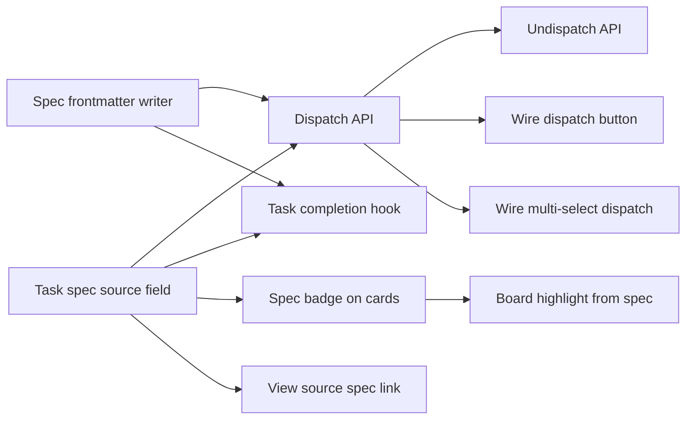

# Dispatch & Board Integration

## Design Problem

How does a validated spec become a board task, and how do the two views (spec mode and board mode) stay linked? Dispatch must translate spec content into a task prompt, wire `depends_on` edges from spec dependencies to task dependencies (via `dispatched_task_id`), and maintain bidirectional links so clicking a task navigates to its source spec and vice versa.

Key constraints:
- **Only validated leaf specs are dispatchable.** Non-leaf (design) specs must be broken down into child specs first. This preserves the integrity of progress tracking, drift propagation, and impact analysis — all of which assume leaf-level dispatch granularity. Dispatching a non-leaf would leave its children as orphaned specs with no connection to the executed work.
- **Dispatch and Break Down are complementary, not alternatives.** The focused view offers **Break Down** for specs that need decomposition and **Dispatch** for leaf specs that are ready for execution. A design spec goes through Break Down → child specs → Dispatch on each child.
- Dispatch creates a board task where `prompt = spec body` and `DependsOn` maps from spec `depends_on` to `dispatched_task_id` of sibling specs
- Multi-select dispatch (batch) must wire dependencies atomically
- Undispatch (cancel) clears `dispatched_task_id` and returns spec to `validated`
- Mode switching preserves context: board highlights tasks from focused spec's subtree; clicking a task's spec badge navigates to spec mode
- The spec's status moves to `complete` when its dispatched task completes

## Current State

The following infrastructure already exists:

- **Spec model field**: `DispatchedTaskID *string` in `internal/spec/model.go:70`, parsed from YAML frontmatter
- **Dispatch validation**: `internal/spec/validate.go` enforces that non-leaf specs cannot have `dispatched_task_id` and that no two specs share the same ID
- **Batch task API**: `POST /api/tasks/batch` in `internal/handler/tasks.go:242` supports symbolic `depends_on_refs`, topological sort (Kahn's algorithm), and cycle detection — ideal for multi-dispatch dependency wiring
- **UI stubs**: `dispatchFocusedSpec()` in `ui/js/spec-mode.js:476` and `dispatchSelectedSpecs()` in `ui/js/spec-explorer.js:531` are wired to the dispatch button and `d` keyboard shortcut but are no-op stubs
- **Planning agent template**: `internal/planner/commands_templates/dispatch.tmpl` exists as a placeholder for agent-mediated dispatch
- **Mode switching**: Fully implemented in `ui/js/spec-mode.js` with board/spec/docs modes and localStorage persistence
- **Spec SSE stream**: `GET /api/specs/stream` is active and consumed by the UI for real-time tree updates

## Decision: Atomic Dispatch API (A+B Hybrid)

Combines the reuse benefits of Option A (direct API call using existing `POST /api/tasks/batch`) with the atomicity of Option B (dedicated server-side endpoint that coordinates both task creation and spec update).

**Architecture**: A dedicated `POST /api/specs/dispatch` endpoint that performs two operations atomically:
1. **Create the board task** — reads the spec body, resolves dependency `dispatched_task_id` values, and calls into the existing task creation logic (reusing `POST /api/tasks/batch` internals)
2. **Update the spec file** — writes `dispatched_task_id` back into the spec's YAML frontmatter

Both succeed or both fail. The UI dispatch button calls this endpoint directly. The planning agent can also trigger the same endpoint via chat (nice-to-have), providing a conversational alternative where the agent can validate, check dependencies, and provide feedback before dispatching.

**Batch variant**: `POST /api/specs/dispatch` accepts a list of spec paths for multi-select dispatch. Dependency wiring across the batch is resolved atomically using the same topological sort logic from the batch task API.

### Task Completion Feedback

In practice, implementations almost never match specs exactly. Agents discover edge cases, simplify designs, add capabilities the spec didn't anticipate, or skip items that turn out to be unnecessary. This is normal — the spec is a plan, not a contract. The completion feedback system must handle divergence as the common case, not the exception.

Three-layer design separating immediate metadata, drift assessment, and iteration:

**Layer 1 — Server-side hook (deterministic).** When a task reaches `done`, the server checks if it was dispatched from a spec (via metadata linkage). It updates the spec file's frontmatter: `status` → `done` (not `complete` — see below), `updated` timestamp, and records the task's commit range. This is a reliable, instant metadata flip that requires no agent involvement.

Note: layer 1 sets `done`, not `complete`. The spec is not truly complete until layer 2 confirms the implementation satisfies the spec's intent, or the user explicitly accepts the divergence. This prevents premature `complete` status on specs whose implementations drifted significantly.

**Layer 2 — Drift assessment (non-deterministic).** After the server-side hook fires, an agent compares the task's actual implementation against the spec's acceptance criteria. It produces a structured drift report:

- **File-level drift**: compare spec's `affects` against files actually modified (from `git diff`). Flag unexpected files touched and expected files not touched.
- **Semantic drift**: for each acceptance criterion or "What to do" item, classify as satisfied, diverged, not implemented, or superseded.
- **Drift level**: minimal (>90% satisfied), moderate (70-90%), or significant (<70%).

The report is appended to the spec as an `## Outcome` section. Based on drift level:
- **Minimal**: spec transitions from `done` → `complete`. No action needed.
- **Moderate**: spec transitions to `complete` but the Outcome section documents divergences for future reference. Propagate drift warnings to parent specs and dependents (see [spec-state-control-plane.md](../../spec-state-control-plane.md)).
- **Significant**: spec transitions to `stale` instead of `complete`. The spec no longer accurately describes what was built and needs refinement before it can be considered done.

**Layer 3 — Iteration loop.** When layer 2 marks a spec `stale` (or the user judges the drift unacceptable), the spec re-enters the workflow:

1. `/wf-spec-refine` updates the spec to match what was actually built — removing satisfied items, updating diverged descriptions, adding unspecified work that should be documented.
2. If remaining work exists (items not implemented or superseded), the user can `/wf-spec-dispatch` again to create a follow-up task. The new task's prompt reflects the delta between the refined spec and the current implementation.
3. If the implementation is acceptable despite divergence, the user runs `/wf-spec-wrapup` to accept the Outcome and transition to `complete`.

This loop can repeat: dispatch → implement → assess drift → refine → re-dispatch. Each iteration narrows the gap between spec and implementation. The system doesn't force convergence — the user decides when "close enough" is good enough.

The three-layer split ensures specs always get timely metadata (layer 1), drift is assessed automatically when possible (layer 2), and the human stays in control of the accept/iterate decision (layer 3). Layer 2 is an extension point — the initial implementation can ship with layer 1 only, adding drift assessment later. Layer 3 requires no new infrastructure; it reuses existing `/wf-spec-refine` and `/wf-spec-dispatch`.

## Remaining Work

### Backend: Dispatch Endpoint

1. **Spec frontmatter writer** — Add `UpdateFrontmatter()` to `internal/spec/` that can write a single field (like `dispatched_task_id` or `status`) back to a spec file's YAML frontmatter without disturbing the markdown body. Currently the spec package only reads (`ParseFile`, `ParseBytes`).

2. **Dispatch API route** — Add `POST /api/specs/dispatch` to `internal/apicontract/routes.go`. Handler in `internal/handler/`. Request body: `{paths: []string, run: bool}`. The handler:
   - Reads and validates each spec (must be `validated` status)
   - Resolves `depends_on` → `dispatched_task_id` for each spec's dependencies
   - Creates tasks via existing batch creation logic (reuse `handleBatchCreate` internals from `internal/handler/tasks.go`)
   - Writes `dispatched_task_id` back to each spec file atomically
   - Returns created task IDs and any errors

3. **Undispatch API route** — Add `POST /api/specs/undispatch` (or `DELETE /api/specs/{path}/dispatch`). Cancels the linked board task, clears `dispatched_task_id`, and returns the spec to `validated` status.

4. **Spec-to-task metadata linkage** — Store the source spec path on the task so the reverse link (task → spec) works. Options: a label field on the Task model (`SpecSourcePath string`), or task metadata. This must survive task archival and soft-delete.

5. **Task completion hook (layer 1)** — In `internal/store/` or `internal/runner/`, when a task transitions to `done`, check for spec linkage and update the spec file's `status` to `done` (not `complete`) and `updated` timestamp via `UpdateFrontmatter()`. Record the task's commit range in the spec frontmatter or a sidecar file so layer 2 can find the diff.

6. **Drift assessment (layer 2, extension point)** — After the completion hook fires, optionally trigger a drift assessment. Two sub-steps:
   - **File-level drift**: compare spec `affects` against `git diff` of the task's commits. Mechanical, can run server-side.
   - **Semantic drift**: agent classifies each acceptance criterion as satisfied/diverged/not-implemented/superseded. Requires sandbox.
   Append an `## Outcome` section to the spec. Transition: minimal drift → `complete`, moderate → `complete` with warnings propagated to parent and dependents (feeds into [spec-state-control-plane.md](../../spec-state-control-plane.md)), significant → `stale`. Initial implementation can defer this — the hook in item 5 is sufficient for launch; the user can run `/diff` manually.

7. **Iteration support (layer 3)** — No new backend work. The iteration loop (`stale` → `/wf-spec-refine` → `/wf-spec-dispatch`) reuses existing infrastructure. The dispatch endpoint must accept re-dispatch of a spec whose `dispatched_task_id` was previously set (clear the old link, create a new task).

### Frontend: Dispatch UI

8. **Wire dispatch button** — Implement `dispatchFocusedSpec()` in `ui/js/spec-mode.js:476` to call `POST /api/specs/dispatch` with the focused spec's path. Show loading state, handle errors, and update the spec tree on success.

9. **Wire multi-select dispatch** — Implement `dispatchSelectedSpecs()` in `ui/js/spec-explorer.js:531` to call the batch dispatch endpoint with all selected spec paths.

10. **Spec badge on task cards** — In `ui/js/render.js`, render a small badge on task cards that were dispatched from a spec. Clicking the badge navigates to spec mode with that spec focused.

11. **"View Source Spec" link in task modal** — In `ui/js/modal-core.js`, add a link to the source spec when the task has spec metadata. Clicking navigates to spec mode.

12. **Board highlight from spec context** — When viewing a spec in focused mode, highlight its dispatched task(s) on the board. When switching to board mode from a focused spec, scroll to / filter for the relevant tasks.

### Agent Integration (Nice-to-Have)

13. **Planning agent dispatch command** — Update `internal/planner/commands_templates/dispatch.tmpl` so the `/dispatch` slash command calls the atomic `POST /api/specs/dispatch` endpoint instead of manually updating frontmatter. The agent can validate prerequisites and provide feedback before triggering the API call.

## Outcome

The dispatch & board integration is fully implemented with layer 1 completion feedback. Validated leaf specs can be dispatched as board tasks via the UI or batch API, with bidirectional navigation (task → spec badge, spec → board highlight) and automatic spec status updates on task completion.

### What Shipped

- **2 API endpoints**: `POST /api/specs/dispatch` (atomic batch dispatch with dependency wiring, rollback on failure) and `POST /api/specs/undispatch` (cancel task, clear linkage, return to validated) in `internal/handler/specs_dispatch.go`
- **Spec frontmatter writer**: `spec.UpdateFrontmatter()` in `internal/spec/write.go` — updates individual YAML fields via `yaml.Node` without disturbing markdown body, atomic writes
- **Task model field**: `SpecSourcePath string` on `Task` for reverse linkage (task → spec)
- **Leaf detection**: `spec.IsLeafPath()` in `internal/spec/leaf.go` — filesystem-based check for child specs
- **Completion hook**: `Store.OnDone` callback fires when tasks reach `done`, updates spec status to `complete` via `SpecCompletionHook`
- **Frontend**: dispatch button (single + multi-select), spec badge on task cards (purple, clickable), "View Source Spec" link in task modal, board highlight with indigo glow animation on mode switch
- **Tests**: 13 backend tests for UpdateFrontmatter, 4 for IsLeafPath, 9 for dispatch handler, 4 for undispatch, 4 for completion hook, 4 for SpecSourcePath persistence; 5+6 frontend tests for dispatch buttons, 3 for spec badge, 2 for modal link, 2 for board highlight

### Design Evolution

1. **Leaf-only dispatch enforced**: The original spec said "any validated spec is dispatchable — both design specs (non-leaf) and implementation specs (leaf)." This was implemented initially but reverted after discovering it broke progress tracking, drift propagation, and impact analysis — all of which assume leaf-level dispatch granularity. The `checkDispatchConsistency` validation rule was restored.

2. **Simplified topological sort**: The spec suggested reusing Kahn's algorithm from the batch task API. Since dependencies are resolved via pre-assigned UUIDs before creation, sequential creation produces correct results without topological sorting.

3. **Callback pattern for completion hook**: The spec suggested adding `specRootDirs []string` to the Store. The implementation uses a `Store.OnDone func(Task)` callback set by the server layer, keeping the store decoupled from workspace and spec packages.

4. **Layer 1 sets `complete` directly**: The spec called for an intermediate `done` status with layer 2 confirming `complete`. Since drift assessment (layer 2) is deferred, the hook sets `complete` directly. When layer 2 is implemented, this will be updated to use an intermediate status.

5. **`ValidateSpec` signature change**: Removing then re-adding `checkDispatchConsistency` caused the `isLeaf` parameter to be temporarily removed and then restored on `ValidateSpec`.

## Open Questions

1. Should the dispatch button be visible only on the focused view, or also available as a context menu action in the spec explorer?
2. When multi-dispatching, should the system enforce that all selected specs' dependencies are either also being dispatched or already have `dispatched_task_id` set? Or allow dispatching specs with unresolved dependencies (the board task will block on unmet deps)?
3. When a dispatched task fails and is retried, does the spec stay linked to the same task UUID or get re-dispatched as a new task?

## Task Breakdown

| Child spec | Depends on | Effort | Status |
|------------|-----------|--------|--------|
| [Spec frontmatter writer](dispatch-workflow/spec-frontmatter-writer.md) | — | small | **complete** |
| [Task spec source field](dispatch-workflow/task-spec-source-field.md) | — | small | **complete** |
| [Dispatch API endpoint](dispatch-workflow/dispatch-api.md) | spec-frontmatter-writer, task-spec-source-field | medium | **complete** |
| [Undispatch API endpoint](dispatch-workflow/undispatch-api.md) | dispatch-api | small | **complete** |
| [Task completion hook](dispatch-workflow/task-completion-hook.md) | spec-frontmatter-writer, task-spec-source-field | small | **complete** |
| [Wire dispatch button](dispatch-workflow/wire-dispatch-button.md) | dispatch-api | small | **complete** |
| [Wire multi-select dispatch](dispatch-workflow/wire-multi-select-dispatch.md) | dispatch-api | small | **complete** |
| [Spec badge on cards](dispatch-workflow/spec-badge-on-cards.md) | task-spec-source-field | small | **complete** |
| [View source spec link](dispatch-workflow/view-source-spec-link.md) | task-spec-source-field | small | **complete** |
| [Board highlight from spec](dispatch-workflow/board-highlight-from-spec.md) | spec-badge-on-cards | small | **complete** |

**Parallelism:** Tasks A and B have no dependencies and can run in parallel. After they complete, C, E, H, and I can all run in parallel. After C completes, D, F, and G can run in parallel.

**Deferred items:** Drift assessment (layer 2, item 6 in Remaining Work), iteration support (layer 3, item 7), and planning agent dispatch command (item 13) are not included in this breakdown. Layer 2 is an explicit extension point. Layer 3 reuses existing infrastructure. The agent command is nice-to-have.

## Affects

- `internal/apicontract/routes.go` — new dispatch/undispatch routes
- `internal/handler/` — dispatch handler (new file or extension of existing)
- `internal/spec/` — `UpdateFrontmatter()` for writing fields back to spec files
- `internal/store/models.go` — `SpecSourcePath` field on Task for reverse linkage
- `internal/store/` or `internal/runner/` — task completion hook for spec status update
- `ui/js/spec-mode.js` — wire `dispatchFocusedSpec()`
- `ui/js/spec-explorer.js` — wire `dispatchSelectedSpecs()`
- `ui/js/render.js` — spec badge on task cards
- `ui/js/modal-core.js` — "View Source Spec" link
