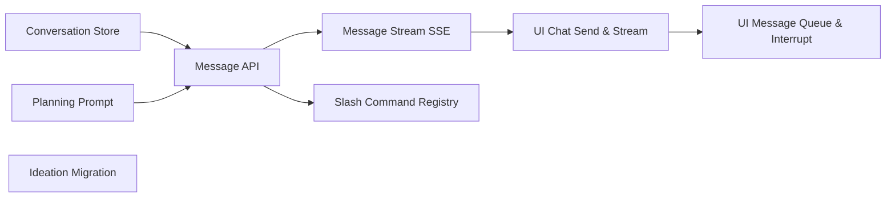

# Planning Chat Agent

## Design Problem

How does the chat-driven iteration model work end-to-end? The right pane of spec mode is a conversation stream where the user types directives and the agent executes immediately — reading the codebase, writing spec files, breaking down specs, updating entry-point documents. This is fundamentally different from the existing task execution model (fire-and-forget prompt → wait for completion). The planning agent is interactive: each user message gets a response, the agent's writes appear live in the explorer and focused view, and the conversation persists globally across spec switches and sessions.

Key constraints:
- The agent runs inside the planning sandbox (per the planning-sandbox sub-design, already implemented in `internal/planner/`)
- Zero permission prompts — the agent writes to `specs/` autonomously
- Global conversation persistence across spec switches and sessions — agent state via Claude Code's `--resume` session (persisted in the container's `claude-config` volume), UI replay log in `~/.wallfacer/planning/`
- The agent has full read access to the workspace codebase (not just specs)
- Agent has spec-creation skills (API endpoint, refactor, bug fix, migration patterns)
- Agent proactively updates entry-point documents on spec status changes
- Slash commands (`/summarize`, `/break-down`, `/create`, etc.) trigger structured agent skills, similar to Claude Code's `/command` pattern

## Current State

The following infrastructure is already implemented:

- **Planning sandbox container** (`internal/planner/`): Long-lived worker container keyed by workspace fingerprint. `Planner.Exec()` runs commands inside the container via the `sandbox.Backend` worker mechanism. Full workspace mounted read-only with `specs/` read-write override. API: `GET/POST/DELETE /api/planning`.
- **Spec mode UI shell** (`ui/js/spec-mode.js`, `ui/css/spec-mode.css`): Three-pane layout with explorer, focused markdown view, and chat stream area. Mode switching between Board and Specs. Deep-linking via `#spec/<path>`.
- **Ideation agent** (`internal/runner/ideate.go`, `internal/handler/ideate.go`): Runs brainstorm analysis in ephemeral containers. Parses JSON results, manages ideation history in `{dataDir}/ideation-history.jsonl`.
- **SSE streaming** (`internal/handler/stream.go`): Task log streaming, refinement log streaming, task list push updates.

## Design

### Approach: Headless Claude Code over Container Exec

The planning agent is not a custom LLM orchestrator — it wraps Claude Code's headless mode inside the existing planning container. The same `-p <prompt> --output-format stream-json` invocation pattern used by task execution (`internal/runner/container.go`) applies here. Multi-turn conversation uses `--resume <session-id>` to continue the same Claude Code session across user messages. Codex compatibility is out of scope — see `specs/local/spec-coordination/spec-planning-ux/planning-codex-compat.md` for a follow-up.

This approach is chosen because:
- Claude Code already handles conversation context, tool use, file reading/writing, and context window management internally — the server doesn't need to reimplement any of this
- The `--resume` flag carries session state across turns; Claude Code persists sessions in `~/.claude/` inside the container, which is already a named volume (`claude-config`) that survives container restarts
- The `--output-format stream-json` output is already parsed by the task runner's log infrastructure — the same parsing works for planning responses
- System prompt customization is done via `CLAUDE.md` / `--system-prompt` flags, matching existing patterns

### Unified Planning Worker

The planning worker container and the ideation agent should share a single long-lived worker. Currently ideation runs in ephemeral containers (`internal/runner/ideate.go` builds a `ContainerSpec` per run). Instead:

- The `Planner` manages the single long-lived container for both planning conversation and ideation runs
- Ideation uses `Planner.Exec()` with the ideation prompt instead of spawning its own container
- This eliminates container startup overhead for ideation (~2-5s per run) and consolidates the container lifecycle into one place
- The planner container already has the correct mounts (full workspace RO, specs RW) — ideation only needs RO, which is a subset
- Ideation history (`ideation-history.jsonl`) continues to be managed by the runner; only the container launch path changes

### Conversation Persistence

Two layers of persistence:

**Agent-side (inside container):** Claude Code's own session state lives in the `claude-config` named volume at `~/.claude/` inside the container. The `--resume <session-id>` flag tells Claude Code to continue from where it left off, including its internal conversation history and context window management. This survives container restarts (the planning container is a long-lived worker) and gives us multi-turn context for free.

**Server-side (for UI replay):** The server maintains a conversation log in `~/.wallfacer/planning/<fingerprint>/`:

- **`messages.jsonl`** — append-only log of user messages and parsed agent responses (role, content, timestamp, focused spec path). This is for the UI to display conversation history — the actual agent context is managed by Claude Code internally.
- **`session.json`** — maps the workspace fingerprint to the active Claude Code session ID, plus metadata (last active timestamp, focused spec). When the user reopens the application, the server reads this to resume the same session via `--resume`.
- One directory per workspace fingerprint, matching the planning container keying
- On application startup, the server loads the message log and serves it to the UI; the next user message resumes the Claude Code session via `--resume`

### Message Flow

1. User types message in the chat stream pane
2. `POST /api/planning/messages` sends the message to the server
3. Server appends user message to `messages.jsonl`
4. Server builds the exec args: `-p <message> --output-format stream-json --resume <session-id>` (or without `--resume` for the first message in a new session)
5. `Planner.Exec()` runs the command inside the planning container — same as task execution but through the worker container
6. Agent stdout (`stream-json` events) streams back via SSE (`GET /api/planning/messages/stream`); the server parses these using the same log parsing infrastructure as `StreamLogs`
7. Claude Code reads/writes files autonomously inside the container — spec files are written directly since `specs/` is mounted read-write
8. Server extracts the session ID from the first response event and stores it in `session.json` for future `--resume` calls
9. Server parses the final response text and appends it to `messages.jsonl` for UI replay
10. `ExplorerStream` and `SpecTreeStream` detect the file changes automatically within their polling cycle

### System Prompt

A `CLAUDE.md` file is generated and mounted into the planning container (or passed via `--system-prompt`) to establish the agent's role. This follows the same pattern as the workspace `AGENTS.md` for task containers:

- **Identity**: Spec writer and planning assistant, not a code implementer
- **Permissions**: Read all workspace files, write only to `specs/` directories
- **Skills**: Slash-command skill set (see "Slash Commands" section below)
- **Conventions**: Spec document model (frontmatter schema, lifecycle states, DAG rules), naming conventions, track organization
- **Context injection**: The focused spec path and current spec tree summary are included in each `-p` prompt, not the system prompt — this allows per-message context without restarting the session

The system prompt template lives in `internal/prompts/planning.tmpl` and is rendered once when the planning session starts. Per-message context (focused spec, slash command expansion) is prepended to the `-p` prompt text.

### Live File Update Detection

File change detection reuses existing infrastructure — no new filesystem watching needed:

- **`ExplorerStream`** (`GET /api/explorer/stream`) already polls workspace directories every 3s and sends `refresh` events when file fingerprints change. When the planning agent writes spec files, this stream automatically detects the changes.
- **`SpecTreeStream`** (`GET /api/specs/stream`) already polls spec directories every 3s and sends `snapshot` events when the spec tree changes. Spec status updates, new spec files, and frontmatter edits are all picked up automatically.
- The planning messages stream (`GET /api/planning/messages/stream`) only needs to carry the agent's response text — it does not duplicate file-change detection. It is closer in nature to `StreamLogs` (live container stdout) than to the explorer/spec SSE endpoints.
- Optionally, the agent response can include a `modified_files` hint in a structured footer so the UI can trigger an immediate refresh instead of waiting for the next 3-second poll cycle.

### Slash Commands

The chat input supports `/command` syntax, modeled after Claude Code's skills pattern. When the user types a slash command, the UI shows an autocomplete menu of available commands. The selected command expands into a structured prompt that the agent executes with specific instructions and output format expectations.

Built-in slash commands for the planning agent:

| Command | Description |
|---------|-------------|
| `/summarize [words]` | Produce a structured summary of the focused spec under the given word limit (default 200) |
| `/break-down` | Decompose the focused spec into sub-specs or implementation tasks |
| `/create <title>` | Create a new spec file with proper frontmatter in the appropriate track |
| `/status <state>` | Update the focused spec's status and propagate changes to `specs/README.md` |
| `/validate` | Check the focused spec against the document model rules (frontmatter, DAG, naming) |
| `/impact` | Analyze what existing code and specs the focused spec would affect |
| `/dispatch` | Prepare the focused spec for dispatch to the task board (set `dispatched_task_id`) |

**Implementation**: Each slash command is defined as a template in `internal/prompts/planning/` (e.g., `summarize.tmpl`, `breakdown.tmpl`). The server expands the command into a full prompt before passing it to `Planner.Exec()`. The UI sends the raw `/command args` text; the server intercepts the leading `/`, looks up the matching template, renders it with the current context (focused spec, tree state), and prepends it to the exec payload. From the agent's perspective, a slash command is just a well-structured user message.

**Extensibility**: New slash commands are added by dropping a template file and registering it in a command registry. The `GET /api/planning/commands` endpoint returns the available commands for UI autocomplete.

### Entry-Point Auto-Update

When a slash command or free-form directive changes a spec's status (e.g., `drafted` → `validated`), the agent proactively updates `specs/README.md` in the same turn. The system prompt instructs the agent to maintain consistency between individual spec frontmatter and the entry-point status tables. This is enforced as a convention in the prompt, not a server-side hook.

### Context Window Management

Claude Code manages its own context window internally via the `--resume` session mechanism — the server does not need to implement sliding windows, summarization, or token counting. Claude Code's built-in context compression handles long sessions automatically.

The server's only responsibility is:
- Storing the session ID so `--resume` works across application restarts
- Starting a new session (dropping `--resume`) if the user explicitly clears the conversation via `DELETE /api/planning/messages`, which also clears `messages.jsonl`

## New API Endpoints

- `GET /api/planning/messages` — Retrieve conversation history (supports pagination via `?before=<timestamp>`)
- `POST /api/planning/messages` — Send a user message or slash command, triggers agent exec
- `GET /api/planning/messages/stream` — SSE: stream the agent's response tokens + modified-files events
- `DELETE /api/planning/messages` — Clear conversation history (with confirmation)
- `GET /api/planning/commands` — List available slash commands with descriptions (for UI autocomplete)

### Concurrent Access & Message Queue

Claude Code's headless mode (`-p`) is single-shot: one prompt in, one response out. There is no way to inject messages into a running invocation. The design uses a client-side message queue with interrupt semantics:

- While the agent is responding, the user can continue typing and submitting messages. Queued messages appear visually in the chat input area (stacked below the input box), not yet sent to the server.
- The user can **edit** or **remove** a queued message before it is sent. Clicking a queued message opens it for inline editing; a dismiss button removes it from the queue.
- The user can **interrupt** the current agent turn (kills the in-flight exec process). This is not a session termination — the next message still uses `--resume` with the same session ID, so the agent retains full context from all previous turns including the partial interrupted one. The interrupted response (whatever was streamed so far) is shown in the chat as a truncated message.
- When the agent finishes responding (or is interrupted), the next queued message is sent automatically via `POST /api/planning/messages`.
- The server processes one message at a time — the queue lives entirely in the UI. `POST /api/planning/messages` returns **409 Conflict** if an exec is already in flight, which the UI handles by keeping the message in the queue and retrying after the current response completes or is interrupted.

## Affects

- `internal/planner/` — conversation dispatch, history management, context windowing
- `internal/prompts/` — new `planning.tmpl` system prompt
- `internal/handler/` — new endpoints for planning messages and streaming
- `internal/runner/` — ideation refactored to use `Planner.Exec()` instead of ephemeral containers
- `ui/js/` — chat stream component (message input, response rendering, live file change indicators)
- `~/.wallfacer/planning/` — conversation persistence storage

## Task Breakdown

| Child spec | Depends on | Effort | Status |
|------------|-----------|--------|--------|
| [Conversation Store](planning-chat-agent/conversation-store.md) | — | medium | **complete** |
| [Planning System Prompt](planning-chat-agent/planning-prompt.md) | — | small | **complete** |
| [Ideation Migration](planning-chat-agent/ideation-migration.md) | — | medium | validated |
| [Message API Endpoints](planning-chat-agent/message-api.md) | conversation-store, planning-prompt | medium | validated |
| [Message Stream SSE](planning-chat-agent/message-stream.md) | message-api | medium | validated |
| [Slash Command Registry](planning-chat-agent/slash-command-registry.md) | message-api | medium | validated |
| [UI Chat Send and Stream](planning-chat-agent/ui-chat-send-stream.md) | message-stream | medium | validated |
| [UI Message Queue and Interrupt](planning-chat-agent/ui-message-queue.md) | ui-chat-send-stream | medium | validated |

