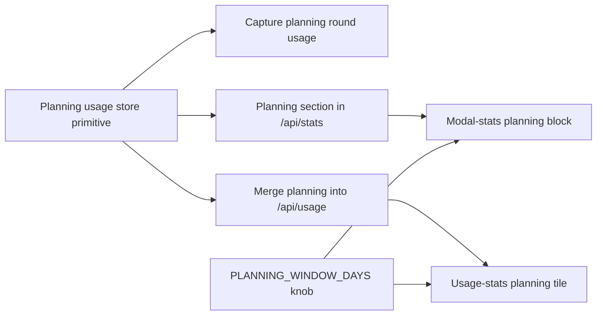

# Planning Cost Tracking

## Design Problem

How is planning sandbox cost recorded and surfaced alongside the existing
board execution cost analytics? Planning is a separate, orthogonal cost
dimension from kanban task execution:

- **Board execution cost is already tracked and solved.** Kanban tasks accrue
  per-turn `TurnUsageRecord`s and per-activity `UsageBreakdown` rows;
  `GET /api/stats` aggregates these by workspace, activity, status, and
  failure category; `modal-stats.js` renders it. This spec does not change any
  of that.
- **Planning cost is currently not captured at all.** The planning sandbox
  (`internal/planner/`, `internal/handler/planning.go`) runs an agent turn
  per user message round but discards usage after streaming the response.
  There is no persisted record, no aggregate, no dashboard row.

The only remaining question is how planning usage is captured and where it
appears in the existing analytics UI — without disturbing the solved
execution-cost path.

Decisions baked in by feedback:

- **Unit of attribution is the message round.** Each round produces one usage
  record regardless of how many specs the round modifies. Splitting a round's
  cost across multiple specs is explicitly out of scope.
- **Aggregation key is the workspace group.** A planning session is scoped to
  exactly one group (via `internal/workspace/groups.go::GroupKey`); its
  per-round usage rolls up to that group.
- **Planning cost appears in the existing usage analytics surface**
  (`modal-stats.js` / `usage-stats.js`) as a new, clearly-labelled planning
  section, distinct from — and additive to — the existing execution
  breakdowns.

## Already Implemented (out of scope)

These pieces are done; this spec does not touch them:

- Recursive spec progress: `internal/spec/progress.go` (`NodeProgress`,
  `TreeProgress`), exposed via `GET /api/specs/tree`, rendered by
  `ui/js/spec-mode.js`, live via `GET /api/specs/stream`.
- Board execution cost model: `TaskUsage`, `TurnUsageRecord`,
  `UsageBreakdown map[SandboxActivity]TaskUsage` in
  `internal/store/models.go`.
- Board execution analytics: `GET /api/stats`
  (`internal/handler/stats.go`) with `ByWorkspace`, `ByActivity`,
  `ByStatus`, `ByFailureCategory`, top-tasks, and daily rollup; `GET /api/usage`
  (`internal/handler/usage.go`) with `ByStatus` / `BySubAgent`.
- Sandbox activity enum: the `planning` `SandboxActivity` constant already
  exists and is routable, but nothing writes usage under it yet.

## Shape of the Solution

Planning is its own track. A round is not a task — no board state, no
worktree, no commit lifecycle — so planning usage is a new *record type*
keyed by workspace group, with no coupling to the `Task` record. It still
lives in `internal/store/` (that's the persistence package), just in its
own file alongside the existing per-task storage, reusing the atomic-write
and JSON helpers already there. "Shoehorn into a synthetic `Task`" was
considered and rejected as a category error that would force
`kind = "planning"` filters into every task-facing read path just to
inherit an append-file helper.

### Decision 1 — Per-round record shape

**Reuse `TurnUsageRecord`.** The fields are identical in meaning for a
planning round: `Turn` is the round number, `Timestamp` is when the round
happened, the token/cost fields map one-for-one, `StopReason` uses the
same set, `Sandbox` names the runtime, and `SubAgent` is fixed to
`"planning"`. No new type, no duplicated JSON shape, no duplicated cost
math — existing helpers that already sum `TurnUsageRecord`s work as-is.

A separate `PlanningRoundUsage` type was considered for "decoupled
evolution" but rejected: the fields genuinely match today, and a future
task-specific field on `TurnUsageRecord` would be a smell even for tasks
(the right move would be to split the record, not fork planning). The
coupling cost here is real; the decoupling benefit is speculative.

### Decision 2 — File layout

One file per group: `~/.wallfacer/planning/<group-key>/usage.jsonl`. This
falls out of the earlier decision to aggregate by workspace group — the
group is already the primary key for both storage and reporting, so the
directory layout mirrors it. Records don't need to carry a `group_key`
field (the path has it), deletion/inspection per group is a single `rm`,
and the planning-sandbox container itself is already scoped per group.

`<group-key>` must be path-safe; use a short hash of the sorted path
list (e.g., SHA-256 truncated), matching the fingerprint scheme
`~/.wallfacer/instructions/` already uses.

### Decision 3 — Where the read/write API lives inside `internal/store/`

A new `planning_usage.go` directly under `internal/store/`, alongside the
existing task-storage files. It exports
`AppendPlanningUsage(groupKey, record)` and
`ReadPlanningUsage(groupKey, since) []TurnUsageRecord`. Both
`internal/planner/` (writes) and `internal/handler/stats.go` (reads)
import from `store`, the same way they do for tasks. No new package —
the code is small (~one file plus tests) and reuses the package's
atomic-write and JSON helpers. A `store/planningusage/` sub-package is
available later if the format grows, but premature fencing offers no
immediate benefit.

### UI surface (orthogonal to the above)

Planning cost lands in the UI as a new "Planning" block in
`modal-stats.js` — a sibling to the existing `ByWorkspace` / `ByActivity`
sections — listing one row per workspace group with tokens, cost, round
count, and a per-round sparkline driven by each record's `Timestamp`.
`usage-stats.js` also gets a planning tile in its period-picker view, fed
by `BySubAgent["planning"]` in `/api/usage`.

### Display window, not retention

The storage layer never deletes. Planning usage records accumulate
indefinitely in `~/.wallfacer/planning/<group-key>/usage.jsonl` — there is
no tombstone, no compaction, no mirrored
`WALLFACER_TOMBSTONE_RETENTION_DAYS`. The data is small (one line per
round, bounded by user typing speed) so unbounded growth is acceptable for
the foreseeable future.

Scoping is a *read-side* concern. Both the stats API and the UI already
use a "days" window (`/api/usage?days=N`, the 7/30/0-day picker in
`usage-stats.js`); planning reads reuse the same pattern:
`ReadPlanningUsage(groupKey, since time.Time)` filters on `Timestamp`.
The default window is configurable via a new env/settings knob
(`WALLFACER_PLANNING_WINDOW_DAYS`, default matching the existing
period-picker default), editable from the Settings panel. Users can still
override per-request via the period picker in the stats modal.

## Task Breakdown

| Child spec | Depends on | Effort | Status |
|------------|-----------|--------|--------|
| [Planning usage store primitive](progress-cost-tracking/planning-usage-store.md) | — | small | **complete** |
| [Capture planning round usage](progress-cost-tracking/capture-planning-round-usage.md) | planning-usage-store | medium | **complete** |
| [Planning section in /api/stats](progress-cost-tracking/stats-planning-section.md) | planning-usage-store | medium | **complete** |
| [Merge planning into /api/usage BySubAgent](progress-cost-tracking/usage-planning-merge.md) | planning-usage-store | small | **complete** |
| [WALLFACER_PLANNING_WINDOW_DAYS config knob](progress-cost-tracking/planning-window-config.md) | — | small | **complete** |
| [Planning block in modal-stats.js](progress-cost-tracking/modal-stats-planning-block.md) | stats-planning-section, planning-window-config | medium | **complete** |
| [Planning tile in usage-stats.js](progress-cost-tracking/usage-stats-planning-tile.md) | usage-planning-merge, planning-window-config | small | validated |

Parallelism: once the store primitive lands, {capture, stats endpoint,
usage endpoint, env knob} run in parallel. UI blocks run in parallel
once their respective backend and config dependencies are in.

## Affects

- `internal/planner/` — capture per-round usage from the agent exec result
  and call into `internal/store/` to persist it.
- `internal/handler/planning.go` — wire usage capture into the message
  round handler.
- `internal/store/` — new `planning_usage.go` (or `planningusage/`
  sub-package, per Decision 3) with append/read/aggregate for planning
  usage records. Independent of the `Task` record but shares the
  package's existing atomic-write and JSON helpers.
- `internal/handler/stats.go` — additive only: append a `Planning` section
  (keyed by workspace group) to `StatsResponse`. No changes to
  `ByWorkspace` / `ByActivity` / `ByStatus` buckets.
- `internal/handler/usage.go` — optional: surface `planning` in
  `BySubAgent` alongside existing activities.
- `ui/js/modal-stats.js` — render the new `Planning` block beside the
  existing execution breakdowns; the execution blocks stay unchanged.
- `ui/js/usage-stats.js` — optional: add a planning tile to the
  period-picker view if `BySubAgent` is populated.
