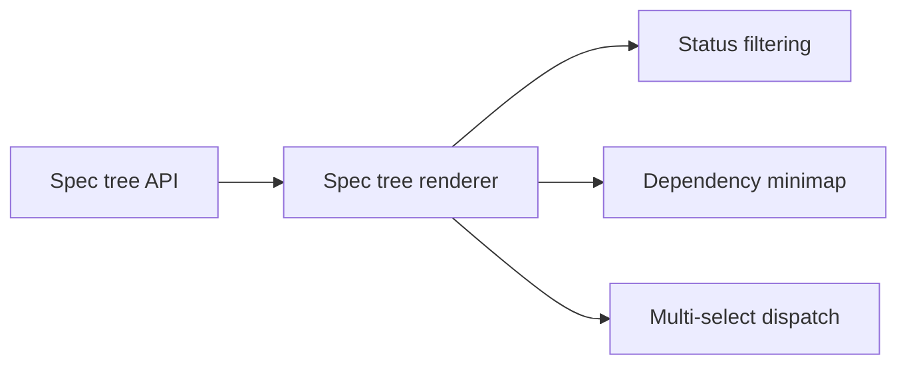

# Spec Explorer & Dependency Minimap

## Design Problem

How should the spec explorer render the spec tree with status badges, recursive progress indicators, and a dependency minimap — while reusing the existing file explorer infrastructure? The current file explorer (`explorer.js`, `internal/handler/explorer.go`) is a generic directory browser. The spec explorer needs spec-aware rendering: status icons, `done/total` leaf counts, collapsible subtrees, status filtering, multi-select for batch dispatch, and a dependency graph overlay.

Key constraints:
- Reuses file explorer infrastructure (tree rendering, lazy-load, resize) but with a fixed root at `specs/`
- Must show recursive progress (e.g., "4/6") by aggregating all leaves in a subtree — not just direct children
- Status badges derive from spec frontmatter, which requires parsing YAML on the server side
- The "Show workspace files" toggle expands the tree to include the full workspace
- Multi-repo workspace groups show a spec forest (one tree per repo, grouped)
- The dependency minimap renders the focused spec's upstream/downstream neighborhood

## Context

The existing file explorer (`ui/js/explorer.js`) uses:
- `fetchTreeNode()` API calls for lazy directory listing
- 3-second polling for refresh (not server-pushed)
- localStorage persistence for open/closed state and panel width
- `_expandNode()` for on-demand child loading

The backend handler (`internal/handler/explorer.go`) provides:
- `ExplorerTree(path, workspace)` — returns one directory level: `{name, type, size, modified}`
- No spec-awareness — returns raw filesystem entries

The spec system (`internal/spec/`) already provides:
- `spec.BuildTree()` — walks `specs/` recursively, builds `tree.Tree[string, *Spec]`
- `spec.Progress()` — recursive leaf count aggregation
- `spec.ComputeImpact()` — reverse dependency graph
- `spec.ValidateSpec()` — frontmatter validation

## Options

**Option A — Extend existing explorer API.** Add a `?mode=specs` parameter to `GET /api/explorer/tree`. When set, the handler parses spec frontmatter for each `.md` file and returns enriched entries: `{name, type, status, effort, progress: {done, total}, dispatched}`. The frontend uses these extra fields to render badges.

- Pro: Minimal API surface change. Frontend reuses most of the tree rendering logic.
- Con: Per-request frontmatter parsing is expensive for large spec trees. The explorer API becomes spec-aware, mixing concerns.

**Option B — Dedicated spec tree API.** A new endpoint (`GET /api/specs/tree`) returns the full spec tree in one response (pre-built via `spec.BuildTree()`). Includes frontmatter, progress, and dependency edges for all specs. The frontend renders the tree from this single payload.

- Pro: One request, full tree. Progress and dependency data are pre-computed server-side. Frontend has all data for minimap rendering without additional API calls. Matches the `internal/spec/` package design (tree-at-once, not per-node).
- Con: Larger payload for big spec trees. No lazy-loading — the full tree is always sent. Doesn't reuse the explorer API.

**Option C — Hybrid: spec tree API + explorer fallback.** The spec tree API returns the spec tree with metadata. When "Show workspace files" is toggled, the non-spec portions of the tree fall back to the existing explorer API for lazy directory listing.

- Pro: Spec data is fast (pre-built tree). Non-spec workspace browsing is lazy (existing infra). Clean separation of spec-aware and generic file browsing.
- Con: Two data sources for one tree view. Merging spec tree nodes and explorer nodes in the frontend adds complexity.

### Minimap Rendering

**Option X — Client-side graph layout.** The frontend receives dependency edges from the spec tree API and renders the minimap using a JS graph layout library (e.g., dagre, ELK.js, or a simple force-directed layout). The minimap is an SVG or canvas element below the explorer.

- Pro: Interactive (click-to-navigate, hover for details). Layout adapts to node count. No server dependency for rendering.
- Con: Adds a JS dependency. Layout quality varies with graph shape. Performance concern for large graphs.

**Option Y — Server-rendered Mermaid.** The server generates a Mermaid graph definition from the dependency neighborhood. The frontend renders it using the existing Mermaid integration (if any) or a Mermaid-to-SVG renderer.

- Pro: Declarative, consistent layout. Mermaid is already used in spec documents (the README has Mermaid graphs).
- Con: Mermaid rendering is heavyweight. Limited interactivity (click-to-navigate requires post-processing the SVG). Not ideal for dynamic neighborhood changes.

**Option Z — Custom minimal renderer.** A purpose-built renderer that draws the 1-2 hop neighborhood as a simple left-to-right or top-to-bottom flow. Nodes are colored rectangles, edges are lines. No layout library — positions computed from the DAG structure.

- Pro: Tiny, fast, no dependencies. Tailored to the specific use case (small neighborhood graph, not arbitrary DAGs). Full control over click handling and styling.
- Con: Must handle edge cases (wide graphs, cycles in display, long labels). More custom code to maintain.

## Open Questions

1. Should the spec tree be pushed via SSE (like task updates) or polled? SSE would give instant updates when the agent modifies specs, but adds a new stream. Polling (like the current explorer) is simpler but has a 3-second lag.
2. How does the spec explorer handle multi-repo spec forests? Show repo names as top-level groups, or interleave specs by track across repos?
3. Should status filtering (show only stale/in-progress/not-started specs) be a dropdown, toggle buttons, or part of the command palette?
4. For the minimap, what's the right neighborhood depth? 1 hop shows immediate dependencies; 2 hops gives broader context but may be cluttered. Should it be configurable?
5. Multi-select for batch dispatch: checkboxes on each leaf, shift-click range select, or a "select mode" toggle? How does multi-select interact with the focused view (which spec is shown)?

## Affects

- `internal/handler/explorer.go` — either extended with `?mode=specs` or a new spec tree handler created alongside
- `internal/handler/` — new `specs.go` handler if a dedicated API is chosen
- `internal/spec/` — may need a `SerializeTree()` or `ToJSON()` method for API responses
- `ui/js/explorer.js` — spec-aware rendering, status badges, progress indicators, or a new `spec-explorer.js`
- `ui/js/` — new minimap component (SVG/canvas renderer)
- `ui/index.html` — minimap container element

## Design Decisions

**Spec tree data: Option B — Dedicated spec tree API.** `GET /api/specs/tree` returns the full tree in one response, pre-built via `spec.BuildTree()`. Progress and dependency edges included. When "Show workspace files" is toggled, workspace files fall back to the existing explorer API (Option C hybrid).

**Minimap: Option Z — Custom minimal renderer.** A purpose-built SVG renderer for the 1-hop dependency neighborhood. No layout library dependency. Nodes are colored rectangles, edges are lines, click-to-navigate. Tiny and fast.

**Spec tree updates:** Polling (3-second interval, same as existing explorer). SSE can be added later if the lag is noticeable during active planning.

## Task Breakdown

| Child spec | Depends on | Effort | Status |
|------------|-----------|--------|--------|
| [Spec tree API endpoint](spec-explorer/spec-tree-api.md) | — | medium | complete |
| [Spec tree renderer with status badges](spec-explorer/spec-tree-renderer.md) | spec-tree-api, mode-state-and-switching | medium | complete |
| [Status filtering](spec-explorer/status-filtering.md) | spec-tree-renderer | small | complete |
| [Dependency minimap renderer](spec-explorer/dependency-minimap.md) | spec-tree-renderer | medium | complete |
| [Multi-select for batch dispatch](spec-explorer/multi-select-dispatch.md) | spec-tree-renderer | small | complete |

## Outcome

The spec explorer and dependency minimap are fully implemented. The explorer renders the spec tree from a dedicated API endpoint, grouped by track with collapsible headers. The minimap shows a 1-hop dependency neighborhood as a draggable SVG canvas.

### What Shipped

- **`GET /api/specs/tree`** — backend endpoint returning the full spec tree with JSON-serialized frontmatter, recursive progress counts, and dependency edges
- **`internal/spec/serialize.go`** — `SerializeTree()` function, JSON tags on Spec struct, `Date.MarshalJSON()`
- **`ui/js/spec-explorer.js`** — spec tree renderer with status icons, progress badges, collapsible tracks, status filtering dropdown, "Show workspace files" toggle, multi-select checkboxes on all validated specs
- **`ui/js/spec-minimap.js`** — custom SVG dependency minimap with draggable canvas, status-colored nodes, click-to-navigate, resize handle with localStorage persistence
- **19 frontend tests** (spec-explorer) + **8 frontend tests** (spec-minimap) + **3 backend tests** (serialize)

### Design Evolution

1. **Track grouping.** The original spec didn't specify how to group root nodes. All depth-0 specs from different tracks were initially flat, causing a 50+ item list. Added collapsible track headers (cloud, foundations, local, shared) for organization.
2. **Draggable minimap canvas.** Originally used overflow scrollbars. Changed to click-and-drag panning with `cursor: grab` for a better UX.
3. **Multi-select on all validated specs.** Originally restricted to validated leaf specs only. Expanded to all validated specs (design and implementation) to match the updated dispatch-workflow design that allows dispatching any validated spec.
4. **Path normalization.** The `depends_on` field uses repo-root paths (`specs/local/foo.md`) while tree nodes use specs-relative paths (`local/foo.md`). The minimap strips the `specs/` prefix for correct matching.
5. **Deterministic tree order.** `scanDir` iterated over a Go map, causing random node order on each API call. Fixed by sorting map keys before iteration.

