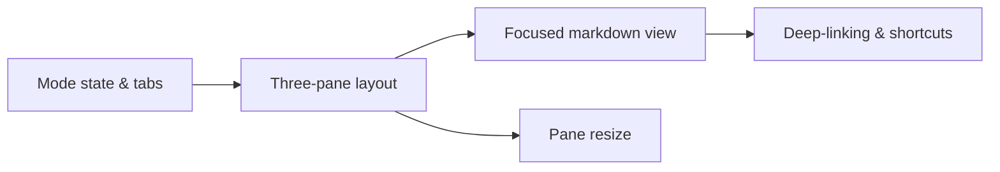

# Spec Mode UI Shell

## Design Problem

How should the spec mode three-pane layout integrate with the existing single-page application? The current UI is a task board with a file explorer sidebar, header, status bar, and modal system. Spec mode introduces a fundamentally different layout (explorer + focused markdown view + chat stream) that coexists with the board view. The design must handle mode switching, layout persistence, and keyboard shortcut routing without breaking the existing board experience.

Key constraints:
- Zero-cost mode switching (single click or `S` key), with context preservation
- The header must accommodate mode tabs (`[Board] [Specs]`) alongside existing workspace-group tabs, search, and settings
- The three-pane layout must be resizable (at minimum the explorer width, ideally all three panes)
- The layout must work on the existing vanilla JS + Tailwind stack (no framework)
- The status bar, terminal panel, and other bottom panels must work in both modes

## Context

The current UI architecture (`ui/js/`) is component-based vanilla JS with SSE streaming. Key patterns:
- `render.js` — board rendering via `scheduleRender()` + `requestAnimationFrame` coalescing
- `explorer.js` — left sidebar file tree with lazy-load, resize, localStorage persistence
- `modal.js` / `modal-core.js` — task detail modal system with focus trap
- `api.js` + `tab-leader.js` — SSE streaming with cross-tab leader/follower
- `status-bar.js` — footer with panel cycling (terminal / dep graph / office)

The HTML layout is in `ui/index.html` using Go templates. The explorer panel is already a resizable left sidebar. The board occupies the main content area.

Mode switching needs to swap the main content area (board vs. spec mode panes) while keeping the header, status bar, and explorer potentially shared or replaced.

## Options

**Option A — DOM swapping.** Both layouts exist in the DOM. Mode switching toggles visibility (`display: none` vs. `display: flex`). The board and spec mode panes are sibling containers. State is preserved because the DOM is never destroyed.

- Pro: Simplest implementation. No teardown/rebuild cost. Both views maintain scroll position, input focus, and internal state across switches.
- Con: Higher memory usage (both layouts always in DOM). Event listeners accumulate. The explorer panel serves different roles in each mode (workspace files vs. spec tree) — sharing the same DOM element is awkward.

**Option B — Component-based rendering.** Each mode has a `render()` function that builds its DOM when activated. Switching modes destroys the current layout and builds the new one. State is preserved in JS module variables, not the DOM.

- Pro: Clean separation. Each mode's DOM is minimal (only what's active). Easier to reason about event listener lifecycle.
- Con: Mode switching has rebuild cost (though with `requestAnimationFrame` coalescing this is manageable). Must explicitly save/restore scroll positions, input state, and focus.

**Option C — Hybrid: shared shell, swapped content.** The header, status bar, and bottom panels are always present. The main content area swaps between board view and spec mode panes. The explorer sidebar stays but changes its content (workspace files vs. spec tree) based on mode.

- Pro: Shared chrome feels cohesive. The explorer resize handle and width persist naturally. Bottom panels (terminal) work identically in both modes.
- Con: The explorer must support two "roots" and switch between them — more complex than two independent panels.

## Open Questions

1. Should the explorer be shared (one panel, two roots) or separate (spec mode has its own explorer instance)? The "Show workspace files" toggle suggests a shared panel that can display either root.
2. How does the focused markdown view render live-updating content? Options: re-render on file change (detected via polling or SSE), or use a reactive binding to the spec file content.
3. Should the three panes have fixed proportions or be individually resizable? The existing explorer has a drag-to-resize handle — should the focused view / chat pane boundary also be draggable?
4. How does deep-linking work? The board uses `#<task-id>/<tab>` for modal deep-links. Spec mode could use `#spec/<path>` to link directly to a spec in the focused view.
5. How do keyboard shortcuts route between modes? `S` toggles modes, but `Enter`, `D`, `B` only apply in spec mode. Should shortcuts be mode-scoped or global with mode checks?

## Affects

- `ui/index.html` — new layout containers for spec mode (three-pane shell), header mode tabs
- `ui/js/render.js` — mode-aware rendering (skip board render when in spec mode)
- `ui/js/explorer.js` — mode-aware root switching or separate spec explorer module
- `ui/js/state.js` — current mode state, focused spec path
- New `ui/js/spec-mode.js` or similar — spec mode orchestrator
- `ui/js/status-bar.js` — mode indicator in footer

## Design Decision

**Option C — Hybrid: shared shell, swapped content.** The header, status bar, and bottom panels (terminal, dep graph, office) are always present. The main content area swaps between the board grid and the spec mode three-pane container. The explorer sidebar is shared — it switches its root between workspace files and the spec tree based on mode, with a "Show workspace files" toggle in spec mode.

Deep-linking uses `#spec/<path>` format (alongside existing `#<task-id>/<tab>`). Keyboard shortcuts are mode-scoped: `S` toggles globally, `Enter`/`D`/`B` only fire in spec mode.

## Task Breakdown

| Child spec | Depends on | Effort | Status |
|------------|-----------|--------|--------|
| [Mode state and header tabs](spec-mode-ui-shell/mode-state-and-switching.md) | — | small | complete |
| [Three-pane layout](spec-mode-ui-shell/spec-mode-layout.md) | mode-state-and-switching | medium | complete |
| [Focused markdown view](spec-mode-ui-shell/focused-markdown-view.md) | spec-mode-layout | medium | complete |
| [Deep-linking and keyboard shortcuts](spec-mode-ui-shell/spec-mode-deep-linking.md) | focused-markdown-view | small | complete |
| [Pane resize handle](spec-mode-ui-shell/pane-resize.md) | spec-mode-layout | small | complete |

## Outcome

The spec mode UI shell is fully implemented with a three-pane layout (explorer + focused markdown view + chat stream) that coexists with the board view via mode switching.

### What Shipped

- **`ui/js/spec-mode.js`** — mode state with localStorage persistence, `switchMode()`/`_applyMode()`, focused markdown view with 2-second polling, `#spec/<path>` deep-linking, YAML frontmatter parser, spec link navigation (`.md` links navigate within spec mode), table of contents, design/implementation badge, metadata bar, keyboard shortcuts (`S` toggle, `D` dispatch, `B` break down)
- **`ui/css/spec-mode.css`** — three-pane layout, status badges with colors, TOC positioning, chat stream, resize handles
- **`ui/index.html`** — spec mode container with focused view header (title, status, kind, effort, dispatch/breakdown buttons), metadata bar, markdown body, chat stream with input
- **Header mode tabs** — `[Board]` `[Specs]` in `initial-layout.html`
- **32 frontend tests** across 5 test files

### Design Evolution

1. **`_applyMode()` extracted from `switchMode()`.** The idempotency guard in `switchMode()` prevented DOM updates when the JS variable already matched localStorage (second tab scenario). Extracted `_applyMode()` for unconditional DOM updates.
2. **Explorer auto-visibility.** Explorer auto-opens in spec mode and auto-hides in board mode, independent of the `e` key toggle state.
3. **Workspace switch awareness.** `reloadExplorerTree()` and `_initExplorer()` now check the current mode and load the spec tree instead of workspace files when in spec mode.
4. **Breakdown button replaces Summarize.** The "Summarize" button was repurposed as "Break Down" — visible for validated and drafted specs, pre-fills the chat with a breakdown directive.
