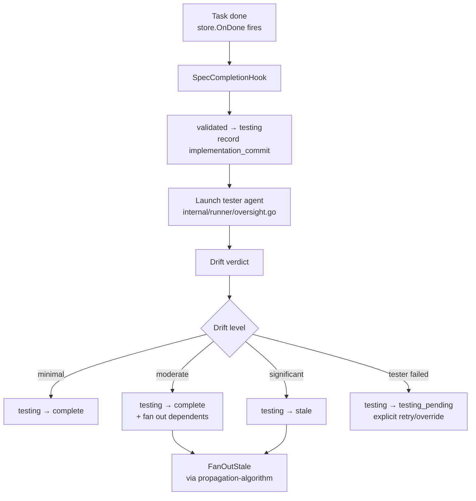

# Task-done Drift Pipeline

The core of the control plane: when a dispatched task reaches `done`,
run a tester, produce a drift verdict, and transition the spec
accordingly. Also fans out staleness to impacted specs.

`SpecCompletionHook` today writes `complete` unconditionally. This spec
turns that unconditional write into a gated verdict.

---

## Flow



---

## 1. Hold at `testing`

Prereq: [lifecycle-testing-state.md](lifecycle-testing-state.md)
adopts Option A (7th state).

When `store.OnDone` fires:
1. Read the source spec (`SpecSourcePath` on the task).
2. If spec status is `validated`, transition to `testing` via
   `UpdateFrontmatter`. Record the task's commit range in a new
   frontmatter field:
   ```yaml
   implementation_commit: <base-sha>..<tip-sha>
   ```
   Field is optional, populated only by this hook. Cleared on
   `testing → complete` or `testing → stale`.
3. Commit the status write (subject `<path>: enter testing`).

If the spec is not at `validated` (e.g., `stale` because of an upstream
change mid-implementation), skip the whole flow — log a warning, leave
the status alone, don't run the tester.

---

## 2. Tester agent contract

Reuse the existing test-verification agent (the one behind
`POST /api/tasks/{id}/test`) rather than introducing a new agent.

**Input** (passed in the system prompt or a structured prelude):
- Spec body (full markdown)
- Spec `affects` list
- Task git diff (`git diff <base>..<tip>`)
- Task's changed files list (`git diff --name-only`)
- Acceptance criteria block, if the spec body has one

**Output** (structured — the agent emits JSON in its final turn):

```json
{
  "expected_files": ["internal/runner/execute.go", "internal/runner/container.go"],
  "actual_files":   ["internal/runner/execute.go", "internal/runner/container.go", "internal/runner/board.go"],
  "unexpected":     ["internal/runner/board.go"],
  "missing":        [],
  "criteria": {
    "satisfied":       5,
    "diverged":        1,
    "not_implemented": 0,
    "superseded":      0,
    "total":           6,
    "notes":           "criterion 3 implemented differently: ..."
  },
  "drift_level": "moderate",
  "summary":     "Implementation matches intent; one extra file (board.go) needed to wire the flow."
}
```

### Drift-level rules

Algorithmic classification based on the JSON fields (server-side, not
the agent's word):

```
satisfied_ratio = criteria.satisfied / criteria.total   if total > 0 else 1.0
file_ratio      = |expected ∩ actual| / |expected|       if expected > 0 else 1.0

drift_level = "minimal"     if satisfied_ratio >= 0.9 && |unexpected| ≤ 1
drift_level = "moderate"    if satisfied_ratio >= 0.7 && |unexpected| ≤ 3
drift_level = "significant" otherwise
```

The server computes `drift_level` from the verdict fields; the agent's
self-reported level is advisory and logged but not authoritative. Keeps
a misbehaving agent from locking in `complete` on a divergent change.

---

## 3. Branch on verdict

| Verdict | Spec transition | Fan-out |
|---|---|---|
| `minimal` | `testing → complete` | none |
| `moderate` | `testing → complete` | fan out dependents as `stale` |
| `significant` | `testing → stale` | fan out dependents as `stale` |
| tester failed | `testing → testing_pending` (see §6) | none yet |

Commit after the write: subject `<path>: mark complete` /
`<path>: mark stale (drift: <level>)`. `git revert` reverses the
verdict and the cascade together.

---

## 4. Fan-out

Uses the two channels from
[propagation-algorithm.md](propagation-algorithm.md):

```
impacted = DependsOnImpact(tree, sourcePath)
         ∪ AffectsImpactFromDiff(tree, changedFiles, sourcePath)
FanOutStale(tree, impacted)
```

Channel 2 here uses the actual task diff (`AffectsImpactFromDiff`),
not the source spec's declared affects — precise and catches files
the spec forgot to list.

---

## 5. Drift report persistence

Two-part store:

**Inline summary** — appended to the spec body as an `## Outcome`
section (or replacing an existing one). Visible in the focused view.
Example shape:

```markdown
## Outcome

**Drift: moderate** (2026-04-12)

- Expected files: runner.go, execute.go
- Actual files: runner.go, execute.go, board.go
- Unexpected: board.go
- Criteria: 5/6 satisfied, 1 diverged

Implementation matches intent; one extra file (board.go) needed to
wire the flow.
```

**Structured sidecar** — full JSON verdict persisted via
`store.SaveDriftReport(taskID, report)`. Retrieved by
`GET /api/specs/{path}/drift` for the UI "Review Changes" action.

Inline outcome is for humans reading the spec; sidecar is for tooling.

---

## 6. Tester failure handling

**Do not silently fall back to `complete`.** That erases the whole
point of drift detection — every flaky agent run would produce a false
`complete` no one sees.

Instead: on tester crash, timeout, or malformed output, write a new
intermediate frontmatter marker:

```yaml
testing_pending: "tester failed at 2026-04-12T12:30:00Z: timeout after 600s"
```

The spec stays at `testing` with the `testing_pending` reason visible
in the explorer as a distinct badge (e.g., "⏳ testing: retry needed").
The user has three options:

1. Click **Retry Test** — re-runs the tester on the same commit range.
2. Click **Mark Complete Without Drift Check** — explicit override;
   writes `testing → complete`, clears `testing_pending`, records
   `drift: skipped` in Outcome.
3. Ignore — spec stays in `testing_pending` until someone deals with it.

Failure is surfaced, not hidden. Cost: a small UX addition; benefit:
the drift verdict stays trustworthy.

---

## 7. Commit concurrency

`SpecCompletionHook` runs in a background goroutine per task. Two
tasks finishing near-simultaneously both try to `git add + git commit`
the same workspace → index-lock errors, partial applies.

**Solution: per-workspace commit mutex.** A `sync.Mutex` keyed by
workspace path, held from `git add` through `git commit`. Callers
queue; worst case is serialized commits, which is what git already
does internally but fails loudly without the mutex.

Lives alongside the existing archive-commit helper in
`internal/handler/specs.go` so archive, unarchive, validate, and drift
commits all share the same lock.

**Batch writer alternative** — accumulate status writes for N seconds
then flush in one commit. Rejected: complicates ordering with task
commit-and-push; mutex is simpler and enough at current scale.

---

## 8. `implementation_commit` frontmatter field

New optional field, same shape as `dispatched_task_id`:

```yaml
implementation_commit: 3a2b1c4..5f6e7d8
```

Schema rules:
- Optional; null/absent by default.
- Populated by this hook on `validated → testing`.
- Cleared on `testing → complete`, `testing → stale`, or any
  `→ drafted` transition (refine, unarchive).
- Validator: no new rule — malformed values get caught by YAML parse.
- Document in `spec-document-model.md` alongside `dispatched_task_id`.

Needs a schema-prep commit before this pipeline can land.

---

## Acceptance

- `store.OnDone` calls `SpecCompletionHook`; the hook writes
  `validated → testing` and records `implementation_commit`.
- Tester agent runs with spec + diff; returns structured verdict.
- Server computes `drift_level` from verdict fields; ignores the
  agent's self-reported level except for logging.
- Verdict branches drive `complete` / `stale` / `testing_pending`
  correctly.
- Fan-out uses both channels of the propagation algorithm;
  `git revert` reverses verdict + cascade.
- Tester failure leaves the spec at `testing_pending` with a visible
  reason; Retry and Mark-Complete-Without-Drift-Check actions work.
- Per-workspace commit mutex prevents concurrent-commit races.
- `implementation_commit` is documented in the document-model spec.
- Unit tests cover all three drift levels + tester-failure path.
- Integration test: full round-trip `store.OnDone` → tester →
  `complete` for a minimal-drift case.

---

## Open Questions

1. **Specs without acceptance criteria.** Most of the existing corpus
   lacks a formal "Acceptance Criteria" section. The tester's criteria
   count will be 0/0 → default `satisfied_ratio = 1.0` → always
   `minimal` drift. That yields false confidence. Options:
   - Require acceptance criteria on all dispatchable specs (new
     `has-criteria` validator error; bulk migration needed).
   - **Fall back to file-level drift when criteria are absent**
     (drift_level based on unexpected/missing only). Tentative: this —
     pragmatic, matches reality.
2. **Tester sandbox cost.** Running a tester agent on every task
   completion is non-trivial token + container cost. Gate behind a
   per-workspace toggle (`WALLFACER_DRIFT_TESTER`)? Tentative: yes,
   default on once P3 is stable.
3. **Who writes the `## Outcome` section — the tester or the hook?**
   The hook has the structured data; the tester has better prose. If
   the hook writes the outcome, the tester's summary is formatted
   deterministically; if the tester writes it, prose is richer but
   format can drift. Tentative: the hook writes, using a template;
   tester's summary slots into a "Notes" bullet.
4. **Override UX.** "Mark Complete Without Drift Check" is a
   judgment-call action. Should it require a justification in a dialog,
   or be frictionless? Tentative: frictionless; record the override
   in the commit message so history shows the decision.
