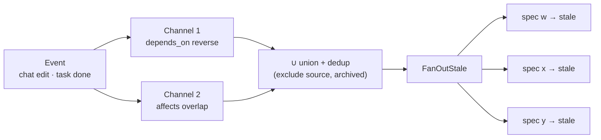
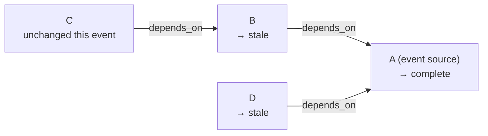
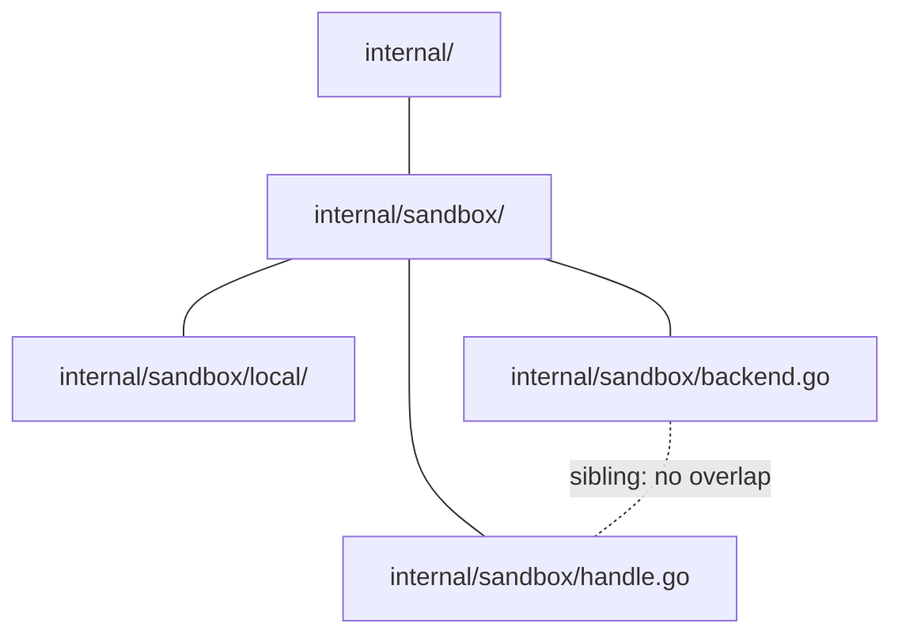
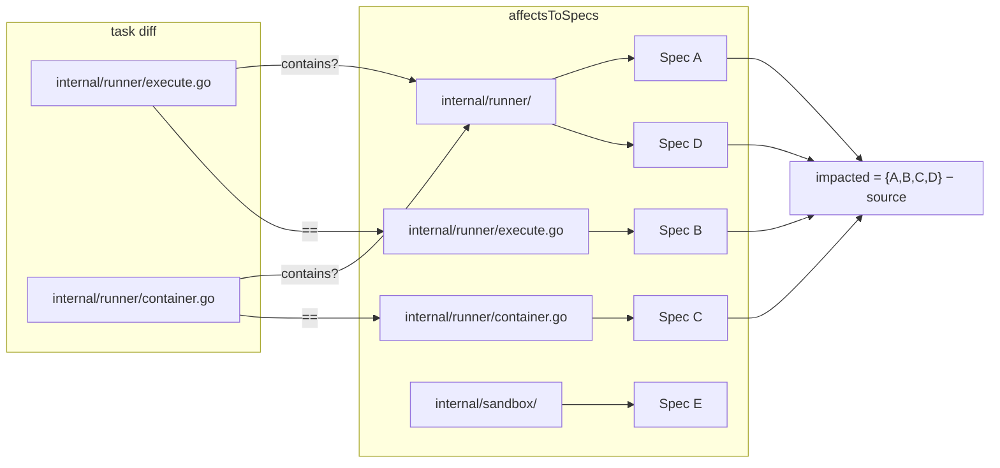
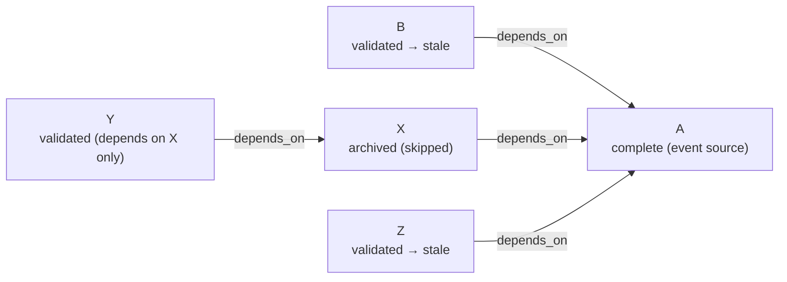

# Stale Propagation Algorithm

Shared infrastructure used by every control-plane hook that fans out
staleness to other specs. The chat-edit hook (P1) and the task-done hook
(P3) both call the same helpers; this spec defines what those helpers do.

---

## Two Channels

Staleness propagates through two complementary channels. Both run on every
fan-out event; results are unioned and deduplicated before applying.



### Channel 1 — Explicit dependency (`depends_on`)

Author intent: "my design hinges on yours." Already solved by
`internal/spec/impact.go`:

- `Adjacency(tree)` — forward adjacency; archived specs pruned as both
  sources and sinks.
- `dag.ReverseEdges(Adjacency(tree))` — reverse index (spec → specs that
  depend on it).

Query: `reverse[sourcePath]` minus archived specs. O(1) lookup after
build; build is O(S · A_dep).

**Single-hop rule.** Each event marks only **direct** dependents stale.
Transitive dependents are picked up by the next event in the chain (when
the stale spec is refined and re-dispatched). Multi-hop propagation
would cascade too aggressively.



### Channel 2 — Implicit code coupling (`affects`)

Physical reality: "we both touch this file; your change may invalidate my
assumptions." `depends_on` is manually declared and often incomplete; the
`affects` overlap catches couplings the authors forgot to encode.

#### Normalization

```
normalize(e) = strings.TrimRight(filepath.ToSlash(e), "/")
```

Collapses `internal/sandbox/` and `internal/sandbox` to the same key.

#### Containment

Two entries overlap iff one contains the other along the path tree.
Siblings never overlap.

```
contains(dir, path) = (dir == path) || strings.HasPrefix(path, dir + "/")
overlaps(a, b)      = contains(a, b) || contains(b, a)
```



#### Indexes

Build two indexes on tree load (skipping archived specs):

```
specToAffects:   map[SpecPath][]normalizedEntry   (forward)
affectsToSpecs:  map[normalizedEntry]Set[SpecPath] (reverse — the new piece)
```

Build: O(S · A_aff). Recomputed every tree load, not cached.

Exact-match lookups use `affectsToSpecs` directly. Containment queries
scan `affectsToSpecs.keys()` — ~650 comparisons at current scale,
sub-millisecond.

**Path-trie upgrade** (deferred until profiled): insert each entry into
a trie keyed by path components. Query walks from root to the path node
collecting specs at every visited ancestor (directories that contain
the query) and every descendant (files/dirs the query contains).
O(D + |results|). Ship the linear scan first.

#### Two query entry points

| Entry | Trigger | Uses |
|---|---|---|
| `AffectsImpactFromDiff(tree, changedFiles, source)` | Task done (diff available) | Match each changed file against `affectsToSpecs` via `contains`; precise — uses actual changes, not declared affects |
| `AffectsImpactFromSpec(tree, source)` | Chat edit (specs/-only commit, no code diff) | Match each of source's declared affects against every entry in `affectsToSpecs` via `overlaps` (symmetric) |



Spec E is untouched (its `internal/sandbox/` contains none of the
changed files). Source spec is excluded before fan-out.

---

## Unified Fan-out

P1 and P3 both call the same helper; only the impact functions differ.

```
func FanOutStale(tree *Tree, impacted []string) []string:
    applied = []
    for path in sorted(impacted):
        node = tree.At(path)
        if node == nil || node.Value == nil:             continue
        if node.Value.Status == StatusArchived:          continue
        if StatusMachine.Validate(
               node.Value.Status, StatusStale) != nil:   continue  # same-to-same, illegal
        UpdateFrontmatter(node.absPath, {status: stale, updated: now})
        applied.append(path)
    return applied
```

P1 (chat edit on `sourcePath`, specs/-only commit):

```
impacted = DependsOnImpact(tree, sourcePath)
         ∪ AffectsImpactFromSpec(tree, sourcePath)
FanOutStale(tree, impacted)
```

P3 (task done on `sourcePath`, `changedFiles` = task diff):

```
impacted = DependsOnImpact(tree, sourcePath)
         ∪ AffectsImpactFromDiff(tree, changedFiles, sourcePath)
FanOutStale(tree, impacted)
```

---

## Archived Pruning



`Adjacency` prunes archived specs as both sources and sinks before the
reverse traversal runs. X is skipped; Y (depends on X only) is invisible
to A's event; B and Z are correctly impacted. The same pruning applies
to channel 2: `affectsToSpecs` is built from non-archived specs only.

---

## Idempotency and Convergence

- `FanOutStale` only writes legal transitions. Already-stale and
  archived specs are silently skipped.
- Status-only writes do **not** touch code, so they don't trigger
  further `affects` fan-out. No cascade risk.
- Single-hop `depends_on` propagation: multi-hop would cascade too
  aggressively; rely on the explicit chain of events.

---

## "Too Broad" Affects

A spec listing `internal/` matches every spec under `internal/`.
Legitimate for umbrella refactors; usually a smell.

Policy:
- No hard cap — algorithm treats broad entries correctly.
- **New validator advisory `affects-too-broad`**: warn when a single
  affects entry matches >20 other specs. Lives with `affects-exist` in
  `validate.go`.
- Runtime log when a single fan-out impacts >20 specs.

---

## Complexity Summary

| Step | Cost | Notes |
|---|---|---|
| Build `Adjacency` reverse index | O(S · A_dep) | existing |
| Build `affectsToSpecs` | O(S · A_aff) | new |
| `DependsOnImpact` | O(\|out\|) | reverse map lookup |
| `AffectsImpactFromDiff`, linear scan | O(F · E) | F = changed files, E = total affects entries |
| `AffectsImpactFromSpec`, linear scan | O(A_src · E) | A_src = source's affects count |
| `FanOutStale` | O(\|impacted\| · I/O) | one `UpdateFrontmatter` per spec |

At S ≈ 215, E ≈ 650, F ≈ 20: sub-millisecond outside I/O.

---

## Edge Cases

1. **Sibling files never overlap** (correct — umbrella dir handles aggregation).
2. **Diamond overlap** — no cycles; same-to-same rejected by `StatusMachine`.
3. **Non-existent files in `affects`** — allowed; propagation works.
4. **Trailing-slash inconsistency** — `normalize` handles it.
5. **Case sensitivity** — match case-sensitively; document.
6. **Renames** — `git diff --name-only -M` shows both sides; both impacted.
7. **Deletions** — count as changes; appear in `--name-only`.
8. **Empty `affects`** — channel 2 yields nothing; channel 1 still runs.
9. **Self-impact** — `sourcePath` always excluded.

---

## Open Questions

1. **Manual spec edits outside the chat.** `git commit -m '...'` on a spec
   bypasses P1's hook. Should this algorithm be invoked by a post-commit
   git hook, or left to [periodic-scan.md](periodic-scan.md) to catch on
   workspace reload? Tentative: **let periodic-scan handle it** — any
   other path requires the user to install a hook. Move the coverage
   story to that spec.
2. **Linear scan vs trie now.** Current scale is fine for linear. Profile
   shows <1ms per query. Defer the trie. Revisit at S > 1000.
3. **"Too broad" threshold.** 20 is a guess. Collect data from live
   fan-outs to calibrate. Start at 20, adjust if noisy.
