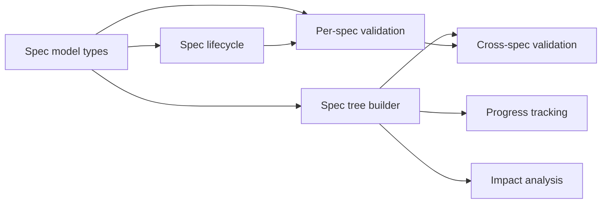

# Spec Document Model

Defines the properties, lifecycle, and tree structure of spec documents.

---

## Spec Properties

Every spec document carries structured frontmatter:

```yaml
---
title: Sandbox Backends
status: validated          # vague | drafted | validated | complete | stale
track: foundations         # foundations | local | cloud | shared
depends_on:                # specs this one requires (DAG edges — can point anywhere)
  - specs/foundations/storage-backends.md
affects:                   # packages and files this spec describes
  - internal/sandbox/
  - internal/runner/execute.go
effort: large              # small | medium | large | xlarge
created: 2026-01-15
updated: 2026-03-28
author: changkun
dispatched_task_id: null   # UUID of kanban task (leaf specs only, set on dispatch)
---
```

**No `parent` or `children` fields.** Parent-child relationships are derived from the filesystem: a spec's parent is the spec file in its containing directory; a spec's children are the specs in its subdirectory. This avoids maintaining redundant lists that duplicate what the directory structure already provides.

### Two Relationship Types

| Relationship | Structure | Source | Purpose |
|---|---|---|---|
| **Parent-child** | Tree | Filesystem (directory nesting) | Organization, browsing, progress aggregation |
| **depends_on** | DAG | Frontmatter | Ordering, blocking, context propagation |

These are independent. A spec can depend on any other spec regardless of where they sit in the directory tree. `depends_on` is not constrained to siblings — it can cross subtrees, tracks, and depths.

### Leaf vs Non-Leaf Specs

| Property | Non-leaf spec | Leaf spec |
|----------|---------------|-----------|
| Subdirectory | Has a `<name>/` directory with child specs | No subdirectory (or empty) |
| `dispatched_task_id` | Always null | Set when dispatched to kanban board |
| Content focus | Problem, motivation, design decisions, cross-cutting concerns | Which files to change, acceptance criteria, test plan |
| Granularity | Any size | Small enough for one agent task (2-5 files, one clear goal) |

A spec is a leaf if it has no child specs in a corresponding subdirectory. The distinction is **dynamic**: any leaf spec can gain children at any time (create a subdirectory, add child specs), and this works at any depth. There is no limit on tree depth.

This means the tree grows organically:
1. Start with a single spec (leaf).
2. If it's too big to execute, break it down → create a subdirectory, add child specs. The original becomes non-leaf.
3. If a child is still too big, break *that* down the same way.
4. Repeat until every leaf is small enough to dispatch as a single task.

### File Organization

Specs live in `specs/<track>/`. When a spec is broken down, its children live in a subdirectory named after the parent. This nests to arbitrary depth:

```
specs/
  foundations/
    sandbox-backends.md                    # depth 0: non-leaf
    sandbox-backends/                      # children of sandbox-backends
      define-interface.md                  #   depth 1: leaf
      local-backend.md                     #   depth 1: leaf
      runner-migration.md                  #   depth 1: non-leaf (too big, broken down further)
      runner-migration/                    #   children of runner-migration
        refactor-launch.md                 #     depth 2: leaf
        refactor-listing.md                #     depth 2: leaf
        retire-executor.md                 #     depth 2: leaf
  local/
    spec-coordination.md                   # depth 0: non-leaf
    spec-coordination/
      spec-document-model.md              #   depth 1: leaf (or non-leaf if broken down later)
      spec-planning-ux.md
```

Child specs are named descriptively without numeric prefixes. Execution order is determined by `depends_on`, not filename order. The directory nesting mirrors the tree structure — you can always tell a spec's depth from its file path.

---

## Spec Validation

A spec validator checks structural correctness of spec documents. It runs on individual specs and across the full spec tree.

### Per-Spec Validation

| Rule | Severity | Description |
|------|----------|-------------|
| **Required fields** | error | `title`, `status`, `track`, `effort`, `created`, `updated`, `author` must be present |
| **Valid status** | error | `status` must be one of: `vague`, `drafted`, `validated`, `complete`, `stale` |
| **Valid track** | error | `track` must match the spec's filesystem location (`specs/<track>/...`) |
| **Valid effort** | error | `effort` must be one of: `small`, `medium`, `large`, `xlarge` |
| **Date format** | error | `created` and `updated` must be valid ISO dates; `updated` ≥ `created` |
| **Dispatch consistency** | error | Non-leaf specs must have `dispatched_task_id: null`. Leaf specs may have null or a valid UUID |
| **`depends_on` targets exist** | error | Every path in `depends_on` must resolve to an existing spec file |
| **`affects` paths exist** | warning | Every path in `affects` should resolve to an existing file or directory in the codebase. Warning (not error) because code may not exist yet for `vague`/`drafted` specs |
| **No self-dependency** | error | A spec cannot appear in its own `depends_on` |
| **Body not empty** | warning | Specs beyond `vague` status should have meaningful content below the frontmatter |

### Cross-Spec Validation (Tree-Wide)

| Rule | Severity | Description |
|------|----------|-------------|
| **DAG is acyclic** | error | The `depends_on` graph must have no cycles. Report the full cycle path on violation |
| **No orphan directories** | warning | A `<name>/` subdirectory should have a corresponding `<name>.md` parent spec |
| **No orphan specs** | warning | A `<name>.md` file with a `<name>/` subdirectory should have at least one child spec in it |
| **Status consistency** | warning | A `complete` non-leaf spec should not have incomplete leaves in its subtree |
| **Stale propagation** | warning | If a spec is `stale`, dependents that are still `validated` should be flagged for review |
| **Track consistency** | warning | All specs in `specs/<track>/` should have `track: <track>` in frontmatter |
| **Unique dispatches** | error | No two specs may share the same `dispatched_task_id` |

### When to Run

- **On spec creation or edit** — validate the changed spec and re-check cross-spec rules affected by the change (cycles, status consistency).
- **Before dispatch** — a leaf spec must pass all error-level rules before it can be dispatched as a task.
- **On demand** — full tree validation as a CLI command or UI action, surfacing all warnings and errors across the spec tree.

Validation results are not stored — they are computed fresh each time, like progress tracking and impact analysis.

---

## Spec Lifecycle

A spec has one status dimension that covers both design maturity and readiness:

```
vague ──▶ drafted ──▶ validated ──▶ complete
            │          │    ▲          │
            │          │    │          │
            ▼          ▼    │          ▼
          stale      stale  └───── stale
```

| State | Meaning | Transitions |
|-------|---------|-------------|
| **vague** | Initial idea. Problem statement exists but design is incomplete. | → `drafted` (design details added) |
| **drafted** | Enough detail for review. May have open questions. | → `validated` (reviewed and approved) · → `stale` (superseded) |
| **validated** | Reviewed, approved, ready to break down or dispatch. | → `complete` (all work done) · → `stale` (invalidated) |
| **complete** | All children done (non-leaf) or task done (leaf). Spec updated to reflect reality. | → `stale` (if later work modifies what this spec describes) |
| **stale** | Spec no longer matches reality. Needs human review. | → `drafted` (refreshed) · → `validated` (re-validated) |

### Lifecycle Rules

- **Leaf specs** should be `validated` before dispatch. Don't execute against a half-baked design.
- **Non-leaf specs** should be `validated` before breaking down into children.
- When all children of a non-leaf are `complete`, the parent can move to `complete` — after verifying the implementation matches the design. If there's a significant delta, go to `stale` first.
- `stale` signals "this document needs human attention." It's not a dead end.

### Progress Tracking

Non-leaf specs track progress by **recursively** aggregating all leaves in their subtree — not just direct children:

```
sandbox-backends.md — 4/6 leaves done
  ✓ define-interface.md (complete, leaf)
  ✓ local-backend.md (complete, leaf)
    runner-migration.md — 2/3 leaves done
      ✓ refactor-launch.md (complete, leaf)
      ✓ refactor-listing.md (complete, leaf)
      ○ retire-executor.md (validated, leaf)
  ○ update-registry.md (drafted, leaf)
```

Here `sandbox-backends.md` counts 4/6 (all leaves in the subtree), not 2/3 (direct children). `runner-migration.md` counts 2/3 (its own leaves). The counts compose upward through any number of levels.

This aggregation is computed on the fly — no separate storage. The spec explorer and any progress views derive it from the tree.

---

## Spec Relationships

### Filesystem Tree (Organization)

```
specs/
  foundations/
    sandbox-backends.md
    sandbox-backends/
      define-interface.md
      local-backend.md
      runner-migration.md
      runner-migration/
        refactor-launch.md
        refactor-listing.md
        retire-executor.md
```

The filesystem determines parent-child relationships. `sandbox-backends.md` is the parent of everything in `sandbox-backends/`. This is purely organizational — it determines how specs are browsed in the explorer and how progress aggregates upward.

### Dependency DAG (Ordering)

```
define-interface.md ──────────────▶ local-backend.md
        │                                  │
        │                                  ▼
        │                          runner-migration/
        │                            refactor-launch.md
        │                                  │
        │                                  ▼
        │                            refactor-listing.md
        │                                  │
        │                                  ▼
        │                            retire-executor.md
        │
        └──────────────────────────▶ update-registry.md
                                           │
                            (cross-tree)   ▼
                                    container-reuse.md
                                    (different subtree)
```

`depends_on` edges form a DAG that can cross any boundary:
- **Between siblings**: `local-backend.md` depends on `define-interface.md` (same directory)
- **Across depths**: `refactor-launch.md` depends on `local-backend.md` (child depends on parent's sibling)
- **Across subtrees**: `container-reuse.md` depends on `update-registry.md` (different track entirely)

When leaf specs are dispatched, `depends_on` becomes `DependsOn` on the kanban board.

**Only leaf specs are dispatched.** When a non-leaf spec has `depends_on`, it means "all leaves in this subtree are blocked until the dependency is complete." This allows expressing ordering between groups of work without listing every individual leaf dependency.

### Propagation

- **Upward through the tree** (children → parent): When children complete, the parent's progress updates. If implementation diverges from the parent's design, the parent should be updated.
- **Downward through the tree** (parent → children): If a parent spec is modified, its children may be invalidated. See [spec-drift-detection.md](spec-drift-detection.md).
- **Along DAG edges** (dependency → dependent): If a completed dependency drifts, specs that depend on it get warnings. This follows `depends_on` edges regardless of tree position.

### Impact Analysis (Reverse Dependencies)

`depends_on` answers "what blocks me?" The reverse question — "what do I impact?" — is equally important. When a spec completes, changes, or goes stale, the system needs to surface every spec that transitively depends on it so those can be reviewed.

**This is a computed property, not a stored field.** The reverse index is derived on the fly by inverting all `depends_on` edges across the spec tree. No `impacted_by` or `depended_on_by` frontmatter is needed — that would duplicate information and drift out of sync.

Given the DAG from the example above:

```
Impact of define-interface.md:
  direct:     local-backend.md, update-registry.md
  transitive: refactor-launch.md, refactor-listing.md, retire-executor.md,
              container-reuse.md (cross-tree)

Impact of local-backend.md:
  direct:     refactor-launch.md
  transitive: refactor-listing.md, retire-executor.md
```

**When to surface impact:**

| Event | Action |
|-------|--------|
| Spec reaches `complete` | Show dependents that are now unblocked (ready to dispatch or break down) |
| Spec moves to `stale` | Warn all transitive dependents — their assumptions may be invalid |
| Spec design changes (edited while `validated`) | Flag direct dependents for review; they may need updating |
| `affects` files modified outside spec work | See [spec-drift-detection.md](spec-drift-detection.md) for file-level impact |

**Impact scope for non-leaf specs:** When a non-leaf spec changes, the impact includes both (a) specs that `depends_on` it directly, and (b) specs that depend on any leaf in its subtree, since the non-leaf's design governs its children's implementation.

The impact query composes with progress tracking: a non-leaf dependent shows how many of its own leaves are affected, not just a binary flag.

---

## Operation Regimes

Not all specs need the same level of human involvement. Two regimes, determined by design certainty:

| Regime | When | Human role | Agent role |
|--------|------|------------|------------|
| **Human-driven** | Idea is vague, approach uncertain | Idea provider + steering. Reviews and redirects at every step. | Expander. Drafts, structures, asks clarifying questions. |
| **Agent-driven** | Design is clear, acceptance criteria defined | Reviewer. Monitors, provides feedback when needed. | Executor. Breaks down, dispatches, executes, reports. |

The regime is not a system mode — it's an emergent property of how the human and agent interact. The system infers it from spec maturity: `vague`/`drafted` specs are human-driven; `validated` specs can be agent-driven.

**Transition:** Human-driven → agent-driven when spec reaches `validated` and human approves. Agent-driven → human-driven when drift is detected or execution reveals the design was wrong.

---

## Task Breakdown

| Child spec | Depends on | Effort | Status |
|------------|-----------|--------|--------|
| [Spec model types](spec-document-model/spec-model-types.md) | — | medium | complete |
| [Spec lifecycle](spec-document-model/spec-lifecycle.md) | spec-model-types | small | complete |
| [Spec tree builder](spec-document-model/spec-tree-builder.md) | spec-model-types | medium | complete |
| [Per-spec validation](spec-document-model/per-spec-validation.md) | spec-model-types, spec-lifecycle | medium | complete |
| [Cross-spec validation](spec-document-model/cross-spec-validation.md) | spec-tree-builder, per-spec-validation | medium | complete |
| [Progress tracking](spec-document-model/progress-tracking.md) | spec-tree-builder | small | validated |
| [Impact analysis](spec-document-model/impact-analysis.md) | spec-tree-builder | medium | validated |


