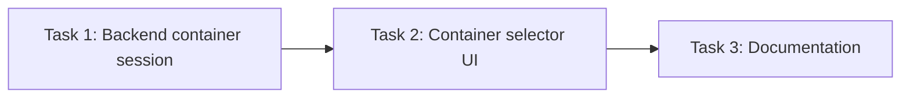

# Terminal: Container Exec Integration

**Status:** Not started
**Date:** 2026-03-28

---

## Current State

- **Host terminal** is complete: `/api/terminal/ws` WebSocket handler in `internal/handler/terminal.go`, xterm.js client in `ui/js/terminal.js`, PTY spawning via `internal/pty/`.
- **Terminal sessions** ([terminal-sessions.md](terminal-sessions.md)) is complete — multi-session tab bar with `sessionRegistry`, relay dispatcher, per-session reader goroutines, and `create_session`/`switch_session`/`close_session` WebSocket messages.
- **`GET /api/containers`** exists in `internal/handler/containers.go` — returns `[]sandbox.ContainerInfo` (ID, Name, TaskID, TaskTitle, Image, State, Status, CreatedAt) for running wallfacer sandbox containers.
- **CLI `wallfacer exec`** (`internal/cli/exec.go`) attaches to containers via `podman exec -it` with `syscall.Exec()` process replacement. Not available from the web UI.
- **`SandboxBackend` interface** (`internal/sandbox/backend.go`) defines `Launch` and `List` methods with a local implementation. The terminal handler does not use this interface.

## Problem

The host terminal runs a shell on the host machine. To inspect or debug a running task container, users must use `wallfacer exec <task-id>` from a separate terminal. A "Container Shell" tab type that attaches to running task containers would eliminate this context switch.

## Goal

Add a container exec terminal mode that spawns `podman exec -it <container> bash` instead of a host shell, selectable from a dropdown of running containers.

## Design

### Extend session creation for container exec

The existing `sessionRegistry.create(shell, cwd, cols, rows)` in `internal/handler/terminal.go` spawns a host shell via PTY. Extend it (or add a sibling method like `createContainerExec`) to spawn `podman exec -it <container> bash` instead. The per-session reader goroutine, `outputCh` channel, relay dispatcher, and process monitor all work unchanged — only the command spawned differs.

Add a `container` field to the `create_session` WebSocket message:
```json
{"type":"create_session","container":"<container-id>"}
```
When `container` is set, spawn `podman exec -it <container> bash` via PTY instead of a host shell. When absent, spawn a host shell as before (backward-compatible). Dispatch the exec command via `SandboxBackend` so different backends use different exec mechanisms (see Cloud Deployment below).

### Container selector UI

- Dropdown populated from `GET /api/containers` (already implemented in `internal/handler/containers.go`).
- Shows container name and associated task title.
- Selecting a container sends `{"type":"create_session","container":"<id>"}`, which opens a new tab labeled with the task title (e.g., "Task: fix-auth @ 3b616d1e").

### Cloud Deployment

In cloud deployment (K8s backend per [sandbox-backends.md](../foundations/sandbox-backends.md)), the host shell has limited utility — the API server is a stateless pod. Container exec becomes the primary terminal mode:

| Backend | Host shell | Container exec |
|---------|-----------|---------------|
| Local | PTY via `internal/pty` | `podman exec` via PTY |
| K8s | Disabled or server pod shell | `kubectl exec` via SPDY/WebSocket relay |
| Remote Docker | Disabled | `docker -H <remote> exec` via PTY |

The WebSocket protocol and xterm.js frontend are backend-agnostic — only the PTY spawn mechanism changes. The handler dispatches based on the active `SandboxBackend`.

## Dependencies

- Requires host terminal (complete).
- Requires [terminal-sessions.md](terminal-sessions.md) (complete) — container shell tabs use the session/tab registry to coexist with host shell tabs.

## Task Breakdown

| # | Task | Depends on | Effort | Status |
|---|------|-----------|--------|--------|
| 1 | [Backend container session](terminal-container-exec/task-01-backend-container-session.md) | — | Medium | Done |
| 2 | [Container selector UI](terminal-container-exec/task-02-container-selector-ui.md) | 1 | Medium | Todo |
| 3 | [Documentation](terminal-container-exec/task-03-docs.md) | 2 | Small | Todo |


