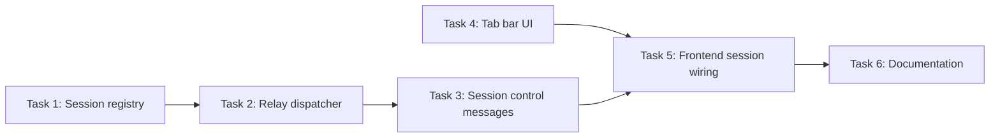

# Terminal: Multiple Sessions with Tabs

**Status:** Not started
**Date:** 2026-03-28

---

## Current State

- **Host terminal** is complete: single WebSocket connection per browser tab, single PTY per connection.
- **Backend**: `internal/handler/terminal.go` — `HandleTerminalWS` creates one `terminalSession` (PTY + shell process) per WebSocket. Message types: `input`, `resize`, `ping`. Two relay goroutines hardcoded to the single PTY.
- **Frontend**: `ui/js/terminal.js` — single xterm.js instance opened directly into `#status-bar-panel` (from `ui/partials/status-bar.html`). `onData`/`onResize` handlers write straight to the WebSocket with no session routing.

## Problem

Phase 1 of the host terminal ([host-terminal.md](../foundations/host-terminal.md)) provides a single shell session per browser tab. Users who need multiple shells (e.g., one for builds, one for logs, one for git) must open separate browser tabs. A tabbed terminal — like VS Code's — would allow multiple sessions within the same panel.

## Goal

Add a tab bar above the terminal panel supporting multiple concurrent shell sessions per browser tab.

## Design

- **Tab bar** above the xterm.js canvas inside `#status-bar-panel` (`ui/partials/status-bar.html`).
- **Session registry** in the handler: `map[string]*terminalSession` keyed by session ID, replacing the current single-session local variable in `HandleTerminalWS`.
- **New WebSocket messages**: `create_session`, `switch_session`, `close_session` — extend the existing `terminalMessage` struct (`internal/handler/terminal.go`) alongside the current `input`/`resize`/`ping` types.
- **Relay dispatcher**: replace the two hardcoded relay goroutines with a dispatcher that routes I/O to the currently active session's PTY.
- Each tab shows a label (numbered, or named by cwd basename).
- Switching tabs detaches xterm from the current session's PTY output and attaches to the new one.
- Closing the last tab disconnects the WebSocket.

## Dependencies

- Requires host terminal (complete).
- Required by [terminal-container-exec.md](terminal-container-exec.md) (container shell tabs need the session/tab registry).

## Task Breakdown

| # | Task | Depends on | Effort | Status |
|---|------|-----------|--------|--------|
| 1 | [Session registry](terminal-sessions/task-01-session-registry.md) | — | Medium | Done |
| 2 | [Relay dispatcher](terminal-sessions/task-02-relay-dispatcher.md) | 1 | Medium | Todo |
| 3 | [Session control messages](terminal-sessions/task-03-session-messages.md) | 2 | Small | Todo |
| 4 | [Tab bar UI](terminal-sessions/task-04-tab-bar-ui.md) | — | Medium | Todo |
| 5 | [Frontend session wiring](terminal-sessions/task-05-frontend-session-wiring.md) | 3, 4 | Large | Todo |
| 6 | [Documentation](terminal-sessions/task-06-docs.md) | 5 | Small | Todo |

