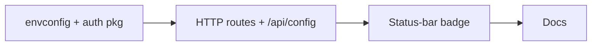

# Authentication & Identity

## Problem

Wallfacer's only access control is a shared bearer token (`WALLFACER_SERVER_API_KEY`). There is no concept of user identity. Every request is anonymous once the token matches. This blocks two things:

1. **Cloud multi-tenant:** The control plane needs to map authenticated users to per-user instances.
2. **Single-host access control:** Even a personal VPS deployment benefits from real login over a manually-rotated static token.

## Scope

Authentication and identity are handled by the centralized
**latere.ai auth service** (`auth.latere.ai`). Wallfacer integrates as
both an **OIDC Relying Party** (browser login) and a **resource server**
(API token validation) using the shared packages:

- **`latere.ai/x/pkg/oidc`** — OAuth 2.0 Authorization Code + PKCE
  flow, encrypted cookie sessions, token refresh, userinfo
- **`latere.ai/x/pkg/jwtauth`** — RS256 JWT validation via JWKS,
  HTTP middleware, claims extraction

This spec does **not** cover:
- OAuth provider integration (handled by the auth service)
- User model or storage (handled by the auth service)
- User management CRUD (handled by the auth service)
- Session management internals (handled by the auth service)
- Role-based access control definitions (handled by the auth service)
- Login UI with provider buttons (handled by the auth service)
- Sandbox credential OAuth flows (`internal/oauth/` — separate system
  for Claude/Codex API tokens, unchanged by this spec)

---

## Phase 1 — Cloud-Gated Sign-In Badge

The first shippable slice is intentionally narrow: **let a user sign in to
latere.ai and see their avatar + username in the status bar**. Nothing else
changes. No routes become authenticated. No data is keyed on `principal_id`.
No `org_id` is stored. Anonymous usage remains fully supported.

This slice exists to (a) validate the `latere.ai/x/pkg/oidc` integration
end-to-end, and (b) start drawing a visible line between **local-only**
features and **cloud** features in the UI ahead of the tenant-filesystem
and k8s-sandbox work.

### Feature flag — `WALLFACER_CLOUD`

A new environment variable gates every cloud-only UI surface and route.

| Value | Behavior |
|-------|----------|
| unset / `false` (default) | Local mode. No sign-in affordance rendered, no `/login` or `/callback` routes registered, no `/api/auth/me`. `WALLFACER_SERVER_API_KEY` continues to work exactly as today. |
| `true` | Cloud mode. Sign-in badge rendered in the status bar. `/login`, `/callback`, `/logout`, `/api/auth/me` mounted. `AUTH_URL` + `AUTH_CLIENT_ID` + `AUTH_CLIENT_SECRET` required; wallfacer fails fast on startup if `WALLFACER_CLOUD=true` but they are missing. |

`WALLFACER_CLOUD` is also exposed to the frontend via
`GET /api/config` (new boolean field `cloud`) so the status-bar renderer can
decide whether to mount the sign-in partial without a second round trip.

Rationale for a dedicated flag (vs. "infer from `AUTH_URL` set"):
- Cloud surfaces beyond login (remote control placeholder, tenant filesystem
  toggles, billing links) will need the same gate. One flag keeps the
  partition crisp.
- Makes local development with a running auth service possible without
  polluting the UI with cloud affordances.

### Platform integration (as of `latere.ai/x/pkg/oidc`)

The platform package is the single integration surface. Relevant API
(confirmed against `~/dev/latere.ai/pkg/oidc/`):

```go
// Config populated from env; required fields: ClientID, ClientSecret, RedirectURL.
cfg := oidc.LoadConfig()   // reads AUTH_URL (default https://auth.latere.ai),
                           // AUTH_CLIENT_ID, AUTH_CLIENT_SECRET,
                           // AUTH_REDIRECT_URL, AUTH_COOKIE_KEY.

client := oidc.New(cfg)    // returns *Client, or nil if cfg.Enabled() == false
                           // (graceful degrade — no panic, no error).

client.HandleLogin(w, r)     // GET /login
client.HandleCallback(w, r)  // GET /callback
client.HandleLogout(w, r)    // GET /logout
client.UserFromRequest(w, r) // returns *oidc.User or nil; auto-refreshes
                             // expired access tokens and re-sets cookie.
oidc.ClearSession(w)         // used by front-channel /logout/notify.
client.AuthURL()             // base URL of the auth service (for UI links).

type User struct { Sub, Email, Name, Picture string }
```

The reference consumer is `~/dev/latere.ai/latere-ai` (see
`internal/auth/auth.go`, `internal/handler/auth.go`,
`internal/handler/handler.go`, `internal/server/server.go`). Wallfacer
should mirror its wiring — a thin `internal/auth/` re-export and
nil-checked handler methods.

### Phase 1 scope

In scope for the first implementation task:

1. Add `WALLFACER_CLOUD` parsing to `internal/envconfig/` and plumb into
   the server config snapshot. Also surface `AuthURL` (from
   `oidc.Client.AuthURL()`) for the UI.
2. Add the `latere.ai/x/pkg/oidc` dependency to `go.mod` (vanity path
   resolves to `github.com/latere-ai/pkg`; a `go-import` meta is served
   by latere-ai).
3. Create `internal/auth/` as a thin re-export of the platform package
   (`Client = oidc.Client`, `User = oidc.User`, `LoadConfig`, `New`,
   `ClearSession`), matching latere-ai's pattern. Pass an
   `*auth.Client` (nullable) through `handler.New`.
4. Register these routes **only when `WALLFACER_CLOUD=true`**:
   - `GET /login` → `client.HandleLogin` (503 if client is nil)
   - `GET /callback` → `client.HandleCallback`
   - `GET /logout` → `client.HandleLogout`, falling back to
     `auth.ClearSession(w) + redirect /` when client is nil
   - `GET /logout/notify` → `auth.ClearSession(w)`; 200 OK. Front-channel
     logout target invoked from the auth service via hidden iframe when
     the user signs out at `auth.latere.ai`.
   - `GET /api/auth/me` → 200 `{sub,email,name,picture}` from
     `UserFromRequest`, or `204 No Content` when unauthenticated.
5. Startup validation: if `WALLFACER_CLOUD=true` but `oidc.New` returns
   nil (required env unset), the server logs a fatal error and exits.
   If `WALLFACER_CLOUD=false`, no cloud routes are mounted at all
   regardless of auth env vars.
6. Extend `GET /api/config` response with `cloud: bool` and, when cloud
   mode is on, `auth_url: string` (from `client.AuthURL()`).
7. Render sign-in badge in `ui/partials/status-bar.html`:
   - Signed out: "Sign in" link → `/login`.
   - Signed in: avatar (from `picture`, `` with `referrerpolicy="no-referrer"`
     for Google/GitHub CDN hosts) + username (from `name`, falling back
     to `email`). Click reveals dropdown with "Sign out" → `/logout`.
   - Badge is only mounted when `config.cloud === true`; otherwise the
     JS skips the entire block and the partial renders nothing.
   - Install a hidden iframe `src="{auth_url}/logout" name="latere-logout-iframe"`
     only when signed in, so the auth service's front-channel broadcast
     hits `/logout/notify` on this origin. (Follows the platform's
     front-channel logout pattern; see `test_frontchannel_logout.sh` in
     latere-ai for the end-to-end check.)
8. Frontend regression tests in `ui/js/tests/status-bar.test.js` covering:
   badge hidden when `cloud=false`; "Sign in" shown when `cloud=true` and
   `/api/auth/me` returns 204; avatar + name shown when it returns 200;
   username falls back to `email` when `name` is empty.
9. Backend tests in `internal/handler/` covering the 204/200 branches of
   `/api/auth/me` with a fake `oidc.Client`, and the nil-client → 503
   branch for `/login`.
10. Docs: `docs/guide/configuration.md` gains a "Cloud mode" subsection
    describing `WALLFACER_CLOUD`, the five `AUTH_*` vars, and the
    sign-in badge. Add a pointer in `AGENTS.md` / `CLAUDE.md` noting
    the cloud/local partition.

Explicitly **out of scope for Phase 1** (covered by later phases in this
same spec):

- JWT middleware on API routes (`pkg/jwtauth`)
- `org_id` / `principal_id` columns on workspace/task records
- Authorization checks (`IsSuperadmin`, scope gating)
- Agent token exchange
- Org switching
- Login redirect for unauthenticated browser requests (Phase 1 just shows
  a sign-in link; it never forces a redirect)

### Task Breakdown (Phase 1)

| Child spec | Depends on | Effort | Status |
|------------|-----------|--------|--------|
| [WALLFACER_CLOUD + internal/auth re-export](authentication/envconfig-and-auth-package.md) | — | small | validated |
| [Cloud-gated routes + /api/auth/me + /api/config](authentication/http-routes-and-api-config.md) | envconfig-and-auth-package | medium | validated |
| [Status-bar sign-in badge](authentication/status-bar-sign-in-badge.md) | http-routes-and-api-config | medium | validated |
| [Cloud mode documentation](authentication/docs-cloud-mode.md) | status-bar-sign-in-badge | small | validated |



Later phases (JWT middleware, data-model migration, agent token exchange,
remote control, etc.) remain design-level and are not part of this
breakdown.

---

## Design

### Overview

Wallfacer has two authentication surfaces:

1. **Browser login** (via `pkg/oidc`): Users visiting the web UI
   authenticate through the auth service and get an encrypted session
   cookie.
2. **API token validation** (via `pkg/jwtauth`): Programmatic clients
   and agent tokens are validated locally using JWKS public keys.

```
Browser → Wallfacer /login → redirect to auth.latere.ai/authorize
                                    |
                          User authenticates (Google, GitHub, X, email)
                                    |
                          Redirect back to Wallfacer /callback
                                    |
                          Exchange code for tokens (access + refresh + ID)
                                    |
                          Store tokens in encrypted session cookie → redirect to /

API Client → Wallfacer /api/...
               Authorization: Bearer <jwt>
                     |
               jwtauth.Middleware validates JWT via JWKS
                     |
               Claims extracted from context → handler executes
```

### Client Registration

Wallfacer is registered as a **confidential** `oauth_client` with the
auth service:
- `client_type`: confidential
- `redirect_uris`: `["https://wallfacer.latere.ai/callback"]`
- `allowed_scopes`: `["openid", "email", "profile"]`

Registration is done via the auth service admin API
(`POST /admin/clients`) or direct database insert.

### Browser Authentication (pkg/oidc)

Standard OAuth 2.0 Authorization Code flow with mandatory PKCE (S256),
implemented by `pkg/oidc.Client`:

1. User visits wallfacer, has no session
2. `HandleLogin` generates PKCE verifier + state, stores in encrypted
   flow cookie (`__Host-latere-flow`, 10 min TTL), redirects to
   `auth.latere.ai/authorize`
3. User authenticates at the auth service
4. Auth service redirects back to `/callback` with authorization code
5. `HandleCallback` validates state, exchanges code for tokens via
   `POST auth.latere.ai/token` (HTTP Basic Auth + PKCE verifier)
6. Tokens stored in encrypted session cookie
   (`__Host-latere-session`, 24h TTL)

**Cookie security:**
- `HttpOnly`, `Secure`, `SameSite=Lax`
- AES-256-GCM encryption (key from `AUTH_COOKIE_KEY` or derived from
  client secret)
- `__Host-` prefix requires `Secure=true` and no `Domain` attribute

**Token refresh:** `UserFromRequest` automatically refreshes expired
access tokens using the stored refresh token and persists the updated
session cookie. No server-side session store needed.

### API Token Validation (pkg/jwtauth)

For programmatic API access (CLI tools, service accounts, agent tokens),
wallfacer validates JWTs locally:

1. `jwtauth.Middleware` extracts token from `Authorization: Bearer` header
2. Fetches JWKS from `auth.latere.ai/.well-known/jwks.json`
   (cached 5 min, stale-on-error fallback)
3. Verifies RS256 signature, `exp`, `iss`, `aud`
4. Injects `*Claims` into request context

No round-trip to the auth service on every request.

### JWT Claims

Access tokens are RS256 JWTs with the following claims:

| Claim | Type | Description |
|-------|------|-------------|
| `sub` | string | Principal ID (user, service, or agent UUID) |
| `principal_type` | string | `"user"`, `"service"`, or `"agent"` |
| `email` | string | User email (users only) |
| `org_id` | string? | Current org context (null if no org) |
| `scp` | string[] | Granted scopes |
| `roles` | string[] | RBAC role names in current org |
| `is_superadmin` | bool | Superadmin privilege flag |
| `iss` | string | Issuer (`https://auth.latere.ai`) |
| `aud` | string | Audience (wallfacer's `client_id`) |
| `exp` | int64 | Expiration (15 min TTL) |
| `iat` | int64 | Issued at |
| `jti` | string | Unique token ID |
| `validation` | string | Agent only: `"local"` or `"strict"` |
| `delegation_id` | string | Agent only: delegation UUID |
| `act.sub` | string | Agent only: delegator's principal ID |

### Middleware

Following the pattern established by the fs service:

```go
// internal/auth/middleware.go

// jwtAuth is jwtauth.Validator.Middleware — validates JWT, injects Claims
// into context. Returns 401 on invalid/missing token.
var jwtAuth func(http.Handler) http.Handler

// checkTokenInfo wraps a handler to call auth service /tokeninfo for
// agent tokens with validation="strict" (write/delete scopes).
func checkTokenInfo(authIssuer string, next http.Handler) http.Handler

// auth wraps a handler requiring authentication (JWT + tokeninfo check).
func auth(h http.HandlerFunc) http.HandlerFunc

// optionalAuth wraps a handler where auth is optional — validates if
// Authorization header is present, passes through otherwise.
func optionalAuth(h http.HandlerFunc) http.HandlerFunc
```

**Context propagation:** Handlers access the authenticated principal via
`jwtauth.ClaimsFromContext(r.Context())`, which returns the full
`*jwtauth.Claims` struct (sub, org_id, principal_type, scopes, roles,
etc.).

### Authorization

For most routes, a simple "is authenticated" check suffices. Admin-only
routes check `claims.IsSuperadmin`. Scope-based checks use the `scp`
claim array from the JWT. Team-level context beyond what the JWT carries
requires a call to `/tokeninfo`.

### Data Model Changes

Wallfacer keys user-specific data on `principal_id` (from JWT `sub`)
for ownership and attribution. For cloud multi-tenant deployments,
`org_id` (from JWT `org_id`) is used for tenant isolation.

```go
type Workspace struct {
    ID          string    // workspace UUID
    OrgID       *string   // from JWT org_id, nullable (only set in multi-tenant mode)
    CreatedBy   string    // from JWT sub, principal_id
    Name        string
    // ...
}
```

In multi-tenant mode (latere.ai cloud), queries filter by `org_id`.
In standalone mode, `org_id` is null and queries filter by
`principal_id` only. Wallfacer never stores user profiles locally;
display info (name, avatar) is fetched from `/userinfo` and cached
with a short TTL.

### User Profile Resolution

When wallfacer needs to display user info (e.g. "workspace created by
Alice"), it calls the auth service userinfo endpoint via `pkg/oidc`:

```go
user := client.UserFromRequest(w, r)
// user.Sub, user.Email, user.Name, user.Picture
```

Cached in the encrypted session cookie. For API-only contexts, call
`GET auth.latere.ai/userinfo` with the bearer token.

### Org Switching

If a user belongs to multiple orgs, wallfacer triggers a token refresh
with a new `org_id` parameter. The auth service issues a new access
token scoped to the target org.

---

## Relationship to internal/oauth/

Wallfacer already has `internal/oauth/` which handles OAuth flows for
**sandbox credentials** (Claude Code API tokens, Codex API keys). This
is a completely separate system:

| Concern | internal/oauth/ | internal/auth/ (this spec) |
|---------|-----------------|---------------------------|
| Purpose | Sandbox API credentials | User identity |
| Routes | `/api/auth/{provider}/start` | `/login`, `/callback`, `/logout` |
| Tokens | Provider-specific API tokens | latere.ai JWTs |
| Storage | `.env` file | Encrypted session cookies |

The route paths do not collide. Both systems coexist.

---

## Agent Token Exchange (Future)

Wallfacer launches AI agents in containers. Those agents may need tokens
to call other latere.ai services (e.g. fs for file storage). The auth
service supports RFC 8693 token exchange:

```
POST auth.latere.ai/token
  grant_type=urn:ietf:params:oauth:grant-type:token-exchange
  &subject_token=<user-jwt>
  &subject_token_type=urn:ietf:params:oauth:token-type:access_token
  &agent_id=<agent-principal-id>
```

This produces a scoped agent token with `validation="strict"` (for
write scopes) or `validation="local"` (read-only). Agent tokens have
a max 15-min TTL and no refresh capability.

**Out of scope for initial implementation.** Flagged here because
wallfacer's task execution model is the primary use case for agent
delegation. Will be addressed in a follow-up spec.

---

## Deployment Modes

Auth is opt-in. When `AUTH_URL` is unset, wallfacer operates exactly
as it does today with no auth code paths activated.

| Configuration | Behavior |
|---------------|----------|
| No auth + no API key | Server is open (current default) |
| API key only | Current behavior, unchanged |
| Auth configured | Login via latere.ai auth, full identity |
| Auth + API key | Auth for browser; API key for CLI/scripts |

### Third-Party OIDC

The `pkg/oidc` package is specific to the latere.ai auth service
(latere-specific cookie names, userinfo format, token claims). Generic
third-party OIDC provider support (Keycloak, Entra ID, etc.) for
self-hosted deployments is **deferred** — it would require a separate
code path or a more generic OIDC client. Self-hosted deployments without
latere.ai auth continue using the API key mechanism.

---

## Remote Control (placeholder)

When a locally-running wallfacer is signed in to latere.ai, the local
instance is **linked** to the user's latere.ai account. This creates
the foundation for remote control: the latere.ai web UI (or mobile
client) can observe and operate a user's local wallfacer instances
without the user having to expose their machine to the public internet.

This is **not a paid-features gate** — there are no paid features yet.
It is a placeholder for a capability the auth integration enables:
identity on both ends of the wire, so a latere.ai control plane can
reach the right local instance.

### What "linking" means

- The local wallfacer, on successful login, records the user's
  `principal_id` from the JWT.
- The local instance registers itself with latere.ai as a reachable
  target for this principal (mechanism TBD — likely a long-lived
  outbound connection or periodic heartbeat to avoid requiring any
  inbound network path on the user's machine).
- latere.ai maintains a registry of `principal_id → [local instances]`
  so a request made in the web UI can be routed to the intended
  instance.

### What this is **not** (yet)

- Not a feature-entitlements system. Signed-in users get the same
  wallfacer features as anonymous users; the only difference is
  attribution (`created_by` on tasks/workspaces) and the ability to
  be reached remotely.
- Not a session sync mechanism. Local task data stays local unless
  the user explicitly opts into cloud-backed storage.
- Not a billing hook. No usage metering is wired through the auth
  check today.

### Implementation is deferred

The wire protocol, registration flow, and latere.ai-side registry are
all out of scope for this spec. The auth spec only needs to guarantee
that when sign-in happens, wallfacer has the identity info it would
need to register later. Everything else is a follow-up spec once the
remote-control feature is scoped.

---

## Configuration

| Variable | Description | Default |
|----------|-------------|---------|
| `WALLFACER_CLOUD` | Enable cloud-gated UI surfaces (sign-in badge, future cloud toggles) | `false` |
| `AUTH_URL` | Auth service base URL (e.g. `https://auth.latere.ai`) | (unset = auth disabled) |
| `AUTH_CLIENT_ID` | OAuth client ID | (required if AUTH_URL set) |
| `AUTH_CLIENT_SECRET` | OAuth client secret | (required if AUTH_URL set) |
| `AUTH_REDIRECT_URL` | OAuth callback URL | (auto-derived if unset) |
| `AUTH_COOKIE_KEY` | AES-GCM key for session cookies (hex or raw) | (derived from client secret) |
| `AUTH_JWKS_URL` | JWKS endpoint for API token validation | (auto-derived from AUTH_URL + `/.well-known/jwks.json`) |
| `AUTH_ISSUER` | Expected JWT issuer claim | (defaults to AUTH_URL) |
| `WALLFACER_SERVER_API_KEY` | Static API key for standalone mode | (unset = disabled) |

When `AUTH_URL` is set, wallfacer initializes both `pkg/oidc` (browser
login) and `pkg/jwtauth` (API validation). `AUTH_JWKS_URL` and
`AUTH_ISSUER` can be auto-derived from `AUTH_URL` for the common case.

---

## API Routes

### Auth Endpoints (Browser Login)

Mounted only when `WALLFACER_CLOUD=true`.

| Method | Path | Handler | Description |
|--------|------|---------|-------------|
| `GET` | `/login` | `oidc.HandleLogin` | Redirect to auth service |
| `GET` | `/callback` | `oidc.HandleCallback` | Handle auth callback, set session cookie |
| `GET` | `/logout` | `oidc.HandleLogout` | Clear session, redirect to auth service logout |
| `GET` | `/logout/notify` | `auth.ClearSession` | Front-channel logout target; clears local cookie when user signs out at `auth.latere.ai` |

### Authenticated Endpoints

| Method | Path | Description |
|--------|------|-------------|
| `GET` | `/api/auth/me` | Current principal info (from session/JWT) |

User management is handled entirely by the auth service.

---

## UI Changes

### Login

When auth is configured and the user has no valid session, all routes
redirect to `/login`, which immediately redirects to the auth service.
The auth service presents the login UI (provider selection, email code,
etc.).

### Authenticated UI

- **Status bar (bottom):** In cloud mode (`WALLFACER_CLOUD=true`), the
  status bar renders a sign-in badge on the trailing edge. Signed in
  shows the avatar (from `User.Picture`) and username (from `User.Name`,
  falling back to `User.Email`) with a dropdown containing **Sign out**.
  Signed out shows a plain **Sign in** link pointing at `/login`.
- A hidden front-channel logout iframe targets `{AuthURL}/logout` so
  signing out at `auth.latere.ai` clears the wallfacer session cookie via
  `/logout/notify`.
- No user management UI in wallfacer.
- In local mode the badge is not rendered at all — no dead affordance,
  no placeholder.

### Unauthenticated Fallback

When auth is not configured, the UI behaves exactly as today.

---

## Implementation Order

1. **Add `latere.ai/x/pkg` dependency** — Add `pkg/oidc` and
   `pkg/jwtauth` to `go.mod`
2. **Browser login flow** — Wire `oidc.Client` handlers at `/login`,
   `/callback`, `/logout`; add login redirect for unauthenticated
   browser requests
3. **JWT middleware** — Initialize `jwtauth.Validator`, apply middleware
   to API routes; add `checkTokenInfo` wrapper for agent tokens
4. **Data model migration** — Add `org_id` and `created_by` columns
   to workspace/task tables; add org_id filtering
5. **UI integration** — Login redirect, header with user info, sign-out

### Dependencies

- **latere.ai auth service**: must be deployed and accessible. Wallfacer
  must be registered as an oauth_client before auth can be enabled.
- **latere.ai/x/pkg**: shared Go packages for OIDC and JWT validation.

### What Is Handled by the Auth Service

The following items are handled by the latere.ai auth service and are
not part of wallfacer's scope:

- OAuth provider integration (GitHub, Google, X, email)
- User model and storage
- Session store implementation (SSO sessions)
- User management API
- Session management API
- Login UI with provider buttons
- CSRF/session fixation handling
- Refresh token encryption
- Organization, team, and RBAC management
- Agent and delegation management
- Service account management
