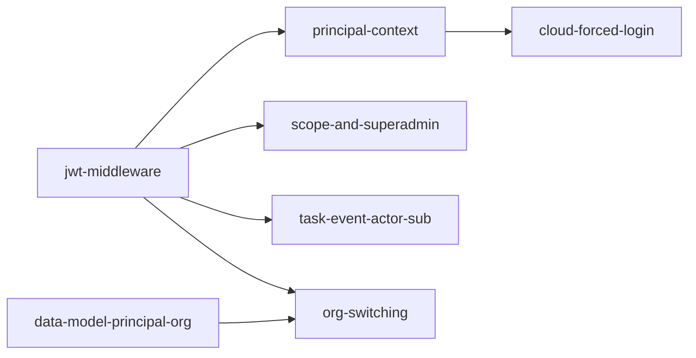

# Authentication & Identity

## Problem

Wallfacer's only access control today is a shared bearer token
(`WALLFACER_SERVER_API_KEY`). Every request is anonymous once the token
matches. That blocks:

1. **Cloud multi-tenant.** The control plane needs per-user identity and
   org-scoped data to map users to instances and enforce tenant boundaries.
2. **Single-host access control.** A personal VPS deployment benefits from
   real login over a rotated static token.
3. **Attribution.** "Workspace X created by Alice" / "task Y dispatched by
   Bob" is undisplayable until requests carry a principal.

This spec is the umbrella for fixing all three. It owns the wallfacer side
of OIDC login, session/JWT handling, principal context, org isolation, and
the UI surfaces that exist only when identity is present.

## What this spec does NOT cover

Identity is delegated to the centralized **latere.ai auth service**
(`auth.latere.ai`). Out of scope here:

- OAuth provider integration (GitHub, Google, X, email one-time-codes).
- User model, user management CRUD, or admin UI.
- Session store internals (auth service handles SSO sessions).
- Login UI with provider buttons (served by the auth service).
- CSRF / session-fixation handling, refresh token encryption.
- Org, team, and RBAC definitions (the auth service owns the role matrix).
- Sandbox-credential OAuth (`internal/oauth/`, Claude / Codex API tokens;
  entirely different system, unchanged by this spec).
- **Agent token exchange** for sandbox agents calling latere.ai backends
  (RFC 8693 delegation), split out into
  [`shared/agent-token-exchange.md`](agent-token-exchange.md) because it
  doesn't block the cloud move.

## Platform dependencies

Two shared Go packages carry the integration:

- **`latere.ai/x/pkg/oidc`**, OAuth 2.0 Authorization Code + PKCE flow,
  encrypted cookie sessions, token refresh, userinfo. Used for **browser
  login**.
- **`latere.ai/x/pkg/jwtauth`**, RS256 JWT validation via JWKS, HTTP
  middleware, claims extraction. Used for **API token validation**.

`pkg/oidc` is wired in as of Phase 1. `pkg/jwtauth` lands in Phase 2.

---

## Roadmap

The work ships in three phases. Each phase has a concrete cloud-track
prerequisite it clears.

```
Phase 1 (shipped) ──→ Phase 2 (shipped) ──→ Phase 3 (future)
     │                     │                      │
     │                     │                      └─ Third-party OIDC,
     │                     │                         remote-control wire
     │                     │
     │                     └─ Unblocks: cloud/multi-tenant.md,
     │                                  cloud/multi-user-collaboration.md
     │
     └─ Unblocks: having a visible cloud/local partition in the UI
        ahead of tenant-filesystem and k8s-sandbox work
```

| Phase | Ships | Status | Unblocks |
|-------|-------|--------|----------|
| 1 | `WALLFACER_CLOUD` flag, browser login routes, sign-in badge | **Shipped** | Visual cloud/local partition |
| 2 | JWT on API, principal context, org fields, forced login, authz, org switcher | **Shipped** | Cloud multi-tenant + multi-user collab |
| 3 | [`third-party-oidc.md`](third-party-oidc.md), [`remote-control.md`](remote-control.md) | Future (vague) | Self-hosted non-latere.ai deployments, latere.ai mobile/web remote control |

The agent-token-exchange spec ([link](agent-token-exchange.md)) is a
peer, not a phase, it runs on Phase 2's principal context but doesn't
gate the cloud move.

---

## Phase 1: Cloud-Gated Sign-In Badge (shipped)

**Goal:** let a signed-in user see their avatar + username in the status
bar. No routes become authenticated. No data is keyed on a principal.
Anonymous usage remains fully supported. This slice existed to (a) prove
the `pkg/oidc` integration end-to-end and (b) draw a visible line between
local-only and cloud surfaces ahead of cloud-track work.

**Shipped pieces** (see the four completed child specs under
[`authentication/`](authentication/) for detail):

- `WALLFACER_CLOUD` flag in `internal/envconfig/envconfig.go`.
- `internal/auth/auth.go` re-exports `pkg/oidc` types and constructors.
- Browser routes in `internal/handler/login.go`, `/login`, `/callback`,
  `/logout`, `/logout/notify`, `/api/auth/me`, mounted only when
  `cfg.Cloud == true`.
- `GET /api/config` exposes `cloud: bool` and `auth_url: string`.
- Status-bar badge (`ui/js/status-bar.js`) with signed-out / signed-in
  renderings and front-channel logout iframe.
- Documentation: `docs/cloud/README.md` plus configuration-guide subsection.

Child specs (all complete):
`envconfig-and-auth-package`, `http-routes-and-api-config`,
`status-bar-sign-in-badge`, `docs-cloud-mode`.

---

## Phase 2: User login, identity, and org isolation

**Goal:** in cloud mode, every request has a validated principal, data is
scoped by `org_id`, and unauthenticated browsers are pushed to `/login`.
Local mode is untouched, anonymous deployments and the existing
`WALLFACER_SERVER_API_KEY` path work exactly as today.

### End-state request flow

After Phase 2 lands, a wallfacer cloud-mode request looks like this:

```
         ┌───────────────────────┐         ┌────────────────────────┐
Browser ─┤ session cookie       │         │ Authorization: Bearer  │
         │ (__Host-latere-session│         │ <JWT>                  │
         └───────────┬──────────┘          └────────────┬───────────┘
                     │                                  │
                     ▼                                  ▼
            ┌────────────────────┐           ┌─────────────────────┐
            │ CookiePrincipal    │           │ jwtauth.OptionalAuth│
            │ (principal-context)│           │ (jwt-middleware)    │
            └──────────┬─────────┘           └──────────┬──────────┘
                       └───────────────┬────────────────┘
                                       │
                                       ▼
                              *jwtauth.Claims
                              in request context
                                       │
                   ┌───────────────────┼────────────────────┐
                   ▼                   ▼                    ▼
           ForceLogin           RequireSuperadmin      Task / Workspace
           (HTML routes,        (/api/admin/*)         handlers,
           cloud-forced-login)  (scope-and-superadmin) filter by OrgID
                                                      (data-model-
                                                       principal-org)
```

Both identity paths (cookie, bearer) land in the same `Claims` shape in
context. Handlers read identity via one helper, `auth.PrincipalFromContext`
, regardless of which path authenticated the request. The session cookie's
access token is itself a JWT issued by the auth service, so the cookie
path validates through the same `jwtauth.Validator` as the bearer path
rather than using a parallel code path.

### End-state data model

Task and workspace records gain two new optional fields:

```go
type Task struct {
    // ... existing fields ...
    CreatedBy string `json:"created_by,omitempty"` // claims.Sub
    OrgID     string `json:"org_id,omitempty"`     // claims.OrgID (empty if not org-scoped)
}
```

Queries pass through `TasksForPrincipal(claims)`:
- `claims == nil` (local mode) → returns everything (today's behavior).
- `claims.OrgID == ""` (user without org context) → anonymous-only records.
- `claims.OrgID == "orgA"` → records with `OrgID == "orgA"` only.

No on-disk migration: both fields are `omitempty`, existing records round-trip
as empty strings. Workspace records get the same two fields.

### End-state UI

- Sign-in badge (already shipped) extended with an **Organizations** submenu
  when the user belongs to more than one org. Selecting an org fires
  `POST /api/auth/switch-org`, which refreshes the session cookie with a
  new JWT scoped to the target org, then reloads.
- Unauthenticated browser navigation to any HTML route redirects to
  `/login?next=<original-path>` instead of rendering the anonymous board.
- `/api/config`, `/api/auth/me`, and the static-asset paths stay unprotected
  so the frontend can bootstrap.
- Local mode: no behavior change.

### Authorization surface

Phase 2 installs the two primitives every cloud deployment needs:

- `RequireSuperadmin` wraps `/api/admin/rebuild-index`.
- `RequireScope(name)` is defined but not yet applied anywhere; handlers
  opt in as scopes are assigned.

Richer RBAC (role matrix, team-level ACLs) lives in
`cloud/multi-user-collaboration.md`, not here.

### Task Breakdown

| Child spec | Depends on | Effort |
|------------|-----------|--------|
| [jwt-middleware.md](authentication/jwt-middleware.md): `pkg/jwtauth` on `/api/*`, `OptionalAuth`, `PrincipalFromContext` | Phase 1 | medium |
| [principal-context.md](authentication/principal-context.md): cookie-path principals flow into same `Claims` context | jwt-middleware | small |
| [data-model-principal-org.md](authentication/data-model-principal-org.md): `CreatedBy` + `OrgID` on task/workspace, org-scoped queries | — | medium |
| [cloud-forced-login.md](authentication/cloud-forced-login.md): anonymous HTML GET → `/login?next=`, API stays 401 | principal-context | small |
| [scope-and-superadmin.md](authentication/scope-and-superadmin.md): `RequireSuperadmin` + `RequireScope`; apply to `/api/admin/*` | jwt-middleware | small |
| [org-switching.md](authentication/org-switching.md): `/api/auth/orgs`, `/api/auth/switch-org`, badge submenu | data-model-principal-org, jwt-middleware | medium |
| [task-event-actor-sub.md](authentication/task-event-actor-sub.md): stamp `ActorSub` + `ActorType` on per-task events; hook point for `audit-log.md` | jwt-middleware | small |



`data-model-principal-org` has no spec-level dependency and can run in
parallel with `jwt-middleware`; it ships in two stages (fields + filter
now, populate-on-create after `jwt-middleware`). Everything else fans
out from those two roots.

### Explicitly out of scope for Phase 2

- Agent token exchange, see [`agent-token-exchange.md`](agent-token-exchange.md).
- In-app user / org administration, handled by the auth service.
- Third-party OIDC providers, Phase 3.
- Cross-org visibility (shared workspaces across orgs), belongs in
  `cloud/multi-user-collaboration.md` if needed.
- Remote-control wire protocol, Phase 3 / separate spec.

---

## Outcome

Phases 1 and 2 shipped together as the cloud authentication foundation.
Cloud-mode deployments now carry a validated principal on every request,
task and workspace records are org-scoped, unauthenticated browsers are
pushed to `/login`, and users with multiple orgs can switch scope from the
sign-in badge. Local-mode behavior is unchanged; the `WALLFACER_SERVER_API_KEY`
path still works exactly as before.

### What Shipped

- **Backend packages**: `internal/auth/` (middleware, validator, principal,
  authorize) re-exporting `latere.ai/x/pkg/jwtauth` and `pkg/oidc` types;
  `internal/store/principal.go` with `TasksForPrincipal`; `internal/store/actor.go`
  for actor attribution on events; `internal/workspace/groups.go` gains
  `CreatedBy`/`OrgID` + `GroupsForPrincipal`.
- **HTTP routes** (all cloud-gated): `/login`, `/callback`, `/logout`,
  `/logout/notify`, `/api/auth/me`, `/api/auth/orgs`, `/api/auth/switch-org`.
  Middleware chain: CookiePrincipal → OptionalAuth → BearerAuth → ForceLogin.
- **Data model**: `CreatedBy` + `OrgID` fields on `Task` and workspace
  `Group` (both `omitempty`, zero on-disk migration).
  Three-shape filter matrix for the `TasksForPrincipal` / `GroupsForPrincipal`
  queries (legacy shared / personal owner-only / strict org).
- **Frontend**: two-line sign-in badge with avatar, display name, and scope
  subtitle; popup menu using `position: fixed` + `getBoundingClientRect`
  to escape the sidebar's `overflow: hidden` in both expanded and collapsed
  layouts; Organizations submenu that reloads after `POST /api/auth/switch-org`.
- **Cross-repo deploys**: `latere.ai/auth` `v0.5.8` (active-org column on
  `sso_sessions`, `/authorize` accepts `org_id`, `/userinfo` returns
  `name` + `picture`, JWT `iss` populated on access tokens);
  `latere.ai/x/pkg/oidc` `v0.10.2` (`AuthCodeURLWithOpts` and `HandleLogin`
  forward empty `org_id`, `UserFromRequest` fetches `/userinfo`).
- **Configuration**: `AUTH_JWKS_URL`, `AUTH_ISSUER` (auto-derived from
  `AUTH_URL`).
- **Tests**: unit coverage for middleware, principal filter matrix,
  `CookiePrincipal`, event actor stamping, org-switch handler, sign-in
  badge rendering + menu, plus two E2E scripts under `scripts/`
  (`e2e-auth-flow.sh` for full email-OTP sign-in and `e2e-switch-org.sh`
  for personal ↔ org switching with workspace-group count verification).
- **Docs**: `docs/cloud/README.md` extended with JWT, principal, forced
  login, org switching, and scope gating sections.

### Design Evolution

1. **Cookie session no longer clears on JWT validation failure.** The spec
   originally implied `CookiePrincipal` would clear a bad session. In
   practice this caused a `/callback → / → /login → /callback` redirect
   loop because the cookie's access token is minted by fosite and is
   re-validated on every request. Now validation failure just attaches
   no principal; the session survives until explicit sign-out.
2. **JWT audience check relaxed.** `jwtauth.Validator` was originally
   configured to require `aud == client_id`. fosite doesn't set `aud` on
   its access tokens, so `BuildValidator` skips audience verification and
   relies on issuer + signature instead.
3. **Personal vs. legacy vs. org distinction** was clarified during
   implementation. Original spec had two shapes (scoped vs. unscoped).
   Production hit a third: records with `OrgID=""` authored by a user
   (personal) vs. records with both empty (legacy/shared). Final matrix:
   org view = strict (`OrgID==p.OrgID` only); personal view = owner-only
   on `OrgID==""`; local/anonymous (`claims==nil`) = everything.
4. **Org switching signalled via empty-value parameter.** Clearing active
   org ("switch to personal") required forwarding `?org_id=` with an
   empty value through `AuthCodeURLWithOpts` and `HandleLogin`. Both
   helpers previously dropped empty params; this is the single-bit
   "clear org" signal to the auth service.
5. **`/userinfo` extended beyond JWT decode.** The sign-in badge needs
   `name` and `picture`, which are not JWT claims. `UserFromRequest` in
   `pkg/oidc` now fetches `/userinfo` after decoding the access token so
   the badge displays `display_name` + avatar without a dedicated client
   call per page load.
6. **`sso_sessions.active_org_id` column added** on the auth service
   (migration 000013) to persist the caller's selected org across refreshes.
   NULL = personal view; a UUID = org-scoped view.
7. **Agent-token exchange extracted** to a separate spec
   ([`agent-token-exchange.md`](agent-token-exchange.md)) during Phase 2
   planning. It depends on the Phase 2 principal context but does not
   gate the cloud-track unblock.
8. **Audit log extracted** to `observability/audit-log.md`. Phase 2 only lays
   down one hook (`actor_sub` on the per-task event trace via
   `task-event-actor-sub.md`); the broader cross-entity log is a
   follow-up spec.
9. **Sign-in badge redesigned** from an inline pill to a two-line stack
   (name on top, scope subtitle below) after display names like
   "Changkun Ou" were being truncated by the competing org pill. The
   menu switched from `position: absolute` to `position: fixed` +
   JS anchoring so it escapes the sidebar's `overflow: hidden` in the
   collapsed layout.

---

## Phase 3: Future

Phase 3 splits into two sibling specs, both currently `vague` and
unblocked by Phase 2:

- [`shared/third-party-oidc.md`](third-party-oidc.md) —
  pluggable OIDC so self-hosted non-latere.ai deployments can log in
  against Keycloak, Entra ID, Okta, etc. Until this ships, those
  deployments keep using `WALLFACER_SERVER_API_KEY`.
- [`shared/remote-control.md`](remote-control.md) —
  wire protocol + latere.ai-side registry that lets the latere.ai web
  UI or a mobile client observe and operate a user's signed-in local
  wallfacer instances. Phase 2 laid down the identity link; Phase 3
  builds the transport.

### Audit Log (cross-entity mutation history)

Not a Phase 3 item itself, but the third future spec that depends on
Phase 2's principal context: `CreatedBy` + `OrgID` on records answers
*who originated this record*; it does not answer *who edited it,
when, and to what*. Cross-entity mutation history, task state
transitions, workspace config edits, admin actions, lives in its own
spec: [`observability/audit-log.md`](../observability/audit-log.md).

That spec depends on Phase 2 (needs `*jwtauth.Claims` on every request)
but is scoped separately so it doesn't balloon the cloud-unblock work.
Phase 2 only adds one hook for it: an `actor_sub` field on the existing
per-task event trace, so task-scoped attribution arrives with Phase 2
and the broader cross-entity log follows later.

---

## Shared Design Reference

One place for cross-phase facts. Both phases refer back here rather than
restating.

### JWT claims

Access tokens are RS256 JWTs signed by the auth service. Claims used by
wallfacer:

| Claim | Type | Used by | Notes |
|-------|------|---------|-------|
| `sub` | string | All phases | Principal ID (user/service/agent UUID). Populates `Task.CreatedBy`. |
| `principal_type` | string | Phase 2+ | `"user"`, `"service"`, `"agent"`. |
| `email` | string | Phase 1 | Users only; used for the sign-in badge fallback. |
| `org_id` | string? | Phase 2 | Current org context; `null` if user has no org. Populates `Task.OrgID`. |
| `scp` | string[] | Phase 2 | Granted scopes, consumed by `RequireScope`. |
| `roles` | string[] | Future | Reserved for `cloud/multi-user-collaboration.md`. |
| `is_superadmin` | bool | Phase 2 | Consumed by `RequireSuperadmin`. |
| `iss` | string | Phase 2 | Issuer (`https://auth.latere.ai`); verified by `jwtauth.Validator`. |
| `aud` | string | Phase 2 | Audience = wallfacer's `client_id`. |
| `exp`, `iat`, `jti` | int64 / string | Phase 2 | Standard expiry / issuance / uniqueness. |
| `validation` | string | Agent-token spec | `"local"` or `"strict"`, agent-token-exchange only. |
| `delegation_id`, `act.sub` | string | Agent-token spec | Agent-token-exchange only. |

### Cookie security

- `HttpOnly`, `Secure`, `SameSite=Lax`.
- AES-256-GCM encryption, key from `AUTH_COOKIE_KEY` or derived from
  the client secret.
- `__Host-` prefix requires `Secure=true` and no `Domain` attribute.
- Session cookie (`__Host-latere-session`): 24 h TTL; automatic refresh
  through `UserFromRequest`.
- Flow cookie (`__Host-latere-flow`): 10 min TTL; stores PKCE verifier +
  state across the redirect to the auth service.

### Client registration

Wallfacer is registered as a **confidential** `oauth_client`:
- `client_type: confidential`
- `redirect_uris: ["https://wallfacer.latere.ai/callback"]` (plus local
  dev URLs as needed)
- `allowed_scopes: ["openid", "email", "profile"]`

Registered via the auth service admin API before a deployment can enable
cloud mode.

### Deployment modes

Three combinations supported:

| Config | Behavior |
|--------|----------|
| `WALLFACER_CLOUD=false`, no API key | Open local server (default today). |
| `WALLFACER_CLOUD=false`, API key set | Bearer-token-gated local server. |
| `WALLFACER_CLOUD=true` + `AUTH_*` set | Full OIDC + (Phase 2) JWT on API + forced login. API key still honored for scripts / CLI. |

---

## Configuration

| Variable | Phase | Description | Default |
|----------|-------|-------------|---------|
| `WALLFACER_CLOUD` | 1 | Enable cloud-gated UI surfaces and routes | `false` |
| `AUTH_URL` | 1 | Auth service base URL | `https://auth.latere.ai` |
| `AUTH_CLIENT_ID` | 1 | OAuth client ID | (required when cloud) |
| `AUTH_CLIENT_SECRET` | 1 | OAuth client secret | (required when cloud) |
| `AUTH_REDIRECT_URL` | 1 | OAuth callback URL | (auto-derived) |
| `AUTH_COOKIE_KEY` | 1 | AES-GCM key for session cookies (hex or raw) | (derived from client secret) |
| `AUTH_JWKS_URL` | 2 | JWKS endpoint for JWT validation | (auto-derived from `AUTH_URL + /.well-known/jwks.json`) |
| `AUTH_ISSUER` | 2 | Expected JWT `iss` claim | (defaults to `AUTH_URL`) |
| `WALLFACER_SERVER_API_KEY` | all | Static API key; orthogonal to cloud mode | (unset = disabled) |

---

## Related Systems

### `internal/oauth/` (sandbox credentials, unchanged)

Wallfacer already has `internal/oauth/` for **sandbox credential** OAuth
(Claude Code API tokens, Codex API keys). This is a completely separate
system from user login. The two coexist:

| Concern | `internal/oauth/` | `internal/auth/` (this spec) |
|---------|-------------------|-------------------------------|
| Purpose | Sandbox API credentials | User identity |
| Routes | `/api/auth/{provider}/start` | `/login`, `/callback`, `/logout` |
| Tokens | Provider-specific API tokens | latere.ai JWTs |
| Storage | `.env` file | Encrypted session cookies |

The route paths do not collide (the sandbox-credential flow uses a
`{provider}` path parameter; the user-login routes use bare `/login` etc.).

### `shared/agent-token-exchange.md` (peer spec)

RFC 8693 token exchange for sandbox agents that need to call latere.ai
backend services on behalf of the dispatching user. Runs on top of the
Phase 2 principal context but does not gate the cloud move.
