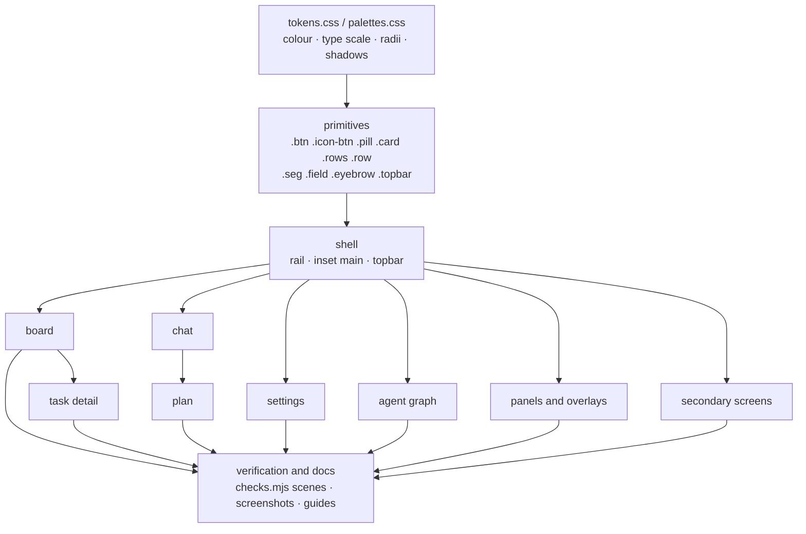
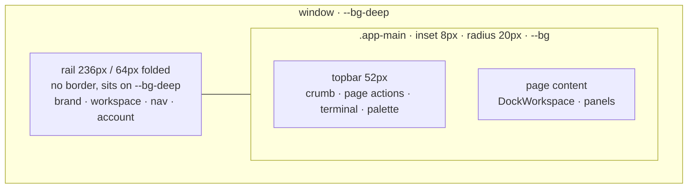

# Console Redesign

## Overview

Rebuild the signed-in wallfacer console on the visual system replichai ships:
a neutral canvas, one brand hue reserved for what the operator acts on, a muted
five-state semantic ramp, pill controls, large radii, and depth drawn with
surfaces and shadows instead of borders. Wallfacer keeps its clay accent and
brick mark. The Liquid Glass material goes: every surface is matte.

The current console reads as a different generation from replichai because of
four things: a hard border seam between rail and content plus a 24px status
strip, 4 to 6px radii with 10 to 12px type, six saturated tint colours on one
card, and a cream canvas with the terracotta accent. Retinting through tokens
fixes none of the geometry, because 7k of the 14.5k lines of CSS are scoped
inside components with hardcoded radii, sizes and 150+ hex literals. So the
work is one spec per surface, each rebuilt on shared primitives and verified
with the screenshot harness at both themes, in the order the surfaces are used.

Decisions made with the user (2026-09-05):

- **Full rebuild per surface** (option B), not a token pass.
- **Palette P2**: clay accent on a neutral canvas. The cream canvas leaves the
  default; it survives as a `paper` preset.
- **Material G1**: matte. `latere-ui/glass` is no longer imported; no
  `backdrop-filter` anywhere in the console.

## Current State

- Rail: `Sidebar.vue` wraps latere-ui `ConsoleSidebar` (glass capsule chrome
  from `latere-ui/src/styles/console.css`) and overrides it with `!important`
  to run flush to the window edge with a `border-right`. Account menu is
  latere-ui `AccountControl`.
- Shell: `layouts/AppLayout.vue` is `.app-shell` (flex) with `.app-main`
  hosting `DockWorkspace` and a 24px `StatusBar.vue` (connection, workspace,
  branch chips with sync/push/rebase, running/waiting counts, Map, Shortcuts,
  Terminal buttons).
- Page header: `styles/header/content-header.css` `.app-header` is a frosted
  36px band (glass ladder tokens) holding the editor tab strip, search, and
  icon buttons.
- Tokens: `styles/tokens.css` default palette `clay` (cream `#f4f1ea`, clay
  `#c45a33`), `palettes.css` presets `indigo/amber/rose/copper`, prefs store
  `PaletteName` roster, `index.html` no-flash script. Radii ladder
  `--radius-xs..2xl` exists for glass; app CSS mostly uses `--r-sm/md` (4/6px)
  or literals.
- Glass: `main.ts` imports `latere-ui/glass`; `App.vue` calls
  `useLiquidGlass`; 37 `backdrop-filter` sites across tokens, palettes,
  command-palette, modal, explorer, Sidebar, AppLayout, AgentGraphPage;
  `tests/glassV2Surfaces.test.ts` asserts the glass ladder is consumed.
- Scoped CSS by surface (style lines): TaskDetail 611, AgentGraphPage 448,
  SpecFocusedView 445, SpecTreePanel 433, SpecCommentsLayer 417, SessionList
  282, LocalDocsPage 275, ChatPage 237, MapPage 187, TaskComposer 162,
  ArtifactsView 157, AgentTrace 149, EditorTabStrip 146, WorkspacePicker 127.
- Screenshot harness: `scripts/ui-shots/{seed,snap,checks}.mjs`, `regen.sh`,
  `ui-test.sh`, `make ui-test`. `checks.mjs` has three scenes (board,
  switcher, picker). Committed screenshots in `docs/guide/images/` and the
  README.

## Architecture

The system has three layers. Tokens carry colour, type and geometry.
Primitives are the shared classes every surface is composed from. Surfaces are
the screens, each rebuilt only from primitives plus the minimum scoped CSS for
its own layout.

### The shell

The status bar is removed. Its contents move to where they belong: the
connection state becomes a dot on the workspace switcher, the branch chip and
its sync, push and rebase actions become a workspace row in the rail under the
switcher, the running and waiting counts become the count on the Board nav
item, Terminal and Shortcuts move to the topbar actions and the palette.
Mission Control is already a nav item.

### Palette P2

Token names do not change; the ~350 `var(--accent…)` and every `--ink`,
`--bg`, `--rule` consumer keeps working. Values change in the default block.
The old cream values move to `palettes.css` as `paper`.

| Token | Light | Dark | Role |
|---|---|---|---|
| `--bg-deep` | `#f0efec` | `#101012` | window ground behind the rail |
| `--bg` | `#fafaf9` | `#17171a` | main card canvas |
| `--bg-sunk` | `#f3f2ef` | `#141416` | inputs, ghost buttons, wells |
| `--bg-elevated` | `#fdfdfc` | `#1c1c20` | hover rows, raised fills |
| `--bg-card` | `#ffffff` | `#1f1f24` | cards, popovers, active nav row |
| `--ink` | `#141311` | `#e9e8e4` | text |
| `--ink-2` | `#55524c` | `#a9a8a2` | secondary text |
| `--ink-3` | `#6f6c66` | `#8a8983` | labels, meta (AA on `--bg`) |
| `--ink-4` | `#9a978f` | `#63625d` | placeholders, disabled |
| `--rule` | `rgba(20,19,17,.08)` | `rgba(255,255,255,.09)` | hairlines |
| `--rule-2` | `rgba(20,19,17,.14)` | `rgba(255,255,255,.15)` | strong hairlines |
| `--accent` | `#c45a33` | `#e07a51` | the one action hue |
| `--accent-2` | `#a84e2e` | `#ec8f69` | accent hover |
| `--ok` | `#3f7a55` | `#8fb894` | done, verified |
| `--warn` | `#96631f` | `#e0bb8c` | waiting, attention |
| `--run` (= `--info`) | `#0f766e` | `#45b8ab` | in progress |
| `--err` | `#a9373b` | `#db8385` | failed |
| `--purple` | `#6b4fa8` | `#b9a6e6` | published, plan |

Two constraints hold for every palette, checked by a unit test that reads the
CSS from disk:

$$
\frac{L(\text{ink-3}) + 0.05}{L(\text{bg}) + 0.05} \ge 4.5
\qquad\text{and}\qquad
\frac{L(\text{bg}) + 0.05}{L(\text{ink}) + 0.05} \ge 12
$$

where $L$ is WCAG relative luminance. The first keeps meta text readable, the
second keeps body text from reading as glare in dark mode (replichai's
"lifted off pure black" decision).

Tint pairs are derived, never hand-picked. For each state $s$ in the ramp:

$$
\text{tint-}s = \operatorname{mix}(s, \text{transparent}, 14\%), \qquad
\text{tint-}s\text{-ink} = s
$$

so `--tint-green` becomes `color-mix(in srgb, var(--ok) 14%, transparent)` and
a badge is always its own state colour on a wash of itself.

### Geometry

Radii are concentric: a control nested inside a surface takes
$r_{inner} = r_{outer} - \text{padding}$, so a 14px card with 8px padding holds
6px controls, and the 20px main card with 8px inset sits on a 28px window.

| Primitive | Geometry | Fill |
|---|---|---|
| main card | radius 20, inset 8, 1px `--rule`, `--sh-main` | `--bg` |
| topbar | height 52, hairline bottom | transparent |
| nav row | height 34, radius 12 | active: `--bg-card` + `--sh-card` |
| card | radius 14 (list/board), 18 (panel), padding 12–14 | `--bg-card` + 1px `--rule` |
| `.btn` | height 30, pill, 12.5px 600 | `--ink` on `--bg` (inverts in dark); hover `--accent` |
| `.btn.ghost` | same, 1px `--rule-2` | `--bg-sunk` |
| `.icon-btn` | 30×30, radius 10, no border | hover `--accent-soft` |
| `.pill` | mono 10px 600 uppercase 0.07em, pill | tint formula above |
| `.field` | height 32, radius 10 | `--bg-sunk`, focus ring `--accent-ring` |
| `.seg` | pill track, pill thumb | `--bg-sunk` / `--bg-card` |
| `.eyebrow` | mono 10px 0.14em uppercase | `--ink-3` |

Type scale, body 13px: `10 · 11 · 13 · 14 · 15 · 17 · 22 · 30`, line height
1.5 body, 1.2 headings. Inter stays the UI face, the system mono stack stays
for data. Instrument Serif is only used by the latere-ui footer wordmark on the
cloud landing and is untouched.

Shadows are matte: `--sh-card: 0 1px 2px rgba(20,19,17,.04)`, `--sh-main: 0 1px
2px rgba(20,19,17,.04), 0 18px 40px -30px rgba(20,19,17,.3)`, `--sh-pop: 0 10px
30px rgba(20,19,17,.13), 0 1px 2px rgba(20,19,17,.06)`. No inset top
highlights, no `--hairline-top`.

### latere-ui

Wallfacer keeps latere-ui for the session store, `AccountMenu`/`AccountPrefs`,
`SiteFooter` (cloud landing) and the docs markdown renderer. It stops using
`ConsoleSidebar`, `useLiquidGlass` and the `latere-ui/glass` stylesheet. The
rail is product chrome and wallfacer owns it, as replichai owns its own. Any
latere-ui component that still reads `--glass-*` tokens gets opaque values
from `tokens.css` (`--glass-bg: var(--bg-card)`, `--glass-blur*: 0`,
`--shadow-glass: var(--sh-pop)`), which is the fallback contract the package
documents for reduce-transparency, so it renders matte without a fork.

## Components

One child spec per surface. Each rebuilds its surface from the primitives,
deletes the scoped CSS that the primitives replace, keeps only layout CSS that
is specific to that screen, and adds a `checks.mjs` scene plus light and dark
screenshots for it.

| Child | Scope | Depends on |
|---|---|---|
| [tokens-and-primitives](console-redesign/tokens-and-primitives.md) | palette P2 values, `paper` preset, type and radii ladders, matte shadows, glass removal, primitive classes, guard tests | theme-system |
| [shell](console-redesign/shell.md) | own rail, inset main card, topbar, status bar removal, AppLayout | tokens-and-primitives |
| [board](console-redesign/board.md) | BoardPage, TaskCard, TaskComposer, column headers, SearchBar, AutomationMenu | shell |
| [task-detail](console-redesign/task-detail.md) | TaskDetail sheet, modal.css, diffs.css, TaskPrPanel, ReviewVerification, AgentTrace | board |
| [chat](console-redesign/chat.md) | ChatPage, AgentChatPanel, ChatMessageList, ChatComposer, ChatModelBadge, SpecChatPopup, multi-turn.css | shell |
| [plan](console-redesign/plan.md) | PlanPage, SpecTreePanel, SpecFocusedView, SpecCommentsLayer, SessionList, FloatingToc | chat |
| [settings](console-redesign/settings.md) | SettingsPage, five tabs, Appearance picker with the new roster | shell |
| [agent-graph](console-redesign/agent-graph.md) | AgentGraphPage, AgentGraphCanvas, AgentEditor, agents.css | shell |
| [panels-and-overlays](console-redesign/panels-and-overlays.md) | CommandPalette, WorkspacePicker, WorkspaceEditModal, ConfirmDialog, Toaster, shortcuts, device sign-in, trash, system prompts, DockWorkspace, TerminalPanel, ExplorerPanel, editor tabs | shell |
| [secondary-screens](console-redesign/secondary-screens.md) | Analytics, Routines, Mission Control, Whiteboard, Artifacts, local docs | shell |
| [verification-and-docs](console-redesign/verification-and-docs.md) | full screenshot regeneration, checks scenes gate in CI, README and guide images, configuration guide | every surface child |

Out of scope: the cloud marketing pages (`ProductPage`, `InstallPage`,
`styles/app/`). They pick up the retinted tokens and lose glass through the
token flip, and their layout is left as the marketing-site spec built it.

## Data Flow

No data changes. The status bar's data (`useSse` connection state, workspace
branch info from `/api/config`, task counts from the tasks store) is re-homed
into the rail and topbar components; the stores and endpoints are untouched.

## Error Handling

A surface spec that lands with a regression the harness catches is not done.
`checks.mjs` failures block the commit of that child; a scene is added before
the surface CSS is deleted, so the guard exists while the rewrite happens.

## Testing Strategy

Three tiers, each child adds to all three:

- **CSS guard tests** (vitest, read from disk, pattern of
  `tests/glassV2Surfaces.test.ts`): no `backdrop-filter` in any stylesheet or
  `<style>` block, no hex literal in scoped CSS outside `styles/`, the palette
  contrast formulas, the token names the child promises to consume.
- **Component tests** (vitest + happy-dom, pattern of
  `tests/sidebarWorkspacePopover.test.ts`): behaviour that moved, e.g. the
  branch actions now in the rail, the terminal toggle in the topbar.
- **Browser checks** (`scripts/ui-shots/checks.mjs`, Playwright, `make
  ui-test`): one scene per surface asserting geometry (rail 236/64, main inset
  8, card radius, no element with a computed `backdrop-filter`), no page
  errors, and a light and dark screenshot. `regen.sh` distributes the
  screenshots to their committed locations.
