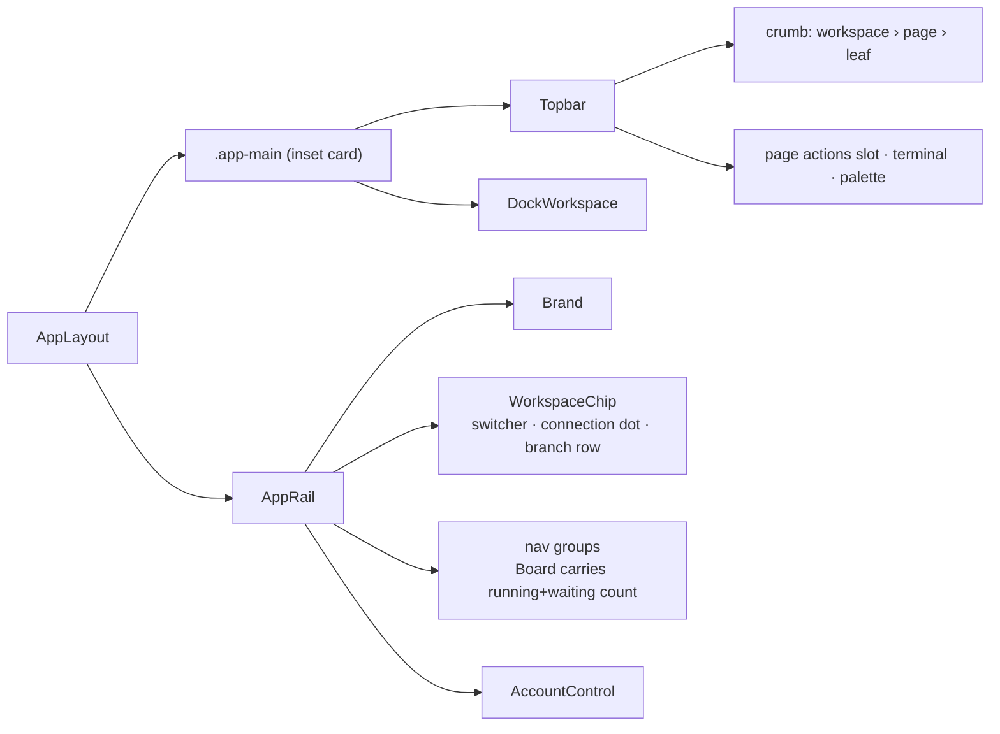

# Shell

## Overview

The rail, the inset main card, and the topbar. This is the change that makes
the console one system: every page sits inside it. It replaces latere-ui's
`ConsoleSidebar` with a rail wallfacer owns, drops the border seam and the
status bar, and gives every page one 52px topbar with a crumb and its actions.

## Current State

- `Sidebar.vue` (435 lines) builds a `ConsoleNavModel` and renders
  `ConsoleSidebar` with slots for logo, top (workspace switcher + popover),
  icons, presence, and foot (`AccountControl`). Its scoped CSS fights the
  package's capsule geometry with `!important`. Nav items: Chat, Plan,
  Whiteboard, Artifacts, Board (unread dot), Agents, Routines, Mission
  Control; Inspect: Terminal (action), Analytics; bottom: Docs, Settings.
- `AppLayout.vue`: `.app-shell` flex, `.app-main` column with the disconnect
  banner, `DockWorkspace`, `StatusBar`, then the overlays. Keyboard bindings
  via `useKeyboard`.
- `StatusBar.vue` (291 lines) + `status-bar.css` (345 lines): connection dot
  and label, workspace label, per-workspace branch chip with ahead/behind
  badges and Sync/Push/Rebase actions (`BranchDropdown.vue`), in-progress and
  waiting counts, Map, Shortcuts, Terminal buttons.
- Page headers are per page: `BoardPage` renders `.app-header`
  (`styles/header/content-header.css`) with the editor tab strip, `SearchBar`,
  explorer, automation, trash icon buttons; `PlanPage` has its own filter
  row; other pages have none.
- `tests/sidebarProductSwitcher.test.ts` and `sidebarWorkspacePopover.test.ts`
  mount `Sidebar.vue`.

## Architecture

Pages contribute to the topbar through a small store slice: `ui.topbar =
{ crumb: string[], actions?: Component }`, set in `onMounted` and cleared in
`onUnmounted`. Board sets its search and icon buttons there; Plan sets its
filter; a page with nothing sets the crumb only.

## Components

### AppRail.vue (new, replaces Sidebar.vue)

Own markup and `styles/rail.css`, no latere-ui chrome. Width `--rail-w` /
`--rail-w-fold`, on `--bg-deep`, no border, padding 14px 10px. Sections in
order: brand row (brick mark, "Wallfacer", fold button), `WorkspaceChip`,
palette trigger (`.field`-styled button "Search or command ⌘K"), nav groups
with `.eyebrow` labels, presence list, `AccountControl` pinned bottom.
Nav row is the parent's `.nav-btn` geometry: 34px, radius 12, icon in a tinted
22px square, active row on `--bg-card` with `--sh-card`. Folded: labels and
eyebrows `display: none`, icons centred, tooltips via `title`. Collapse
persists at the existing `wallfacer-sidebar-collapsed` key. Below 860px the
rail becomes a drawer with a scrim, the pattern replichai's `.rail-scrim`
uses; the existing product switcher behaviour moves into the brand row.

### WorkspaceChip.vue (new)

The workspace switcher button (name, caret) with the connection state as a
5px dot before the name (`--ok` connected, `--warn` reconnecting, `--ink-4`
closed, `title` carries the label). Under it, one `branch row` per renderable
workspace: `⎇ branch`, ahead/behind `.pill-neutral` counts, and the existing
Sync/Push/Rebase actions as `.btn.sm.ghost` inside the existing
`BranchDropdown` popover instead of inline. The popover logic and `busy`
state move from `StatusBar.vue` unchanged.

### Topbar.vue (new)

52px, hairline bottom, transparent. Left: crumb from `ui.topbar.crumb`,
ellipsised per replichai's `.crumb` rules. Right: the page's actions
component, then two `.icon-btn`s: terminal toggle (`ui.toggleTerminal`, kbd
hint in `title`) and shortcuts (`ui.openShortcuts`). The disconnect banner
renders under the topbar inside the main card.

### AppLayout.vue

`.app-shell` on `--bg-deep`; `.app-main` becomes the inset card (`margin: 8px
8px 8px 0`, `--r-main`, 1px `--rule`, `--sh-main`, `overflow: hidden`) with
`Topbar`, banner, `DockWorkspace`. `StatusBar` is removed along with
`status-bar.css`. Below 860px the inset margin and radius drop to 0.

### Board nav count

`AppRail` shows `inProgress + waiting` on the Board item as replichai shows
its Projects count (`.count`, mono 11px, `--ink-3`), replacing both the
status-bar counters and the unread dot when the count is non-zero; the dot
remains for the zero-count unread case.

### Page headers

`styles/header/content-header.css` is deleted. `BoardPage` moves its editor
tab strip into the page body's top edge (a `.tabs` row under the topbar, the
tab strip child spec restyles it) and registers search plus the three icon
buttons as its topbar actions.

## Testing Strategy

- `tests/appRail.test.ts` (rename and extend the two sidebar tests): nav
  model renders the same items and routes, fold persists, workspace popover
  opens and switches, product switcher still reachable from the brand row.
- `tests/workspaceChip.test.ts`: connection dot class per `connState`, branch
  actions call the same endpoints `StatusBar` did (moved tests from
  `StatusBar`'s coverage).
- `tests/topbar.test.ts`: crumb renders from the store, actions slot renders,
  terminal button toggles `ui.showTerminal`, page unmount clears the slice.
- `tests/designSystem.test.ts`: `rail.css` and `topbar.css` have no
  `backdrop-filter`; `Sidebar.vue`, `StatusBar.vue`, `status-bar.css`,
  `header/content-header.css` no longer exist.
- `checks.mjs` scene `shell`: rail box width 236 open and 64 folded, main
  card left edge equals rail right edge, main card inset 8px from top, right
  and bottom, topbar height 52, no `.status-bar` in the DOM, no element with
  a computed `backdrop-filter`. Screenshots `board` light and dark and a
  folded variant.

## Outcome

**Status:** complete, 2026-09-05. Commits `423962f4` (nav model, ui store
slice) and `b90fff5f` (rail, workspace chip, topbar, layout, deletions).

**What shipped.** `AppRail.vue` (with `NavIcon.vue` and `lib/nav.ts` as the one
nav model for rail and crumb) replaces `Sidebar.vue`; `WorkspaceChip.vue`
carries the switcher, the connection dot and the branch rows with Sync / Push
/ Rebase; `Topbar.vue` carries the crumb, the page's actions and the terminal
and shortcuts buttons; `AppLayout.vue` paints `--bg-deep` and insets
`.app-main` as the 20px card. `StatusBar.vue`, `status-bar.css`, `header.css`
and the five `header/` partials are deleted; the board grid rules moved to
`board.css`. `checks.mjs` gained the `shell` scene (rail 236/64, inset 8,
topbar 52, no status bar, search in the topbar slot, cards rendered) and
`make ui-test` passes eleven scenes. Tests: `appRail`, `workspaceChip`,
`topbar`, `nav`.

**Decisions made during implementation.**
- Page actions are a component the page registers on the ui store
  (`setTopbarActions` / `clearTopbarActions`), rendered by `Topbar` with
  `<component :is>`. A first pass used `<Teleport to="#topbar-actions">`; it
  tripped a Vue patch error during hydration in the built app and needed the
  test DOM to fake the target. `BoardActions.vue` holds the board's controls
  and the automation menu state.
- The crumb is derived: workspace from the stores, page from `lib/nav.ts`, a
  leaf a page sets with `setCrumbLeaf`. Pages do not write the whole crumb.
- The product switcher stays in the brand row (latere-ui `ProductSwitcher`
  used directly, styled by its own scoped CSS); the rail no longer imports
  `latere-ui/console`.
- Below 860px the rail is a fixed drawer opened by the topbar's menu button
  with a scrim in `AppLayout`; the fold button hides there.
- The editor tab strip renders at the top edge of the board body and hides
  itself when only the pinned Board tab is open.

**Deviations from the spec.** The Map button had no replacement to add:
Mission Control is already a nav row. The unread dot only shows when the
Board count is zero, as specified.

**Surprises.** `board.css` styles the task card as `.card`, the same name as
the primitive; the workspace popover borrowed `position: relative` from it
and pushed the rail down. The popover now carries its own class and the board
spec renames the task card.

**Follow-ups.** None beyond the sibling specs.
