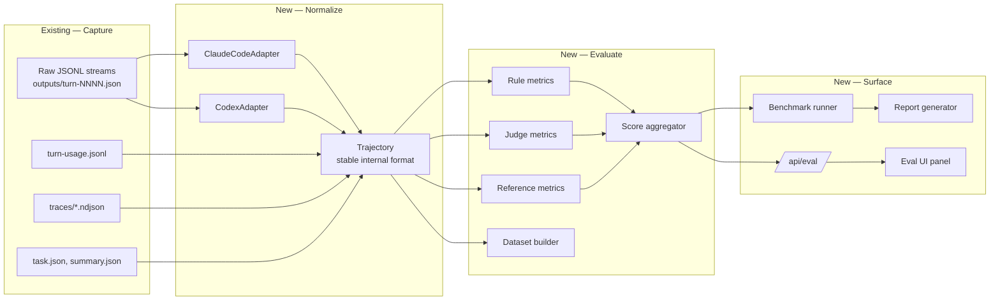

# Evaluation Pipeline & Agent Benchmark

## Overview

Wallfacer already captures every turn of every agent run — raw Claude Code / Codex CLI JSONL streams, per-turn usage records, trace events, and immutable task summaries. This spec proposes building an **evaluation pipeline** on top of that data: a system that converts captured trajectories into graded results, derives quality metrics, and composes them into a **reproducible benchmark** for agent systems.

Two things motivate this. First, we currently can't answer quantitative questions about how well the agents behave (success rate on equivalent prompts, cost to first correct commit, tool-use efficiency, instruction-following drift). Second, the captured data is rich enough to be a research asset on its own — once normalized, it can feed offline evaluators, preference datasets, and (in future work) reward models or RL loops.

Scope for this spec: the **evaluation and benchmarking** side — schema normalization, metric taxonomy, graders, benchmark harness, and surfacing results. Training-side use of the data (RLVR, fine-tuning, reward modeling) is out of scope here but is an explicit design consideration so the data shape doesn't preclude it.

## Current State

The data we need is already on disk. Per the filesystem storage layout (`internal/store/backend_fs.go`):

- `~/.wallfacer/data/<workspace-key>/<task-uuid>/`
  - `outputs/turn-NNNN.json` — raw agent stream per turn, written by `SaveTurnOutput` (`internal/store/io.go:76`). Truncated on overflow, sentinel appended.
  - `turn-usage.jsonl` — append-only `TurnUsageRecord` NDJSON (`internal/store/turn_usage.go`).
  - `traces/compact.ndjson` + `traces/NNNN.json` — `TaskEvent` audit trail.
  - `task.json`, `summary.json`, `oversight.json`, `oversight-test.json` — task metadata, immutable summary on `done`, oversight assessments.
  - `tombstone.json` — soft-delete marker; data retained for `WALLFACER_TOMBSTONE_RETENTION_DAYS`.
- `ExecutionEnvironment` (`internal/store/models.go`) captures container image + digest, model, API endpoint, instructions hash, sandbox type.
- Outcomes: `FailureCategory` (`timeout | budget_exceeded | worktree_setup | container_crash | agent_error | sync_error | unknown`), `RetryRecord` snapshots, test-run results.
- Commit pipeline produces real git commits per task — diff, lint, and test-run outcomes are reconstructible from the worktree state at each `span_end` of `commit`.

The raw streams themselves are **not normalized**: Claude Code emits its `--output-format stream-json` NDJSON, Codex emits its `codex exec --json` NDJSON. Both formats are documented in vendor docs but not formally versioned (no published JSON Schema in either ecosystem — see [Claude Code #9058](https://github.com/anthropics/claude-code/issues/9058), [Codex #2288](https://github.com/openai/codex/issues/2288)).

No existing package does evaluation or aggregation. `GET /api/tasks/{id}/outputs/{filename}` and `/api/tasks/{id}/turn-usage` serve single-task slices; there is no batch export, dataset build, or cross-task aggregate endpoint.

## Approaches Considered

The space of "evaluating coding agents" is crowded. This section surveys the approaches, what they require, and what Wallfacer's data supports.

### 1. Rule-based / process metrics (recommended primary)

Compute metrics directly from the captured trajectory and the resulting git state. No model-in-the-loop.

Examples: **success rate** (task reached `done`), **commit count per task**, **tokens/cost per successful commit**, **retry rate by failure category**, **turn-to-first-tool-use**, **tool-use diversity**, **test-pass rate**, **diff size distribution**, **files touched outside declared scope**, **lint delta**, **average time in `committing` state**.

Strengths: deterministic, cheap, reproducible, cacheable.
Weaknesses: can't grade *quality* of open-ended outputs (was the code well-structured? did the agent pick the right abstraction?).

### 2. LLM-as-judge (recommended secondary)

Run a grader model over the trajectory + final diff to score quality dimensions: instruction-following, code quality, test coverage, alignment with the prompt, safety.

Patterns to support: **single-model rubric scoring** (1–5 per dimension with justification), **pairwise preference** between two trajectories for the same prompt, **reference-answer comparison** when a gold diff exists.

Strengths: captures qualitative dimensions; scales; well-studied pattern.
Weaknesses: grader bias, variance, drift when the grader changes. Requires careful prompt versioning and tie-breaking.

### 3. Reference-answer metrics (selective)

For benchmark tasks with a known-good diff or known-good test suite (our own `wf-spec-*` tasks; public SWE-Bench-style items), compute **exact-match** and **semantic-match** against the reference.

Strengths: objective where available.
Weaknesses: only applies to a fixed task set; brittle for open-ended prompts.

### 4. Preference modeling (future)

Accumulate pairwise preferences (human or LLM-judged) between trajectories and fit a Bradley-Terry-style preference model. Produces a scalar quality signal comparable across heterogeneous tasks.

Strengths: unified ranking across prompts; feeds naturally into reward-model training.
Weaknesses: requires volume and careful sampling to avoid distribution bias.

### 5. RL / RLVR (out of scope, design with the door open)

**RLVR** (reinforcement learning with verifiable rewards) and vanilla RL from captured trajectories are compelling long-term directions: the commit pipeline produces a verifiable reward (tests pass / commit merged), and every trajectory is a full (state, action, reward) rollout.

They are out of scope for this spec — we are not training models here — but the spec's outputs (normalized trajectories, reward-aligned metrics) are exactly the inputs an RLVR pipeline would consume. **Design constraint:** the normalized trajectory format must retain tool-call granularity, timing, and reward-signal attribution so a future training pipeline can consume it without re-mining the raw streams.

### Recommendation

Ship **(1) rule-based + (2) LLM-as-judge** in phase 1. **(3) reference-answer** in phase 2, initially for our own internal task suite. **(4) preference modeling** and **(5) RL** are deferred but explicitly designed-around in the normalized schema.

## Architecture

Three-layer pipeline:



The **Trajectory** type is the contract. Everything upstream of it is vendor-specific; everything downstream is vendor-agnostic.

## Components

### Normalizer — `internal/eval/trajectory/`

Converts raw vendor streams into a stable `Trajectory` value.

- `Trajectory` — ordered list of `TrajectoryEvent`s plus per-turn aggregates, task-level metadata (pulled from `task.json` / `summary.json`), and a `ProviderVersion` stamp (Claude Code vX.Y.Z / Codex vX.Y.Z). Provider version **must** be captured at run time — extend `ExecutionEnvironment` (`internal/store/models.go`) so it's recorded alongside the existing image/model/hash fields.
- `TrajectoryEvent` — a small, closed enum: `message`, `thinking`, `tool_call`, `tool_result`, `stop`, `error`, `unknown`. `unknown` preserves the raw payload unchanged so new vendor event types flow through the pipeline without breaking.
- Two adapters, one per provider: `ClaudeCodeAdapter`, `CodexAdapter`. Each owns its vendor quirks and version-specific decoding. New providers (future agent abstraction — see `specs/shared/agent-abstraction.md`) add an adapter.
- Adapters are **pure**: `(raw []byte, env ExecutionEnvironment) -> (Trajectory, error)`. No I/O. Testable offline against fixture files checked into `internal/eval/trajectory/testdata/`.

### Metric library — `internal/eval/metrics/`

Each metric is a `func(Trajectory) (MetricResult, error)` registered under a stable name. Results are numeric (float64) plus optional structured detail.

- **Process metrics (cheap):** `turns`, `tokens_input`, `tokens_output`, `cache_read_tokens`, `cost_usd`, `tool_call_count`, `tool_diversity`, `time_in_committing`, `retry_count_total`, `retry_count_by_category`.
- **Outcome metrics (git-derived):** `reached_done`, `commit_count`, `files_changed`, `lines_added`, `lines_deleted`, `files_outside_scope` (needs a declared scope — ties to `specs/oversight/validation-barrier.md`).
- **Test metrics:** `test_run_passed`, `test_coverage_delta` (requires prior coverage snapshot — out of scope for v1).
- **Efficiency derived metrics:** `cost_per_success`, `turns_per_success`, `tokens_per_line_of_diff`.

Metric registry is flat; new metrics register by name; a metric that can't run on a given trajectory returns `ErrNotApplicable` (excluded from aggregates cleanly).

### Judge — `internal/eval/judge/`

LLM-as-judge grader. Uses the existing sandbox infrastructure via `backend.Launch` — a judge is just another `SandboxActivity` (`Judge`). Prompts live in `internal/prompts/judge_*.tmpl` and are overridable via the existing system-prompt-template API (`GET/PUT/DELETE /api/system-prompts/{name}`).

- **Rubric scorer:** rubric + trajectory + final diff → scored dimensions with justification. Rubric is YAML, versioned, checked into `internal/prompts/rubrics/`.
- **Pairwise comparator:** two trajectories for the same prompt → winner + margin + reasoning.
- **Reference comparator:** trajectory + gold diff → structural + semantic similarity score.

Determinism hooks: every judge run records `(judge_model, rubric_version, prompt_template_hash, seed)` so results are reproducible and comparable over time. Stored as a `JudgeResult` blob via `StorageBackend.SaveBlob` under `eval/judge/<eval-run-id>/<task-uuid>.json`.

### Dataset builder — `internal/eval/dataset/`

Projects a set of tasks into a training/evaluation-ready dataset: one record per task, columns for prompt, environment, trajectory (normalized), metrics, judge scores, final diff, and (optionally) ground truth. Emits JSONL by default; Parquet behind a build tag if the user opts in.

Filters: by workspace, sandbox type, date range, status, tag, dependency scope. Redaction: re-uses the planned `specs/identity/data-boundary-enforcement.md` redaction hooks — nothing ships out of a workspace without going through the configured redactor.

### Benchmark runner — `internal/eval/benchmark/`

A benchmark is a named bundle:

```
benchmarks/<benchmark-name>/
  manifest.yaml        # version, metrics list, judge config, baseline agent
  tasks/               # ordered list of task definitions — prompt, setup script, success criteria
  references/          # optional gold diffs / gold test outputs
  baselines/           # archived eval-run ids for comparison
```

Running a benchmark = dispatching its tasks onto a clean workspace snapshot, capturing the trajectories, running the metric suite, running the judge, and emitting a report. Benchmarks are **deterministic inputs** (pinned prompts, pinned setup) against **non-deterministic agents** — the report surfaces variance (N runs) so regressions are statistically meaningful.

First-party benchmark bundles to ship:

1. **`wf-core-tasks`** — ~10 representative tasks from Wallfacer's own spec-driven workflow (spec validate, small refactor, bug fix from BUGS.md, add test, PR-style change).
2. **`wf-conflict-suite`** — the parallel-conflict task set already exercised by `make e2e-dependency-dag`, promoted to a graded benchmark.
3. **`wf-plan-mode`** — planning-agent specific tasks (create spec, refine spec, break down).

Third-party benchmarks (e.g., SWE-Bench subsets) can be added via the same manifest format.

### Aggregator + report — `internal/eval/report/`

Aggregates metric results across a benchmark run (mean, median, p95, per-category breakdowns) and renders Markdown / JSON / HTML reports. HTML report is the primary UI artifact — embeds sparklines, diff comparisons, and judge-score breakdowns.

### UI surface — `ui/js/eval/`

New panel accessible from the sidebar. Two modes:

- **Eval browser** — list eval runs, filter by benchmark / date / agent / model, open a run to see per-task scorecards, trajectories, and diffs.
- **Comparison view** — pick two eval runs (before/after model change, or two agents) and see paired metric deltas with significance indicators.

Minimum viable UI in v1 is a single run viewer. Comparison view is v2.

## Data Flow

**Post-hoc evaluation of an existing task:**

1. User (or cron) calls `wallfacer eval run --task=<uuid>` or `POST /api/eval/runs` with filter criteria.
2. Eval coordinator loads task data from `StorageBackend` (task.json, turn-usage, traces, raw outputs).
3. Appropriate adapter (chosen by `Sandbox` field) normalizes to `Trajectory`.
4. Registered metrics run in parallel over the trajectory.
5. If the eval config enables the judge, the judge runs in a sandbox container using the existing runner machinery.
6. Aggregator writes an `EvalRun` record + per-task `EvalResult` blobs via `StorageBackend`.
7. Report renderer emits Markdown / HTML under `~/.wallfacer/data/<workspace-key>/eval/<run-id>/`.
8. UI / CLI / API surfaces read the aggregated record.

**Running a benchmark:**

1. `wallfacer eval bench <name>` loads `benchmarks/<name>/manifest.yaml`.
2. For each task in the manifest: spin up a clean workspace snapshot (reuse overlay-snapshots infrastructure when available — `specs/shared/overlay-snapshots.md`), dispatch the prompt via the standard runner, capture the trajectory.
3. Run metric suite + judge as in post-hoc flow.
4. Repeat N times per task for variance (configurable, default 3).
5. Aggregate across runs; emit report.

## API Surface

### CLI

- `wallfacer eval run [--task=<uuid>|--filter=<expr>] [--metrics=<list>] [--judge=<rubric>]` — evaluate existing captured tasks.
- `wallfacer eval bench <benchmark-name> [--runs=N] [--tag=<label>]` — run a benchmark from scratch.
- `wallfacer eval list` — list eval runs.
- `wallfacer eval show <run-id>` — print scorecard.
- `wallfacer eval export <run-id> --format=jsonl|parquet` — dataset export.
- `wallfacer eval diff <run-id-a> <run-id-b>` — paired metric delta.

### HTTP

- `GET  /api/eval/runs` — list eval runs with filters.
- `POST /api/eval/runs` — start an eval run (body: filter or benchmark name + config).
- `GET  /api/eval/runs/{id}` — run metadata + per-task results summary.
- `GET  /api/eval/runs/{id}/stream` — SSE: progress for a running eval.
- `GET  /api/eval/runs/{id}/tasks/{task_id}` — full per-task scorecard + trajectory + judge.
- `GET  /api/eval/runs/{id}/report` — HTML report.
- `GET  /api/eval/runs/{id}/export` — dataset export; respects redaction config.
- `DELETE /api/eval/runs/{id}` — delete an eval run's artifacts.
- `GET  /api/eval/benchmarks` — list available benchmarks.
- `GET  /api/eval/metrics` — list registered metrics with descriptions.

### Configuration (env)

- `WALLFACER_EVAL_ENABLED` (default `true`).
- `WALLFACER_EVAL_JUDGE_MODEL` — override the default judge model.
- `WALLFACER_EVAL_JUDGE_TEMPERATURE` — judge sampling temperature (default `0`).
- `WALLFACER_EVAL_BENCH_RUNS` — default variance runs per task (default `3`).
- `WALLFACER_EVAL_MAX_PARALLEL` — concurrent task evaluations (default inherits `WALLFACER_MAX_PARALLEL`).

### Storage extensions

Extend `ExecutionEnvironment` with:
- `AgentCLIVersion string` — e.g., `claude-code/1.2.3` or `codex/0.14.0`, captured by running `<cli> --version` once per container at launch (cached for container lifetime).

Add eval artifacts under the storage backend's blob surface:
- `eval/runs/<run-id>/run.json`
- `eval/runs/<run-id>/tasks/<task-uuid>.json`
- `eval/runs/<run-id>/judge/<task-uuid>.json`
- `eval/runs/<run-id>/report.html`
- `eval/datasets/<dataset-id>.jsonl`

## Error Handling

Three failure modes dominate:

1. **Vendor format drift.** An adapter sees a new event type or a field shape changes. Behavior: the unrecognized event is wrapped as `TrajectoryEvent{Kind: Unknown, Raw: ...}` and the normalizer logs a structured warning with the offending bytes. The eval run **does not fail**; metrics that require that event return `ErrNotApplicable` and are excluded from aggregates with a clear note in the report. A per-provider `normalizer_unknown_event_count` metric surfaces drift rate so operators notice before it becomes material.

2. **Judge model unavailable / refusing.** The judge is retried with a bounded budget (re-uses auto-retry infra in `internal/runner/`). After exhaustion, the `JudgeResult` is marked `failed` with the reason; the run proceeds with rule-based metrics only. Reports flag missing judge coverage rather than silently under-reporting.

3. **Partial / truncated trajectories.** Some tasks will have truncated turn outputs (`WALLFACER_MAX_TURN_OUTPUT_BYTES`). Metrics that depend on full turn content return `ErrNotApplicable`; outcome-level metrics (success, commits, tests) still compute from `summary.json`. The `trajectory_truncated` flag is set on the `EvalResult` and surfaced in the UI.

All three modes are visible in the report rather than swallowed. Bias from drop-outs is quantifiable, not hidden.

## Testing Strategy

### Unit tests

- **Adapters:** fixture-driven. Commit real recorded JSONL from both providers (scrubbed of user content) under `internal/eval/trajectory/testdata/{claude,codex}/v<N>/`. Each fixture has a golden `Trajectory` JSON. Adapter tests diff normalized output against golden. New provider versions = new fixture subdirectory; old versions stay regression-guarded.
- **Metrics:** table-driven. Construct synthetic `Trajectory` values covering each metric's edge cases (zero turns, all-tool-call turns, truncation flag, failure categories). Assert exact numeric output.
- **Judge:** mocked out — test prompt assembly, rubric versioning, retry logic, result decoding. Live judge calls are covered by integration tests behind a build tag.

### Integration tests

- **End-to-end `eval run`:** seed a temp store with a handful of real task directories (reuse existing test fixtures in `internal/store/testdata/`), run the eval coordinator, assert the emitted `EvalRun` shape and report structure.
- **Benchmark manifest loader:** load each first-party benchmark manifest, validate schema, assert task list is non-empty and each task's setup script exists.
- **`e2e-eval-smoke`** (new `make` target): dispatches a single trivial benchmark task end-to-end against a real sandbox, evaluates it, asserts the report renders. Gated behind sandbox credentials like existing E2E suites.

### Reproducibility checks

- A dedicated test re-evaluates a frozen trajectory + frozen judge model + frozen rubric and asserts the produced `EvalResult` matches a golden value byte-for-byte (rule metrics) or within a tight tolerance (judge scores at temperature 0).

### Format-drift guard

- A nightly CI job (or periodic agent job) runs the adapters against the latest Claude Code / Codex CLI producing a small canary trajectory. Any new unknown event types fail the job and flag the regression proactively. Prevents silent adapter rot.

## Non-Goals

- **Training agents.** This spec does not implement RLVR, SFT, or reward-model training. It produces the substrate such work would consume.
- **Real-time evaluation during task execution.** Evaluation is post-hoc. Runtime anomaly detection is `specs/observability/telemetry-observability.md`'s concern.
- **Cross-organization dataset sharing.** Redaction and boundary enforcement are handled by `specs/identity/data-boundary-enforcement.md`; this spec only plugs into their hooks.
- **General-purpose scientific experiment framework.** We target agent-trajectory evaluation specifically; we won't try to be Weights & Biases.

## Open Questions

- How do we handle judge-model versioning vs eval comparability? One answer: pin a "canonical judge" per benchmark manifest version; a benchmark version change implies a judge version change.
- Should first-party benchmark tasks live inside the `specs/` tree (as spec-driven tasks) or in a parallel `benchmarks/` tree? (Leaning: parallel tree, since benchmarks are fixed artefacts, not iterative design docs.)
- Is there a path for **user-contributed benchmarks** via a public registry later? Out of scope for v1 but design the manifest format with that in mind.

## Downstream Impact

Specs that will want to consume this once shipped:

- `specs/shared/agent-abstraction.md` — eval becomes the correctness bar for any new agent backend.
- `specs/oversight/multi-agent-consensus.md` / `specs/oversight/multi-agent-debate.md` — evaluation is how we judge whether consensus/debate actually improves outcomes.
- `specs/shared/token-cost-optimization.md` — cost-efficiency metrics here feed directly into that spec's regression model.
- `specs/shared/intelligence-system.md` — failure pattern learning needs graded trajectories.

These will declare `depends_on: specs/shared/eval-pipeline.md` when they reach the validation stage.
