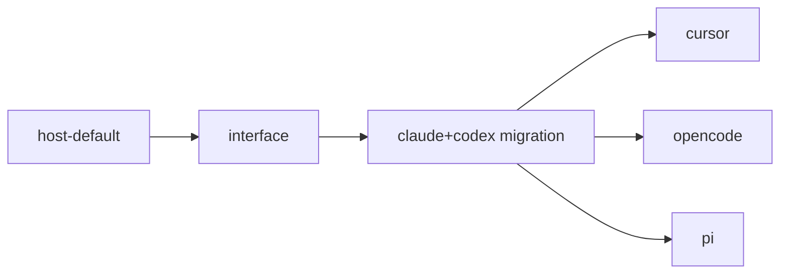

# Harness Abstraction

> Migration note: the `internal/sandbox/` -> `internal/executor/` rename plus the new `internal/harness/` package shipped, and all five Tier-A harnesses (Claude, Codex, Cursor, OpenCode, Pi) are registered and selectable. The Design prose below is written in the present tense as the target architecture; read it as the shipped state. See [Outcome](#outcome).

## Problem

Wallfacer used to hardcode two coding-agent CLIs - Claude Code and Codex - across the runner, handlers, env config, and UI. The former `sandbox.Type{Claude, Codex}` enum did double duty: it named a **harness** (which CLI to spawn) and was wired through code paths named "sandbox" (which container to run it in, even though [host-default.md](host-default.md) removed the container).

Issue #12 asks for more harnesses - OpenCode, Cursor, Pi, and others. Adding a third under the old shape would have meant duplicating Claude/Codex's argv-building, NDJSON-parsing, session-resume, and usage-extraction logic across every site that branched on `sandbox.Type`. The previous [agent-abstraction.md](agent-abstraction.md) (shipped) unified the seven **roles** onto a single `runAgent` primitive, but it still called a single argv/parse path inside. That path is what needed the new abstraction.

## Landscape (from the developer-doc survey)

| Tier | Harnesses | NDJSON event stream | Session resume | MCP | Headless approval flag |
|---|---|---|---|---|---|
| **A - fully embeddable** | Claude Code, Codex, Cursor, OpenCode, Pi | yes, documented | yes | yes | yes |
| **B - partial** | Goose | yes (schema less stable) | yes | yes (70+ ext) | per-extension |
| **C - text-only / scrape** | Aider, Crush | no - plain stdout | weak | no | `--yes` / `--yolo` |

All Tier-A harnesses carry the same five facts through different vocabularies: session id, assistant text deltas, tool-call start, tool-call end, terminal result with usage/cost. Argv shape varies (`-p` vs positional vs stdin; `--model` vs `-m`; `--cd` vs `--workspace` vs cwd). Headless-approval flag varies. The variance is parametric - translation, not behavior.

Tier C lacks structured output entirely and is out of scope for v1.

## Design

Two layers, both new:

### Layer 1 - `internal/harness/` (new package)

```go
package harness

type ID string

const (
    Claude   ID = "claude"
    Codex    ID = "codex"
    Cursor   ID = "cursor"
    OpenCode ID = "opencode"
    Pi       ID = "pi"
)

type Harness interface {
    ID() ID
    BuildArgv(req Request) (argv []string, stdin io.Reader, err error)
    ParseEvent(raw []byte) (Event, error)        // one NDJSON line → canonical Event
    AuthEnv(cfg AuthConfig) (map[string]string, error)
    Capabilities() Capabilities
}

type Request struct {
    Prompt       string
    Cwd          string
    Model        string         // best-effort, harness-specific format
    SessionID    string         // empty ⇒ new session; non-empty ⇒ resume
    Permission   Permission     // ReadOnly | Edit | Full
    SystemPrompt string         // appended where supported
    MCPServers   []MCPServer    // dropped on harnesses without MCP
    MaxTurns     int
    MaxCostUSD   float64        // dropped on harnesses without budget flag
}

type Event struct {
    Kind       EventKind   // SystemInit | AssistantText | ToolCallStart | ToolCallEnd | UserResult | Result | Error
    SessionID  string
    Text       string      // for AssistantText
    Tool       *ToolCall   // for ToolCall*
    Usage      *Usage      // populated on Result (input/output/cache tokens + cost when known)
    StopReason string
    Raw        json.RawMessage
}

type Capabilities struct {
    SupportsResume    bool
    SupportsMCP       bool
    SupportsSystemPrompt bool   // some have --append-system-prompt; others need prompt prepend
    EmitsUsage        bool
    EmitsCost         bool
    NeedsTTY          bool
}
```

Each harness is one Go file: `internal/harness/claude.go`, `codex.go`, `cursor.go`, etc. Tests live alongside. No harness depends on any other.

### Layer 2 - Executor (`internal/executor/`, narrowed)

The former `sandbox.Backend` interface lives on as `executor.Backend` - the **executor** abstraction, "where does the task run" - but its scope narrows. Three executor categories:

| Category | Examples | Composes a `Harness`? |
|---|---|---|
| **Harness-running, local** | `HostExecutor` (from [host-default.md](host-default.md)) | yes |
| **Harness-running, remote** | `TopozExecutor` ([cloud/latere-integration/topos-remote-executor.md](../cloud/latere-integration/topos-remote-executor.md)) | yes - Topos runs the wallfacer-selected harness server-side |
| **Self-contained, remote** | `ClaudeManagedAgentsExecutor` ([cloud/claude-managed-agents.md](../cloud/claude-managed-agents.md)), `AntigravityExecutor` ([cloud/antigravity.md](../cloud/antigravity.md)) | no - the harness is baked into the platform, model and tools may be selectable but the agent loop is not |

The K8s/Cella path keeps its own backend on the cloud side.

The runner's flow has two shapes depending on executor category:

```go
// Harness-running executors (host, Topos):
argv, stdin, _ := harness.BuildArgv(req)
handle, _ := executor.Launch(ctx, argv, env, cwd, stdin)
for line := range handle.Stdout() {
    evt, _ := harness.ParseEvent(line)
    // emit to event sourcing, accumulate usage, etc.
}

// Self-contained executors (Managed Agents, Antigravity):
handle, _ := executor.Dispatch(ctx, req)   // takes harness.Request directly
for evt := range handle.Events() {         // executor parses native API events into canonical Event
    // same downstream consumers
}
```

The `Executor` interface must be high-level enough to host both - likely `RunTask(ctx, req) (EventStream, error)` where harness-running implementations internally call `harness.BuildArgv` + `harness.ParseEvent`, and self-contained implementations call their remote API directly. The runner stays uniform; the dispatch choice is internal to each executor.

`runAgent` (the role primitive) is unaffected - it still owns role descriptors. For harness-running executors it goes through `harness.BuildArgv` / `harness.ParseEvent`; for self-contained executors it passes `harness.Request` straight through.

## Decisions

1. **New package `internal/harness/`**, separate from `internal/executor/`. Executor is "where it runs"; harness is "what runs." Conflating them was the original bug.
2. **The former `sandbox.Type` is now `harness.ID`.** The rename completed and `internal/sandbox/` was removed, so no backward-compat type alias lingers. Persisted task records and env vars keep the same string values (`"claude"`, `"codex"`), which preserves stored data and the `WALLFACER_SANDBOX_*` env-var names.
3. **`Capabilities` is read at runtime**, not compile-time, so callers can degrade gracefully (skip `MaxCostUSD` on harnesses that don't honor it, prepend `SystemPrompt` into the user prompt on harnesses without `--append-system-prompt`).
4. **No Tier-C support in v1.** Aider and Crush lack a structured event stream; supporting them needs a stdout-scraping adapter and a "lossy harness" UX. Deferred.
5. **Goose deferred too** - Tier B, but its NDJSON schema is least documented externally. Add once a user asks.
6. **Topos is not a harness, neither are Claude Managed Agents or Antigravity.** They're all *executors*. Topos proxies a wallfacer-selected harness; Managed Agents and Antigravity are self-contained (fixed harness, with selectable model in the Managed Agents case). Separate specs: [`cloud/latere-integration/topos-remote-executor.md`](../cloud/latere-integration/topos-remote-executor.md), [`cloud/claude-managed-agents.md`](../cloud/claude-managed-agents.md), [`cloud/antigravity.md`](../cloud/antigravity.md).

## Out of Scope

- Removing the container backend - that's [host-default.md](host-default.md), a prerequisite (shipped).
- Remote / Topos executor - separate cloud spec.
- Tier-C (Aider, Crush) - deferred until demand.
- User-installable third-party harnesses - could become a plugin model later; v1 ships in-tree harnesses only.
- UI work to let users pick a harness per task - already exists for Claude/Codex; new harnesses slot into the same surface.

## Task Breakdown

| Child spec | Depends on | Effort |
|---|---|---|
| [Interface and package skeleton](harness-abstraction/interface.md) | host-default | small |
| [Migrate Claude and Codex](harness-abstraction/claude-and-codex-migration.md) | interface | medium |
| [Add Cursor](harness-abstraction/cursor.md) | claude-and-codex-migration | medium |
| [Add OpenCode](harness-abstraction/opencode.md) | claude-and-codex-migration | medium |
| [Add Pi](harness-abstraction/pi.md) | claude-and-codex-migration | medium |



**Recommended execution order:**

1. **Interface** (shipped) - the `internal/harness/` package with type definitions and tests, no production caller. Lowest risk, gives every subsequent spec a stable target.
2. **Claude + Codex migration** (shipped) - argv/parse logic refactored into `claude.go` and `codex.go`. Behavior-preserving; the existing runner suite was the regression gate.
3. **Cursor / OpenCode / Pi** - each is independent after migration. Adding a third harness is the real test of whether the interface is right: if any of these needs to leak through, the interface should be revised before adding the next.

## Validation Goals

The abstraction is sound when:

- Adding a new Tier-A harness touches only one new file (`internal/harness/<name>.go`) plus its test, an entry in the registry, and one UI list entry.
- No file outside `internal/harness/` switches on harness ID for argv construction or event parsing.
- The existing Claude/Codex code paths produce byte-identical behavior post-migration (NDJSON output equivalence, usage attribution unchanged). (Met: migration landed behavior-preserving.)

## Open Questions for Implementation

- Should `harness.Permission` map 1:1 onto each CLI's permission knob, or normalize across harnesses (e.g., "Edit" always means "can write within cwd, no shell elevation")? Lean toward a normalized 3-value enum that each adapter translates; document divergences in `Capabilities`.
- Where do user-supplied environment overrides per harness live? Current env config has `WALLFACER_SANDBOX_<ACTIVITY>` per role; do we add `WALLFACER_HARNESS_<NAME>_*` for harness-specific knobs (e.g., Cursor's `CURSOR_API_KEY`, OpenCode's `OPENCODE_SERVER_PASSWORD`)? Resolved in [interface](harness-abstraction/interface.md).

## Outcome

Shipped. The abstraction and all five Tier-A harnesses landed; every leaf spec is complete.

- **Interface + migration:** [interface](harness-abstraction/interface.md) - `internal/harness/` package with the `Harness` interface, value types, registry, and a fake harness for tests. [claude-and-codex-migration](harness-abstraction/claude-and-codex-migration.md) - Claude and Codex argv/parse logic moved into `claude.go`/`codex.go`; `sandbox.Type` became `harness.ID` and `internal/sandbox/` became `internal/executor/` (`executor.Backend` / `HostBackend`).
- **All five harnesses registered + selectable:** [cursor](harness-abstraction/cursor.md), [opencode](harness-abstraction/opencode.md), [pi](harness-abstraction/pi.md) each ship an adapter (`Register`ed at init), a host-mode launcher in `internal/executor/`, env/config/UI/doctor surfacing, docs, and build-tag-gated live e2e tests.

**Validation finding (the central question this epic posed).** The `Harness` *interface* held up: no harness required revising Request/Event/Capabilities/AuthEnv, and each adapter is a single ~150-250 line file. What the interface did **not** make automatic was *registration propagation* - the launch dispatch, binary resolution, `/api/config` sandbox list, and `doctor` all hardcoded the `{claude, codex}` pair, so each new harness had to touch those call sites. Cursor (the first validation case) generalized `config.go` to drive its list from `harness.All()`; OpenCode and Pi then dropped in without reopening it. The executor's per-harness `launch*` switch remains the one site that still grows by one case per harness (each has genuinely different stdout handling), which is acceptable.

Status flipped from `validated` to `complete` on 2026-06-15 once all three leaf harnesses shipped.
