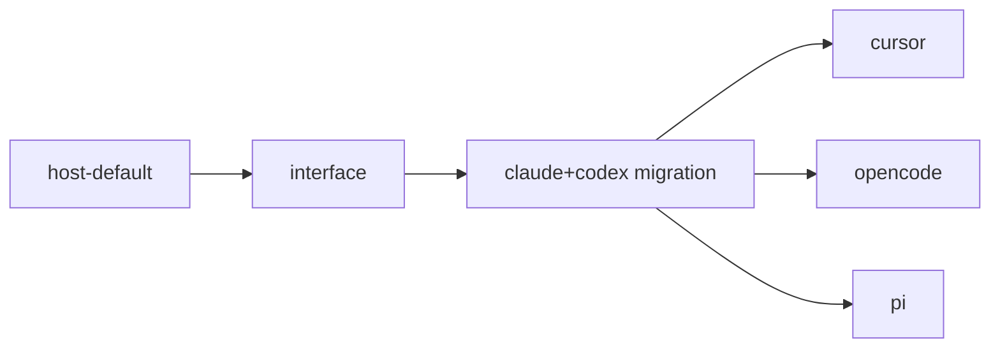

# Harness Abstraction

## Problem

Wallfacer hardcodes two coding-agent CLIs — Claude Code and Codex — across the runner, handlers, env config, and UI. The current `sandbox.Type{Claude, Codex}` enum is doing double duty: it names a **harness** (which CLI to spawn) and is wired through code paths named "sandbox" (which container to run it in, even though [host-default.md](host-default.md) removes the container).

Issue #12 asks for more harnesses — OpenCode, Cursor, Pi, and others. Adding a third today means duplicating Claude/Codex's argv-building, NDJSON-parsing, session-resume, and usage-extraction logic across every site that branches on `sandbox.Type`. The previous [agent-abstraction.md](agent-abstraction.md) (shipped) unified the seven **roles** onto a single `runAgent` primitive, but it still calls a single argv/parse path inside. That path is what needs the new abstraction.

## Landscape (from the developer-doc survey)

| Tier | Harnesses | NDJSON event stream | Session resume | MCP | Headless approval flag |
|---|---|---|---|---|---|
| **A — fully embeddable** | Claude Code, Codex, Cursor, OpenCode, Pi | yes, documented | yes | yes | yes |
| **B — partial** | Goose | yes (schema less stable) | yes | yes (70+ ext) | per-extension |
| **C — text-only / scrape** | Aider, Crush | no — plain stdout | weak | no | `--yes` / `--yolo` |

All Tier-A harnesses carry the same five facts through different vocabularies: session id, assistant text deltas, tool-call start, tool-call end, terminal result with usage/cost. Argv shape varies (`-p` vs positional vs stdin; `--model` vs `-m`; `--cd` vs `--workspace` vs cwd). Headless-approval flag varies. The variance is parametric — translation, not behavior.

Tier C lacks structured output entirely and is out of scope for v1.

## Design

Two layers, both new:

### Layer 1 — `internal/harness/` (new package)

```go
package harness

type ID string

const (
    Claude   ID = "claude"
    Codex    ID = "codex"
    Cursor   ID = "cursor"
    OpenCode ID = "opencode"
    Pi       ID = "pi"
)

type Harness interface {
    ID() ID
    BuildArgv(req Request) (argv []string, stdin io.Reader, err error)
    ParseEvent(raw []byte) (Event, error)        // one NDJSON line → canonical Event
    AuthEnv(cfg AuthConfig) (map[string]string, error)
    Capabilities() Capabilities
}

type Request struct {
    Prompt       string
    Cwd          string
    Model        string         // best-effort, harness-specific format
    SessionID    string         // empty ⇒ new session; non-empty ⇒ resume
    Permission   Permission     // ReadOnly | Edit | Full
    SystemPrompt string         // appended where supported
    MCPServers   []MCPServer    // dropped on harnesses without MCP
    MaxTurns     int
    MaxCostUSD   float64        // dropped on harnesses without budget flag
}

type Event struct {
    Kind       EventKind   // SystemInit | AssistantText | ToolCallStart | ToolCallEnd | UserResult | Result | Error
    SessionID  string
    Text       string      // for AssistantText
    Tool       *ToolCall   // for ToolCall*
    Usage      *Usage      // populated on Result (input/output/cache tokens + cost when known)
    StopReason string
    Raw        json.RawMessage
}

type Capabilities struct {
    SupportsResume    bool
    SupportsMCP       bool
    SupportsSystemPrompt bool   // some have --append-system-prompt; others need prompt prepend
    EmitsUsage        bool
    EmitsCost         bool
    NeedsTTY          bool
}
```

Each harness is one Go file: `internal/harness/claude.go`, `codex.go`, `cursor.go`, etc. Tests live alongside. No harness depends on any other.

### Layer 2 — Executor (existing, narrowed)

The current `sandbox.Backend` interface stays as the **executor** abstraction — "where does the process run" — but its scope narrows to launch + supervise. Implementations: `HostExecutor` (local, from [host-default.md](host-default.md)), `RemoteExecutor` (Topos, separate spec). The K8s/Cella path keeps its own backend on the cloud side.

The runner becomes:

```go
argv, stdin, _ := harness.BuildArgv(req)
handle, _ := executor.Launch(ctx, argv, env, cwd, stdin)
for line := range handle.Stdout() {
    evt, _ := harness.ParseEvent(line)
    // emit to event sourcing, accumulate usage, etc.
}
```

`runAgent` (the role primitive) is unaffected — it still owns role descriptors. It just calls `harness.BuildArgv` and `harness.ParseEvent` instead of branching on `sandbox.Type`.

## Decisions

1. **New package `internal/harness/`**, not under `internal/sandbox/`. Sandbox / executor is "where it runs"; harness is "what runs." Conflating them is the current bug.
2. **`sandbox.Type` is renamed to `harness.ID`** with a backward-compat alias for one release. Persisted task records and env vars use the same string values (`"claude"`, `"codex"`).
3. **`Capabilities` is read at runtime**, not compile-time, so callers can degrade gracefully (skip `MaxCostUSD` on harnesses that don't honor it, prepend `SystemPrompt` into the user prompt on harnesses without `--append-system-prompt`).
4. **No Tier-C support in v1.** Aider and Crush lack a structured event stream; supporting them needs a stdout-scraping adapter and a "lossy harness" UX. Deferred.
5. **Goose deferred too** — Tier B, but its NDJSON schema is least documented externally. Add once a user asks.
6. **Topos is not a harness.** It's a remote *executor* (Latere's `/v1/agents` control plane). Separate spec: [`cloud/latere-integration/topos-remote-executor.md`](../cloud/latere-integration/topos-remote-executor.md).

## Out of Scope

- Removing the container backend — that's [host-default.md](host-default.md), a prerequisite.
- Remote / Topos executor — separate cloud spec.
- Tier-C (Aider, Crush) — deferred until demand.
- User-installable third-party harnesses — could become a plugin model later; v1 ships in-tree harnesses only.
- UI work to let users pick a harness per task — already exists for Claude/Codex; new harnesses slot into the same surface.

## Task Breakdown

| Child spec | Depends on | Effort |
|---|---|---|
| [Interface and package skeleton](harness-abstraction/interface.md) | host-default | small |
| [Migrate Claude and Codex](harness-abstraction/claude-and-codex-migration.md) | interface | medium |
| [Add Cursor](harness-abstraction/cursor.md) | claude-and-codex-migration | medium |
| [Add OpenCode](harness-abstraction/opencode.md) | claude-and-codex-migration | medium |
| [Add Pi](harness-abstraction/pi.md) | claude-and-codex-migration | medium |



**Recommended execution order:**

1. **Interface** — ship the `internal/harness/` package with type definitions and tests but no production caller. Lowest risk, gives every subsequent spec a stable target.
2. **Claude + Codex migration** — refactor existing argv/parse logic into `claude.go` and `codex.go`. Behavior-preserving; the existing 867-test runner suite is the regression gate.
3. **Cursor / OpenCode / Pi** — each is independent after migration. Adding a third harness is the real test of whether the interface is right: if any of these needs to leak through, the interface should be revised before adding the next.

## Validation Goals

The abstraction is sound when:

- Adding a new Tier-A harness touches only one new file (`internal/harness/<name>.go`) plus its test, an entry in `harness.All()`, and one UI list entry.
- No file outside `internal/harness/` switches on harness ID for argv construction or event parsing.
- The existing Claude/Codex code paths produce byte-identical behavior post-migration (NDJSON output equivalence, usage attribution unchanged).

## Open Questions for Implementation

- Should `harness.Permission` map 1:1 onto each CLI's permission knob, or normalize across harnesses (e.g., "Edit" always means "can write within cwd, no shell elevation")? Lean toward a normalized 3-value enum that each adapter translates; document divergences in `Capabilities`.
- Where do user-supplied environment overrides per harness live? Current env config has `WALLFACER_SANDBOX_<ACTIVITY>` per role; do we add `WALLFACER_HARNESS_<NAME>_*` for harness-specific knobs (e.g., Cursor's `CURSOR_API_KEY`, OpenCode's `OPENCODE_SERVER_PASSWORD`)? Resolved in [interface](harness-abstraction/interface.md).
