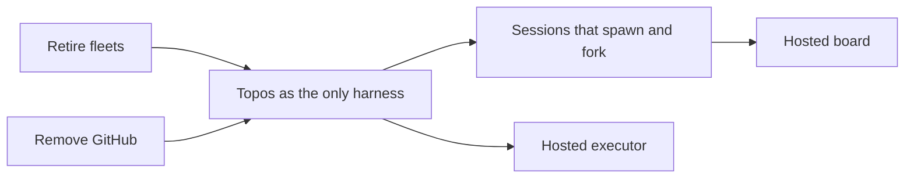

# Platform-Native Wallfacer: One Harness, No Fleets, No GitHub

Umbrella for four decisions the maintainer made on 2026-10-02, after the spec
tree was reviewed against the code. Together they change what wallfacer is:
from a board that drives third-party coding CLIs through user-authored agent
pipelines, to an application on the Latere platform that runs one harness and
lets agents organize themselves at run time.

## The decisions

| # | Decision | In the maintainer's words | Spec |
|---|---|---|---|
| 1 | **Retire fleets.** No user-authored agents or fleets. | Wallfacer becomes "some sort of application later that can spawn or create agents on the fly, like Claude Code's workflow". | [retire-agent-fleets](platform-native/retire-agent-fleets.md) |
| 2 | **One harness.** Migrate to the rebuilt Topos harness and make it the only one. | "Clean use of the Latere platform and the Topos harness. No Claude Code, no Codex, but just allow model switches." | [topos-native-harness](topos-native-harness.md), to be rewritten against the rebuilt module |
| 3 | **Rethink the board before hosting it.** | A hosted board "is something we need to think about how to make this scale". An execution board "is nice but has some problems such as sharing context, messages, awareness to each other"; in Claude Code "an agent can spawn a subagent, can fork itself to inherit the entire context thread". | [sessions-that-spawn-and-fork](platform-native/sessions-that-spawn-and-fork.md) |
| 4 | **Remove GitHub.** No GitHub connection in wallfacer for now. | "Once the whole Latere platform is more stable and mature, GitHub connection is more or less just connected by a connector." | [remove-github-integration](platform-native/remove-github-integration.md) |

## Before and after

| | Today | After |
|---|---|---|
| Harness | Five CLI harnesses (Claude Code, Codex, Cursor, OpenCode, Pi) as subprocesses, plus an opt-in in-process one on a pre-rebuild runtime pin | The Topos harness, in-process for a local run and hosted for a remote one |
| Models | Whatever each CLI is signed in to, or a provider key | The platform's Models capability; the user picks and switches the model |
| Credentials | Per-CLI sign-in, provider keys in the keyring | One Latere sign-in |
| Orchestration | Built-in `implement` pipeline, user-authored fleets on two other engines | One agent per task that spawns what it needs at run time |
| Authoring surface | An agent and fleet editor | None. Instructions come from the repository's instruction files and the task |
| GitHub | A brokered token, a pull request per task | Nothing. A push to a remote is plain git |
| Remote execution | Drafted: a hosted session, as a mode of the native harness | The same harness, the same events, another place |

What does not change: wallfacer runs on the user's machine by default; a task
works in its own git worktree; the commit, rebase and merge pipeline, the spec
lifecycle, oversight, and the board stay wallfacer's.

## Why these belong together

Each decision removes a place where wallfacer held a second copy of something
the platform or the harness owns.

- An agent editor beside the platform's agent builder.
- Five process adapters, each with its own sign-in, event format and failure
  modes, beside one harness whose session log is the same locally and hosted.
- A GitHub token broker beside what will be a platform connector.
- A fleet topology drawn in advance beside a harness that can spawn and fork
  when the work calls for it.

They also make the cloud track simpler. The
[hosted executor](../cloud/latere-integration/topos-remote-executor.md) maps
session events onto the task timeline; with one harness, the local run emits
the same events, and wallfacer keeps one mapping for both.

## Order of work

1. **Retire fleets** and **remove GitHub** first. Both are removals with no
   design dependency, and both shrink the surface the harness migration has to
   carry.
2. **Topos as the only harness.** The large one: move the in-process seam to
   the rebuilt module, route every role through it, then remove the CLI
   adapters, the subprocess executor and the per-CLI credential flows.
3. **Sessions that spawn and fork.** A design, not yet a plan. It decides what
   the board becomes and therefore what a hosted board is.

## What this reverses

Recorded so nobody reads the old statements as current.

- **Harness abstraction.** The archived
  [harness-abstraction](../.archive/shared/harness-abstraction.md) made five
  CLIs selectable behind one interface. After decision 2 the interface has one
  implementation, and the abstraction is removed with the adapters.
- **"Model agnosticism through harnesses."** Agnosticism moves to the model
  catalog: any model the platform offers, one harness.
- **CLI credential flows.** The archived
  [oauth-token-setup](../.archive/local/oauth-token-setup.md) (browser sign-in
  for Claude and Codex credentials) and the provider half of
  [provider-secret-store](../.archive/local/provider-secret-store.md) lose
  their subject.
- **The agent-graph design.** [agent-graph-e2e-design](../.archive/local/agent-graph-e2e-design.md)
  is withdrawn by decision 1.
- **The Git workflow track's GitHub half.** The
  [github-integration](../.archive/intent/github-integration.md) umbrella and
  its children are retired by decision 4. Task revert and commit attribution
  are local git and stay.
- **The platform integration's first design rule.** It says the default build
  with no sign-in runs a host agent process with no network dependency on
  Latere. With models coming from the platform, that cannot stay true as
  written. See open question 1.

## Open questions

1. **What a signed-out instance can do.** If the only model source is the
   platform's Models capability, an instance with no Latere account can plan,
   browse and review, and cannot run an agent. The alternatives are a model
   gateway the user points at themselves (the gateway is open source and
   self-hostable) or a direct provider key. Which of these wallfacer supports
   decides whether "local-first" still means "works with no account". The
   harness spec must answer this before the CLI adapters are removed.
2. **Third-party remote executors.** [claude-managed-agents](../cloud/claude-managed-agents.md)
   and [antigravity](../cloud/antigravity.md) dispatch tasks to other vendors'
   hosted agents. They contradict "clean use of the Latere platform" and were
   not named in the decision. Recommended: archive both. Not done yet.
3. **Existing users of a CLI subscription.** A user who runs wallfacer on a
   Claude or Codex subscription pays nothing per token today. After decision 2
   they pay the platform's model prices. The migration needs a stated position
   and a release note, not a silent switch.
4. **Sub-agent roles.** Title, commit message, oversight and test verification
   run as separate one-shot agents today, each pinned to a harness by an
   environment variable. On one harness they become model calls or spawned
   threads. Which, and on which model, is the harness spec's to decide.

## Non-goals

- Renaming the product or moving its address.
- Changing the spec lifecycle, the commit pipeline, or the worktree model.
- A hosted board. It waits on decision 3's design.
