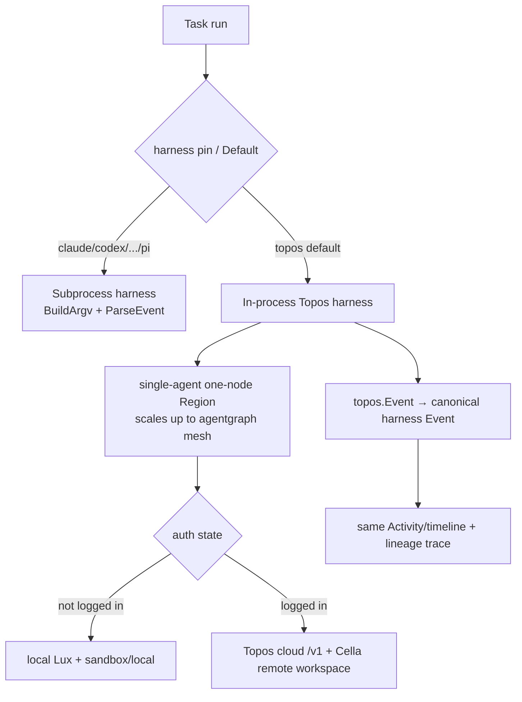

# Topos as Native Harness

## Overview

Make Topos (`latere.ai/x/topos`) wallfacer's first-class **native agent harness**
and the default execution path going forward, so a fresh wallfacer run is powered by
the latere.ai-native runtime rather than the Claude Code CLI. Claude Code and every
other harness (Codex, Cursor, OpenCode, Pi) remain registered and selectable; only the
hardcoded *default* changes. The native harness runs in-process and offline for local
use, and offers logged-in users an option to execute on the Topos agent cloud platform
with Cella remote workspaces.

This is the harness-layer counterpart to the already-shipped
[[topos-runtime-integration]] (which embedded Topos as a *separate* multi-agent runtime
path) and [[topos-live-agent-trace]] (live tracing). Those made Topos *runnable*; this
spec makes it the *native default* and reconciles it with the harness abstraction.

## Current State

Two seams exist side by side and do not yet meet:

1. **The harness abstraction** (`internal/harness/`). Each harness is a CLI adapter:
   the `Harness` interface (`harness.go`) is built around a subprocess — `BuildArgv(req)
   → argv + stdin`, `ParseEvent(raw []byte) → Event`, `AuthEnv(cfg) → env`. Registered
   harnesses (claude/codex/cursor/opencode/pi/fake) self-register via `init()` into a
   package registry (`registry.go`). `Default() ID { return Claude }`
   (`registry.go:48`) hardcodes the default, and the doc comment already anticipates
   "a follow-up may make this configurable."

2. **The Topos runtime path** (`internal/agentgraph/`). Topos is embedded **in-process**
   and runs agentic flows via Lux (`flow.Flow.Agentic`); it has **zero** references to
   `internal/harness`. A run produces a lineage graph, not a harness `Event` stream. The
   single importer of the root `topos` package is `internal/agentgraph`, guarded by an
   import-boundary test.

**Hardcoded Claude-Code couplings** beyond the registry default:

- `internal/runner/agent.go:189` — `primary := harness.Claude`.
- `internal/runner/agent.go:256,271` — a Claude-specific token-limit error fallback.
- `internal/runner/commit.go:487` — `initial := harness.Claude`.
- `internal/runner/container.go:252,266` — return `harness.Claude`.

A task pins its harness through the `Sandbox` field (a legacy name carried from the old
`sandbox.Type`; see `internal/runner/agent_test.go:172` using `Sandbox: harness.Claude`).

## The central design decision: in-process harness vs CLI subprocess

The `Harness` interface assumes a subprocess that emits NDJSON. Topos runs in-process.
Two ways to make Topos satisfy the harness contract:

- **(A) Generalize the harness seam to admit an in-process harness.** Add an execution
  strategy so a harness is either *subprocess* (today's `BuildArgv`/`ParseEvent`) or
  *in-process* (`Run(ctx, Request) → <-chan Event`). Topos reuses the existing
  `internal/agentgraph` embed (a single-agent run = a one-node region) and maps
  `topos.Event` → the canonical harness `Event`. No new process boundary, no `latere`
  binary dependency. Cost: the harness interface and its call sites in `internal/runner`
  must stop assuming argv.
- **(B) Run Topos as the `latere` CLI subprocess.** `../latere-cli` already streams a
  Topos run as NDJSON (`topos_stream.go`) and runs locally (`topos_local.go`), which
  fits `BuildArgv`/`ParseEvent` with near-zero interface change. Cost: a process
  boundary wallfacer already avoids for agentic runs, plus a hard dependency on an
  installed `latere` binary, duplicating an embed wallfacer already has.

**Decision: (A), ratified 2026-06-30.** wallfacer already embeds Topos in-process for
multi-agent runs ([[topos-runtime-integration]]); the native harness is the *same* engine
at single-agent scale, not a second copy reached through a subprocess. **CLI invocation of
`latere` is explicitly rejected** — no subprocess boundary for the native path.
`../latere-cli`'s `topos_*.go` commands are the **reference for the driver logic** (region
build, provider selection, sandbox wiring, streaming), not a binary to shell out to.

## Architecture

The native harness unifies the two seams: it is a registered `Harness` (so the picker,
config, and runner treat it uniformly) whose implementation is the embedded Topos
runtime. The multi-agent agentgraph path and the single-agent native harness become the
same engine at different region sizes.

## Components

### 1. Harness registration + Result/event mapping

- New `harness.Topos ID = "topos"` constant and a `toposHarness` registered via `init()`
  (mirrors `claude.go`/`codex.go`). Lives in `internal/harness/topos.go`.
- Bridge `internal/agentgraph` into the harness contract: a single-agent run maps
  `topos.Event` (already exposed via `Options.Observer`, see [[topos-live-agent-trace]])
  to the canonical `harness.Event` (`KindAssistantText`, `KindToolCall*`, `KindResult`
  with `Usage`/`StopReason`). The canonical types are already harness-agnostic, so the
  mapping is total.
- Resolve the in-process-vs-subprocess decision (OQ-1) by either extending the `Harness`
  interface with an in-process `Run` strategy (recommendation A) or adding a thin
  subprocess adapter (B).
- Keep the import boundary: only `internal/agentgraph` (and the new harness bridge it
  backs) names a `topos` type.

### 2. Default flip + decoupling audit

- `registry.go:48` `Default()` returns `Topos` (make it configurable per the existing
  doc-comment intent; env/config override falls back to `Topos`).
- Audit and unwind each hardcoded `harness.Claude`: `agent.go:189`, `commit.go:487`,
  `container.go:252,266`. Replace with `harness.Default()` / the resolved pin, preserving
  behavior for tasks explicitly pinned to Claude.
- The Claude-specific token-limit fallback (`agent.go:256,271`) is gated on
  `primary == harness.Claude`; generalize or scope it so a non-Claude default does not
  silently lose the fallback (the native harness needs its own degradation story).
- "Decouple from Claude Code" = stop defaulting to the Claude Code **CLI harness**. It
  does **not** remove Claude **models**: Topos can still call Claude models through Lux
  (`../latere-cli/.../topos_claude_auth.go` shows model-credential use is distinct from
  the harness).

### 3. Auth-gated local/cloud execution + sandbox wiring

The harness resolves an execution mode from login state. The swap is which
`sandbox.Provider` (and model/control plane) is injected; the agent documents are
identical ("author once, run local or cloud").

| Mode | Trigger | Control plane | Model creds | Execution backend |
|------|---------|---------------|-------------|-------------------|
| Local (default) | not logged in | in-process embedded `latere.ai/x/topos` | local Lux (`luxd` stateless / BYO keys) | topos `sandbox/local` |
| Cloud | logged into latere.ai | Topos cloud platform `/v1` | metered Lux | Cella remote workspaces (`../sandbox`, `latere.ai/x/sandbox`, via topos `sandbox/cella`) |

- The seam is `topos.Options.Sandbox sandbox.Provider` (`topos/topos.go:200`). Local mode
  injects `sandbox/local`; cloud mode injects the `sandbox/cella` provider pointed at a
  remote workspace.
- Mirror `../latere-cli`'s `topos_provider.go` / `topos_local.go` for provider and
  credential resolution rather than re-deriving it.
- Local mode must work fully offline with no latere.ai dependency (the default path).
- Cloud mode is an **opt-in** for logged-in users; it must never become a silent
  requirement (OQ-2: how/where the user chooses local vs cloud per run or per workspace).

### 4. UI / branding surfacing

The runtime is invisible today (only 3 frontend mentions, all code-comment/help-text).
Surface the native-harness identity:

- Add a `.topos-brand` wordmark rule to `frontend/src/styles/app/buttons-hero.css`
  alongside the existing `.wallfacer-brand`/`.cella-brand` (italic serif,
  `linear-gradient(135deg,#55707a 0%,#6f8a56 58%,#a07045 100%)` clipped to text), and a
  small 4-node graph SVG icon component (ported from the agents-repo `SiteNav` mark).
- Brand `AgentLineage.vue`'s header ("Agent Graph" → node icon + Topos wordmark) and
  upgrade the plain-text "topos runtime" mention in `AgentGraphPage.vue` to the wordmark.
- Show the resolved harness (and local/cloud mode) in the harness picker so a user can
  see and switch the native default.

### 5. Migration / back-compat

- The change is a **default flip, not a removal**: tasks with an explicit `Sandbox`
  harness pin (including Claude) run unchanged.
- Existing serialized tasks with no pin must resolve deterministically; decide whether
  the flip is retroactive (unpinned old tasks become Topos) or only applies to new runs
  (OQ-3).
- No regression to existing subprocess-harness execution paths.

## API Surface

- Config / env: a default-harness override (the `Default()` doc-comment's "configurable"
  follow-up) defaulting to `topos`; a local-vs-cloud execution selector for logged-in
  users.
- No new HTTP routes required for local mode; cloud mode consumes the Topos platform
  `/v1` (owned by `../agents`), not a new wallfacer route.

## Error Handling

- The Claude-only token-limit fallback must not be silently lost when the default is not
  Claude; the native harness defines its own degradation (e.g., surface the Lux/cloud
  error, optional fallback to a configured subprocess harness).
- Cloud mode unreachable (offline, not logged in, platform error) degrades to local mode
  with a clear signal, never a hard failure of an otherwise-local-capable run.
- Topos observer/runtime panics are already `recover()`-guarded in the SDK
  ([[topos-live-agent-trace]] Phase 1); the harness bridge must not reintroduce a crash
  path.

## Testing Strategy

- **Harness registration**: `Topos` registers; `Lookup`/`All` include it; `Default()`
  returns `Topos`; pinned Claude still resolves to Claude.
- **Event mapping**: a fake-model Topos single-agent run maps to the canonical `Event`
  stream (assistant text, tool calls, result with usage) — deterministic via topos
  `ModelFake` (no network), mirroring the agentgraph tests.
- **Decoupling audit**: tests asserting the runner uses the resolved/default harness, not
  a literal `harness.Claude`, at each former hardcoded site; the token-limit fallback
  still fires for a Claude-pinned task.
- **Local/cloud selection**: the correct `sandbox.Provider` and model creds are injected
  per auth state; local mode runs with no cloud dependency.
- **Back-compat**: existing pinned tasks serialize/run byte-identically; the import-guard
  test still passes (only the agentgraph bridge names topos).
- **Frontend**: `.topos-brand` renders; `AgentLineage.vue` shows the wordmark; non-topos
  tasks unaffected. `make build` (vue-tsc + SSG) and `golangci-lint` green.

## Open Questions

- **OQ-1 RESOLVED (2026-06-30).** Approach **A** — in-process harness: generalize the
  seam, reuse the agentgraph embed, map `topos.Event` → canonical `Event`. CLI subprocess
  over `latere` (B) is rejected; no subprocess boundary for the native path.
- **OQ-2.** Where the user chooses local vs cloud execution — per run, per workspace, or
  a global setting — and the default for a logged-in user (local unless explicitly opted
  into cloud).
- **OQ-3.** Retroactivity of the default flip for existing unpinned tasks (new-runs-only
  vs retroactive).
- **OQ-4.** Relationship to [[topos-runtime-integration]] M6 (unified Agents/Flows graph
  UI): does the native single-agent harness share the same editor/registry surface, and
  does this spec wait on the in-progress GraphCanvas/MapPage work or proceed in parallel
  on the harness layer only.

## Implementation Status (2026-07-01)

Built and tested (opt-in native harness — a task pinned to `topos` runs end to
end in-process):

- **Decoupling audit DONE** (`9059cb99`). The harness resolver's final fallback
  (`sandboxForTaskActivity`, `runAgent` tier-6, the plan-commit-message helper)
  routes through `harness.Default()` instead of a literal `harness.Claude`;
  behaviour-identical today. The Claude→Codex token-limit fallback is correctly
  left keyed on the *resolved* primary (Claude-specific, not default-specific).
- **Harness registration DONE** (`26a8d02f`). `harness.Topos` + a `toposHarness`
  registry citizen; in-process (`BuildArgv` returns `ErrInProcess`); an
  `InProcess(id)` predicate; surfaced in `harness.All()` (UI selector). Pkg cov
  90.5%.
- **Single-agent seam DONE** (`e865d461`). `agentgraph.RunAgent` runs a one-node
  pinned region through the same engine/observer/model wiring as the multi-agent
  path. Pkg cov 90.1%.
- **Runner wiring DONE** (`519a1dd9`). `execute.go` routes an implement-path task
  whose resolved harness is in-process to `runNativeTopos` (zero container
  launches, single-node lineage). Shared `driveToposRun` extracted from
  `runAgenticFlow`. Integration-tested.
- **Branding DONE** (`52d11106`). `.topos-brand` wordmark + the node-graph logo
  in `AgentLineage.vue` ("Agent Graph · powered by Topos").

**Remaining (the `Default()` flip is gated on this — NOT yet done):**

1. **Worktree execution (keystone) — BLOCKED on a topos-side seam.** The native
   run currently uses the topos *local* sandbox, which execs in a per-sandbox
   temp dir, not the task's git worktree, so it cannot modify the user's repo.
   The fix requires injecting a worktree-rooted `topos.Options.Sandbox`, but
   that field is typed `sandbox.Provider` — a topos *subpackage* type. The
   embeddable-boundary test (`agentgraph/boundary_test.go`,
   `TestWallfacerImportsOnlyRootTopos`) forbids wallfacer from importing any
   `latere.ai/x/topos/...` subpackage; only the root package is allowed. The
   root `topos` package exposes **no** sandbox constructor or working-directory
   option (`topos.Options` has `SessionID/Model/Budget/MaxHandoffDepth/Observer/
   Sandbox/Brain` — no `Workdir`). So wallfacer cannot construct or inject a
   worktree sandbox today. **Required topos change (gated push — user-owned):**
   add to the root `latere.ai/x/topos` either (a) an `Options.Workdir string`
   that the default local provider roots execution at, or (b) a root-level
   constructor like `topos.LocalSandbox(root string)` returning a value
   assignable to `Options.Sandbox`. (a) is the smallest, most embedder-friendly
   surface. Once it lands and wallfacer bumps the topos version, the worktree is
   threaded through `agentgraph.RunAgent` from the task's `WorktreePaths`.
   A worktree-rooted `worktreeSandbox` provider was prototyped wallfacer-side but
   reverted — it necessarily imports `topos/sandbox{,/local}` and so violates the
   boundary; the seam must come from topos.
2. **Commit + verification parity.** After the run, `runNativeTopos` must make a
   durable git commit of the worktree changes and run the verification/test step,
   matching what the subprocess path does — today it persists text + lineage and
   walks the state machine without committing.
3. **Auth-gated local/cloud.** Resolve the execution mode from login state
   (local `sandbox/local` default vs logged-in Topos cloud + Cella `sandbox/cella`
   remote workspace) — Component 3 above.
4. **`Default()` flip + `defaultSandbox` UI default** — flip `registry.go`
   `Default()` to `Topos` and the `config.go` `defaultSandbox` pre-selection,
   ONLY after 1–2 land, else real task runs stop committing code. Update
   `TestDefault`.

## Notes

- [[topos-runtime-integration]]'s frontmatter is **stale**: marked `drafted` though
  M1–M5 are DONE and shipped (only M6 remains, gated on in-progress map work). It should
  read `in_progress`. Flagged here; correct under that spec, not this one.
- This is an xlarge parent spec; break down via `/wf-spec-breakdown` after OQ-1 is
  ratified, since the interface decision reshapes the harness-registration milestone.
