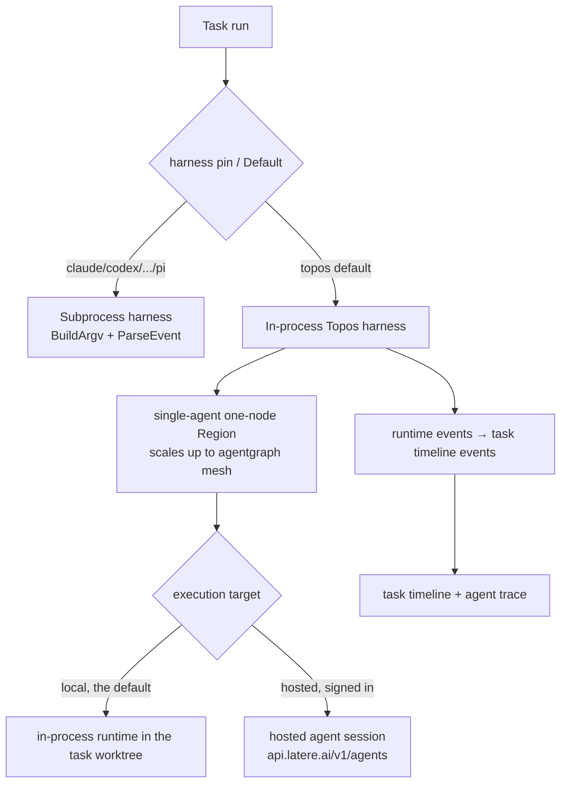

# Topos as Native Harness

> **Scope changed 2026-10-02; rewrite pending.** This spec makes the native
> harness the default while every CLI harness stays selectable, on the
> runtime module wallfacer pins today. The maintainer decided the same day to
> go further ([platform-native](platform-native.md), decision 2): migrate to
> the rebuilt runtime module and make it the only harness, with models from
> the Latere platform and the user switching models. No Claude Code, no
> Codex, no other CLI.
>
> What that changes here:
>
> - "Remaining before `Default()` changes" becomes "remaining before the CLI
>   adapters are removed". The five items still apply and are joined by the
>   module migration itself.
> - Component 2 (decoupling from Claude Code as the default) becomes removal
>   of `internal/harness`'s CLI adapters, the subprocess executor, and the
>   per-CLI credential flows.
> - The sub-agent roles (title, commit message, oversight, test) need a home
>   on the one harness.
> - A signed-out instance runs no agent, since models come from the platform
>   (decided; see "Signed out" in the umbrella). The harness refuses to start
>   and the interface offers sign-in.
>
> The body below is the accurate record of what is shipped on the current
> pin. It is rewritten once the rebuilt module's embedding surface has been
> read against wallfacer's seam.

## Overview

Make Topos (`latere.ai/x/topos`) wallfacer's first-class **native agent harness**
and the default execution path going forward, so a fresh wallfacer run is powered by
the latere.ai-native runtime rather than the Claude Code CLI. Claude Code and every
other harness (Codex, Cursor, OpenCode, Pi) remain registered and selectable; only the
hardcoded *default* changes. The native harness runs in-process and offline for local
use, and offers signed-in users the option to run the same task as a hosted agent
session on the Latere platform.

This is the harness-layer counterpart to the already-shipped
[[topos-runtime-integration]] (which embedded Topos as a *separate* multi-agent runtime
path) and [[topos-live-agent-events]] (live tracing). Those made Topos *runnable*; this
spec makes it the *native default* and reconciles it with the harness abstraction.

**Where it stands.** The opt-in half is in the code: `topos` is a registered
harness, a task pinned to it runs in-process in its worktree, and its edits are
committed. The default half is not: `harness.Default()` returns `Claude`, and the
list under [Remaining](#remaining) says what stands between the two.

## The module the embed sits on

`go.mod` pins `latere.ai/x/topos v0.7.0`. `internal/agentgraph` is the only package
that imports the runtime, and a boundary test
(`TestWallfacerImportsOnlyRootTopos`) keeps it that way. The upstream project
restarted its repository on 2026-09-26: the v0.7.0 packages wallfacer imports are no
longer on its main branch and remain available at their tags.

Everything this spec has shipped, and every remaining item that touches
`internal/agentgraph`, is work against that pre-rebuild module. Moving the pin to a
post-rebuild release is a migration of its own. This spec does not design it, and
open question OQ-5 asks whether the default should change before it.

## Current state (verified 2026-10-02)

The two seams this spec started from have met.

1. **The harness abstraction** (`internal/harness/`). The `Harness` interface is
   still shaped for a subprocess: `BuildArgv`, `ParseEvent`, `AuthEnv`,
   `Capabilities`. `topos` is registered beside claude, codex, cursor, opencode,
   and pi (`internal/harness/topos.go`). Its `BuildArgv` returns `ErrInProcess`,
   and `harness.InProcess(id)` tells a caller to take the in-process path instead.
   `harness.Default()` returns `Claude`.

2. **The embedded runtime** (`internal/agentgraph/`). `RunAgent` runs one agent as
   a one-node pinned region, with the task worktree as the runtime's working
   directory. `RunFlowWithModel` runs a multi-agent fleet. Both return a
   runtime-free `Result` (final text and trace) and report live events through a
   runtime-free `Event`.

3. **Where they meet** (`internal/runner/`). `Runner.Run` sets up the task
   worktree and then, for a task whose resolved harness is in-process and which
   is not a test run, calls `runNativeTopos` instead of the subprocess turn loop.
   `runNativeTopos` and `runAgenticFlow` share `driveToposRun`
   (`internal/runner/agentic.go`), which forwards live events to the task
   timeline, stores the final text and the trace, and runs the commit pipeline.
   `generateCommitMessage` has an in-process branch for such a task.

How a task's harness is resolved (`sandboxForTaskActivity`,
`internal/runner/container.go`): the task's per-activity override, the task's
harness pin, the env file's per-activity setting, the env file's default
(`WALLFACER_DEFAULT_SANDBOX`), then `harness.Default()`. The task's pin is stored
in the `Sandbox` field, a legacy name. The composer leaves the pin empty unless the
user picks a harness, so an ordinary task resolves through the env file and the
default at the moment it runs.

What a native run does not do today:

- **No test step, no oversight.** `Runner.Run` skips the periodic oversight worker
  for an in-process run, and the run never enters the loop that performs test runs.
- **No stop in `waiting`.** `driveToposRun` walks `waiting`, `committing`, and
  `done` in one call. The commit pipeline merges as soon as the run returns.
- **No usage or cost.** The runtime result carries final text and a trace. The
  runtime emits usage events, and `agenticEvent` forwards only assistant text,
  delegations, and tool use. A native run records no tokens and no cost on the
  task, and the task's cost and token limits are not passed to the runtime.
- **No resume, no MCP.** `Capabilities` reports system prompts and usage only.
- **Static key only.** `agenticModelConfig` wires `ANTHROPIC_API_KEY`, through the
  gateway when `ANTHROPIC_BASE_URL` is set. Bearer and OAuth credentials are not
  wired, so a Claude subscription login gives this path nothing to authenticate
  with.
- **No refusal without a key.** With no key the run does not fail. `modelOptions`
  selects the runtime's deterministic test model, the run proceeds in the task
  worktree, and its result goes through the commit pipeline like any other. The
  config response reports the harness usable whether or not a key is set
  (`sandboxUsable`, `internal/handler/sandbox_gate.go`). The test model exists so
  tests can exercise the path without a network. It is not safe to run against a
  user's worktree.
- **Sub-agent roles stay subprocess.** `runAgent` has no in-process branch. See
  Component 2.

## The central design decision: in-process harness vs CLI subprocess

The `Harness` interface assumes a subprocess that emits NDJSON. Topos runs in-process.
Two ways to make Topos satisfy the harness contract were considered:

- **(A) Admit an in-process harness.** A harness is either *subprocess*
  (`BuildArgv`/`ParseEvent`) or *in-process*. Topos reuses the existing
  `internal/agentgraph` embed (a single-agent run is a one-node region). No new
  process boundary and no dependency on an installed binary. Cost: the call sites
  in `internal/runner` must stop assuming argv.
- **(B) Run Topos as the `latere` CLI subprocess.** Fits `BuildArgv`/`ParseEvent`
  with near-zero interface change. Cost: a process boundary wallfacer already
  avoids for agentic runs, a hard dependency on an installed binary, and a second
  copy of an embed wallfacer already has.

**Decision: (A), ratified 2026-06-30.** wallfacer already embeds Topos in-process for
multi-agent runs ([[topos-runtime-integration]]); the native harness is the *same*
engine at single-agent scale, not a second copy reached through a subprocess. **CLI
invocation of `latere` is explicitly rejected**: no subprocess boundary for the
native path.

What shipped is a narrower form of (A) than first written. The interface gained no
`Run` method. A predicate (`InProcess`) and a sentinel (`ErrInProcess`) mark the
harness, and the runner branches on the predicate at each call site that can run
in-process. Two call sites do so today: the implementation run and the commit
message.

## Architecture

```mermaid
flowchart TD
  task[Task run] --> resolve{harness pin / Default}
  resolve -->|claude/codex/.../pi| cli[Subprocess harness<br/>BuildArgv + ParseEvent]
  resolve -->|topos default| topos[In-process Topos harness]
  topos --> region[single-agent one-node Region<br/>scales up to agentgraph mesh]
  region --> mode{execution target}
  mode -->|local, the default| local[in-process runtime in the task worktree]
  mode -->|hosted, signed in| cloud[hosted agent session<br/>api.latere.ai/v1/agents]
  topos --> ev[runtime events → task timeline events] --> stream[task timeline + agent trace]
```

The native harness unifies the two seams: it is a registered `Harness` (so the picker,
config, and runner treat it uniformly) whose implementation is the embedded Topos
runtime. The multi-agent agentgraph path and the single-agent native harness are the
same engine at different region sizes.

## Shipped

| Part | What | Evidence |
|------|------|----------|
| Decoupling, runner | The harness resolver's final fallback, `runAgent`'s default, and the plan-commit-message helper call `harness.Default()` instead of naming `Claude` | `8afa4a8f`; `sandboxForTaskActivity`, `runAgent`, `GenerateCommitMessage` |
| Registration | `harness.Topos`, `toposHarness`, `ErrInProcess`, `InProcess`; listed by `harness.All()` | `d996c97f`; `internal/harness/topos.go`, `topos_test.go` |
| Single-agent seam | `agentgraph.RunAgent` | `bd5740cc`; `internal/agentgraph/adapter.go` |
| Runner wiring | `runNativeTopos`; `driveToposRun` extracted and shared with `runAgenticFlow` | `df9df847`; `TestRun_NativeToposHarnessReachesDoneInProcess` |
| Worktree execution | The task worktree is the runtime's working directory; dispatch moved after worktree setup; file tools confined to the worktree | `73ed429c`, `fb15e241`, `b53c98b9`; `TestRunAgent_WithWorktreeExecutesInRepo`, `internal/agentgraph/symlink_test.go` |
| Commit pipeline | `driveToposRun` calls `Runner.Commit`; the commit message is generated in-process, because the role inherits the task's harness and the subprocess backend cannot launch it | `7e351855`, `7604ab29`, `291cc45d`; `TestRun_NativeToposHarnessCommitsWorktreeEdits` |
| Branding | `.topos-brand` wordmark; the graph mark and "powered by Topos" in the trace header | `c7ce346f`; `frontend/src/styles/app/buttons-hero.css`, `AgentTrace.vue` |
| Selectable in the UI | Topos logo and label; offered in the composer's harness picker and in the task detail's; listed in Settings as a default harness | `92916a79`; `HarnessLogo.vue`, `lib/harness.ts`, `TaskComposer.vue`, `TaskDetail.vue` |

Shipped differently from the first text:

- **Events are not mapped to the canonical harness `Event`.** Component 1 planned a
  total mapping onto `KindAssistantText`, `KindToolCall*`, and `KindResult` with
  usage. What shipped maps three runtime event names straight onto task timeline
  events (`agenticEvent`), and `toposHarness.ParseEvent` returns `KindUnknown`.
  The usage gap above follows from this.
- **The run renders as a trace, not as the turn-by-turn activity view.** A native
  run shows in the task detail through `AgentTrace.vue` as a one-node graph with
  its live lines.

## Components

### 1. Harness registration + event mapping

Shipped, with the divergence recorded above. Remaining here: carry the runtime's
usage events onto the task (tokens and cost per run), and pass the task's cost and
token limits to the runtime, so a native run is accounted and bounded like a
subprocess run. Keep the import boundary: only `internal/agentgraph` names a
runtime type.

### 2. Default flip + decoupling audit

The runner's three fallbacks go through `harness.Default()`. These sites still name
`harness.Claude` and each needs a decision before the default changes:

| Site | What it does today | For the flip |
|------|--------------------|--------------|
| `defaultSandbox` (`internal/handler/config.go`) | The harness pre-selected in the UI when the env file sets none: Claude, or Codex when only a Codex model is configured | Decide whether it follows `Default()` |
| `buildConfigResponse`'s initial `default_sandbox` (same file) | Placeholder, overwritten by `defaultSandbox` when a parsed env config is present | Follow the same decision |
| `TestSandbox` (`internal/handler/env.go`) | The harness tested when the request names none | A subprocess probe; an in-process harness has nothing to exec |
| `GenerateAgentSessionTitle` (`internal/runner/title.go`) | Title for a chat session, falling back to Claude | Subprocess only |
| Drift assessment (`internal/runner/drift.go`) | Always Claude, Codex on a token-limit error | Subprocess only |
| Chat usage records (`persistAgentRoundUsage`, `internal/handler/agentsession.go`) | Stamps every chat round's usage record as Claude | Outside this spec: chat is not a task run |
| Review proposer and critics (`internal/handler/tasks_autoimplement.go`, `internal/adversarial/`) | Claude proposes; Claude and Codex critique | Outside this spec |

The Claude to Codex token-limit fallback in `runAgent` is keyed on the resolved
primary being Claude. That is correct as it stands: it is a property of the Claude
harness, not of the default. A native run has no equivalent; see Error Handling.

**The gap that blocks the flip: sub-agent roles.** `runAgent` hands every role to
the subprocess backend. `HostBackend.Launch` (`internal/executor/host.go`) has a
case for each CLI harness and none for `topos`. Two call sites branch on
`InProcess` before reaching it: the implementation run and
`generateCommitMessage`. Title, oversight, testing, and the plan-commit message do
not. With `Default()` returning `Topos`, each of those would resolve to a harness
the backend cannot launch whenever no env setting names another one. The flip
therefore needs one of:

- an in-process branch in `runAgent` for prompt-only roles, as
  `generateCommitMessageInProcess` already does for one of them, or
- a rule that sub-agent roles resolve to a subprocess harness when the task's
  harness is in-process.

"Decouple from Claude Code" means: stop defaulting to the Claude Code **CLI
harness**. It does **not** remove Claude **models**. The native harness reaches
Claude models through the configured gateway or a provider key.

### 3. Local and hosted execution

> **Revised 2026-10-02.** This component first injected a remote sandbox provider
> into the in-process runtime, so the loop ran on the user's machine and its tools
> ran in a remote workspace. Latere consolidated its services into one platform,
> and in cloud mode wallfacer calls the platform's Agents capability and nothing
> beneath it ([platform integration](../cloud/latere-integration.md)). The loop and
> its machine now move together or not at all.

A task on the native harness has an execution target. The swap is where the whole
run happens, not which sandbox the local loop reaches.

| Target | Available when | Where the loop runs | Model access | Where tools act |
|--------|----------------|---------------------|--------------|-----------------|
| `local` (default) | always | in-process, the embedded runtime | the configured gateway or provider key | the task's worktree |
| `hosted` | signed in | a hosted agent session at `api.latere.ai/v1/agents` | the session's, billed by the platform | the session's own workload |

- The hosted run, its field on the task, the dispatch sequence, the event mapping and
  the data-boundary confirmation are specified in
  [topos-remote-executor](../cloud/latere-integration/topos-remote-executor.md). This
  spec owns the harness surface the choice is drawn on.
- `local` must work fully offline with no Latere dependency. It is the default path.
- `hosted` is an **opt-in** for signed-in users and must never become a silent
  requirement. Signing in does not change a task's target.

### 4. UI / branding surfacing

Shipped: the wordmark rule, the graph mark, the trace header, the harness logo and
label, and Topos as a choice in the composer, the task detail, and Settings.

Remaining:

- `AgentGraphPage.vue` still names the runtime in plain text ("the topos runtime")
  in its coordination notice. Use the wordmark there.
- Show the execution target beside the harness picker for a signed-in user
  (Component 3, OQ-2).

### 5. Migration / back-compat

- The change is a **default flip, not a removal**: a task with an explicit harness
  pin (including Claude) runs unchanged.
- Resolution happens when a task runs, not when it is created. An unpinned task that
  has not run yet takes whatever the default is at that moment, and an env file that
  sets `WALLFACER_DEFAULT_SANDBOX` keeps overriding it. OQ-3 asks whether unpinned
  tasks that exist at the time of the flip should be pinned first.
- No regression to the subprocess-harness execution paths.

## API Surface

- Config / env: the default-harness override exists (`WALLFACER_DEFAULT_SANDBOX`,
  with per-activity variants, editable in Settings). The flip changes what applies
  when it is unset. A local-vs-hosted execution selector for signed-in users is
  new.
- No new HTTP routes required for local mode; a hosted run consumes the platform's
  Agents API, not a new wallfacer route.

## Error Handling

- A native run that fails is classified by `classifyFailure`, may be retried by
  `tryAutoRetry`, and otherwise fails the task with the runtime's error. There is no
  fallback to another harness. Whether a native run should fall back to a configured
  subprocess harness on a model or gateway error is OQ-6.
- A missing credential is a configuration error, not a reason to substitute a
  model (Remaining item 3). Today it substitutes one.
- A hosted dispatch that cannot start (offline, not signed in, a platform refusal) fails
  with the platform's reason and leaves the task ready to run again under either target.
  It does not switch targets on its own: a silent move to `local` would run a task on a
  machine the user did not choose for it, and a silent move to `hosted` would push a
  repository the user did not choose to send.
- Runtime observer panics are recovered inside the runtime
  ([[topos-live-agent-events]] Phase 1); the bridge must not reintroduce a crash
  path. `driveToposRun` drops events when its buffer is full instead of blocking
  the run.

## Testing Strategy

In the tree:

- **Registration**: `TestToposInUse`, `TestToposBuildArgvIsInProcess`
  (`internal/harness/topos_test.go`). `TestDefault` asserts `Claude` and changes
  with the flip.
- **Single agent and worktree**: `TestRunAgent_WithWorktreeExecutesInRepo`, the
  symlink confinement test (`internal/agentgraph/`).
- **Dispatch and commit**: `TestRun_NativeToposHarnessReachesDoneInProcess`,
  `TestRun_NativeToposHarnessCommitsWorktreeEdits`,
  `TestRun_AgenticFlowCommitsWorktreeEdits` (`internal/runner/agentic_test.go`).
- **Import boundary**: `TestWallfacerImportsOnlyRootTopos`.

To add with the remaining work:

- **No credential**: with no key configured, a task pinned to `topos` fails with a
  configuration error, nothing is written to its worktree, and nothing is
  committed.
- **Sub-agent roles**: a task resolved to the in-process harness gets a title and,
  where applicable, an oversight summary, with no launch of an unsupported harness.
- **Verification**: a native run is followed by the test step under the same
  conditions as a subprocess run.
- **Usage**: a native run with a real or scripted model records tokens and cost on
  the task, and a task limit stops the run.
- **Default**: `Default()` returns `Topos`; a task pinned to Claude still resolves to
  Claude; the token-limit fallback still fires for a Claude-pinned task.
- **Local/hosted selection**: a `local` task runs in-process with no platform call; a
  `hosted` task is offered only when signed in. The hosted run's own tests are in
  [topos-remote-executor](../cloud/latere-integration/topos-remote-executor.md).
- **Frontend**: the execution-target selector renders only when signed in; non-topos
  tasks are unaffected.

## Open Questions

- **OQ-1 RESOLVED (2026-06-30).** Approach **A**, an in-process harness that reuses
  the agentgraph embed. CLI subprocess over `latere` (B) is rejected; no subprocess
  boundary for the native path.
- **OQ-2 RESOLVED (2026-10-02).** The execution target is a per-task field with a
  workspace-level default for new tasks, `local` unless the user changed it. What remains
  open is where the selector sits next to the harness picker.
- **OQ-3.** Retroactivity of the default flip for existing unpinned tasks
  (new-runs-only vs retroactive). See Component 5 for what the code does without a
  decision.
- **OQ-4 RESOLVED by what shipped.** The native single-agent harness shares the
  harness registry and pickers, not the agent-graph editor. It did not wait on the
  agent-graph surface, which is recorded in
  [agent-graph-e2e-design](../.archive/local/agent-graph-e2e-design.md).
- **OQ-5.** Should the default change while the embed is pinned to the pre-rebuild
  module, or only after the pin moves? Flipping first makes every ordinary task run
  on a module the upstream project has replaced.
- **OQ-6.** The degradation story for a native run: fail with the gateway's error,
  or fall back to a configured subprocess harness.
- **OQ-7.** Should a native run stop in `waiting` before the commit pipeline, as a
  subprocess run does? Today it merges on completion. The same question is open
  for fleets in [agent-graph-e2e-design](../.archive/local/agent-graph-e2e-design.md).
- **Not established.** No test covers what title generation or a test run does
  today for a task pinned to `topos`. Reading the code, `sandboxForTaskActivity`
  returns the task's pin for every activity and `HostBackend.Launch` has no case
  for `topos`, which suggests both fail to launch. `7604ab29` found and fixed
  exactly this for the commit-message role. Confirm the other roles with a test
  as the first step of Remaining item 5.

## Remaining

**The `Default()` flip is gated on these and is not done.**

0. **Release the topos seam.** Done: the seam is tagged and `go.mod` pins a
   released `latere.ai/x/topos`, so standalone and CI builds work.
1. **Commit + verification parity.** The commit half is done: `driveToposRun`
   runs the real commit pipeline in the `committing` phase when the run has a
   worktree, so a native run's edits land as a durable git commit. The
   verification half is open: a native run does not yet run the test step the
   subprocess harnesses do.
2. **Local and hosted targets.** Draw the execution-target selector for signed-in
   users (Component 3 above). The hosted run itself is
   [topos-remote-executor](../cloud/latere-integration/topos-remote-executor.md).
3. **Refuse a run with no credential.** Outside tests, a native run or a fleet run
   with no usable model credential fails with a configuration error before
   anything runs in the worktree, and the config response reports the harness
   unusable with the reason. The test model stays reachable from tests only. This
   item does not wait for the flip: it applies to a task pinned to `topos` today.
4. **Credentials a default can rely on.** Wire the bearer and OAuth credentials
   the subprocess harnesses accept, or decide that the native default requires a
   gateway or provider key and say so where the default is chosen.
5. **Sub-agent roles for an in-process task.** Close the gap in Component 2 so
   title, oversight, and testing have a harness they can run on.
6. **Usage and limits.** Component 1's remainder.
7. **`Default()` flip and the UI pre-selection.** Change `Default()` in
   `internal/harness/registry.go` and decide `defaultSandbox` in
   `internal/handler/config.go`, only after 1 and 3 to 6 land and OQ-5 is
   answered. Update `TestDefault`, `docs/guide/agent-graph.md`, and
   `docs/internals/agent-graph-runtime.md`, which both describe the native
   harness as opt-in.
