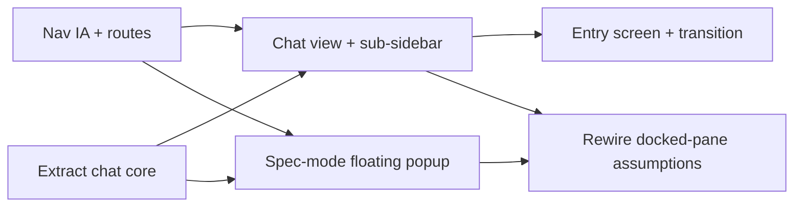

# Dedicated Chat UI

## Problem

Today `/plan` fuses three things into one page: the spec tree (left), the focused spec view (centre), and the planning chat (right, a narrow docked column). The chat is the primary way users think, but it is treated as a side panel:

1. **Chat is cramped and second-class.** It lives in a ~360px right column with thread *tabs* across the top (`Spec UX`, `Chat 8`, `+`). Tabs don't scale past a handful of sessions, the message input is a thin single-line box, and the whole surface reads as an accessory to the spec view rather than a place to do real work.
2. **No dedicated home for conversation.** There is no top-level "Chat" destination. To talk to the planning agent you go to `/plan`, which presupposes specs. A user who just wants to think out loud has to navigate a spec-centric page.
3. **The chat fights the spec view for space.** In spec mode the docked chat steals horizontal room from the spec being read, and toggling it (`C`) hides it entirely — there's no in-between where you can read a spec *and* keep chatting without one squeezing the other.

The goal: promote chat to a first-class, Claude-style surface. A dedicated **Chat** destination with a session sub-sidebar and a generous composer. In **Spec** mode, the chat becomes a floating, draggable popup that hovers over the spec view — present but never crowding it. The sidebar leads with **Chat / Spec / Board**.

This is overwhelmingly a **UI re-layout**, not new backend state. The "sessions" the design calls for already exist as the **thread model** (`planning.ts`: `threads`, `threadOrder`, `activeThreadId`, archive, per-thread `queue`/`scrollTop`/`unread`/`lastViewedAt`), persisted per workspace-group on disk (`internal/handler/planning_threads.go`). The current tabs *are* sessions. No API or persistence changes are required.

## Constraints

- **No backend changes.** `/api/planning/*` routes, the `ThreadManager`, per-workspace-group thread storage, the streaming protocol, slash-command and `@`-mention endpoints all stay exactly as they are. This spec is frontend-only.
- **One composer, two mounts.** The composer + autocomplete + streaming + bubble rendering currently live inside `PlanningChatPanel.vue`. Extract the reusable core into shared pieces and mount them in both the Chat view (full surface) and the Spec-mode popup. Do **not** fork the chat logic into two divergent implementations.
- **Threads are the sessions — reuse them.** The session sub-sidebar is a re-render of the existing thread list, not a new model. Creating, switching, renaming, and archiving sessions route through the existing thread store actions.
- **Replace chat-first, don't duplicate it.** The new centered entry screen becomes the single empty/start state for the Chat surface, superseding the `chat-first-mode` empty composer. Ship one empty state, not two.
- **Non-destructive IA.** The Workspace nav group leads with Chat, Plan, Board; the remaining items (Agents, Flows, Routines, Map) stay below. The spec page keeps its `/plan` route and the "Plan" label (see the decision note below). No nav items are removed, no routes renamed. (References to a `/spec` route elsewhere in this doc predate that decision; read them as `/plan`.)
- **Respect `prefers-reduced-motion`.** All new motion (drag, popup open, entry-to-conversation transition) collapses duration to 0 while preserving final state, matching the existing animation discipline in `chat-first-mode`.

## Design

### Information architecture

The Workspace nav group is reordered and extended. `Chat`, `Plan`, and `Board` lead; everything else keeps its current position below.

| Order | Label | Route | Notes |
|---|---|---|---|
| 1 | Chat | `/chat` | New. Dedicated Claude-style chat surface with session sub-sidebar. |
| 2 | Plan | `/plan` | The spec page (spec tree + focused view), with chat as a floating popup instead of a docked column. |
| 3 | Board | `/` | Unchanged. |
| 4+ | Agents, Flows, Routines, Map | unchanged | Stay below the lead trio. |

> **Decision (during implementation):** the spec page keeps the **`/plan`** route and the **"Plan"** label. Although we call it spec mode internally, "Plan" reads as friendlier to non-technical users than "Spec". This avoids a route rename + redirect entirely — `?spec=`/`?task=` deep links and the legacy `#plan/`/`#spec/` hashes already target `/plan`. The icon set adds a `chat` glyph (speech bubble); `Plan` keeps the existing document icon.

Both Chat and Spec operate on the **same workspace-group thread set**. Switching workspace groups swaps the thread list in both surfaces (the backend already re-roots its `ThreadManager` on `UpdateWorkspaces`). The frontend currently does **not** reload threads on workspace switch while a chat surface is mounted — this spec adds a watch on the active workspace key that calls `loadThreads()` so the session sub-sidebar stays correct without a page reload.

### Reusable chat core (the extraction)

`PlanningChatPanel.vue` today owns: the header, the thread tab bar, the message list, the queue display, the composer, autocomplete wiring, streaming lifecycle, and bubble rendering. Split it into composable, surface-agnostic pieces:

- **`ChatMessageList.vue`** — renders the bubble stream for the active thread: user/assistant bubbles, `Agent activity` disclosure, per-round undo, streaming updates, auto-scroll with user-scroll-up detection, the queue chips. Props: the active thread; emits scroll state. No knowledge of where it's mounted.
- **`ChatComposer.vue`** — the input box: auto-growing textarea, `/` and `@` buttons, slash/mention dropdowns (via `usePlanningAutocomplete`), send/interrupt button, send-mode toggle, hint text. Emits `send(text)`. This is the single composer mounted in three places (entry screen, conversation view, spec popup), parameterized by size variant (`hero` | `docked` | `compact`).
- **`useChatSession()` composable** — wraps the send/stream/interrupt/queue lifecycle currently inlined in `PlanningChatPanel.vue` (lines ~75–386) so both surfaces drive identical behaviour. Reads/writes the `planning` store; no new state.
- **`SessionList.vue`** — the session sub-sidebar (Chat surface) and, in collapsed form, nothing in the popup. Renders `threadOrder` as a vertical list with active highlight, unread dot, rename, archive, and a `+ New chat` action. This replaces the horizontal tab bar.

`PlanningChatPanel.vue` is retired as a monolith; its responsibilities move to these pieces plus the two host surfaces below. The CSS in `PlanningChatPanel.css` is split alongside (shared bubble/composer styles into a shared stylesheet, surface-specific layout into each host).

### Surface 1 — Chat view (`/chat`)

A full-height, two-column surface: session sub-sidebar (left) + conversation (right). This is the Claude-style home.

**Entry / empty state** (no active session, or a brand-new empty session) — supersedes `chat-first-mode`'s empty composer:

```
┌───────────────┬──────────────────────────────────────────────────────┐
│ SESSIONS      │                                                      │
│ ───────────── │                                                      │
│ + New chat    │                                                      │
│               │                                                      │
│ ● Spec UX     │                  ✳  What should we plan?             │
│   Chat 8      │                                                      │
│   Auth refac… │     ┌──────────────────────────────────────────┐     │
│               │     │  Message the planning agent…              │     │
│               │     │                                            │     │
│               │     │  [+]                          [/] [@] [➤]  │     │
│               │     └──────────────────────────────────────────┘     │
│               │                                                      │
│               │     [✎ Draft a spec] [⊞ Break down] [↗ Dispatch]     │
│               │                                                      │
└───────────────┴──────────────────────────────────────────────────────┘
```

- Centered greeting + a large, prominent composer (the `hero` variant of `ChatComposer`). The greeting is short and wallfacer-relevant ("What should we plan?"), not Claude's product copy.
- Quick-action chips below the composer are **wallfacer-relevant**, not Claude's Gmail/Drive chips: e.g. `Draft a spec`, `Break down`, `Dispatch` — each pre-fills the composer with the matching slash command (`/create`, `/break-down`, `/dispatch`) so the user lands one keystroke from a real action. (Final chip set is a leaf-task decision; these are the strawman.)
- Sending the first message transitions the same surface into the conversation view (below) — the composer animates from centered `hero` to docked `bottom`, the greeting fades, the message stream fades in. Reads as one fluid event, not a page swap.

**Conversation view** (active session with messages):

```
┌───────────────┬──────────────────────────────────────────────────────┐
│ SESSIONS      │  Spec UX                                    [Clear] │
│ ───────────── │ ──────────────────────────────────────────────────── │
│ + New chat    │                                                      │
│               │   me   YOU · 07:50                                   │
│ ● Spec UX     │        help me plan an auth refactor                 │
│   Chat 8      │                                                      │
│   Auth refac… │   wf   PLAN-AGENT · 07:50                            │
│               │        Here's a draft design…                        │
│               │        ▸ Agent activity                              │
│               │                                                      │
│               │     ┌──────────────────────────────────────────┐     │
│               │     │  Message the planning agent…              │     │
│               │     │  [+]            Shift+Return    [/] [@] [➤] │     │
│               │     └──────────────────────────────────────────┘     │
└───────────────┴──────────────────────────────────────────────────────┘
```

- The composer is the same `ChatComposer` (now `docked` variant): a generous bottom input box with the `+`, `/`, `@`, send-mode hint, and send/interrupt buttons — matching the reference's "big bottom input box with buttons."
- The session sub-sidebar lists all non-archived threads for the workspace group; the active one is highlighted; unread sessions show a dot (reusing the existing `unread` flag). `+ New chat` creates a thread; an overflow/archive affordance reaches archived threads (reuse the existing archive menu logic).
- The conversation header shows the session name (inline-rename on click, reusing thread rename) and the `Clear` action.

### Surface 2 — Spec mode (`/spec`) — floating draggable chat

The spec page keeps the spec tree (left) + focused view, but the chat is no longer a docked right column. It becomes a **floating popup** that opens in the **bottom-right** corner, hovering over the focused view, and can be **dragged freely** anywhere in the viewport.

```
┌─────────────────┬────────────────────────────────────────────────────┐
│ 📋 Roadmap      │  # Planning Chat Threads                            │
│ ─────────────   │  status: drafted · effort: large                   │
│ Foundations     │                                                    │
│  ✓ sandbox-…    │  ## Problem                          ┌───────────┐ │
│  ✓ storage-…    │  Today the specs UI chat …           │ Spec UX ▾ │ │
│                 │                                       │ ───────── │ │
│ Local           │  ## Design                           │ me: let's │ │
│ ▶ spec-coord    │  (full markdown body here)           │ wf: OK, I…│ │
│    ├─ threads   │                                       │ ───────── │ │
│    └─ chat-…    │  [Dispatch] [Archive]                 │ [msg…][➤] │ │
│                 │                                       └───────────┘ │
└─────────────────┴────────────────────────────────────────────────────┘
                                                  ← floating, draggable
```

- **Open/close.** A chat affordance (button in the focused-view header, plus the `C` shortcut) toggles the popup. When closed it collapses to a small launcher bubble in the bottom-right; opening expands it with a short scale/opacity animation from that anchor.
- **Drag.** A grab handle on the popup header lets the user move it anywhere. Position is **clamped to the viewport** (the popup never leaves the screen) and **persisted to `localStorage`** (mirroring the existing `wallfacer-spec-chat-width` / `wallfacer-spec-sidebar-width` keys; new key `wallfacer-spec-chat-popup` storing `{x, y, w, h, open}`). On viewport resize the position re-clamps.
- **Resize.** The popup is resizable (corner handle), within sane min/max, persisted alongside position. This replaces the old docked-pane width resize.
- **Compact session switcher.** The popup header carries a compact session dropdown (`Spec UX ▾`) instead of the full sub-sidebar — switching the active thread, creating a new one, and showing unread. The full session management lives in the Chat surface; the popup keeps it minimal.
- **Same core.** The popup mounts `ChatMessageList` + `ChatComposer` (`compact` variant) + `useChatSession` — identical behaviour to the Chat surface, just chrome-light and floating.

The spec-tree sidebar and focused view reclaim the full content width (no permanent chat column). The popup floats above; because it's an overlay, the spec text underneath is never reflowed by chat resize.

### Rewiring the docked-pane assumptions

The current chat is wired as a docked pane inside `PlanPage.vue`. Each coupling needs re-pointing:

- **Keyboard shortcuts.** `C` now toggles the floating popup (open/closed) instead of show/hide of a column. `D` (dispatch) and `B` (break down) keep working against the focused spec; `B`'s "open chat and send" path targets the popup (open it if closed, then send).
- **Deep linking.** `?spec=<path>` and `?task=<id>` move to `/spec`. `/plan?spec=…` redirects preserving the query. The legacy `#plan/<path>` / `#spec/<path>` hash translation moves to the `/spec` page mount.
- **`SpecFocusedView` → chat bridge.** The existing `@send-chat` bridge (focused-view "Break Down" button forwarding a message into the chat) now opens the popup and sends through `useChatSession`, instead of calling a docked panel's exposed `send()`.
- **Layout state machine.** `chat-first` layout is removed from `PlanPage` (its empty-state role moves to the Chat surface's entry screen). `/spec` always renders the spec tree + focused view; when there are no specs, the focused view shows its own empty/roadmap-bootstrap state (the spec-creation path is unchanged — `/create` and the `/spec-new` directive still work from the popup chat).

### Motion

- **Entry → conversation** (Chat surface): composer morphs centered→docked (transform + position, ~240ms emphasized decelerate), greeting fades out (~140ms), message stream fades in (~180ms, slight overlap). Single fluid event.
- **Popup open/close** (Spec surface): scale `0.96→1` + opacity from the bottom-right anchor (or the launcher bubble), ~200ms.
- **Drag**: direct pointer-follow, no easing during drag; on release, no snap (free placement) but clamp if out of bounds.
- All collapse to instant under `prefers-reduced-motion: reduce`, preserving final geometry.

## Acceptance Criteria

- [x] The Workspace nav group leads with `Chat` (`/chat`), `Plan` (`/plan`), `Board` (`/`), in that order; Agents/Flows/Routines/Map remain below, unremoved.
- [x] The spec page keeps its `/plan` route and "Plan" label. `?spec=`/`?task=` deep links and legacy `#plan/<path>`/`#spec/<path>` hashes still focus the right spec under `/plan`. (No `/spec` rename or redirect was introduced.)
- [ ] The Chat surface (`/chat`) renders a session sub-sidebar (vertical list of the workspace group's non-archived threads, active highlight, unread dot, `+ New chat`, rename, archive) — not a horizontal tab bar.
- [ ] With no active session or an empty session, the Chat surface shows a centered greeting + a large `hero` composer + wallfacer-relevant quick-action chips. Clicking a chip pre-fills the composer with the matching slash command.
- [ ] Sending the first message transitions the entry screen into the conversation view within one fluid animation (composer morphs centered→docked, greeting fades, stream fades in); no full-page swap or flash.
- [ ] The conversation view shows the message stream above a generous `docked` composer with `+`, `/`, `@`, send-mode hint, and send/interrupt buttons. Streaming, queue, per-round undo, `Agent activity` disclosure, and autocomplete all behave exactly as in the current `PlanningChatPanel`.
- [ ] The chat core is extracted into shared pieces (`ChatMessageList`, `ChatComposer`, `SessionList`, `useChatSession`) mounted by both surfaces. There is exactly one composer implementation and one streaming lifecycle — no forked logic between Chat and Spec.
- [ ] In `/spec`, the chat is a floating popup anchored bottom-right, overlaying the focused view; the spec tree + focused view occupy the full content width with no permanent chat column.
- [ ] The popup can be dragged anywhere via its header handle; its position is clamped to the viewport and persisted to `localStorage` (`wallfacer-spec-chat-popup`). Reopening the page restores the last position, size, and open/closed state.
- [ ] On viewport resize, a popup positioned near an edge re-clamps so it stays fully visible.
- [ ] The popup is resizable within min/max bounds; size persists alongside position.
- [ ] The popup header carries a compact session switcher (current session name + dropdown) that switches/creates threads and shows unread, without the full sub-sidebar.
- [ ] `C` toggles the popup open/closed in `/spec`. `D` dispatches the focused spec; `B` opens the popup (if closed) and sends the break-down message. The `SpecFocusedView` break-down bridge opens the popup and sends through the shared session lifecycle.
- [ ] Switching workspace groups while a chat surface is mounted reloads the thread list (a watch on the active workspace key calls `loadThreads()`); the session sub-sidebar and popup switcher reflect the new group's threads without a page reload.
- [ ] The `chat-first` empty-composer state is removed from `/spec`; the Chat surface's entry screen is the single empty/start state. No two empty composers coexist.
- [ ] All new motion (entry→conversation, popup open/close, drag release) collapses to instant under `prefers-reduced-motion: reduce` while preserving final geometry and content.
- [ ] No backend route, handler, storage layout, or streaming-protocol change is introduced (verified: diff touches only `frontend/` plus this spec).

## Test Plan

**Frontend unit tests (`frontend/src/**/*.test.ts`, Vitest):**

- `router redirect`: navigating to `/plan`, `/plan?spec=foo.md`, `/plan?task=123` resolves to `/spec` with the query preserved.
- `SessionList.test.ts`: renders `threadOrder` with active highlight + unread dots; `+ New chat`, rename, and archive call the matching store actions; archived threads are reachable via the overflow affordance.
- `ChatComposer.test.ts`: `hero`/`docked`/`compact` variants render the right chrome; quick-action chips pre-fill the composer with the expected slash command; send-mode toggle and `/`+`@` autocomplete behave identically across variants (reuse/extend the existing autocomplete tests).
- `useChatSession.test.ts`: send → stream → finish → queue-drain and interrupt match the behaviour previously covered for `PlanningChatPanel` (port the existing streaming/queue tests onto the extracted composable).
- `chat-entry-transition.test.ts`: with no messages the entry screen renders; after the first send the conversation view renders; under stubbed `prefers-reduced-motion: reduce` the transition applies final state with zero duration.
- `spec-chat-popup.test.ts`: popup opens bottom-right; simulated drag updates position and persists `{x,y,w,h,open}` to `localStorage`; out-of-viewport positions clamp on open and on resize; reopening restores persisted geometry and open state; `C` toggles open/closed.
- `workspace-switch-threads.test.ts`: changing the active workspace key triggers `loadThreads()` and re-renders the session list.

**Manual E2E:**

1. Open `/chat` on a fresh workspace → centered greeting + hero composer + quick-action chips, no sessions. Click `Draft a spec` → composer pre-filled with `/create`. Clear it, type "help me plan an auth refactor", send → entry morphs into the conversation view in one smooth motion; the message and agent stream appear.
2. Start a second session via `+ New chat`; rename it; switch between sessions in the sub-sidebar; archive one and recover it from the overflow.
3. Go to `/spec` on a repo with specs → spec tree + focused view at full width, chat popup launcher bottom-right. Open it, drag it to the top-left, resize it, reload the page → it reopens where you left it at the same size.
4. Drag the popup near the right edge, shrink the browser window → popup re-clamps to stay visible.
5. In `/spec`, press `C` to toggle the popup; press `B` on a focused spec → popup opens and the break-down message is sent.
6. Switch workspace groups (one with specs, one without) → the session list in both `/chat` and the `/spec` popup updates to the new group's threads without a reload.
7. Navigate to a legacy `/plan?spec=foo.md` and `#spec/foo.md` URL → lands on `/spec` focused on `foo.md`.
8. Toggle OS "reduce motion" → entry transition, popup open, and drag-release apply instantly with correct final state.

**Keyboard tests:**

- `C` in `/spec` toggles the popup open/closed; `D` dispatches the focused spec; `B` opens the popup and sends break-down.

## Non-Goals

- **Any backend change.** No new endpoints, no storage migration, no streaming-protocol change. Sessions are the existing per-workspace-group threads.
- **A new session/thread data model.** The session sub-sidebar and popup switcher render the existing thread store. No global vs per-workspace rework, no rename of `thread`→`session` in code identifiers.
- **Multi-window or multiple simultaneously-open popups.** One floating chat popup per `/spec` page. Tearing chat into a separate OS window is out of scope.
- **Voice / model-picker / attachments chrome from Claude's reference.** The reference screenshots show mic, model selector, and Drive/Gmail chips; those are Claude product features, not part of this redesign. Quick-action chips map to wallfacer slash commands only.
- **Changing the agent, prompts, slash commands, or `@`-mention behaviour.** Pure presentation; the agent contract is untouched.
- **Reworking the spec tree or focused view.** Only the chat's relationship to them (docked column → floating popup) changes; the tree and focused-view internals stay as they are.
- **Persisting popup geometry server-side or per-thread.** Position/size/open-state is a browser-local UI preference (`localStorage`), not synced state.
- **Renaming the `/spec` page's internal identifiers** (`spec-mode`, `planning` store, CSS classes). User-facing nav label and route only; a code-symbol rename is a separate refactor.

## Open Questions

- **Quick-action chip set.** The strawman is `Draft a spec` / `Break down` / `Dispatch`. Final set and whether chips are context-aware (e.g. hide `Dispatch` when no leaf spec is focused) is a leaf-task decision.
- **Popup default size/anchor exact values.** Bottom-right anchor and a sensible default size are settled; exact px and min/max bounds to be pinned during implementation against the existing chat width range (280–~50% viewport).

## Task Breakdown

| Child spec | Depends on | Effort | Status |
|------------|-----------|--------|--------|
| Nav IA + routes (chat/plan/board, add `/chat`, keep `/plan`) | — | small | **complete** |
| Extract reusable chat core (`ChatMessageList`, `ChatComposer`, `SessionList`, `useChatSession`) | — | large | **complete** |
| Chat view + session sub-sidebar (`/chat`) | extract-chat-core, nav-ia | medium | **complete** |
| Entry screen + entry→conversation transition (replaces chat-first) | chat-view | medium | **complete** |
| Spec-mode floating draggable popup | extract-chat-core, nav-ia | large | **complete** (shipped, then gated off — see Outcome) |
| Rewire docked-pane assumptions (shortcuts, focused-view bridge, workspace-switch reload) | spec-popup, chat-view | medium | **complete** |



**Recommended iteration order:** Start `Nav IA` and `Extract chat core` in parallel — they're independent foundations. `Chat view` and `Spec-mode popup` both join once the core is extracted. `Entry screen` builds on the Chat view; `Rewire docked-pane assumptions` is the convergence point once both surfaces exist.

## Outcome

Shipped frontend-only, reusing the existing per-workspace thread model as the
"sessions" — no backend change. What landed:

- **Chat core** (`useChatSession`, `ChatMessageList.vue`, `ChatComposer.vue`,
  `SessionList.vue`): one implementation of the conversation lifecycle and
  composer, mounted by every surface. `PlanningChatPanel.vue` was reduced to its
  panel chrome over this core.
- **Nav + routes**: Workspace nav leads with **Chat / Plan / Board**; new
  `/chat` route. The spec page keeps `/plan`.
- **Chat view** (`/chat`, `ChatPage.vue`): session sub-sidebar + a centered
  entry screen (greeting, hero composer, `/create`·`/break-down`·`/dispatch`
  quick chips) that morphs into the conversation on first send, superseding the
  chat-first empty composer as the single empty state.
- **Floating popup** (`SpecChatPopup.vue`): draggable, resizable, viewport-
  clamped, geometry + open-state persisted to `localStorage`, with a compact
  session switcher. Mounts the shared core.
- **Workspace-switch reload**: `useChatSession` watches the active workspace key
  and reloads the thread list so the session list never goes stale.

### Design Evolution

1. **"Plan", not "Spec".** The nav label and route stayed `Plan` / `/plan` for
   non-technical friendliness, dropping the planned `/spec` rename + redirect
   and all its deep-link churn. References to `/spec` above predate this.
2. **Popup deactivated in Plan mode (for now).** `SpecChatPopup` is built and
   tested, but `PlanPage` gates it behind `PLANNING_CHAT_ENABLED = false` — the
   popup, its focused-view toggle button, and the `C` shortcut are off in the
   three-pane view pending a product decision on whether chat belongs there or
   only in the dedicated `/chat` surface. Flip the flag to restore it. The
   chat-first empty-workspace onboarding is unaffected.
