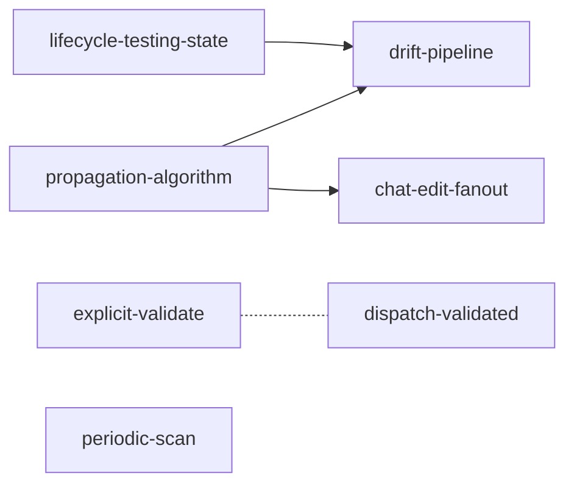

# Spec State Control Plane

The wallfacer server owns every state transition a spec goes through.
The lifecycle state machine lives in `internal/spec/lifecycle.go`, but
today only two classes of transitions are automated:

- **To `archived` and back to `drafted`** (archival actions on the
  `POST /api/specs/transition` endpoint in
  `internal/handler/specs_dispatch.go` / `internal/handler/specs.go` -
  shipped by [spec-archival.md](spec-archival.md)).
- **To `complete` on task done** - `SpecCompletionHook`
  (`internal/handler/specs_dispatch.go`) writes `complete`
  **unconditionally**, no tester verdict, no drift check.

Every other transition is manual: the user edits YAML by hand or an
agent writes `status: validated` during `/wf-spec-refine`. Downstream
specs don't know when their upstream changes. There's no drift
detection at all.

This spec establishes the **control plane**: server-managed hooks that
move specs through the lifecycle in response to the events that justify
each transition, with drift assessment as the decision gate when a task
lands.

---

## Current State

Already in place:

- **`internal/spec/lifecycle.go`** - six-state machine
  (`vague / drafted / validated / complete / stale / archived`) with
  every legal edge. No `testing` state exists yet (the drift pipeline
  proposes adding it). See
  [spec-document-model.md](spec-document-model.md) and
  [spec-archival/core-model.md](spec-archival/core-model.md).
- **`internal/spec/write.go` `UpdateFrontmatter`** - atomic YAML-field
  write, used by dispatch, archive, undispatch, and the completion hook.
- **`SpecCompletionHook`** (`internal/handler/specs_dispatch.go`) -
  wired to `store.OnDone` in `internal/cli/server.go`; writes
  `status: complete` unconditionally on task done. The drift gate this
  spec adds does not exist yet.
- **`POST /api/specs/transition`** - single endpoint with an `action`
  discriminator (`dispatch` / `undispatch` / `archive` / `unarchive`).
  Archived specs are exempt from every propagation rule in this spec.
- **Undispatch** writes `status: validated` when clearing the task link.
- **Task test action** (`POST /api/tasks/{id}/test`, `TestTask`
  handler) - the infrastructure the drift pipeline reuses for the
  tester verdict.

Gaps this spec closes, in priority order:

| Gap | Consequence |
|---|---|
| Chat edits do not fan out to dependents | Downstream specs drift silently after upstream edits |
| Dispatch does not set `validated` | Status lies about readiness during execution |
| Task-done writes `complete` blindly | No drift assessment; `complete` can mean "diverged from intent" |
| Downstream dependents not notified on completion | No review signal when a dependency lands with drift |
| `drafted → validated` has no automated trigger | "Design is settled" intent stays implicit |
| Code changes outside the spec flow | Drift from manual edits / refactors never surfaces |

---

## Shape of Every Control-plane Hook

A hook is a server-side function that runs in response to a specific
event, reads the spec tree, and writes one or more frontmatter
mutations. Every hook follows the same shape:

1. Triggered by an existing server event (task state change, planning
   commit, transition call).
2. Reads the spec tree via `spec.BuildTree` / `spec.Adjacency`. Skips
   archived specs everywhere - `Adjacency` already prunes them.
3. Validates each proposed transition via
   `spec.StatusMachine.Validate`. Illegal transitions are logged and
   skipped, never applied.
4. Writes via `spec.UpdateFrontmatter` - one spec at a time, no
   transaction. Idempotent.
5. Commits via the shared spec-commit helper in
   `internal/handler/specs.go` (`commitSpecChanges` /
   `commitSpecTransition`) so the transition is visible in git and
   reversible with `git revert`. A per-workspace commit mutex prevents
   concurrent-commit races.

All child specs obey these rules.

---

## Breakdown

The design is split into seven sub-designs so each can be iterated on
independently:

| Child spec | Focus | Effort | Status |
|---|---|---|---|
| [propagation-algorithm.md](spec-state-control-plane/propagation-algorithm.md) | Two-channel fan-out (`depends_on` reverse + `affects` overlap); reverse index; containment; `FanOutStale` helper. Shared infrastructure used by chat-edit and drift-pipeline. | medium | complete |
| [lifecycle-testing-state.md](spec-state-control-plane/lifecycle-testing-state.md) | Decide: add a 7th `testing` state or keep implicit. Load-bearing for the drift pipeline. | small | complete |
| [drift-pipeline.md](spec-state-control-plane/drift-pipeline.md) | Task-done flow: `validated → testing`, tester agent + verdict schema, branch to `complete`/`stale`, fan-out, tester failure handling, `implementation_commit` frontmatter, commit concurrency. | large | complete |
| [chat-edit-fanout.md](spec-state-control-plane/chat-edit-fanout.md) | Chat rounds that modify specs fan out staleness to dependents using the propagation algorithm. `updated`-only bumps skipped. | small | complete |
| [dispatch-validated.md](spec-state-control-plane/dispatch-validated.md) | Dispatch writes `status: validated`; folder dispatch accepts non-leaf paths and marks the subtree validated. | medium | complete |
| [explicit-validate.md](spec-state-control-plane/explicit-validate.md) | User-facing `drafted → validated` action: toolbar button + transition action + breakdown tasks-mode auto-validate. | small | complete |
| [periodic-scan.md](spec-state-control-plane/periodic-scan.md) | Advisory scan catching drift from code changes outside the spec flow (manual edits, refactors). No auto-mutation. | small | complete |

### Dependencies

- `propagation-algorithm` and `lifecycle-testing-state` must settle
  first - they're load-bearing for the drift pipeline.
- `chat-edit-fanout` also depends on `propagation-algorithm`.
- `dispatch-validated`, `explicit-validate`, `periodic-scan` are
  independent and can run in parallel.
- `explicit-validate` has a soft relationship with `dispatch-validated`
  (folder dispatch wants the non-leaf at `validated` first), captured
  as an open question on the dispatch side.

### Suggested execution order

1. Settle `lifecycle-testing-state` decision - a paragraph-level call,
   no code yet.
2. Implement `propagation-algorithm` - helpers, reverse index,
   `FanOutStale`.
3. Ship `chat-edit-fanout`, `dispatch-validated`, `explicit-validate`,
   `periodic-scan` in parallel - each is small and independent.
4. Implement `drift-pipeline` last - biggest chunk, depends on the
   shared infrastructure and the testing-state decision.

---

## Archived Specs Are Fully Excluded

Archived specs are invisible to every channel in this spec - same
invariant `internal/spec/impact.go`, `progress.go`, and `validate.go`
enforce. Each child spec documents how it honors the exclusion (usually
by calling through `Adjacency`, which prunes archived specs as both
sources and sinks).

---

## Key Decisions Surfaced to Review

These span multiple child specs and need resolution before
implementation starts:

1. **Tester failure must not silently write `complete`.** See
   [drift-pipeline.md](spec-state-control-plane/drift-pipeline.md) §6.
   Recommended: hold at `testing` with `testing_pending` frontmatter
   + retry/override actions.
2. **Add `testing` as a 7th lifecycle state.** See
   [lifecycle-testing-state.md](spec-state-control-plane/lifecycle-testing-state.md).
   Option A (explicit state) recommended over Option B (implicit via
   task state) or C (frontmatter flag).
3. **Per-workspace commit mutex.** See
   [drift-pipeline.md](spec-state-control-plane/drift-pipeline.md) §7.
   Concurrent commit races are real; the mutex fixes them with minimal
   complexity.
4. **`implementation_commit` frontmatter.** See
   [drift-pipeline.md](spec-state-control-plane/drift-pipeline.md) §8.
   New optional field; needs a schema-prep commit before the pipeline
   lands.
5. **Specs without acceptance criteria.** See
   [drift-pipeline.md](spec-state-control-plane/drift-pipeline.md) OQ 1.
   File-level drift fallback recommended over bulk-requiring criteria.
6. **Manual spec edits outside the planning chat.** See
   [propagation-algorithm.md](spec-state-control-plane/propagation-algorithm.md)
   OQ 1 and [periodic-scan.md](spec-state-control-plane/periodic-scan.md).
   Tentative: periodic-scan handles the gap; no git post-commit hook.

---

## Outcome

**Shipped (2026-06-25).** All seven child designs are implemented, each with
tests and `make build` green:

- **7th `testing` state** added with the completion gate (`validated → complete`
  is illegal; completion routes through `testing`). `validated → stale` stays
  legal for propagation.
- **Stale propagation** (`internal/spec/propagation.go`): two-channel
  `DependsOnImpact` + `AffectsImpactFrom{Diff,Spec}`, `FanOutStale`, plus the
  `affects-too-broad` validator advisory.
- **Chat-edit fan-out** (`planning_git.go`): edited specs cascade staleness to
  live dependents in the same planning commit; `updated`-only bumps skip.
- **Dispatch → validated + folder dispatch** (`specs_dispatch.go`): non-leaf
  subtrees dispatch atomically and promote drafted members.
- **Explicit validate** + **mark-stale/dismiss** + **force-complete** actions on
  `POST /api/specs/transition`.
- **Periodic scan** (`GET /api/specs/stale-candidates`): advisory git-log scan,
  surfaced with a Rescan button and Mark Stale / Dismiss.
- **Drift pipeline** (`specs_drift.go`): `validated → testing` with
  `implementation_commit`, injectable tester, server-side `ClassifyDrift` (with
  the criteria-absent file-level fallback), branch to `complete`/`stale` with
  fan-out in one commit, and `testing_pending` + override on tester failure.
- **Per-workspace commit mutex** in the shared spec-commit helpers.

**Drift tester now wired.** The agent-backed `DriftTester` is implemented
(`runner.AssessDrift` runs a one-shot container with the `drift.tmpl` prompt and
parses the verdict JSON via `parseDriftVerdict`) and wired into the completion
hook through `NewRunnerDriftTester`. It stays gated behind
`WALLFACER_DRIFT_TESTER` (off by default per OQ2): with the flag off the hook
preserves complete-on-done; with it on, a completed task runs the tester before
the spec lands. The server recomputes the authoritative drift level from the
verdict fields (`spec.ClassifyDrift`), so the agent's self-reported level is
advisory only.

**Deferred / follow-up.** The **structured drift sidecar**
(`store.SaveDriftReport` + `GET .../drift`) and the **Retry Test** action remain
optional: the inline `## Outcome` section is the git-tracked verdict
persistence and is implemented, and `force-complete` already covers the
tester-failure escape hatch. Both can be added if a richer review UI is wanted.

## Acceptance

This spec is done when every child spec is `complete`. Parent-level
integration acceptance (to be rechecked at wrap-up):

- All lifecycle transitions that have server-side triggers are
  documented with concrete hook points.
- Archive exclusion is consistent across every channel.
- `git revert` on any control-plane commit reverses the status writes
  and any cascades atomically.
- No silent-failure path in the drift pipeline (tester failures are
  visible to users).
